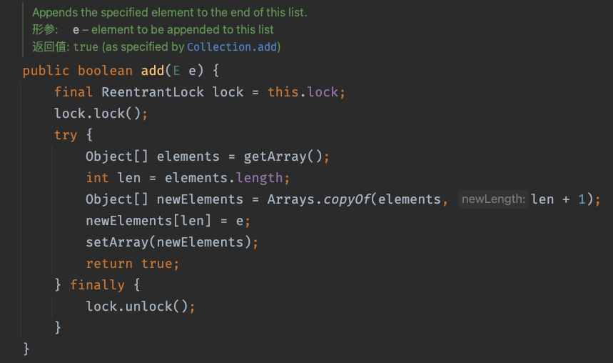

# JUC

## 1 Thread

### 1.1 进程和线程

* **进程**：是指一个内存中运行的应用程序，每个进程都有一个独立的内存空间，一个应用程序可以同时运行多个进程；进程也是程序的一次执行过程，是系统运行程序的基本单位；系统运行一个程序即是一个进程从创建、运行到消亡的过程。

* **线程**：线程是进程中的一个执行单元，负责当前进程中程序的执行，一个进程中至少有一个线程。一个进程中是可以有多个线程的，这个应用程序也可以称之为多线程程序。 

    简而言之：**一个程序运行后至少有一个进程，一个进程中也至少包含一个线程** 。

​	线程是进程划分成的更小的运行单位。线程和进程最大的不同在于基本上各进程是独立的，而各线程则不一定，因为同一进程中的线程极有可能会相互影响。线程执行开销小，但不利于资源的管理和保护；而进程正相反。

### 1.2 使用线程

​	Java使用`java.lang.Thread`类代表**线程**，所有的线程对象都必须是Thread类或其子类的实例。每个线程的作用是完成一定的任务，实际上就是执行一段程序流即一段顺序执行的代码。Java使用线程执行体来代表这段程序流。

Java中通过继承Thread类来**创建**并**启动多线程**的步骤如下：

1. 定义Thread类的子类，并重h方法，该run()方法的方法体就代表了线程需要完成的任务,因此把run()方法称为线程执行体。
2. 创建Thread子类的实例，即创建了线程对象。
3. 调用线程对象的start()方法来启动该线程。

构造方法

- `public Thread()` :分配一个新的线程对象。
- `public Thread(String name)` :分配一个指定名字的新的线程对象。
- `public Thread(Runnable target)` :分配一个带有指定目标新的线程对象。
- `public Thread(Runnable target,String name)` :分配一个带有指定目标新的线程对象并指定名字。

有三种使用线程的方法：

- 实现 Runnable 接口；
- 实现 Callable 接口；
- 继承 Thread 类。

实现 Runnable 和 Callable 接口的类只能当做一个可以在线程中运行的任务，不是真正意义上的线程，因此最后还需要通过 Thread 来调用。可以理解为任务是通过线程驱动从而执行的。

#### 1.2.1 实现 Runnable 接口

需要实现接口中的 run() 方法。

```java
public class MyRunnable implements Runnable {
    @Override
    public void run() {
        // ...
    }
}
```

使用 Runnable 实例再创建一个 Thread 实例，然后调用 Thread 实例的 start() 方法来启动线程。

```java
public static void main(String[] args) {
    MyRunnable instance = new MyRunnable();
    Thread thread = new Thread(instance);
    thread.start();
}
```

#### 1.2.2 实现 Callable 接口

与 Runnable 相比，Callable 可以有返回值，返回值通过 FutureTask 进行封装。

```java
public class MyCallable implements Callable<Integer> {
    public Integer call() {
        return 123;
    }
}
public static void main(String[] args) throws ExecutionException, InterruptedException {
    MyCallable mc = new MyCallable();
    FutureTask<Integer> ft = new FutureTask<>(mc);
    Thread thread = new Thread(ft);
    thread.start();
    System.out.println(ft.get());
}
```

#### 1.2.3 继承 Thread 类

同样也是需要实现 run() 方法，因为 Thread 类也实现了 Runable 接口。

当调用 start() 方法启动一个线程时，虚拟机会将该线程放入就绪队列中等待被调度，当一个线程被调度时会执行该线程的 run() 方法。

```java
public class MyThread extends Thread {
    public void run() {
        // ...
    }
}
public static void main(String[] args) {
    MyThread mt = new MyThread();
    mt.start();
}
```

常用方法:

- public String getName() :获取当前线程名称。
- public void start() :导致此线程开始执行; Java虚拟机调用此线程的run方法。
- public void run() :此线程要执行的任务在此处定义代码。
- public static void sleep(long millis) :使当前正在执行的线程以指定的毫秒数暂停（暂时停止执行）。
- public static Thread currentThread() :返回对当前正在执行的线程对象的引用。

### 1.3 基础线程机制

#### 1.3.1 Daemon

守护线程是程序运行时在后台提供服务的线程，不属于程序中不可或缺的部分。

当所有非守护线程结束时，程序也就终止，同时会杀死所有守护线程。

main() 属于非守护线程。

在线程启动之前使用 setDaemon() 方法可以将一个线程设置为守护线程。

```java
public static void main(String[] args) {
    Thread thread = new Thread(new MyRunnable());
    thread.setDaemon(true);
}
```

#### 1.3.2 sleep()

Thread.sleep(millisec) 方法会休眠当前正在执行的线程，millisec 单位为毫秒。

sleep() 可能会抛出 InterruptedException，因为异常不能跨线程传播回 main() 中，因此必须在本地进行处理。线程中抛出的其它异常也同样需要在本地进行处理。

```java
public void run() {
    try {
        Thread.sleep(3000);
    } catch (InterruptedException e) {
        e.printStackTrace();
    }
}
```

#### 1.3.3 yield()

对静态方法 Thread.yield() 的调用声明了当前线程已经完成了生命周期中最重要的部分，可以切换给其它线程来执行。该方法只是对线程调度器的一个建议，而且也只是建议具有相同优先级的其它线程可以运行。

```java
public void run() {
    Thread.yield();
}
```

### 1.4 线程中断

一个线程执行完毕之后会自动结束，如果在运行过程中发生异常也会提前结束。

#### 1.4.1 InterruptedException

通过调用一个线程的 interrupt() 来中断该线程，如果该线程处于阻塞、限期等待或者无限期等待状态，那么就会抛出 InterruptedException，从而提前结束该线程。但是不能中断 I/O 阻塞和 synchronized 锁阻塞。

对于以下代码，在 main() 中启动一个线程之后再中断它，由于线程中调用了 Thread.sleep() 方法，因此会抛出一个 InterruptedException，从而提前结束线程，不执行之后的语句。

```java
public class InterruptExample {

    private static class MyThread1 extends Thread {
        @Override
        public void run() {
            try {
                Thread.sleep(2000);
                System.out.println("Thread run");
            } catch (InterruptedException e) {
                e.printStackTrace();
            }
        }
    }
}
public static void main(String[] args) throws InterruptedException {
    Thread thread1 = new MyThread1();
    thread1.start();
    thread1.interrupt();
    System.out.println("Main run");
}
Main run
java.lang.InterruptedException: sleep interrupted
    at java.lang.Thread.sleep(Native Method)
    at InterruptExample.lambda$main$0(InterruptExample.java:5)
    at InterruptExample$$Lambda$1/713338599.run(Unknown Source)
    at java.lang.Thread.run(Thread.java:745)
```

#### 1.4.2 interrupted()

如果一个线程的 run() 方法执行一个无限循环，并且没有执行 sleep() 等会抛出 InterruptedException 的操作，那么调用线程的 interrupt() 方法就无法使线程提前结束。

但是调用 interrupt() 方法会设置线程的中断标记，此时调用 interrupted() 方法会返回 true。因此可以在循环体中使用 interrupted() 方法来判断线程是否处于中断状态，从而提前结束线程。

```java
public class InterruptExample {

    private static class MyThread2 extends Thread {
        @Override
        public void run() {
            while (!interrupted()) {
                // ..
            }
            System.out.println("Thread end");
        }
    }
}
public static void main(String[] args) throws InterruptedException {
    Thread thread2 = new MyThread2();
    thread2.start();
    thread2.interrupt();
}
Thread end
```

### 1.5 线程安全

如果有多个线程在同时运行，而这些线程可能会同时运行这段代码。程序每次运行结果和单线程运行的结果是一样的，而且其他的变量的值也和预期的是一样的，就是线程安全的。
通过一个案例，演示线程的安全问题：
电影院要卖票，我们模拟电影院的卖票过程。假设本次电影的座位共100个(本场电影只能卖100张票)。
我们来模拟电影院的售票窗口，实现多个窗口同时卖 “葫芦娃大战奥特曼”这场电影票(多个窗口一起卖这100张票)。需要窗口，采用线程对象来模拟；需要票，Runnable接口子类来模拟。

```java
public class Ticket implements Runnable {
    private int ticket = 100;
    @Override
    public void run() {
        while (ticket > 0) {
            System.out.println(Thread.currentThread().getName() + "开始售票");
            try {
                Thread.sleep(100);
            } catch (InterruptedException e) {
                e.printStackTrace();
            }
            ticket--;
            System.out.println(Thread.currentThread().getName() + "售票完成,还剩" + ticket + "张票");
        }

    }
}

```

测试类:

```java
public class Demo {
	public static void main(String[] args) {
		// 创建线程任务对象
		Ticket ticket = new Ticket();
		// 创建三个窗口对象
		Thread t1 = new Thread(ticket, "窗口1");
		Thread t2 = new Thread(ticket, "窗口2");
		Thread t3 = new Thread(ticket, "窗口3");
		// 同时卖票
		t1.start();
		t2.start();
		t3.start();
	}
}
```

发现程序出现了两个问题：

1. 相同的票数,比如某张票被卖了两回。
2. 不存在的票，比如-1票，是不存在的。

这种问题，几个窗口(线程)票数不同步了，这种问题称为线程不安全。

线程安全问题都是由全局变量及静态变量引起的。若每个线程中对全局变量、静态变量只有读操作，而无写
操作，一般来说，这个全局变量是线程安全的；若有多个线程同时执行写操作，一般都需要考虑线程同步，
否则的话就可能影响线程安全。

#### 1.5.1 线程同步

处理多线程问题时，多个线程访问同一个对象，并且某些线程还想修改这个对象。这时就需要线程同步，线程同步其实就是一种等待机制，多个需要同时访问此对象的线程进入这个对象的等待池行程队列，等待前面线程使用完毕，下一个线程再使用。

由于同一进程的多个线程共享同一块存储空间，在方便的同时带来了冲突的问题，为了保证数据在方法中被访问时的正确性，在访问时加入锁（synchronized），当一个线程获得对象的排它锁，独占资源，其他线程必须等待，使用后释放锁即可

* 一个线程持有锁会导致其他所有需要此锁的线程挂起
* 在多线程竞争下，加锁，释放锁会导致比较多的上下文切换和调度延时，引起性能问题
* 如果一个优先级高的线程等待一个优先级低的线程释放锁会导致优先级倒置，引起性能问题

#### 1.5.2 同步代码块

synchronized 关键字可以用于方法中的某个区块中，表示只对这个区块的资源实行互斥访问。
格式:

```java
synchronized(同步锁){
     需要同步操作的代码
}
```

同步锁:

对象的同步锁只是一个概念,可以想象为在对象上标记了一个锁。

锁对象可以是任意类型，多个线程对象要使用同一把锁。
注意:在任何时候,最多允许一个线程拥有同步锁,谁拿到锁就进入代码块,其他的线程只能在外等着(BLOCKED)。
使用同步代码块解决代码：

```java
public class Ticket implements Runnable {
    private int ticket = 100;

    @Override
    public void run() {
        while (ticket > 0) {
            System.out.println(Thread.currentThread().getName() + "开始售票");
            try {
                Thread.sleep(100);
            } catch (InterruptedException e) {
                e.printStackTrace();
            }
            synchronized (this) {
                if (ticket > 0) ticket--;
                System.out.println(Thread.currentThread().getName() + "售票完成,还剩" + ticket + "张票");
            }
        }
    }
}
```

当使用了同步代码块后，上述的线程的安全问题，解决了。

#### 1.5.3 同步方法

使用synchronized修饰的方法,就叫做同步方法,保证A线程执行该方法的时候,其他线程只能在方法外等着。

格式：

```java
public synchronized void method(){
    可能会产生线程安全问题的代码
}
```

```java
public class Ticket implements Runnable{
	private int ticket = 100;   
	/*
	 * 执行卖票操作   
	 */  
	@Override 
	public void run() {	    
	//每个窗口卖票的操作 	        
	//窗口 永远开启 	        
		while(ticket > 0){        
			sellTicket();            
		}        
	}
		        
    /*   
     * 锁对象 是 谁调用这个方法 就是谁     
     * 隐含 锁对象 就是 this	    
     */
	public synchronized void sellTicket(){
		if(ticket>0){//有票 可以卖   
		  //出票操作
		  //使用sleep模拟一下出票时间 
			try {              
				Thread.sleep(100);
			} catch (InterruptedException e) {
  				e.printStackTrace();
			}
        }
        //获取当前线程对象的名字 
        String name = Thread.currentThread().getName();
        System.out.println(name+"正在卖:"+ticket‐‐);
   }
}
```

#### 1.5.4 Lock锁

`java.util.concurrent.locks.Lock` 机制提供了比synchronized代码块和synchronized方法更广泛的锁定操作。同步代码块/同步方法具有的功能Lock都有，除此之外更强大，更体现面向对象。

Lock锁也称同步锁，加锁与释放锁方法，如下：

* public void lock() :加同步锁。
* public void unlock() :释放同步锁。

```java
public class Ticket implements Runnable{
	private int ticket = 100;    
	Lock lock = new ReentrantLock();   
	@Override	    
	public void run() {	    
		//每个窗口卖票的操作 	        
		//窗口 永远开启 	        
		while(ticket > 0){        
			lock.lock();	            
			if(ticket>0){//有票 可以卖            
				//出票操作                 
				//使用sleep模拟一下出票时间                 
				try {                
					Thread.sleep(50);                    
				} catch (InterruptedException e) {                
				// TODO Auto‐generated catch block                    
					e.printStackTrace();                    
				}                
				//获取当前线程对象的名字                 
				String name = Thread.currentThread().getName();               
				System.out.println(name+"正在卖:"+ticket‐‐);	                
			}            
			lock.unlock();            
		}        
	}    
}
```

#### 1.5.5 线程通信

多个线程在处理同一个资源，但是处理的动作（线程的任务）却不相同。

比如：线程A用来生成包子的，线程B用来吃包子的，包子可以理解为同一资源，线程A与线程B处理的动作，一个是生产，一个是消费，那么线程A与线程B之间就存在线程通信问题。

**为什么要处理线程间通信：**

多个线程并发执行时, 在默认情况下CPU是随机切换线程的，当我们需要多个线程来共同完成一件任务，并且我们希望他们有规律的执行, 那么多线程之间需要一些协调通信，以此来帮我们达到多线程共同操作一份数据。

**如何保证线程间通信有效利用资源：**

多个线程在处理同一个资源，并且任务不同时，需要线程通信来帮助解决线程之间对同一个变量的使用或操作。 就是多个线程在操作同一份数据时， 避免对同一共享变量的争夺。也就是我们需要通过一定的手段使各个线程能有效的利用资源。而这种手段即— **等待唤醒机制。**

**什么是等待唤醒机制**

这是多个线程间的一种**协作**机制。谈到线程我们经常想到的是线程间的**竞争（race）**，比如去争夺锁，但这并不是故事的全部，线程间也会有协作机制。就好比在公司里你和你的同事们，你们可能存在在晋升时的竞争，但更多时候你们更多是一起合作以完成某些任务。

就是在一个线程进行了规定操作后，就进入等待状态（**wait()**）， 等待其他线程执行完他们的指定代码过后 再将其唤醒（**notify()**）;在有多个线程进行等待时， 如果需要，可以使用 notifyAll()来唤醒所有的等待线程。

wait/notify 就是线程间的一种协作机制。

**等待唤醒中的方法**

等待唤醒机制就是用于解决线程间通信的问题的，使用到的3个方法的含义如下：

1. wait：线程不再活动，不再参与调度，进入 wait set 中，因此不会浪费 CPU 资源，也不会去竞争锁了，这时的线程状态即是 WAITING。它还要等着别的线程执行一个**特别的动作**，也即是“**通知（notify）**”在这个对象上等待的线程从wait set 中释放出来，重新进入到调度队列（ready queue）中
2. notify：则选取所通知对象的 wait set 中的一个线程释放；例如，餐馆有空位置后，等候就餐最久的顾客最先入座。
3. notifyAll：则释放所通知对象的 wait set 上的全部线程。

>注意：
>
>哪怕只通知了一个等待的线程，被通知线程也不能立即恢复执行，因为它当初中断的地方是在同步块内，而此刻它已经不持有锁，所以她需要再次尝试去获取锁（很可能面临其它线程的竞争），成功后才能在当初调用 wait 方法之后的地方恢复执行。
>
>总结如下：
>
>- 如果能获取锁，线程就从 WAITING 状态变成 RUNNABLE 状态；
>- 否则，从 wait set 出来，又进入 entry set，线程就从 WAITING 状态又变成 BLOCKED 状态

**调用wait和notify方法需要注意的细节**

1. wait方法与notify方法必须要由同一个锁对象调用。因为：对应的锁对象可以通过notify唤醒使用同一个锁对象调用的wait方法后的线程。
2. wait方法与notify方法是属于Object类的方法的。因为：锁对象可以是任意对象，而任意对象的所属类都是继承了Object类的。
3. wait方法与notify方法必须要在同步代码块或者是同步方法中使用。因为：必须要通过锁对象调用这2个方法。

### 1.6 线程状态

ava 线程在运行的生命周期中的指定时刻只可能处于下面 6 种不同状态的其中一个状态：

- NEW: 初始状态，线程被创建出来但没有被调用 `start()` 。
- RUNNABLE: 运行状态，线程被调用了 `start()`等待运行的状态。
- BLOCKED ：阻塞状态，需要等待锁释放。
- WAITING：等待状态，表示该线程需要等待其他线程做出一些特定动作（通知或中断）。
- TIMED_WAITING：超时等待状态，可以在指定的时间后自行返回而不是像 WAITING 那样一直等待。
- TERMINATED：终止状态，表示该线程已经运行完毕。

线程在生命周期中并不是固定处于某一个状态而是随着代码的执行在不同状态之间切换。


线程创建之后它将处于 **NEW（新建）** 状态，调用 `start()` 方法后开始运行，线程这时候处于 **READY（可运行）** 状态。可运行状态的线程获得了 CPU 时间片（timeslice）后就处于 **RUNNING（运行）** 状态。

- 当线程执行 `wait()`方法之后，线程进入 **WAITING（等待）** 状态。进入等待状态的线程需要依靠其他线程的通知才能够返回到运行状态。
- **TIMED_WAITING(超时等待)** 状态相当于在等待状态的基础上增加了超时限制，比如通过 `sleep（long millis）`方法或 `wait（long millis）`方法可以将线程置于 TIMED_WAITING 状态。当超时时间结束后，线程将会返回到 RUNNABLE 状态。
- 当线程进入 `synchronized` 方法/块或者调用 `wait` 后（被 `notify`）重新进入 `synchronized` 方法/块，但是锁被其它线程占有，这个时候线程就会进入 **BLOCKED（阻塞）** 状态。
- 线程在执行完了 `run()`方法之后将会进入到 **TERMINATED（终止）** 状态。

线程进入等待状态，即线程因为某种原因放弃了CPU使用权，阻塞也分为几种情况：

- 等待阻塞：运行的线程执行`wait`方法，JVM会把当前线程放入到等待队列
- 同步阻塞：运行的线程在获取对象的同步锁时，若该同步锁被其他线程锁占用了，那么JVM会把当前的线程放入到锁池中
- 其他阻塞：运行的线程执行`Thread.sleep`或者`join`方法，或者发出了I/O请求时，JVM会把当前线程设置为阻塞状态，当`sleep`结束`join`线程终止、I/O处理完毕则线程恢复

> [线程的几种状态你真的了解么](https://mp.weixin.qq.com/s/R5MrTsWvk9McFSQ7bS0W2w)

#### 1.6.1 死锁

线程死锁描述的是这样一种情况：多个线程同时被阻塞，它们中的一个或者全部都在等待某个资源被释放。由于线程被无限期地阻塞，因此程序不可能正常终止。

线程 A 持有资源 2，线程 B 持有资源 1，他们同时都想申请对方的资源，所以这两个线程就会互相等待而进入死锁状态。


下面通过一个例子来说明线程死锁,代码模拟了上图的死锁的情况：

```java
public class DeadLockDemo {
    private static Object resource1 = new Object();//资源 1
    private static Object resource2 = new Object();//资源 2

    public static void main(String[] args) {
        new Thread(() -> {
            synchronized (resource1) {
                System.out.println(Thread.currentThread() + "get resource1");
                try {
                    Thread.sleep(1000);
                } catch (InterruptedException e) {
                    e.printStackTrace();
                }
                System.out.println(Thread.currentThread() + "waiting get resource2");
                synchronized (resource2) {
                    System.out.println(Thread.currentThread() + "get resource2");
                }
            }
        }, "线程 1").start();

        new Thread(() -> {
            synchronized (resource2) {
                System.out.println(Thread.currentThread() + "get resource2");
                try {
                    Thread.sleep(1000);
                } catch (InterruptedException e) {
                    e.printStackTrace();
                }
                System.out.println(Thread.currentThread() + "waiting get resource1");
                synchronized (resource1) {
                    System.out.println(Thread.currentThread() + "get resource1");
                }
            }
        }, "线程 2").start();
    }
}
```

Output

```text
Thread[线程 1,5,main]get resource1
Thread[线程 2,5,main]get resource2
Thread[线程 1,5,main]waiting get resource2
Thread[线程 2,5,main]waiting get resource1
```

线程 A 通过 `synchronized (resource1)` 获得 `resource1` 的监视器锁，然后通过`Thread.sleep(1000);`让线程 A 休眠 1s 为的是让线程 B 得到执行然后获取到 resource2 的监视器锁。线程 A 和线程 B 休眠结束了都开始企图请求获取对方的资源，然后这两个线程就会陷入互相等待的状态，这也就产生了死锁。

上面的例子符合产生死锁的四个必要条件：

1. 互斥条件：该资源任意一个时刻只由一个线程占用。
2. 请求与保持条件：一个线程因请求资源而阻塞时，对已获得的资源保持不放。
3. 不剥夺条件：线程已获得的资源在未使用完之前不能被其他线程强行剥夺，只有自己使用完毕后才释放资源。
4. 循环等待条件：若干线程之间形成一种头尾相接的循环等待资源关系。

**如何避免死锁？**

避免死锁就是在资源分配时，借助于算法（比如银行家算法）对资源分配进行计算评估，使其进入安全状态。

> **安全状态** 指的是系统能够按照某种线程推进顺序（P1、P2、P3.....Pn）来为每个线程分配所需资源，直到满足每个线程对资源的最大需求，使每个线程都可顺利完成。称 `<P1、P2、P3.....Pn>` 序列为安全序列。

对线程 2 的代码修改成下面这样就不会产生死锁了。

```java
new Thread(() -> {
            synchronized (resource1) {
                System.out.println(Thread.currentThread() + "get resource1");
                try {
                    Thread.sleep(1000);
                } catch (InterruptedException e) {
                    e.printStackTrace();
                }
                System.out.println(Thread.currentThread() + "waiting get resource2");
                synchronized (resource2) {
                    System.out.println(Thread.currentThread() + "get resource2");
                }
            }
        }, "线程 2").start();
```

输出：

```text
Thread[线程 1,5,main]get resource1
Thread[线程 1,5,main]waiting get resource2
Thread[线程 1,5,main]get resource2
Thread[线程 2,5,main]get resource1
Thread[线程 2,5,main]waiting get resource2
Thread[线程 2,5,main]get resource2

Process finished with exit code 0
```

线程 1 首先获得到 resource1 的监视器锁,这时候线程 2 就获取不到了。然后线程 1 再去获取 resource2 的监视器锁，可以获取到。然后线程 1 释放了对 resource1、resource2 的监视器锁的占用，线程 2 获取到就可以执行了。这样就破坏了破坏循环等待条件，因此避免了死锁。

## 2 JUC

java.util.concurrent是并发编程中的工具类

进程：进程是一个具有一定独立功能的程序关于某个数据集合的一次运行活动。它是操作系统动态执行的基本单元，在传统的操作系统中，进程既是基本的分配单元，也是基本的执行单元。

线程：通常在一个进程中可以包含若干个线程，当然一个进程中至少有一个线程，不然没有存在的意义。线程可以利用进程说拥有的资源，在引入线程的操作系统中，通常都是把进程作为分配资源的基本单位，而把线程作为独立运行和独立调度的基本单位，由于线程必进程更小，基本上不拥有系统资源，故对它的调度说付出的开销就会小很多，能更高效的提高系统多个程序间并发执行的程度。

并发：两个及两个以上的作业在同一 **时间段** 内执行。

并行：两个及两个以上的作业在同一 **时刻** 执行。

最关键的点是：是否是 **同时** 执行

Thread传统方案

```java
class Ticket {
    private int ticket = 30;

    public synchronized void saleTicket() {
        if (ticket > 0) {
            System.out.println(Thread.currentThread().getName() + " 卖出第" + (ticket--) + "张票，剩余" + ticket);
        } else {
            System.out.println("票已卖完");
        }
    }
}

public class SaleTicket {
    public static void main(String[] args) throws Exception {
        Ticket ticket = new Ticket();
        new Thread(() -> {
            for (int i = 0; i < 15; i++) ticket.saleTicket();
        }, "ThreadA").start();
        new Thread(() -> {
            for (int i = 0; i < 15; i++) ticket.saleTicket();
        }, "ThreadB").start();
        new Thread(() -> {
            for (int i = 0; i < 15; i++) ticket.saleTicket();
        }, "ThreadC").start();
    }
}
```

JUC方案

```java
class Ticket {
    private int ticket = 30;
    private Lock lock = new ReentrantLock();

    public void saleTicket() {
        lock.lock();
        try {
            if (ticket > 0) {
                System.out.println(Thread.currentThread().getName() + " 卖出第" + (ticket--) + "张票，剩余" + ticket);
            } else {
                System.out.println("票已卖完");
            }
        } catch (Exception e) {
            e.printStackTrace();
        } finally {
            lock.unlock();
        }
    }
}
```

### 2.1 生产者消费者

传统方案

多线程交互中，必须要防止多线程的虚假唤醒，也即使用while判断不能使用if

```java
class AirCondition {
    private int number = 0;

    public synchronized void increment() throws InterruptedException {
        while (number != 0) {
            this.wait();
        }
        number++;
        System.out.println(Thread.currentThread().getName() + ": " + number);
        this.notifyAll();
    }

    public synchronized void decrement() throws InterruptedException {
        while (number == 0) {
            this.wait();
        }
        number--;
        System.out.println(Thread.currentThread().getName() + ": " + number);
        this.notifyAll();
    }
}

public class ThreadWaitNotifyDemo {
    public static void main(String[] args) {
        AirCondition airCondition = new AirCondition();
        new Thread(() -> {
            for (int i = 0; i < 10; i++) {
                try {
                    airCondition.increment();
                } catch (InterruptedException e) {
                    e.printStackTrace();
                }
            }
        }, "A").start();

        new Thread(() -> {
            for (int i = 0; i < 10; i++) {
                try {
                    airCondition.decrement();
                } catch (InterruptedException e) {
                    e.printStackTrace();
                }
            }
        }, "B").start();

        ... C D 线程
    }
}
```

JUC方案

```java
class AirCondition {
    private int number = 0;
    private Lock lock = new ReentrantLock();
    private Condition condition = lock.newCondition();

    public void increment() {
        lock.lock();
        try {
            while (number != 0) {
                condition.await();
            }
            number++;
            System.out.println(Thread.currentThread().getName() + ": " + number);
            condition.signalAll();
        } catch (Exception e) {
            e.printStackTrace();
        } finally {
            lock.unlock();
        }
    }

    public void decrement() {
        lock.lock();
        try {
            while (number == 0) {
                condition.await();
            }
            number--;
            System.out.println(Thread.currentThread().getName() + ": " + number);
            condition.signalAll();
        } catch (Exception e) {
            e.printStackTrace();
        } finally {
            lock.unlock();
        }
    }
}

/**
 * 题目：现在两个线程，可以操作初始值为零的一个变量，
 * 实现一个线程对该变量加1，一个线程对该变量-1，
 * 实现交替，来10轮，变量初始值为0.
 *      1.高内聚低耦合前提下，线程操作资源类
 *      2.判断/干活/通知
 *      3.防止虚假唤醒(判断只能用while，不能用if)
 * 知识小总结：多线程编程套路+while判断+新版写法
 */
public class ThreadWaitNotifyDemo {
    public static void main(String[] args) {
        AirCondition airCondition = new AirCondition();
        new Thread(() -> {
            for (int i = 0; i < 10; i++) airCondition.increment();
        }, "A").start();

        new Thread(() -> {
            for (int i = 0; i < 10; i++) airCondition.decrement();
        }, "B").start();

        new Thread(() -> {
            for (int i = 0; i < 10; i++) airCondition.increment();
        }, "C").start();

        new Thread(() -> {
            for (int i = 0; i < 10; i++) airCondition.decrement();
        }, "D").start();
    }
}
```

### 2.2 精准通知消费顺序

```java
class ShareResource {
    private int number = 1;
    private Lock lock = new ReentrantLock();
    private Condition condition1 = lock.newCondition();
    private Condition condition2 = lock.newCondition();
    private Condition condition3 = lock.newCondition();

    public void print5() {
        lock.lock();
        try {
            while (number != 1) {
                condition1.await();
            }
            for (int i = 0; i < 5; i++) {
                System.out.println(Thread.currentThread().getName() + ": " + (i + 1));
            }
            number = 2;
            condition2.signal();
        } catch (Exception e) {
            e.printStackTrace();
        } finally {
            lock.unlock();
        }
    }

    public void print10() {
        lock.lock();
        try {
            while (number != 2) {
                condition2.await();
            }
            for (int i = 0; i < 10; i++) {
                System.out.println(Thread.currentThread().getName() + ": " + (i + 1));
            }
            number = 3;
            condition3.signal();
        } catch (Exception e) {
            e.printStackTrace();
        } finally {
            lock.unlock();
        }
    }

    public void print15() {
        lock.lock();
        try {
            while (number != 3) {
                condition3.await();
            }
            for (int i = 0; i < 15; i++) {
                System.out.println(Thread.currentThread().getName() + ": " + (i + 1));
            }
            number = 1;
            condition1.signal();
        } catch (Exception e) {
            e.printStackTrace();
        } finally {
            lock.unlock();
        }
    }

    public void print() {
        String threadName = Thread.currentThread().getName();
        lock.lock();
        try {
            if (threadName == "A") {
                while (number != 1) {
                    condition1.await();
                }
                for (int i = 0; i < 5; i++) {
                    System.out.println(threadName + ": " + (i + 1));
                }
                number = 2;
                condition2.signal();
            } else if (threadName == "B") {
                while (number != 2) {
                    condition2.await();
                }
                for (int i = 0; i < 10; i++) {
                    System.out.println(threadName + ": " + (i + 1));
                }
                number = 3;
                condition3.signal();
            } else if (threadName == "C") {
                while (number != 3) {
                    condition3.await();
                }
                for (int i = 0; i < 15; i++) {
                    System.out.println(threadName + ": " + (i + 1));
                }
                number = 1;
                condition1.signal();
            }
        } catch (
                Exception e) {
            e.printStackTrace();
        } finally {
            lock.unlock();
        }
    }
}

/**
 * 备注：多线程之间按顺序调用，实现A->B->C
 * 三个线程启动，要求如下：
 * AA打印5次，BB打印10次，CC打印15次
 * 接着
 * AA打印5次，BB打印10次，CC打印15次
 * 来10轮
 *      1.高内聚低耦合前提下，线程操作资源类
 *      2.判断/干活/通知
 *      3.多线程交互中，防止虚假唤醒(判断只能用while，不能用if)
 *      4.标志位
 */
public class ThreadOrderAccess {
    public static void main(String[] args) {
        ShareResource shareResource = new ShareResource();

        new Thread(() -> {
            for (int i = 0; i < 10; i++) shareResource.print5();
        }, "A").start();

        new Thread(() -> {
            for (int i = 0; i < 10; i++) shareResource.print10();
        }, "B").start();

        new Thread(() -> {
            for (int i = 0; i < 10; i++) shareResource.print15();
        }, "C").start();
    }
}
```

### 2.3 Lock8锁

1、标准访问

```java
class Phone {
    public synchronized void sendEmail() {
        System.out.println("=====Send Email=====");
    }

    public synchronized void sendSMS() {
        System.out.println("=====Send SMS=====");
    }
}

public class Lock8 {
    public static void main(String[] args) {
        Phone phone = new Phone();
        new Thread(() -> {
            phone.sendEmail();
        }, "A").start();

        new Thread(() -> {
            phone.sendSMS();
        }, "B").start();
    }
}
```

结果：

```
=====Send Email=====
=====Send SMS=====
```

2、发邮件暂停4秒

```java
class Phone {
    public synchronized void sendEmail() {
        try {TimeUnit.SECONDS.sleep(4);} catch (InterruptedException e) {e.printStackTrace();}
        System.out.println("=====Send Email=====");
    }

    public synchronized void sendSMS() {
        System.out.println("=====Send SMS=====");
    }
}

public class Lock8 {
    public static void main(String[] args) {
        Phone phone = new Phone();
        new Thread(() -> {
            phone.sendEmail();
        }, "A").start();

        new Thread(() -> {
            phone.sendSMS();
        }, "B").start();
    }
}
```

结果：

```
=====Send Email=====
=====Send SMS=====
```

3、新增普通方法

```java
class Phone {
    public synchronized void sendEmail() {
        try {TimeUnit.SECONDS.sleep(4);} catch (InterruptedException e) {e.printStackTrace();}
        System.out.println("=====Send Email=====");
    }

    public void sendQQ() {
        System.out.println("=====Send QQ=====");
    }
}

public class Lock8 {
    public static void main(String[] args) {
        Phone phone = new Phone();
        new Thread(() -> {
            phone.sendEmail();
        }, "A").start();

        new Thread(() -> {
            phone.sendQQ();
        }, "B").start();
    }
}
```

结果：

```
=====Send QQ=====
=====Send Email=====
```

4、两个资源

```java
class Phone {
    public synchronized void sendEmail() {
        try {
            TimeUnit.SECONDS.sleep(4);
        } catch (InterruptedException e) {
            e.printStackTrace();
        }
        System.out.println("=====Send Email=====");
    }

    public synchronized void sendSMS() {
        System.out.println("=====Send SMS=====");
    }
}

public class Lock8 {
    public static void main(String[] args) {
        Phone phone1 = new Phone();
        Phone phone2 = new Phone();
        new Thread(() -> {
            phone1.sendEmail();
        }, "A").start();

        new Thread(() -> {
            phone2.sendSMS();
        }, "B").start();
    }
}
```

结果：

```
=====Send SMS=====
=====Send Email=====
```

5、两个静态同步方法，同一个资源

```java
class Phone {
    public static synchronized void sendEmail() {
        try {
            TimeUnit.SECONDS.sleep(4);
        } catch (InterruptedException e) {
            e.printStackTrace();
        }
        System.out.println("=====Send Email=====");
    }

    public static synchronized void sendSMS() {
        System.out.println("=====Send SMS=====");
    }
}

public class Lock8 {
    public static void main(String[] args) {
        Phone phone = new Phone();
        new Thread(() -> {
            phone.sendEmail();
        }, "A").start();

        new Thread(() -> {
            phone.sendSMS();
        }, "B").start();
    }
}
```

结果：

```
=====Send Email=====
=====Send SMS=====
```

6、两个静态同步方法，两个资源

```java
class Phone {
    public static synchronized void sendEmail() {
        try {
            TimeUnit.SECONDS.sleep(4);
        } catch (InterruptedException e) {
            e.printStackTrace();
        }
        System.out.println("=====Send Email=====");
    }

    public static synchronized void sendSMS() {
        System.out.println("=====Send SMS=====");
    }
}

public class Lock8 {
    public static void main(String[] args) {
        Phone phone1 = new Phone();
        Phone phone2 = new Phone();
        new Thread(() -> {
            phone1.sendEmail();
        }, "A").start();

        new Thread(() -> {
            phone2.sendSMS();
        }, "B").start();
    }
}
```

结果：

```
=====Send Email=====
=====Send SMS=====
```

7、一个普通同步方法，一个静态同步方法，一个资源

```java
class Phone {
    public static synchronized void sendEmail() {
        try {
            TimeUnit.SECONDS.sleep(4);
        } catch (InterruptedException e) {
            e.printStackTrace();
        }
        System.out.println("=====Send Email=====");
    }

    public synchronized void sendSMS() {
        System.out.println("=====Send SMS=====");
    }
}

public class Lock8 {
    public static void main(String[] args) {
        Phone phone1 = new Phone();
        new Thread(() -> {
            phone.sendEmail();
        }, "A").start();

        new Thread(() -> {
            phone.sendSMS();
        }, "B").start();
    }
}
```

结果：

```
=====Send SMS=====
=====Send Email=====
```

8、一个普通同步方法，一个静态同步方法，两个资源

```java
class Phone {
    public static synchronized void sendEmail() {
        try {
            TimeUnit.SECONDS.sleep(4);
        } catch (InterruptedException e) {
            e.printStackTrace();
        }
        System.out.println("=====Send Email=====");
    }

    public synchronized void sendSMS() {
        System.out.println("=====Send SMS=====");
    }
}

public class Lock8 {
    public static void main(String[] args) {
        Phone phone1 = new Phone();
        Phone phone2 = new Phone();
        new Thread(() -> {
            phone1.sendEmail();
        }, "A").start();

        new Thread(() -> {
            phone2.sendSMS();
        }, "B").start();
    }
}
```

结果：

```
=====Send SMS=====
=====Send Email=====
```

**总结**

1. 标准访问，先打印邮件

2. 邮件设置暂停4秒方法，先打印邮件

    对象锁

    一个对象里面如果有多个synchronized方法，某一个时刻内，只要一个线程去调用其中的一个synchronized方法了，其他的线程都只能等待，换句话说，某一个时刻内，只能有唯一一个线程去访问这些synchronized方法，锁的是当前对象this，被锁定后，其他的线程都不能进入到当前对象的其他的synchronized方法

3. 新增普通方法，先打印普通方法的内容

    加个普通方法后发现和同步锁无关

4. 两个资源，先打印短信

    换成两个对象后，不是同一把锁了，情况立刻变化

5. 两个静态同步方法，同一个资源，先打印邮件

6. 两个静态同步方法，两个资源，先打印邮件，锁的同一个字节码对象Class

    全局锁

    synchronized实现同步的基础：java中的每一个对象都可以作为锁。具体表现为一下3中形式。

    * 对于普通同步方法，锁是当前实例对象，锁的是当前对象this

        * 对于同步方法块，锁的是synchronized括号里配置的对象
        * 对于静态同步方法，锁是当前类的class对象

7. 一个静态同步方法，一个普通同步方法，同一资源，先打印短信

8. 一个静态同步方法，一个普通同步方法，两个资源，先打印短信

    当一个线程试图访问同步代码块时，它首先必须得到锁，退出或抛出异常时必须释放锁。

    也就是说如果一个实例对象的普通同步方法获取锁后，该实例对象的其他普通同步方法必须等待获取锁的方法释放锁后才能获取锁，可是别的实例对象的普通同步方法因为跟该实例对象的普通同步方法用的是不同的锁，所以无需等待该实例对象已获取锁的普通同步方法释放锁就可以获取他们自己的锁。

    所有的静态同步方法用的也是同一把锁--类对象本身，这两把锁(this/class)是两个不同的对象，所以静态同步方法与非静态同步方法之间是不会有静态条件的。但是一旦一个静态同步方法获取锁后，其他的静态同步方法都必须等待该方法释放锁后才能获取锁，而不管是同一个实例对象的静态同步方法之间，还是不同的实例对象的静态同步方法之间，只要它们同一个类的实例对象。

## 3 不安全集合类

### 3.1 ArrayList

ArrayList是线程不安全的

```JAVA
private static void listUnsafe() {
    List<String> list = new CopyOnWriteArrayList<>();

    for (int i = 0; i < 3; i++) {
        new Thread(() -> {
            list.add(UUID.randomUUID().toString().substring(0, 8));
            System.out.println(list);
        }, "Thread" + String.valueOf(i)).start();
    }
}
```

可能会出现ConcurrentModification异常


解决异常的方案：

1. 使用Vector，Vector是线程安全的，但是存储效率较低
2. 使用Collections工具类提供的Collections.synchronizedList(new ArrayList());
3. 使用JUC提供的new CopyOnWriteArrayList();

其中CopyOn WriteArrayList方案源码，利用可重用锁解决。



CopyOnWrite容器即写时复制的容器，往一个容器中添加元素时，不直接往当前容器Object[]添加，而是先将当前容器Object[]进行Copy，复制出一个新的容器Object[] newElements，然后往新的容器Object[] newElements里添加元素，添加完元素之后，再将原容器的引用指向新的容器 setArray(newElements)。这样做的好处是可以对CopyOn Write容器进行并发的读，而不需要加锁，因为当前容器不会添加任何元素。所以CopyOnWrite容器也是一种读写分离的思想，读和写不同的容器。

### 3.2 HashSet

HashSet是线程不安全的

```java
private static void setUnsafe() {
    Set<String> set = new HashSet<>();

    for (int i = 0; i < 30; i++) {
        new Thread(() -> {
            set.add(UUID.randomUUID().toString().substring(0,8));
            System.out.println(set);
        }, "Thread" + String.valueOf(i)).start();
    }
}
```

可能会出现ConcurrentModification异常


解决异常的方案：

1. 使用Collections工具类提供的Collections.synchronizedSet(new HashSet<>());
2. 使用JUC提供的new CopyOnWriteArraySet<>();

### 3.3 HashMap

HashMap是线程不安全的

```java
private static void mapUnsafe() {
    Map<String, String> map = new HashMap<>();

    for (int i = 0; i < 30; i++) {
        new Thread(() -> {
            map.put(Thread.currentThread().getName(), UUID.randomUUID().toString().substring(0, 8));
            System.out.println(map);
        }, "Thread" + String.valueOf(i)).start();
    }
}
```

可能会出现ConcurrentModification异常


解决异常的方案：

1. 可以用 Collections 的 synchronizedMap 方法使 HashMap 具有线程安全的能力
2. 使用JUC提供的new ConcurrentHashMap<>();

## 4 JUC-AQS

### 4.1 CountDownLatch

CountDownLatch主要有两个方法，当一个或多个线程调用await方法时，这些线程会阻塞。其他线程调用countDown方法会将计数器减1(调用countDown方法的线程不会阻塞)，当计数器的值变为0时，因await方法阻塞的线程会被唤醒，继续执行

```java
public class CountDownLatchDemo {
    public static void main(String[] args) throws InterruptedException {
        CountDownLatch countDownLatch = new CountDownLatch(5);
        for (int i = 0; i < 5; i++) {
            new Thread(() -> {
                System.out.println(Thread.currentThread().getName() + "离开教室");
                countDownLatch.countDown();
            }, "Thread" + String.valueOf(i)).start();
        }
        countDownLatch.await();
        System.out.println(Thread.currentThread().getName() + "关门");
    }
}
```

### 4.2 CyclicBarrier

用来控制多个线程互相等待，只有当多个线程都到达时，这些线程才会继续执行。和 CountdownLatch 相似，都是通过维护计数器来实现的。线程执行 await() 方法之后计数器会减 1，并进行等待，直到计数器为 0，所有调用 await() 方法而在等待的线程才能继续执行。

CyclicBarrier 和 CountdownLatch 的一个区别是，CyclicBarrier 的计数器通过调用 reset() 方法可以循环使用，所以它才叫做循环屏障。CyclicBarrier 有两个构造函数，其中 parties 指示计数器的初始值，barrierAction 在所有线程都到达屏障的时候会执行一次。

```java
public class CyclicBarrierDemo {
    public static void main(String[] args) {
        CyclicBarrier cyclicBarrier = new CyclicBarrier(5, () -> {
            System.out.println("人齐，开会");
        });

        for (int i = 0; i < 5; i++) {
            new Thread(() -> {
                System.out.println(Thread.currentThread().getName() + "到了");
                try {
                    cyclicBarrier.await();
                } catch (InterruptedException e) {
                    e.printStackTrace();
                } catch (BrokenBarrierException e) {
                    e.printStackTrace();
                }
            }, "Thread" + String.valueOf(i)).start();

        }
    }
}
```

### 4.3 Semaphore

acquire(获取)：当一个线程调用acquire操作时，需要通过获取信号量（信号量减1）或一直等待到有线程释放信号量或超时

release(释放)：实际上会将信号量加1，然后唤醒等待的线程

信号量主要用于两个目的，一是用于多个共享资源的互斥使用，另一个用于并发线程数的控制

```java
public class SemaphoreDemo {
    public static void main(String[] args) {
        Semaphore semaphore = new Semaphore(3);
        for (int i = 0; i < 6; i++) {
            new Thread(() -> {
                try {
                    semaphore.acquire();
                    System.out.println(Thread.currentThread().getName() + "抢到了车位");
                    try {
                        TimeUnit.SECONDS.sleep(3);
                    } catch (InterruptedException e) {
                        e.printStackTrace();
                    }
                    System.out.println(Thread.currentThread().getName() + "离开了车位");
                } catch (InterruptedException e) {
                    e.printStackTrace();
                } finally {
                    semaphore.release();
                }
            }, "Thread" + String.valueOf(i)).start();

        }
    }
}
```

## 5 JUC-其他组件

### 5.1 FutureTask

FutureTask 实现了 RunnableFuture 接口，该接口继承自 Runnable 和 Future<V> 接口，这使得 FutureTask 既可以当做一个任务执行，也可以有返回值。

```java
public class FutureTask<V> implements RunnableFuture<V>
public interface RunnableFuture<V> extends Runnable, Future<V>
```

FutureTask 可用于异步获取执行结果或取消执行任务的场景。当一个计算任务需要执行很长时间，那么就可以用 FutureTask 来封装这个任务，主线程在完成自己的任务之后再去获取结果。

```java
public class FutureTaskExample {

    public static void main(String[] args) throws ExecutionException, InterruptedException {
        FutureTask<Integer> futureTask = new FutureTask<Integer>(new Callable<Integer>() {
            @Override
            public Integer call() throws Exception {
                int result = 0;
                for (int i = 0; i < 100; i++) {
                    Thread.sleep(10);
                    result += i;
                }
                return result;
            }
        });

        Thread computeThread = new Thread(futureTask);
        computeThread.start();

        Thread otherThread = new Thread(() -> {
            System.out.println("other task is running...");
            try {
                Thread.sleep(1000);
            } catch (InterruptedException e) {
                e.printStackTrace();
            }
        });
        otherThread.start();
        System.out.println(futureTask.get());
    }
}
```

```
other task is running...
4950
```

### 5.2 ReadWriteLock

多个线程同时读一个资源类没有任何问题，所以为了满足并发量，读取共享资源应该可以同时进行。但是，如果有一个线程想去写共享资源来，就不应该再有其他线程可以对改资源进行读或写。

总结：

* 读-读能共存
* 读-写不能共存
* 写-写不能共存

```java
class MyCache {
    private volatile Map<String, Object> map = new HashMap<>();
    private ReadWriteLock readWriteLock = new ReentrantReadWriteLock();

    public void put(String key, Object value) {
        readWriteLock.writeLock().lock();
        try {
            System.out.println(Thread.currentThread().getName() + "=====开始存储");
            try {
                TimeUnit.MICROSECONDS.sleep(300);
            } catch (InterruptedException e) {
                e.printStackTrace();
            }
            map.put(key, value);
            System.out.println(Thread.currentThread().getName() + "=====存储成功");
        } catch (Exception e) {
            e.printStackTrace();
        } finally {
            readWriteLock.writeLock().unlock();
        }
    }

    public void get(String key) {
        readWriteLock.readLock().lock();
        try {
            System.out.println(Thread.currentThread().getName() + "开始获取");
            Object result = map.get(key);
            System.out.println(Thread.currentThread().getName() + "获取结果：" + result);
        } catch (Exception e) {
            e.printStackTrace();
        } finally {
            readWriteLock.readLock().unlock();
        }
    }
}

public class ReadWriteLockDemo {
    public static void main(String[] args) {
        MyCache cache = new MyCache();

        for (int i = 1; i < 5; i++) {
            final int temp = i;
            new Thread(() -> {
                cache.put(temp + "", temp+"");
            }, String.valueOf(i)).start();
        }

        for (int i = 1; i < 5; i++) {
            final int temp = i;
            new Thread(() -> {
                cache.get(temp + "");
            }, String.valueOf(i)).start();
        }
    }
}
```

### 5.3 BlockingQueue

java.util.concurrent.BlockingQueue 接口有以下阻塞队列的实现：

- **FIFO 队列** ：LinkedBlockingQueue、ArrayBlockingQueue（固定长度）
- **优先级队列** ：PriorityBlockingQueue

提供了阻塞的 take() 和 put() 方法：如果队列为空 take() 将阻塞，直到队列中有内容；如果队列为满 put() 将阻塞，直到队列有空闲位置。

**使用 BlockingQueue 实现生产者消费者问题**

```java
public class ProducerConsumer {

    private static BlockingQueue<String> queue = new ArrayBlockingQueue<>(5);

    private static class Producer extends Thread {
        @Override
        public void run() {
            try {
                queue.put("product");
            } catch (InterruptedException e) {
                e.printStackTrace();
            }
            System.out.print("produce..");
        }
    }

    private static class Consumer extends Thread {

        @Override
        public void run() {
            try {
                String product = queue.take();
            } catch (InterruptedException e) {
                e.printStackTrace();
            }
            System.out.print("consume..");
        }
    }
}
public static void main(String[] args) {
    for (int i = 0; i < 2; i++) {
        Producer producer = new Producer();
        producer.start();
    }
    for (int i = 0; i < 5; i++) {
        Consumer consumer = new Consumer();
        consumer.start();
    }
    for (int i = 0; i < 3; i++) {
        Producer producer = new Producer();
        producer.start();
    }
}
```

```
produce..produce..consume..consume..produce..consume..produce..consume..produce..consume..
```

阻塞队列是队列的一种，是Queue接口的派生接口，当队列是空的，从队列中获取元素的操作将会被阻塞，当队列是满的，从队列中添加元素的操作将会被阻塞。试图从空的队列中获取元素的线程将会被阻塞，直到其他线程往空的队列中插入新的元素。试图向已满的队列中添加新元素的线程将会被阻塞，直到其他线程从队列中移除一个或多个元素或者完全清空，使队列变得空闲并后续新增。

BlockingQueue是以接口的形式存在，若想使用阻塞队列需要使用其实现类

ArrayBlockingQueue：由数据结构组成的有界阻塞队列

LinkedBlockingQueue：由链表结构组成的有界阻塞队列（默认值大小integer.MAX_VALUE）

PriorityBlockingQueue：支持优先级排序的无界阻塞队列

DelayQueue：使用优先级队列实现的延迟无界阻塞队列

SynchronousQueue：不存储元素的阻塞队列，也即单个元素的队列

LinkedTransferQueue：由链表组成的无界阻塞队列

LinkedBlockingDeque：由链表组成的双向阻塞队列

| 方法类型 | 抛出异常  | 特殊值   | 阻塞   | 超时               |
| -------- | --------- | -------- | ------ | ------------------ |
| 插入     | add(e)    | offer(e) | put(e) | offer(e,time,unit) |
| 移除     | remove()  | poll()   | take() | poll(time,unit)    |
| 检查     | element() | peek()   | 不可用 | 不可用             |

抛出异常：当阻塞队列满时，再往队列中add插入元素会抛出IllegalStateException:Queue full，当阻塞队列空时，再从队列里remove移除元素会抛NoSuchElementException

特殊值：插入方法，成功true失败false，移除方法，成功返回出队列的元素，队列里没有元素就返回null

一直阻塞：当阻塞队列满时，生产者线程继续往队列中put元素，队列会一直阻塞生产者线程直到put数据或响应中断退出，当阻塞队列空时，消费者线程试图从队列中take元素，队列会一直阻塞消费者线程直到队列可用

超时退出：当阻塞队列满时，队列会阻塞生产者线程一定时间，超过限时生产者线程会退出

### 5.4 ForkJoin

合并分支框架主要用于并行计算中，和 MapReduce 原理类似，都是把大的计算任务拆分成多个小任务并行计算。
ForkJoinPool、ForkJoinTask、RecursiveTask

```java
class MyTask extends RecursiveTask<Integer> {

    private final static int ADJUST_VALUE = 10;

    private Integer start;
    private Integer end;
    private int result;

    public MyTask(Integer start, Integer end) {
        this.start = start;
        this.end = end;
    }

    @Override
    protected Integer compute() {
        if ((end - start) <= ADJUST_VALUE) {
            for (int i = start; i <= end; i++) {
                result = result+i;
            }
        } else {
            int middle = (start + end) / 2;
            MyTask task1 = new MyTask(start, middle);
            MyTask task2 = new MyTask(middle + 1, end);
            task1.fork();
            task2.fork();
            result = task1.join() + task2.join();
        }
        return result;
    }
}

public class ForkJoinDemo {
    public static void main(String[] args) throws ExecutionException, InterruptedException {
        MyTask task = new MyTask(0, 100);
        ForkJoinPool forkJoinPool = new ForkJoinPool();
        ForkJoinTask<Integer> forkJoinTask = forkJoinPool.submit(task);
        Integer integer = forkJoinTask.get();
        System.out.println(integer);
    }
}
```

ForkJoin 使用 ForkJoinPool 来启动，它是一个特殊的线程池，线程数量取决于 CPU 核数。

```java
public class ForkJoinPool extends AbstractExecutorService
```

ForkJoinPool 实现了工作窃取算法来提高 CPU 的利用率。每个线程都维护了一个双端队列，用来存储需要执行的任务。工作窃取算法允许空闲的线程从其它线程的双端队列中窃取一个任务来执行。窃取的任务必须是最晚的任务，避免和队列所属线程发生竞争。例如下图中，Thread2 从 Thread1 的队列中拿出最晚的 Task1 任务，Thread1 会拿出 Task2 来执行，这样就避免发生竞争。但是如果队列中只有一个任务时还是会发生竞争。

## 6 线程池

线程池做的工作主要是控制运行的线程数量，处理过程中将任务放入队列，然后在线程创建后启动这些任务，如果线程数量超过最大数量，超过数量的线程排队等候，等其他线程执行完毕，再从队列中取出任务来执行
主要特点：线程复用、控制最大并发数、管理线程
第一：降低资源消耗，通过重复利用已创建的线程降低线程创建和销毁造成的消耗
第二：提高响应速度，当任务到达时，任务可以不需要等待线程创建就能立即执行
第三：提高线程的可管理性，线程是稀缺资源，如果无限制的创建，不仅会消耗系统资源，还会降低系统的稳定性，使用线程池可以进行统一的分配、调优和监控
Java中的线程池是通过Executor框架实现的，该框架中使用到Executor，Executors，ExecutorService，ThreadPoolExecutor这些类

### 6.1 创建线程池

1、创建一个拥有固定线程数的线程池，执行长期任务性能较好

```java
ExecutorService executorService = Executors.newFixedThreadPool(5);
try {
    for (int i = 0; i < 10; i++) {
        executorService.execute(() -> {
            System.out.println(Thread.currentThread().getName() + "\tRunning...");
            try {TimeUnit.MILLISECONDS.sleep(300);} catch (InterruptedException e) {e.printStackTrace();}
        });
    }
} catch (Exception e) {
    e.printStackTrace();
} finally {
    executorService.shutdown();
}
```

当有10条访问时，线程池只会放出5条线程，其余的等候资源释放

2、创建只有一个线程的线程池

```java
ExecutorService executorService = Executors.newSingleThreadExecutor();
try {
    for (int i = 0; i < 10; i++) {
        executorService.execute(() -> {
            System.out.println(Thread.currentThread().getName() + "\tRunning...");
            try {TimeUnit.MILLISECONDS.sleep(300);} catch (InterruptedException e) {e.printStackTrace();}
        });
    }
} catch (Exception e) {
    e.printStackTrace();
} finally {
    executorService.shutdown();
}
```

依次对资源进行访问，只会有一条线程

3、执行很多短期异步任务，线程池根据需要创建新线程，可以扩容，但在先构建的线程可用时将会重用它们。

```java
ExecutorService executorService = Executors.newCachedThreadPool();
try {
    for (int i = 0; i < 10; i++) {
        executorService.execute(() -> {
            System.out.println(Thread.currentThread().getName() + "\tRunning...");
        });
    }
} catch (Exception e) {
    e.printStackTrace();
} finally {
    executorService.shutdown();
}
```

### 6.2 ThreadPoolExecutor

1、newFixedThreadPool

2、newSingleThreadExecutor

3、newCachedThreadPool

三种创建线程池的方法底层都是调用了ThreadPoolExecutor类，本质上是一样的


1. corePoolSize：线程池中的常驻核心线程数
2. maximumPoolSize：线程池中能够容纳同时执行的最大线程数，此值必须大于等于1
3. keepAliveTime：多余的空闲线程的存活时间，当前线程池中线程数量超过corePoolSize时，当空闲时间达到keepAliveTime时，多余的线程就会被销毁，直到只剩下corePoolSize个线程为止
4. unit：keepAliveTime的单位
5. workQueue：任务队列，别提交但尚未被执行的任务
6. threadFactory：表示生成线程池中工作线程的线程工厂，用于创建线程，一般默认即可
7. handler：拒绝策略，表示当队列满了，并且工作线程大于等于maximumPoolSize时如何拒绝请求执行的runnable的策略

### 6.3 工作流程

1. 在创建线程池后，开始等待请求
2. 当调用execute方法添加一个请求任务时，线程池就会做出如下判断
    * 如果正在运行的线程数小于corePoolSize，那么马上创建线程运行这个任务
    * 如果正在运行的线程数量大于或等于corePoolSize，那么将这些任务放入阻塞队列
    * 如果队列已满且正在运行的线程数量小于maximumPoolSize，那么还要创建非核心线程立刻运行这个任务
    * 如果队列满且正在运行的线程数量大于或等于maximumPoolSize，那么线程池会启动饱和拒绝策略来执行
3. 当一个线程完成任务时，会从队列中取下一个任务来执行
4. 当一个线程空闲超过一定的时间keepAliveTime，线程会判断，如果当前运行的线程数大于corePoolSize，那么这个线程就会被关停，线程池中所有线程任务完成后，最终会收缩到corePoolSize大小

### 6.4 自定义线程池

```java
public class MyThreadPool {
    public static void main(String[] args) {
        ExecutorService executorService = new ThreadPoolExecutor(2,
                5,
                2L,
                TimeUnit.SECONDS,
                new LinkedBlockingDeque<>(3),
                Executors.defaultThreadFactory(),
                new ThreadPoolExecutor.AbortPolicy());
        try {
            for (int i = 0; i < 8; i++) {
                executorService.execute(() -> {
                    System.out.println(Thread.currentThread().getName() + "\t Running...");
                    try {TimeUnit.SECONDS.sleep(1);} catch (InterruptedException e) {e.printStackTrace();}
                });
            }
        } catch (Exception e) {
            e.printStackTrace();
        } finally {
            executorService.shutdown();
        }
    }
}
```

在实际开发中不允许使用Executors创建线程池，可以规避资源耗尽的风险
内置的拒绝策略

1. AbortPolicy（默认）：直接抛出RejectExecutorException阻止系统正常允许
2. CallerRunsPolicy：“调用者运行”一种调节机制，该策略不会抛弃任务且不会抛出异常，而是将某些任务回退给调用者，从而降低新任务的流量
3. DiscardOldestPolicy：抛弃队列中等待最久的任务，然后把当前任务加入队列中，尝试再次提交当前任务
4. DiscardPolicy：该策略默默的丢弃无法处理的任务，不予以任何处理也不抛出异常，如果允许任务丢失，这是最好的策略
