## 内存管理

在C语言中，可以通过申请内存的方式来创建对象或是存放某些数据，但是这样也带来了一些额外的问题，要在何时释放这些内存，怎么才能使得内存的使用最高效，因此，内存管理是一个非常严肃的问题。

比如通过C语言动态申请内存，并用于存放数据：

```c
#include <stdlib.h>
#include <stdio.h>

int main(){
    //动态申请4个int大小的内存空间
    int* memory = malloc(sizeof(int) * 4);
    //修改第一个int空间的值
    memory[0] = 10;
    //修改第二个int空间的值
    memory[1] = 2;
    //遍历内存区域中所有的值
    for (int i = 0;i < 4;i++){
        printf("%d ", memory[i]);
    }
    //释放指针所指向的内存区域
    free(memory);
    //最后将指针赋值为NULL
    memory = NULL;
}
```

而在Java中，这种操作实际上是不允许的，Java只支持直接使用基本数据类型和对象类型，至于内存到底如何分配，并不是由程序员来处理，而是JVM进行控制，这样就帮助我们节省很多内存上的工作，虽然带来了很大的便利，但是，一旦出现内存问题，我们就无法像C/C++那样对所管理的内存进行合理地处理，因为所有的内存操作都是由JVM在进行，只有了解了JVM的内存管理机制，才能够在出现内存相关问题时找到解决方案。

### 内存区域划分

JVM对内存的管理采用的是分区治理，不同的内存区域有着各自的职责所在，在虚拟机运行时，内存区域如下划分：


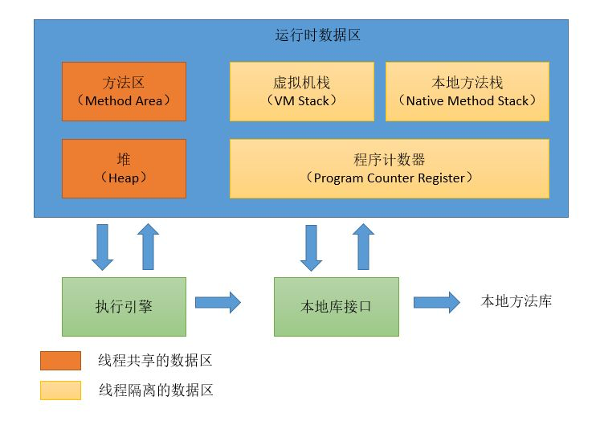

内存区域一共分为5个区域，其中方法区和堆是所有线程共享的区域，随着虚拟机的创建而创建，虚拟机的结束而销毁，而虚拟机栈、本地方法栈、程序计数器都是线程之间相互隔离的，每个线程都有一个自己的区域，并且线程启动时会自动创建，结束之后会自动销毁。内存划分完成之后，JVM执行引擎和本地库接口，也就是Java程序开始运行之后就会根据分区合理地使用对应区域的内存了。

#### 程序计数器

​	程序计数器和传统8086 CPU中PC寄存器的工作原理类似，因为JVM虚拟机目的就是实现物理机那样的程序执行。在8086 CPU中，PC作为程序计数器，负责储存内存地址，该地址指向下一条即将执行的指令，每解释执行完一条指令，PC寄存器的值就会自动被更新为下一条指令的地址，进入下一个指令周期时，就会根据当前地址所指向的指令，进行执行。

​	而JVM中的程序计数器可以看做是当前线程所执行字节码的行号指示器，而行号正好就指的是某一条指令，字节码解释器在工作时也会改变这个值，来指定下一条即将执行的指令。

​	因为Java的多线程也是依靠时间片轮转算法进行的，因此一个CPU同一时间也只会处理一个线程，当某个线程的时间片消耗完成后，会自动切换到下一个线程继续执行，而当前线程的执行位置会被保存到当前线程的程序计数器中，当下次轮转到此线程时，又继续根据之前的执行位置继续向下执行。程序计数器因为只需要记录很少的信息，所以只占用很少一部分内存。

​	程序计数器（Program Counter Register），也叫PC寄存器。每个线程启动的时候，都会创建一个PC寄存器。PC寄存器里保存当前正在执行的JVM指令的地址。 每一个线程都有它自己的PC寄存器，也是该线程启动时创建的。

​	简单来说，PC寄存器就是保存下一条将要执行的指令地址的寄存器，其内容总是指向下一条将被执行指令的地址，这里的地址可以是一个本地指针，也可以是在方法区中相对应于该方法起始指令的偏移量。

​	每个线程都有一个程序计数器，是线程私有的，就是一个指针，指向方法区中的方法字节码（用来存储指向下一条指令的地址,也即将要执行的指令代码），由执行引擎Execution Engine读取下一条指令，是一个非常小的内存空间，几乎可以忽略不记。它是当前线程所执行的字节码的行号指示器，字节码解释器通过改变这个计数器的值来选取下一条需要执行的字节码指令。

PC寄存器一般用以完成分支、循环、跳转、异常处理、线程恢复等基础功能。不会发生内存溢出（OutOfMemory，OOM）错误。

> 如果执行的是一个native方法，那这个计数器是空的。

#### 虚拟机栈区

​	虚拟机栈是非常关键的部分，是一个栈结构，每个方法被执行的时候，Java虚拟机都会同步创建一个栈帧（其实就是栈里面的一个元素），栈帧中包括了当前方法的一些信息，比如局部变量表、操作数栈、动态链接、方法出口等。

**栈管运行，堆管存储！**

栈（Stack），也叫栈内存，主管Java程序的运行，在线程创建时创建。其生命期是跟随线程的生命期，是线程私有的，线程结束栈内存也就是释放。

对于栈来说，不存在垃圾回收的问题，只要线程一结束该栈就Over。

栈存储什么数据？

栈主要存储**8种基本类型的变量、对象的引用变量、以及实例方法。**

**栈帧**

每个方法执行的同时都会创建一个栈帧，用于存储局部变量表、操作数栈、动态链接、方法出口等信息，每个方法从调用直至执行完毕的过程，就对应着一个栈帧在虚拟机中入栈到出栈的过程。

简单来说，栈帧对应一个方法的执行和结束，是方法执行过程的内存模型。

其中，栈帧主要保持了3类数据：

本地变量（Local Variables）：输入参数和输出参数，以及方法内的变量。
栈操作（Operand Stack）：记录出栈、入栈的操作。
栈帧数据（Frame Data）：包括类文件、方法等。

> 栈的大小是根据JVM有关，一般在256K~756K之间，约等于1Mb左右。

**栈的运行原理**

观察下图，在java中，test()和main()都是方法，而在栈中，称为栈帧。在栈中，main()都是第一个入栈的。
栈的顺序为：main()入栈 --> test()入栈 --> test()出栈 --> main()出栈。

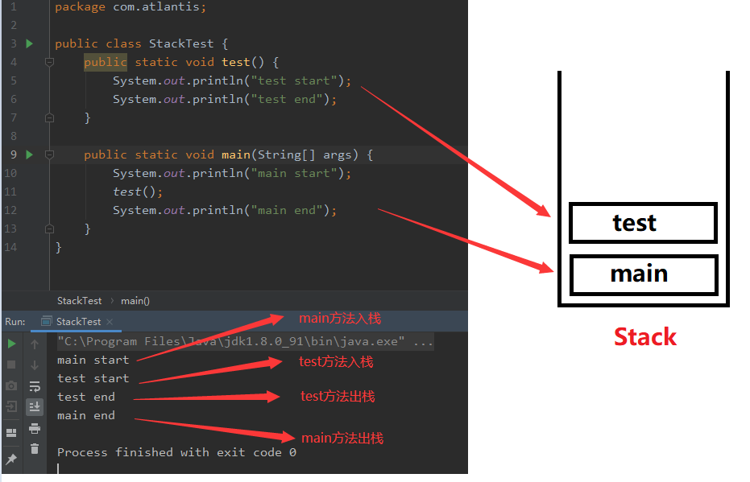

根据代码和运行结果可以知道，main()想要出栈，则必须test()先出栈。那么怎么证明呢？观察下面代码，我们在test()方法中添加了一条语句Thread.sleep(Integer.MAX_VALUE);，来让test()无法进行出栈操作，进而导致main()也无法出栈。运行代码发现，运行结果如我们所料，程序一直停留在test()入栈，无法进行其他操作。


我们接着观察下图，在图中一个栈中有两个栈帧，分别是Stack Frame1和Stack Frame2，对应方法1和方法2。其中Stack Frame2是最先被调用的方法2，所以它先入栈。然后方法2又调用了方法1，所以Stack Frame1处于栈顶位置。执行完毕后，依次弹出Stack Frame1和Stack Frame2，然后线程结束，栈释放。
所以，每执行一个方法都会产生一个栈帧，并保存到栈的顶部，顶部的栈帧就是当前所执行的方法，该方法执行完毕后会自动出栈。


总结如下，栈中的数据都是以栈帧（Stack Frame）的格式存在，栈帧是一个内存区块，是一个数据集，是一个有关方法（Method）和运行期数据的数据集，当一个方法A被调用时就产生了一个栈帧F1，并被压入到栈中，方法A中又调用了方法B，于是产生栈帧F2也被压入栈中，方法B又调用方法C，于是产生栈帧F3也被压入栈中······执行完毕后，遵循“先进后出，后进先出”的原则，先弹出F3栈帧，再弹出F2栈帧，再弹出F1栈帧。

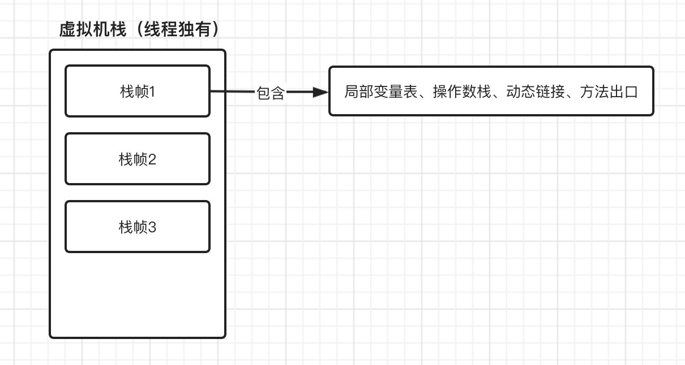

其中局部变量表就是方法中的局部变量，实际上局部变量表在class文件中就已经定义好了，操作数栈就是字节码执行时使用到的栈结构； 每个栈帧还保存了一个**可以指向当前方法所在类**的运行时常量池，目的是：当前方法中如果需要调用其他方法的时候，能够从运行时常量池中找到对应的符号引用，然后将符号引用转换为直接引用，然后就能直接调用对应方法，这就是动态链接，最后是方法出口，也就是方法该如何结束，是抛出异常还是正常返回。

测试类：

```java
public class Main {
    public static void main(String[] args) {
        int res = a();
        System.out.println(res);
    }

    public static int a(){
        return b();
    }

    public static int b(){
        return c();
    }

    public static int c(){
        int a = 10;
        int b = 20;
        return a + b;
    }
}
```

当我们的主方法执行后，会依次执行三个方法`a() -> b() -> c() -> 返回`，我们首先来观察一下反编译之后的结果：

```
{
  public com.test.Main();   #这个是构造方法
    descriptor: ()V
    flags: ACC_PUBLIC
    Code:
      stack=1, locals=1, args_size=1
         0: aload_0
         1: invokespecial #1                  // Method java/lang/Object."<init>":()V
         4: return
      LineNumberTable:
        line 3: 0
      LocalVariableTable:
        Start  Length  Slot  Name   Signature
            0       5     0  this   Lcom/test/Main;

  public static void main(java.lang.String[]);    #主方法
    descriptor: ([Ljava/lang/String;)V
    flags: ACC_PUBLIC, ACC_STATIC
    Code:
      stack=2, locals=2, args_size=1
         0: invokestatic  #2                  // Method a:()I
         3: istore_1
         4: getstatic     #3                  // Field java/lang/System.out:Ljava/io/PrintStream;
         7: iload_1
         8: invokevirtual #4                  // Method java/io/PrintStream.println:(I)V
        11: return
      LineNumberTable:
        line 5: 0
        line 6: 4
        line 7: 11
      LocalVariableTable:
        Start  Length  Slot  Name   Signature
            0      12     0  args   [Ljava/lang/String;
            4       8     1   res   I

  public static int a();
    descriptor: ()I
    flags: ACC_PUBLIC, ACC_STATIC
    Code:
      stack=1, locals=0, args_size=0
         0: invokestatic  #5                  // Method b:()I
         3: ireturn
      LineNumberTable:
        line 10: 0

  public static int b();
    descriptor: ()I
    flags: ACC_PUBLIC, ACC_STATIC
    Code:
      stack=1, locals=0, args_size=0
         0: invokestatic  #6                  // Method c:()I
         3: ireturn
      LineNumberTable:
        line 14: 0

  public static int c();
    descriptor: ()I
    flags: ACC_PUBLIC, ACC_STATIC
    Code:
      stack=2, locals=2, args_size=0
         0: bipush        10
         2: istore_0
         3: bipush        20
         5: istore_1
         6: iload_0
         7: iload_1
         8: iadd
         9: ireturn
      LineNumberTable:
        line 18: 0
        line 19: 3
        line 20: 6
      LocalVariableTable:
        Start  Length  Slot  Name   Signature
            3       7     0     a   I
            6       4     1     b   I
}
```

可以看到在编译之后，整个方法的最大操作数栈深度、局部变量表都是已经确定好的，当程序开始执行时，会根据这些信息封装为对应的栈帧，从`main`方法开始看起：

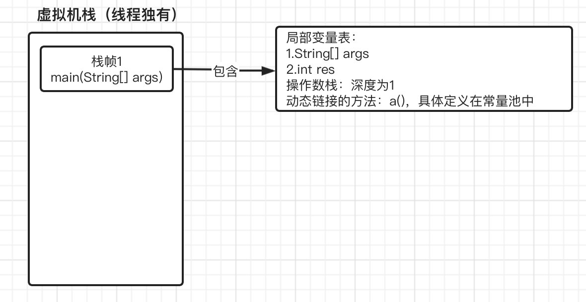

接着我们继续往下，到了` 0: invokestatic  #2                  // Method a:()I`时，需要调用方法`a()`，这时当前方法就不会继续向下运行了，而是去执行方法`a()`，那么同样的，将此方法也入栈，注意是放入到栈顶位置，`main`方法的栈帧会被压栈：

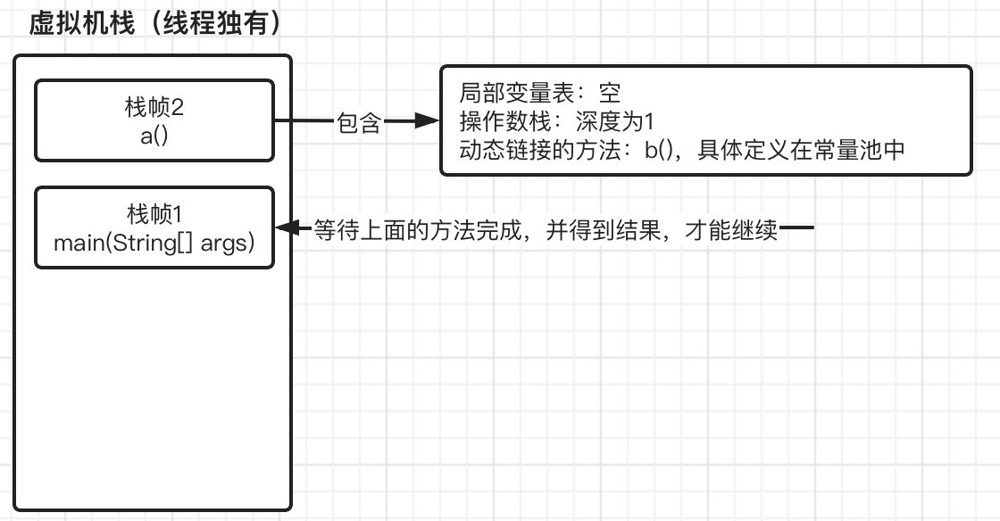

这时，进入方法a之后，又继而进入到方法b，最后在进入c，因此，到达方法c的时候，我们的虚拟机栈变成了：

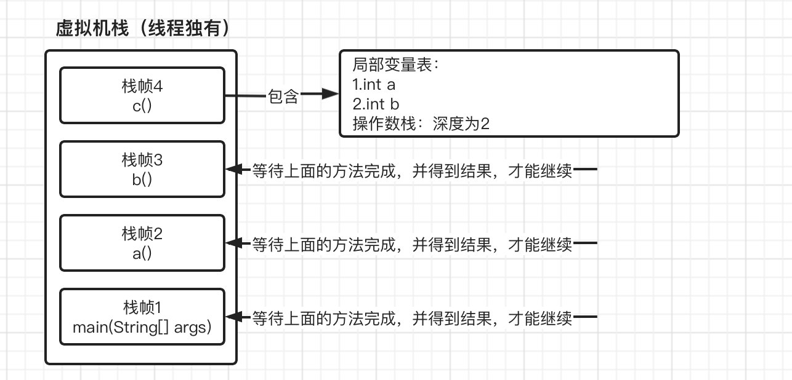

现在依次执行方法c中的指令，最后返回a+b的结果，在方法c返回之后，也就代表方法c已经执行结束了，栈帧4会自动出栈，这时栈帧3就得到了上一栈帧返回的结果，并继续执行，但是由于紧接着马上就返回，所以继续重复栈帧4的操作，此时栈帧3也出栈并继续将结果交给下一个栈帧2，最后栈帧2再将结果返回给栈帧1，然后栈帧1就可以继续向下运行了，最后输出结果。

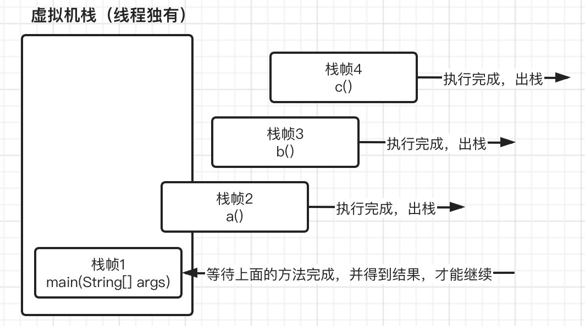

#### 本地方法栈

本地方法接口（Native Interface），其作用是融合不同的编程语言为 Java 所用，它的初衷是用来融合 C/C++ 程序的，Java 诞生的时候是 C/C++ 流行时期，要想立足，就得调用 C/C++ 程序，于是 Java就在内存中专门开辟了一块区域处理标记为 native 的代码。

而本地方法栈（Native Method Stack），就是在一个 Stack 中登记这些 native 方法，然后在执行引擎Execution Engine执行时加载本地方法库native libraies。

接下来，通过下图的多线程部分源码来理解什么是native方法。首先观察start()的源码，发现它其实并没有做什么复杂的操作，只是单纯的调用了start0()这个方法，然后观察start0()的源码，发现它只是一个使用了native关键字修饰的一个方法（private native void start0();），但只有声明却没有具体的实现！

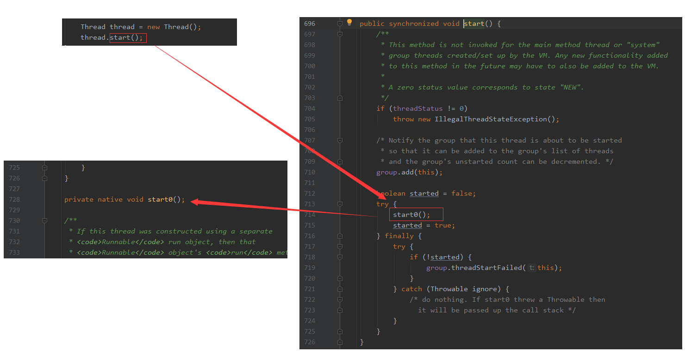

为什么？我们都知道Thread是Class关键字修饰的类（class Thread implements Runnable），而不是接口。一般来说，类中的方法都要有定义和实现，接口里面才有方法的定义声明。这就是native方法的独特之处，说白了，被native关键字修饰的方法，基本上和我们，甚至和 Java 都没啥关系了，因为它要去调用底层操作系统或者第三方语言的库函数，所以我们不需要去考虑它具体是如何实现的。

#### 堆区

堆是整个Java应用程序共享的区域，也是整个虚拟机最大的一块内存空间，而此区域的职责就是存放和管理对象和数组，而垃圾回收机制也是主要作用于这一部分内存区域。一个JVM实例只存在一个堆内存，堆内存的大小是可以调节的。类加载器读取了类文件之后，需要把类、方法、常量变量放到堆内存中，保持所以引用类型的真实信息，方便执行器执行。

其中，堆内存分为3个部分：

Young Generation Space，新生区、新生代
Tenure Generation Space，老年区、老年代
Permanent Space，永久区、元空间

其中新生代又分为：伊甸区和幸存区，幸存区又分为幸存0区和幸存1区，又叫from区和to区

堆内存在逻辑上分为新生代、老年代、元空间，物理上分为新生代和老年代

**对象在堆中的生命周期**

（1）首先，新生区是类的诞生、成长、消亡的区域。一个类在这里被创建并使用，最后被垃圾回收器收集，结束生命。

（2）其次，所有的类都是在Eden Space被new出来的。而当Eden Space的空间用完时，程序又需要创建对象，JVM的垃圾回收器则会将Eden Space中不再被其他对象所引用的对象进行销毁，也就是垃圾回收（Minor GC）。此时的GC可以认为是轻量级GC。

（3）然后将Eden Space中剩余的未被回收的对象，移动到Survivor 0 Space，以此往复，直到Survivor 0 Space也满了的时候，再对Survivor 0 Space进行垃圾回收，剩余的未被回收的对象，则再移动到Survivor 1 Space。Survivor 1 Space也满了的话，再移动至Tenure Generation Space。

（4）最后，如果Tenure Generation Space也满了的话，那么这个时候就会被垃圾回收（Major GC or Full GC）并将该区的内存清理。此时的GC可以认为是重量级GC。如果Tenure Generation Space被GC垃圾回收之后，依旧处于占满状态的话，就会产生我们场景的OOM异常，即OutOfMemoryError。

**Minor GC的过程**

`Survivor 0 Space`，幸存者0区，也叫`from`区；
`Survivor 1 Space`，幸存者1区，也叫`to`区。

其中，`from`区和`to`区的区分不是固定的，是互相交换的，意思是说，在每次GC之后，两者会进行交换，谁空谁就是`to`区。


（1）Eden Space、from复制到to，年龄+1。
首先，当Eden Space满时，会触发第一次GC，把还活着的对象拷贝到from区。而当Eden Space再次触发GC时，会扫描Eden Space和from，对这两个区进行垃圾回收，经过此次回收后依旧存活的对象，则直接复制到to区（如果对象的年龄已经达到老年的标准，则移动至老年代区），同时把这些对象的年龄+1。

（2）清空Eden Space、from
然后，清空Eden Space和from中的对象，此时的from是空的。

（3）from和to互换
最后，from和to进行互换，原from成为下一次GC时的to，原to成为下一次GC时的from。部分对象会在from和to中来回进行交换复制，如果交换15次（由JVM参数MaxTenuringThreshold决定，默认15），最终依旧存活的对象就会移动至老年代。

总结一句话，GC之后有交换，谁空谁是to。

这样也是为了保证内存中没有碎片，所以Survivor 0 Space和Survivor 1 Space有一个要是空的。

> 这样也是为了保证内存中没有碎片，所以`Survivor 0 Space`和`Survivor 1 Space`有一个要是空的。

**HotSpot虚拟机的内存管理**


> 不同对象的生命周期不同，其中98%的对象都是临时对象，即这些对象的生命周期大多只存在于Eden区。

实际而言，方法区（Method Area）和堆一样，是各个线程共享的内存区域，它用于存储虚拟机加载的：类信息+普通常量+静态常量+编译器编译后的代码等等。虽然JVM规范将方法区描述为堆的一个逻辑部分，但它却还有一个别名叫做Non-Heap（非堆内存），目的就是要和堆区分开。

对于HotSpot虚拟机而言，很多开发者习惯将方法区称为 “永久代（Permanent Gen）” 。但严格来说两者是不同的，或者说只是使用永久代来实现方法区而已，永久代是方法区（可以理解为一个接口interface）的一个实现，JDK1.7的版本中，已经将原本放在永久代的字符串常量池移走。（字符串常量池，JDK1.6在方法区，JDK1.7在堆，JDK1.8在元空间。）

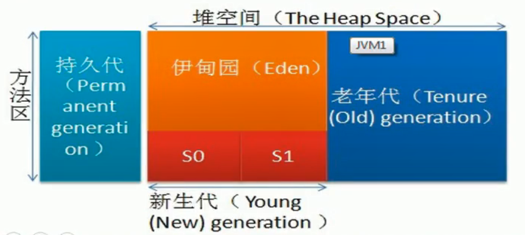

**永久区**

永久区是一个常驻内存区域，用于存放JDK自身所携带的Class，Interface的元数据（也就是上面文章提到的rt.jar等），也就是说它存储的是运行环境必须的类信息，被装载进此区域的数据是不会被垃圾回收器回收掉的，关闭JVM才会释放此区域所占用的内存。
（1）JDK1.7


（2）JDK1.8


在JDK1.8中，永久代已经被移除，被一个称为元空间的区域所取代。元空间的本质和永久代类似。

元空间与永久代之间最大的区别在于： 永久代使用的JVM的堆内存，但是java8以后的元空间并不在虚拟机中而是使用本机物理内存。

因此，默认情况下，元空间的大小仅受本地内存限制。
类的元数据放入native memory，字符串池和类的静态变量放入Java堆中，这样可以加载多少类的元数据就不再由MaxPermSize控制, 而由系统的实际可用空间来控制。

#### 方法区

方法区也是整个Java应用程序共享的区域，它用于存储所有的类信息、常量、静态变量、动态编译缓存等数据，可以大致分为两个部分，一个是类信息表，一个是运行时常量池。

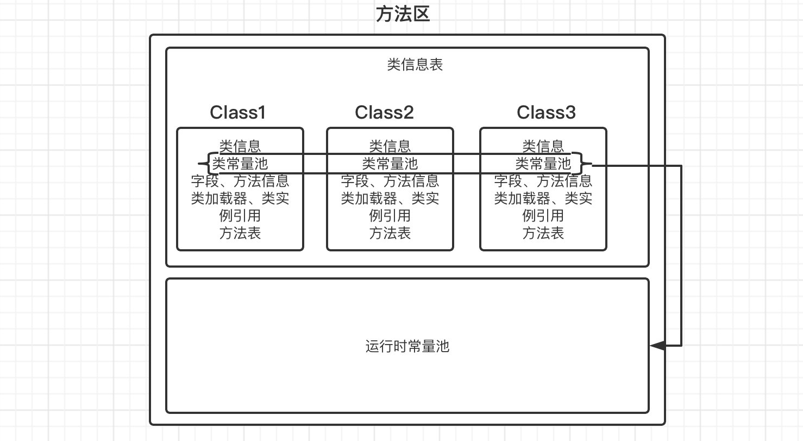

首先类信息表中存放的是当前应用程序加载的所有类信息，包括类的版本、字段、方法、接口等信息，同时会将编译时生成的常量池数据全部存放到运行时常量池中。当然，常量也并不是只能从类信息中获取，在程序运行时，也有可能会有新的常量进入到常量池。

其实String类正是利用了常量池进行优化，编写一个测试用例：

```java
public static void main(String[] args) {
    String str1 = new String("abc");
    String str2 = new String("abc");

    System.out.println(str1 == str2);
    System.out.println(str1.equals(str2));
}
```

得到的结果也是显而易见的，由于`str1`和`str2`是单独创建的两个对象，那么这两个对象实际上会在堆中存放，保存在不同的地址：

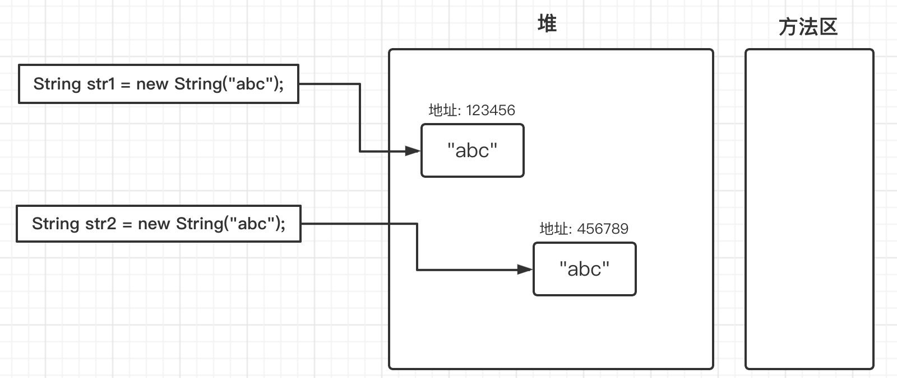

所以当使用`==`判断时，得到的结果`false`，而使用`equals`时因为比较的是值，所以得到`true`。

```java
public static void main(String[] args) {
    String str1 = "abc";
    String str2 = "abc";

    System.out.println(str1 == str2);
    System.out.println(str1.equals(str2));
}
```

现在没有使用new的形式，而是直接使用双引号创建，那么这时得到的结果就变成了两个`true`。这其实是因为直接使用双引号赋值，会先在常量池中查找是否存在相同的字符串，若存在，则将引用直接指向该字符串；若不存在，则在常量池中生成一个字符串，再将引用指向该字符串：

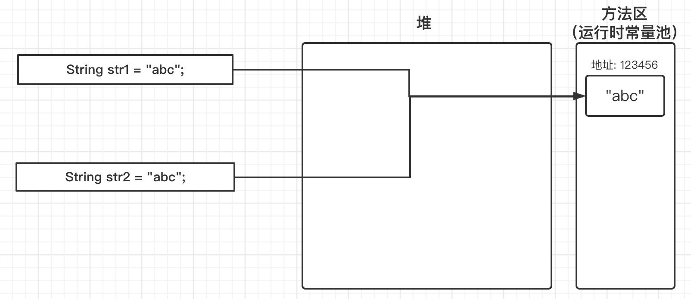

实际上两次调用String类的`intern()`方法，和上面的效果差不多，也是第一次调用会将堆中字符串复制并放入常量池中，第二次通过此方法获取字符串时，会查看常量池中是否包含，如果包含那么会直接返回常量池中字符串的地址：

```java
public static void main(String[] args) {
    //不能直接写"abc"，双引号的形式，写了就直接在常量池里面吧abc创好了
    String str1 = new String("ab")+new String("c");
    String str2 = new String("ab")+new String("c");

    System.out.println(str1.intern() == str2.intern());
    System.out.println(str1.equals(str2));
}
```


所以上述结果中得到的依然是两个`true`。在JDK1.7之后，稍微有一些区别，在调用`intern()`方法时，当常量池中没有对应的字符串时，不会再进行复制操作，而是将其直接修改为指向当前字符串堆中的的引用：

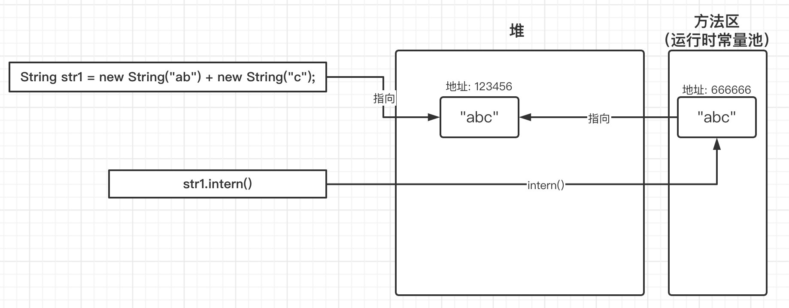

```java
public static void main(String[] args) {
  	//不能直接写"abc"，双引号的形式，写了就直接在常量池里面吧abc创好了
    String str1 = new String("ab")+new String("c");
    System.out.println(str1.intern() == str1);
}
```

```java
public static void main(String[] args) {
    String str1 = new String("ab")+new String("c");
    String str2 = new String("ab")+new String("c");

    System.out.println(str1 == str1.intern());
    System.out.println(str2.intern() == str1);
}
```

所以最后会发现，`str1.intern()`和`str1`都是同一个对象，结果为`true`。

值得注意的是，在JDK7之后，字符串常量池从方法区移动到了堆中。

总结，各个内存区域的用途：

* （线程独有）程序计数器：保存当前程序的执行位置。
* （线程独有）虚拟机栈：通过栈帧来维持方法调用顺序，帮助控制程序有序运行。
* （线程独有）本地方法栈：同上，作用与本地方法。
* 堆：所有的对象和数组都在这里保存。
* 方法区：类信息、即时编译器的代码缓存、运行时常量池。

方法区（Method Area），是供各线程共享的运行时内存区域，它存储了每一个类的结构信息。例如运行时常量池（Runtime Constant Pool）、字段和方法数据、构造函数和普通方法的字节码内容。

上面说的是规范（定义的一种抽象概念），实际在不同虚拟机里实现是不一样的，最典型的就是永久代（PermGen space）和元空间（Meta space）。

> 实例变量存在堆内存中，和方法区无关。

### 内存、栈溢出

实际上，在Java程序运行时，内存容量不可能是无限制的，当我们的对象创建过多或是数组容量过大时，就会导致我们的堆内存不足以存放更多新的对象或是数组，这时就会出现错误，比如：

```java
public static void main(String[] args) {
    int[] a = new int[Integer.MAX_VALUE];
}
```

申请一个容量为21亿多的int型数组，显然，如此之大的数组不可能放在我们的堆内存中，所以程序运行时就会这样：

```java
Exception in thread "main" java.lang.OutOfMemoryError: Requested array size exceeds VM limit
	at com.test.Main.main(Main.java:5)
```

这里得到了一个`OutOfMemoryError`错误，也就是常说的内存溢出错误。可以通过参数来控制堆内存的最大值和最小值：

```
-Xms最小值 -Xmx最大值
-Xms1m -Xmx1m -XX:+HeapDumpOnOutOfMemoryError
```

比如限制堆内存为固定值1M大小，并且在抛出内存溢出异常时保存当前的内存堆转储快照：

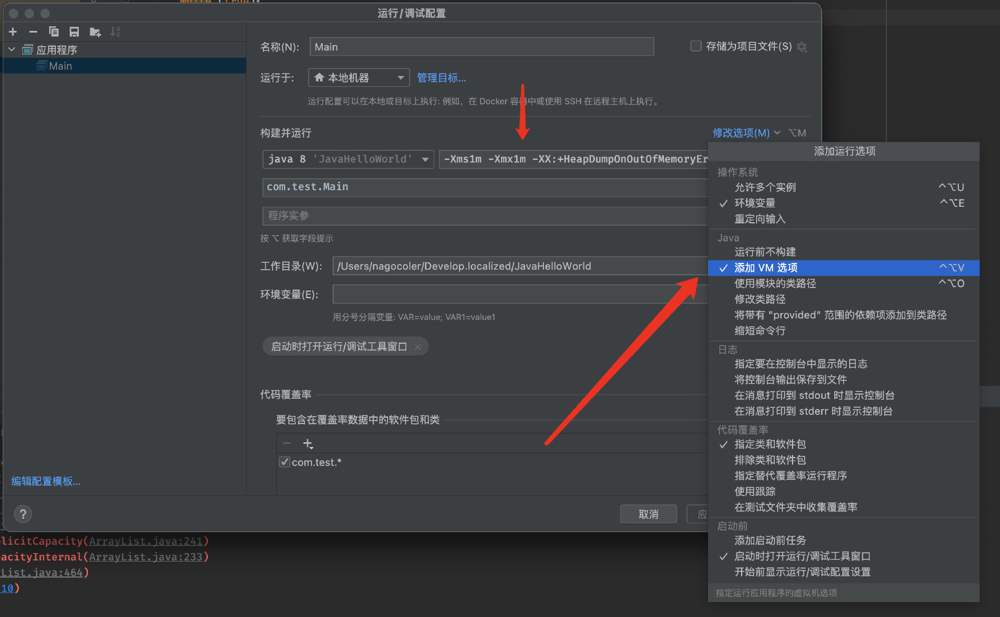

注意堆内存不要设置太小，不然连虚拟机都不足以启动，接着我们编写一个一定会导致内存溢出的程序：

```java
public class Main {
    public static void main(String[] args) {
        List<Test> list = new ArrayList<>();
        while (true){
            list.add(new Test());    //无限创建Test对象并丢进List中
        }
    }

    static class Test{ }
}
```

在程序运行之后：

```
java.lang.OutOfMemoryError: Java heap space
Dumping heap to java_pid35172.hprof ...
Heap dump file created [12895344 bytes in 0.028 secs]
Exception in thread "main" java.lang.OutOfMemoryError: Java heap space
	at java.util.Arrays.copyOf(Arrays.java:3210)
	at java.util.Arrays.copyOf(Arrays.java:3181)
	at java.util.ArrayList.grow(ArrayList.java:267)
	at java.util.ArrayList.ensureExplicitCapacity(ArrayList.java:241)
	at java.util.ArrayList.ensureCapacityInternal(ArrayList.java:233)
	at java.util.ArrayList.add(ArrayList.java:464)
	at com.test.Main.main(Main.java:10)
```

可以看到错误出现原因正是`Java heap space`，也就是堆内存满了，并且根据我们设定的VM参数，堆内存保存了快照信息。可以在IDEA内置的Profiler中进行查看：

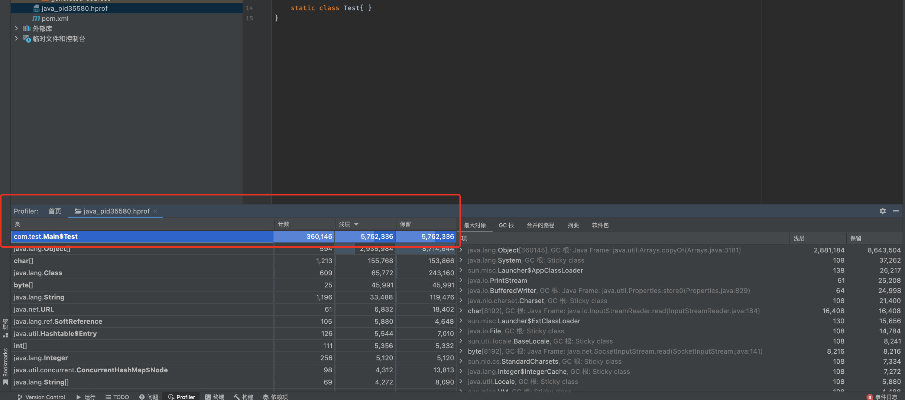

可以很明显地看到，在创建了360146个Test对象之后，堆内存溢出了，于是就抛出了内存溢出错误。

接着来看栈溢出，我们知道，虚拟机栈会在方法调用时插入栈帧，那么，设想如果出现无限递归的情况呢？

```java
public class Main {
    public static void main(String[] args) {
        test();
    }

    public static void test(){
        test();
    }
}
```

这很明显是一个永无休止的程序，并且会不断继续向下调用test方法本身，那么按照我们之前的逻辑推导，无限地插入栈帧那么一定会将虚拟机栈塞满，所以，当栈的深度已经不足以继续插入栈帧时，就会这样：

```
Exception in thread "main" java.lang.StackOverflowError
	at com.test.Main.test(Main.java:12)
	at com.test.Main.test(Main.java:12)
	at com.test.Main.test(Main.java:12)
	at com.test.Main.test(Main.java:12)
	at com.test.Main.test(Main.java:12)
	at com.test.Main.test(Main.java:12)
	....以下省略很多行
```

这也是我们常说的栈溢出，它和堆溢出比较类似，也是由于容纳不下才导致的，我们可以使用`-Xss`来设定栈容量。

### 申请堆外内存

除了堆内存可以存放对象数据以外，也可以申请堆外内存（直接内存），也就是不受JVM管控的内存区域，这部分区域的内存需要自行去申请和释放，实际上本质就是JVM通过C/C++调用`malloc`函数申请的内存，当然得自己去释放了。不过虽然是直接内存，不会受到堆内存容量限制，但是依然会受到本机最大内存的限制，所以还是有可能抛出`OutOfMemoryError`异常。

这里需要提到一个堆外内存操作类：`Unsafe`，就像它的名字一样，虽然Java提供堆外内存的操作类，但是实际上它是不安全的，只有你完全了解底层原理并且能够合理控制堆外内存，才能安全地使用堆外内存。

注意这个类不让new，也没有直接获取方式：

```java
public final class Unsafe {

    private static native void registerNatives();
    static {
        registerNatives();
        sun.reflect.Reflection.registerMethodsToFilter(Unsafe.class, "getUnsafe");
    }

    private Unsafe() {}

    private static final Unsafe theUnsafe = new Unsafe();
  
    @CallerSensitive
    public static Unsafe getUnsafe() {
        Class<?> caller = Reflection.getCallerClass();
        if (!VM.isSystemDomainLoader(caller.getClassLoader()))
            throw new SecurityException("Unsafe");   //不是JDK的类，不让用。
        return theUnsafe;
    }
```

所以就通过反射获取类：

```java
public static void main(String[] args) throws IllegalAccessException {
    Field unsafeField = Unsafe.class.getDeclaredFields()[0];
    unsafeField.setAccessible(true);
    Unsafe unsafe = (Unsafe) unsafeField.get(null);
    
}
```

成功拿到Unsafe类之后，就可以开始申请堆外内存了，比如现在想要申请一个int大小的内存空间，并在此空间中存放一个int类型的数据：

```java
public static void main(String[] args) throws IllegalAccessException {
    Field unsafeField = Unsafe.class.getDeclaredFields()[0];
    unsafeField.setAccessible(true);
    Unsafe unsafe = (Unsafe) unsafeField.get(null);

    //申请4字节大小的内存空间，并得到对应位置的地址
    long address = unsafe.allocateMemory(4);
    //在对应的地址上设定int的值
    unsafe.putInt(address, 6666666);
    //获取对应地址上的Int型数值
    System.out.println(unsafe.getInt(address));
    //释放申请到的内容
    unsafe.freeMemory(address);

    //由于内存已经释放，这时数据就没了
    System.out.println(unsafe.getInt(address));
}
```

看一下`allocateMemory`底层是如何调用的，这是一个native方法，我们来看C++源码：

```cpp
UNSAFE_ENTRY(jlong, Unsafe_AllocateMemory0(JNIEnv *env, jobject unsafe, jlong size)) {
  size_t sz = (size_t)size;

  sz = align_up(sz, HeapWordSize);
  void* x = os::malloc(sz, mtOther);   //这里调用了os::malloc方法

  return addr_to_java(x);
} UNSAFE_END
```

接着来看：

```cpp
void* os::malloc(size_t size, MEMFLAGS flags) {
  return os::malloc(size, flags, CALLER_PC);
}

void* os::malloc(size_t size, MEMFLAGS memflags, const NativeCallStack& stack) {
	...
  u_char* ptr;
  ptr = (u_char*)::malloc(alloc_size);   //调用C++标准库函数 malloc(size)
	....
  // we do not track guard memory
  return MemTracker::record_malloc((address)ptr, size, memflags, stack, level);
}
```

所以上面的Java代码转换为C代码，差不多就是这个意思：

```c
#include <stdlib.h>
#include <stdio.h>

int main(){
    int * a = malloc(sizeof(int));
    *a = 6666666;
    printf("%d\n", *a);
    free(a);
    printf("%d\n", *a);
}
```

所以说，直接内存实际上就是JVM申请的一块额外的内存空间，但是它并不在受管控的几种内存空间中，当然这些内存依然属于是JVM的，由于JVM提供的堆内存会进行垃圾回收等工作，效率不如直接申请和操作内存来得快，一些比较追求极致性能的框架会用到堆外内存来提升运行速度，如nio框架。

## 垃圾回收

​	Java会自动管理和释放内存，它不像C/C++那样要求我们手动管理内存，JVM提供了一套全自动的内存管理机制，当一个Java对象不再用到时，JVM会自动将其进行回收并释放内存，那么对象所占内存在什么时候被回收，如何判定对象可以被回收，以及如何去进行回收工作也是JVM需要关注的问题。

### 垃圾回收机制

对于GC垃圾收集机制，我们需要记住以下几点：

1. 次数上频繁收集Young区。
2. 次数上较少收集Old区。
3. 基本不动元空间。


JVM在进行GC时，并非每次都对上面三个内存区域一起回收的，大部分时候回收的都是指新生代。
因此GC按照回收的区域又分了两种类型，一种是普通GC（minor GC），一种是全局GC（major GC or Full GC）

Minor GC和Full GC的区别：
（1）普通GC（minor GC）：只针对新生代区域的GC，指发生在新生代的垃圾收集动作，因为大多数Java对象存活率都不高，所以Minor GC非常频繁，一般回收速度也比较快。
（2）全局GC（major GC or Full GC）：指发生在老年代的垃圾收集动作，出现了Major GC，经常会伴随至少一次的Minor GC（但并不是绝对的）。Major GC的速度一般要比Minor GC慢上10倍以上

### GC日志信息

**YGC相关参数：**

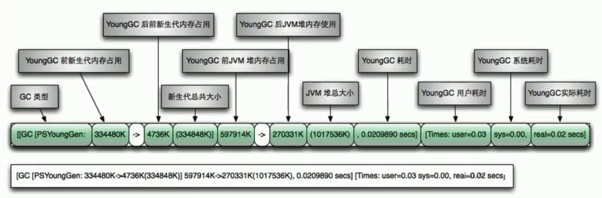

**FGC相关参数：**


### 对象存活判定算法

#### 引用计数法

如果要经常操作一个对象，那么首先一定会创建一个引用变量：

```java
//str就是一个引用类型的变量，它持有对后面字符串对象的引用，可以代表后面这个字符串对象本身
String str = "lbwnb";

//str.xxxxx...
```

实际上，我们会发现，只要一个对象还有使用价值，我们就会通过它的引用变量来进行操作，那么可否这样判断一个对象是否还需要被使用：

* 每个对象都包含一个 **引用计数器**，用于存放引用计数（其实就是存放被引用的次数）
* 每当有一个地方引用此对象时，引用计数`+1`
* 当引用失效（ 比如离开了局部变量的作用域或是引用被设定为`null`）时，引用计数`-1`
* 当引用计数为`0`时，表示此对象不可能再被使用，因为这时我们已经没有任何方法可以得到此对象的引用了

但是这样存在一个问题，如果两个对象相互引用呢？

```java
public class Main {
    public static void main(String[] args) {
        Test a = new Test();
        Test b = new Test();

        a.another = b;
        b.another = a;

        //这里直接把a和b赋值为null，这样前面的两个对象我们不可能再得到了
        a = b = null;
    }

    private static class Test{
        Test another;
    }
}
```

按照引用计数算法，那么当出现以上情况时，虽然我们无法在得到此对象的引用了，并且此对象我们也无需再使用，但是由于这两个对象直接存在相互引用的情况，那么引用计数器的值将会永远是`1`，但是实际上此对象已经没有任何用途了。所以引用计数法并不是最好的解决方案。

#### 可达性分析算法

目前比较主流的编程语言（包括Java），一般都会使用可达性分析算法来判断对象是否存活，它采用了类似于树结构的搜索机制。

首先每个对象的引用都有机会成为树的根节点（GC Roots），可以被选定作为根节点条件如下：

* 位于虚拟机栈的栈帧中的本地变量表中所引用到的对象（其实就是我们方法中的局部变量）同样也包括本地方法栈中JNI引用的对象。
* 类的静态成员变量引用的对象。
* 方法区中，常量池里面引用的对象，比如我们之前提到的`String`类型对象。
* 被添加了锁的对象（比如synchronized关键字）
* 虚拟机内部需要用到的对象。


一旦已经存在的根节点不满足存在的条件时，那么根节点与对象之间的连接将被断开。此时虽然对象1仍存在对其他对象的引用，但是由于其没有任何根节点引用，所以此对象即可被判定为不再使用。比如某个方法中的局部变量引用，在方法执行完成返回之后：

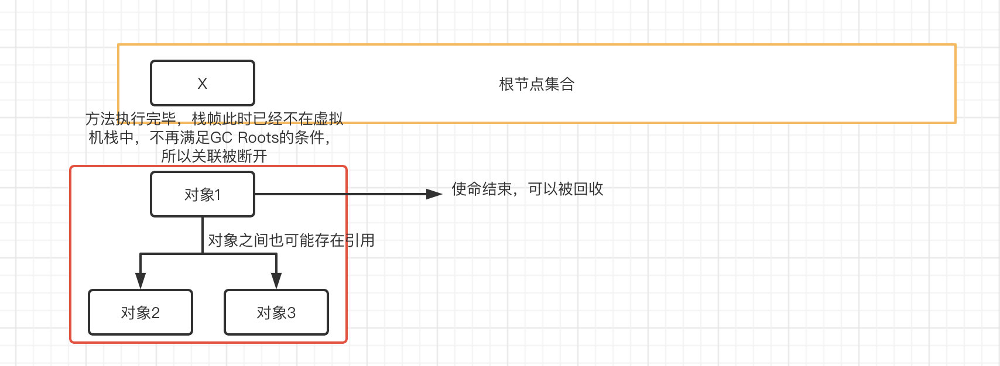

这样就能很好地解决我们刚刚提到的循环引用问题，我们再来重现一下出现循环引用的情况：

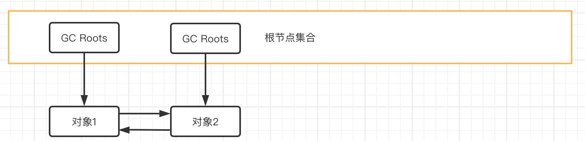

可以看到，对象1和对象2依然是存在循环引用的，但是只有他们各自的GC Roots断开，那么就会变成下面这样：

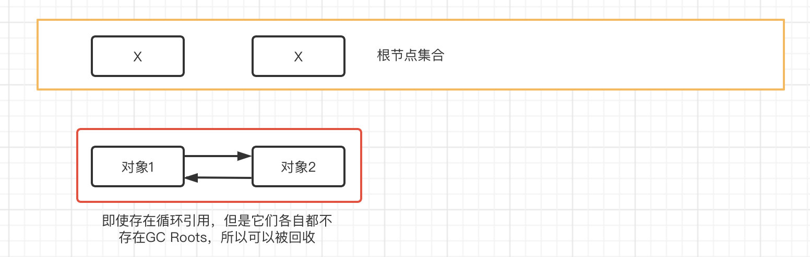

总结：如果某个对象无法到达任何GC Roots，则证明此对象是不可能再被使用的。

#### 最终判定

虽然在经历了可达性分析算法之后基本可能判定哪些对象能够被回收，但是并不代表此对象一定会被回收，我们依然可以在最终判定阶段对其进行挽留。

```java
/**
 * Called by the garbage collector on an object when garbage collection
 * determines that there are no more references to the object.
 * A subclass overrides the {@code finalize} method to dispose of
 * system resources or to perform other cleanup.
 * ...
 */
protected void finalize() throws Throwable { }
```

此方法正是最终判定方法，如果子类重写了此方法，那么子类对象在被判定为可回收时，会进行二次确认，也就是执行`finalize()`方法，而在此方法中，当前对象是完全有可能重新建立GC Roots的！所以，如果在二次确认后对象不满足可回收的条件，那么此对象不会被回收，巧妙地逃过了垃圾回收的命运。比如下面这个例子：

```java
public class Main {
    private static Test a;
    public static void main(String[] args) throws InterruptedException {
        a = new Test();

        //这里直接把a赋值为null，这样前面的对象我们不可能再得到了
        a  = null;

        //手动申请执行垃圾回收操作（注意只是申请，并不一定会执行，但是一般情况下都会执行）
        System.gc();

        //等垃圾回收一下()
        Thread.sleep(1000);

        //我们来看看a有没有被回收
        System.out.println(a);
    }

    private static class Test{
        @Override
        protected void finalize() throws Throwable {
            System.out.println(this+" 开始了它的救赎之路！");
            a = this;
        }
    }
}
```

注意`finalize()`方法并不是在主线程调用的，而是虚拟机自动建立的一个低优先级的`Finalizer`线程（正是因为优先级比较低，所以前面才需要等待1秒钟）进行处理，我们可以稍微修改一下看看：

```java
private static class Test{
    @Override
    protected void finalize() throws Throwable {
        System.out.println(Thread.currentThread());
        a = this;
    }
}
```

```
Thread[Finalizer,8,system]
com.test.Main$Test@232204a1
```

同时，同一个对象的`finalize()`方法只会有一次调用机会，也就是说，如果我们连续两次这样操作，那么第二次，对象必定被回收：

```java
public static void main(String[] args) throws InterruptedException {
    a = new Test();
    //这里直接把a赋值为null，这样前面的对象我们不可能再得到了
    a  = null;
    //手动申请执行垃圾回收操作（注意只是申请，并不一定会执行，但是一般情况下都会执行）
    System.gc();
    //等垃圾回收一下
    Thread.sleep(1000);
    
    System.out.println(a);
    //这里直接把a赋值为null，这样前面的对象我们不可能再得到了
    a  = null;
    //手动申请执行垃圾回收操作（注意只是申请，并不一定会执行，但是一般情况下都会执行）
    System.gc();
    //等垃圾回收一下
    Thread.sleep(1000);
    
    System.out.println(a);
}
```

当然，`finalize()`方法也并不是专门防止对象被回收的，我们可以使用它来释放一些程序使用中的资源等。

最后，总结成一张图：

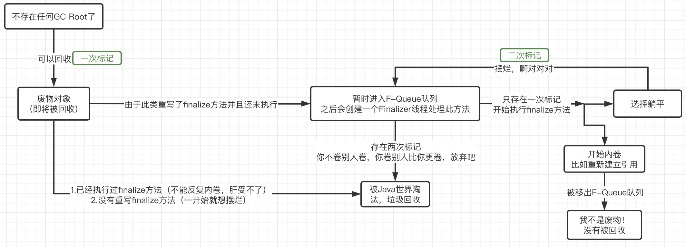

当然，除了堆中的对象以外，方法区中的数据也是可以被垃圾回收的，但是回收条件比较严格。

### 垃圾回收算法

#### 分代收集机制

实际上，如果我们对堆中的每一个对象都依次判断是否需要回收，这样的效率其实是很低的，那么有没有更好地回收机制呢？第一步，我们可以对堆中的对象进行分代管理。

比如某些对象，在多次垃圾回收时，都未被判定为可回收对象，我们完全可以将这一部分对象放在一起，并让垃圾收集器减少回收此区域对象的频率，这样就能很好地提高垃圾回收的效率了。

因此，Java虚拟机将堆内存划分为**新生代**、**老年代**和**永久代**（其中永久代是HotSpot虚拟机特有的概念，在JDK8之前方法区实际上就是采用的永久代作为实现，而在JDK8之后，方法区由元空间实现，并且使用的是本地内存，容量大小取决于物理机实际大小，之后会详细介绍）这里我们主要讨论的是**新生代**和**老年代**。

不同的分代内存回收机制也存在一些不同之处，在HotSpot虚拟机中，新生代被划分为三块，一块较大的Eden空间和两块较小的Survivor空间，默认比例为8：1：1，老年代的GC评率相对较低，永久代一般存放类信息等（其实就是方法区的实现）如图所示：

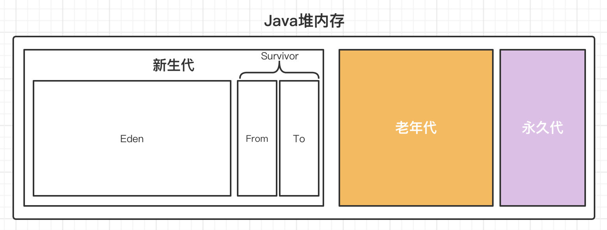

那么它是如何运作的呢？

首先，所有新创建的对象，在一开始都会进入到新生代的Eden区（如果是大对象会被直接丢进老年代），在进行新生代区域的垃圾回收时，首先会对所有新生代区域的对象进行扫描，并回收那些不再使用对象：

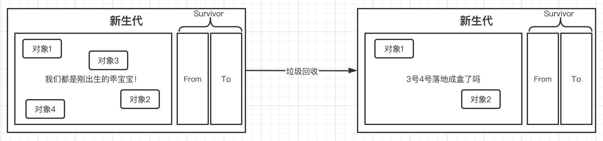

接着，在一次垃圾回收之后，Eden区域没有被回收的对象，会进入到Survivor区。在一开始From和To都是空的，而GC之后，所有Eden区域存活的对象都会直接被放入到From区，最后From和To会发生一次交换，也就是说目前存放我们对象的From区，变为To区，而To区变为From区：

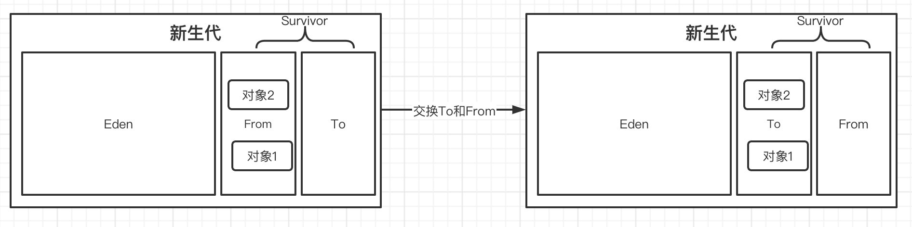

接着就是下一次垃圾回收了，操作与上面是一样的，不过这时由于我们From区域中已经存在对象了，所以，在Eden区的存活对象复制到From区之后，所有To区域中的对象会进行年龄判定（每经历一轮GC年龄`+1`，如果对象的年龄大于`默认值为15`，那么会直接进入到老年代，否则移动到From区）

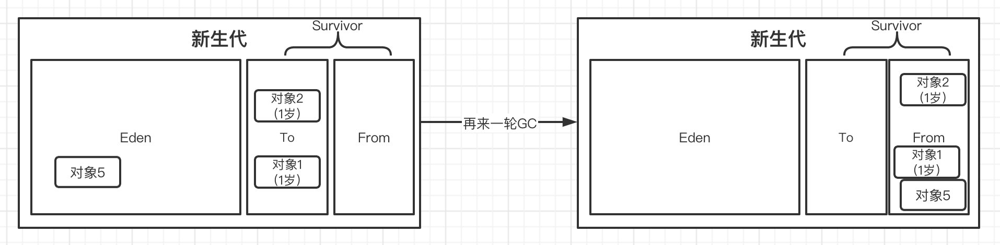

最后像上面一样交换To区和From区，之后不断重复以上步骤。

而垃圾收集也分为：

* Minor GC   -   次要垃圾回收，主要进行新生代区域的垃圾收集。
    * 触发条件：新生代的Eden区容量已满时。
* Major GC   -   主要垃圾回收，主要进行老年代的垃圾收集。
* Full GC      -    完全垃圾回收，对整个Java堆内存和方法区进行垃圾回收。
    * 触发条件1：每次晋升到老年代的对象平均大小大于老年代剩余空间
    * 触发条件2：Minor GC后存活的对象超过了老年代剩余空间
    * 触发条件3：永久代内存不足（JDK8之前）
    * 触发条件4：手动调用`System.gc()`方法

添加启动参数来查看JVM的GC日志：

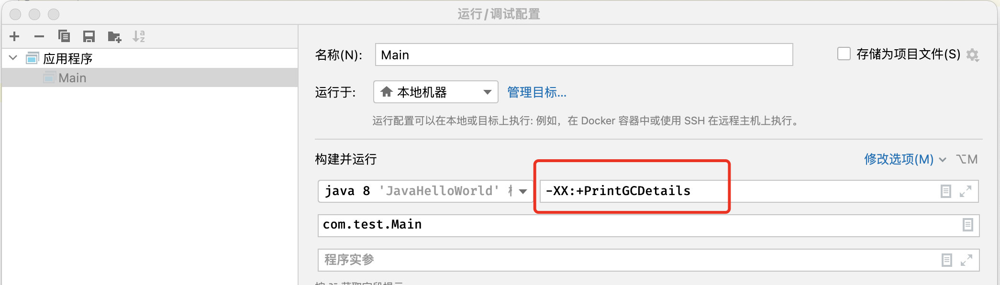

```java
public class Main {
    public static void main(String[] args) {
        Object o = new Object();
        o = null;
        System.gc();
    }
}
```

```
[GC (System.gc()) [PSYoungGen: 2621K->528K(76288K)] 2621K->528K(251392K), 0.0006874 secs] [Times: user=0.01 sys=0.01, real=0.00 secs] 
[Full GC (System.gc()) [PSYoungGen: 528K->0K(76288K)] [ParOldGen: 0K->332K(175104K)] 528K->332K(251392K), [Metaspace: 3073K->3073K(1056768K)], 0.0022693 secs] [Times: user=0.00 sys=0.00, real=0.00 secs] 
Heap
 PSYoungGen      total 76288K, used 3277K [0x000000076ab00000, 0x0000000770000000, 0x00000007c0000000)
  eden space 65536K, 5% used [0x000000076ab00000,0x000000076ae334d8,0x000000076eb00000)
  from space 10752K, 0% used [0x000000076eb00000,0x000000076eb00000,0x000000076f580000)
  to   space 10752K, 0% used [0x000000076f580000,0x000000076f580000,0x0000000770000000)
 ParOldGen       total 175104K, used 332K [0x00000006c0000000, 0x00000006cab00000, 0x000000076ab00000)
  object space 175104K, 0% used [0x00000006c0000000,0x00000006c00532d8,0x00000006cab00000)
 Metaspace       used 3096K, capacity 4496K, committed 4864K, reserved 1056768K
  class space    used 333K, capacity 388K, committed 512K, reserved 1048576K

```

#### 空间分配担保

我们可以思考一下，有没有这样一种极端情况（正常情况下新生代的回收率是很高的，所以说不用太担心会经常出现这种问题），在一次GC后，新生代Eden区仍然存在大量的对象（因为GC之后存活对象会进入到一个Survivor区，但是很明显这时已经超出Survivor区的容量了，肯定是装不下的）那么现在该怎么办？

这时就需要用到空间分配担保机制了，可以把Survivor区无法容纳的对象直接送到老年代，让老年代进行分配担保（当然老年代也得装得下才行）在现实生活中，贷款会指定担保人，就是当借款人还不起钱的时候由担保人来还钱。

当新生代无法容纳更多的的对象时，可以把新生代中的对象移动到老年代中，这样新生代就腾出了空间来容纳更多的对象。

好，那既然新生代装不下就丢给老年代，那么要是老年代也装不下新生代的数据呢？这时，老年代肯定担保人是当不成了，那么这样的话，首先会判断一下之前的每次垃圾回收进入老年代的平均大小是否小于当前老年代的剩余空间，如果小于，那么说明也许可以放得下（不过也仅仅是也许，依然有可能放不下，因为判断的实际上只是平均值，万一这一次突然非常大呢），否则，会先来一次Full GC，进行一次大规模垃圾回收，来尝试腾出空间，再次判断老年代是否有空间存放，要是还是装不下，直接抛出OOM错误。

最后，我们来总结一下一次Minor GC的整个过程：

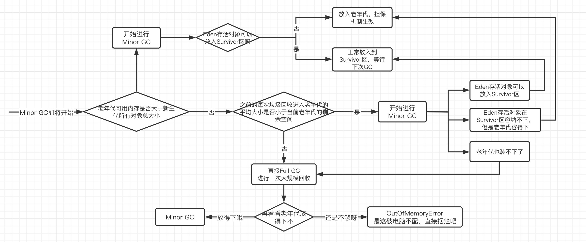

#### 标记-复制算法

复制算法（Copying）：适用于新生代

标记复制算法，实际上就是将内存区域划分为大小相同的两块区域，每次只使用其中的一块区域，每次垃圾回收结束后，将所有存活的对象全部复制到另一块区域中，并一次性清空当前区域。虽然浪费了一些时间进行复制操作，但是这样能够很好地解决对象大面积回收后空间碎片化严重的问题。

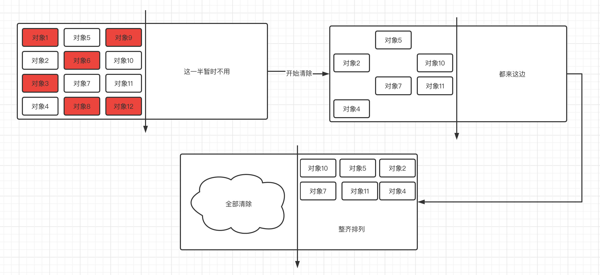

这种算法就非常适用于新生代（因为新生代的回收效率极高，一般不会留下太多的对象）的垃圾回收，而我们之前所说的新生代Survivor区其实就是这个思路，包括8:1:1的比例也正是为了对标记复制算法进行优化而采取的。

虚拟机把新生代分为了三部分：1个Eden区和2个Survivor区（分别叫from和to），默认比例为8:1:1。

一般情况下，新创建的对象都会被分配到Eden区（一些大对象特殊处理），这些对象经过第一次Minor GC后，如果仍然存活，将会被移到Survivor区。对象在Survivor区中每熬过一次Minor GC，年龄 +1，当它的年龄增加到一定程度时（默认是 15 ，通过-XX:MaxTenuringThreshold来设定参数），就会被移动到年老代中。


因为新生代中的对象基本都是朝生夕死（被GC回收率90%以上），所以在新生代的垃圾回收算法使用的是复制算法。

复制算法的基本思想就是将内存分为两块，每次只用其中一块（from），当这一块内存用完，就将还活着的对象复制到另外一块上面。

我们来举个栗子，在GC开始的时候，对象只会存在于Eden区和名为from的Survivor区，Survivor区to是空的。紧接着进行GC，Eden区中所有存活的对象都会被复制到to，而在from区中，仍存活的对象会根据他们的年龄值来决定去向。年龄达到一定值（默认15）的对象会被移动到老年代中，没有达到阈值的对象会被复制到to区域。经过这次GC后，Eden区和from区已经被清空。这个时候，from和to会交换他们的角色，也就是新的to就是上次GC前的from，新的from就是上次GC前的to。不管怎样，都会保证名为to的Survivor区域是空的。Minor GC会一直重复这样的过程，直到to区被填满，to区被填满之后，会将所有对象移动到老年代中。

> -XX:MaxTenuringThreshold，设置对象在新生代中存活的次数。

因为Eden区对象一般存活率较低，一般的，使用两块10%的内存作为空闲和活动区间，而另外80%的内存，则是用来给新建对象分配内存的。一旦发生GC，将10%的from活动区间与另外80%中存活的Eden区对象转移到10%的to空闲区间，接下来，将之前90%的内存全部释放，以此类推。


上面动画中，Area空闲代表to，Area激活代表from，绿色代表不被回收的，红色代表被回收的。

**优点** ：不会产生内存碎片，效率高。
**缺点** ：耗费内存空间。

如果对象的存活率很高，我们可以极端一点，假设是100%存活，那么我们需要将所有对象都复制一遍，并将所有引用地址重置一遍。复制这一工作所花费的时间，在对象存活率达到一定程度时，将会变的不可忽视。

所以从以上描述不难看出，复制算法要想使用，最起码对象的存活率要非常低才行，而且最重要的是，我们必须要克服50%内存的浪费。

#### 标记-清除算法

标记清除（Mark-Sweep）：适用于老年代

首先标记出所有需要回收的对象，然后再依次回收掉被标记的对象，或是标记出所有不需要回收的对象，只回收未标记的对象。实际上这种算法是非常基础的，并且最易于理解的（这里对象我就以一个方框代替了，当然实际上存放是我们前说到的GC Roots形式）

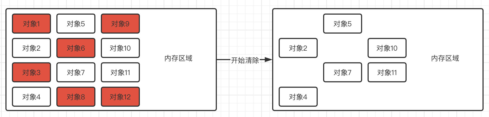

虽然此方法非常简单，但是缺点也是非常明显的 ，首先如果内存中存在大量的对象，那么可能就会存在大量的标记，并且大规模进行清除。并且一次标记清除之后，连续的内存空间可能会出现许许多多的空隙，碎片化会导致连续内存空间利用率降低。

标记清除算法，主要分成标记和清除两个阶段，先标记出要回收的对象，然后统一回收这些对象


简单来说，标记清除算法就是当程序运行期间，若可以使用的内存被耗尽的时候，GC线程就会被触发并将程序暂停，随后将要回收的对象标记一遍，最终统一回收这些对象，完成标记清理工作接下来便让应用程序恢复运行。

主要进行两项工作，第一项则是标记，第二项则是清除。

标记：从引用根节点开始标记遍历所有的GC Roots， 先标记出要回收的对象。
清除：遍历整个堆，把标记的对象清除。


**优点** ：不需要额外的内存空间。
**缺点** ：需要暂停整个应用，会产生内存碎片；两次扫描，耗时严重。

简单来说，它的缺点就是效率比较低（递归与全堆对象遍历），而且在进行GC的时候，需要停止应用程序，这会导致用户体验非常差劲。

而且这种方式清理出来的空闲内存是不连续的，这点不难理解，我们的死亡对象都是随机分布在内存当中，现在把它们清除之后，内存的布局自然会零碎不连续。而为了应付这一点，JVM就不得不维持一个内存的空闲列表，这又是一种开销。并且在分配数组对象的时候，需要去内存寻找连续的内存空间，但此时的内存空间太过零碎分散，因此资源耗费加大。

#### 标记-整理算法

标记压缩（Mark-Compact）：适用于老年代

虽然标记-复制算法能够很好地应对新生代高回收率的场景，但是放到老年代，它就显得很鸡肋了。我们知道，一般长期都回收不到的对象，才有机会进入到老年代，所以老年代一般都是些钉子户，可能一次GC后，仍然存留很多对象。而标记复制算法会在GC后完整复制整个区域内容，并且会折损50%的区域，显然这并不适用于老年代。

那么我们能否这样，在标记所有待回收对象之后，不急着去进行回收操作，而是将所有待回收的对象整齐排列在一段内存空间中，而需要回收的对象全部往后丢，这样，前半部分的所有对象都是无需进行回收的，而后半部分直接一次性清除即可。

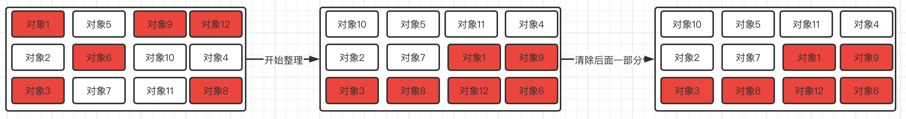

虽然这样能保证内存空间充分使用，并且也没有标记复制算法那么繁杂，但是缺点也是显而易见的，它的效率比前两者都低。甚至，由于需要修改对象在内存中的位置，此时程序必须要暂停才可以，在极端情况下，可能会导致整个程序发生停顿（被称为“Stop The World”）。

所以，我们可以将标记清除算法和标记整理算法混合使用，在内存空间还不是很凌乱的时候，采用标记清除算法其实是没有多大问题的，当内存空间凌乱到一定程度后，我们可以进行一次标记整理算法。


**优点** ：没有内存碎片。
**缺点** ：需要移动对象的成本，效率也不高（不仅要标记所有存活对象，还要整理所有存活对象的引用地址）。

标记清除压缩（Mark-Sweep-Compact）


#### 总结

**年轻代（Young Gen）**
年轻代特点是内存空间相对老年代较小，对象存活率低。

复制算法的效率只和当前存活对象大小有关，因而很适用于年轻代的回收。而复制算法的内存利用率不高的问题，可以通过虚拟机中的两个Survivor区设计得到缓解。

**老年代（Tenure Gen）**
老年代的特点是内存空间较大，对象存活率高。

这种情况，存在大量存活率高的对象，复制算法明显变得不合适。一般是由标记清除或者是标记清除与标记整理的混合实现。

1、标记阶段（Mark） 的开销与存活对象的数量成正比。这点上说来，对于老年代，标记清除或者标记整理有一些不符，但可以通过多核/线程利用，对并发、并行的形式提标记效率。
2、清除阶段（Sweep） 的开销与所管理内存空间大小形正相关。但Sweep“就地处决”的特点，回收的过程没有对象的移动。使其相对其他有对象移动步骤的回收算法，仍然是效率最好的。但是需要解决内存碎片问题。
3、整理阶段（Compact） 的开销与存活对象的数据成开比。如上一条所描述，对于大量对象的移动是很大开销的，做为老年代的第一选择并不合适。

基于上面的考虑，老年代一般是由标记清除或者是标记清除与标记整理的混合实现。以虚拟机中的CMS回收器为例，CMS是基于Mark-Sweep实现的，对于对象的回收效率很高。而对于碎片问题，CMS采用基于Mark-Compact算法的Serial Old回收器做为补偿措施：当内存回收不佳（碎片导致的Concurrent Mode Failure时），将采用Serial Old执行Full GC以达到对老年代内存的整理。

**垃圾回收算法的优缺点**
（1）内存效率： 复制算法 > 标记清除算法 > 标记整理算法（此处的效率只是简单的对比时间复杂度，实际情况不一定如此）。
（2）内存整齐度： 复制算法 = 标记整理算法 > 标记清除算法。
（3）内存利用率： 标记整理算法 = 标记清除算法 > 复制算法。

### 垃圾收集器实现

#### Serial收集器

这款垃圾收集器也是元老级别的收集器了，在JDK1.3.1之前，是虚拟机新生代区域收集器的唯一选择。这是一款单线程的垃圾收集器，也就是说，当开始进行垃圾回收时，需要暂停所有的线程，直到垃圾收集工作结束。它的新生代收集算法采用的是标记复制算法，老年代采用的是标记整理算法。


可以看到，当进入到垃圾回收阶段时，所有的用户线程必须等待GC线程完成工作，就相当于你打一把LOL 40分钟，中途每隔1分钟网络就卡5秒钟，可能这时你正在打团，结果你被物理控制直接在那里站了5秒钟，这确实让人难以接受。

虽然缺点很明显，但是优势也是显而易见的：

1. 设计简单而高效。
2. 在用户的桌面应用场景中，内存一般不大，可以在较短时间内完成垃圾收集，只要不频繁发生，使用串行回收器是可以接受的。

所以，在客户端模式（一般用于一些桌面级图形化界面应用程序）下的新生代中，默认垃圾收集器至今依然是Serial收集器。我们可以在`java -version`中查看默认的客户端模式：

```
openjdk version "1.8.0_322"
OpenJDK Runtime Environment (Zulu 8.60.0.21-CA-macos-aarch64) (build 1.8.0_322-b06)
OpenJDK 64-Bit Server VM (Zulu 8.60.0.21-CA-macos-aarch64) (build 25.322-b06, mixed mode)
```

我们可以在jvm.cfg文件中切换JRE为Server VM或是Client VM，默认路径为：

```
JDK安装目录/jre/lib/jvm.cfg
```

比如我们需要将当前模式切换为客户端模式，那么我们可以这样编辑：

```
-client KNOWN
-server IGNORE
```

#### ParNew收集器

这款垃圾收集器相当于是Serial收集器的多线程版本，它能够支持多线程垃圾收集：


除了多线程支持以外，其他内容基本与Serial收集器一致，并且目前某些JVM默认的服务端模式新生代收集器就是使用的ParNew收集器。

#### Parallel Scavenge/Parallel Old收集器

Parallel Scavenge同样是一款面向新生代的垃圾收集器，同样采用标记复制算法实现，在JDK6时也推出了其老年代收集器Parallel Old，采用标记整理算法实现：


与ParNew收集器不同的是，它会自动衡量一个吞吐量，并根据吞吐量来决定每次垃圾回收的时间，这种自适应机制，能够很好地权衡当前机器的性能，根据性能选择最优方案。

目前JDK8采用的就是这种 Parallel Scavenge + Parallel Old 的垃圾回收方案。

#### CMS收集器

在JDK1.5，HotSpot推出了一款在强交互应用中几乎可认为有划时代意义的垃圾收集器：CMS（Concurrent-Mark-Sweep）收集器，这款收集器是HotSpot虚拟机中第一款真正意义上的并发（注意这里的并发和之前的并行是有区别的，并发可以理解为同时运行用户线程和GC线程，而并行可以理解为多条GC线程同时工作）收集器，它第一次实现了让垃圾收集线程与用户线程同时工作。

它主要采用标记清除算法：


它的垃圾回收分为4个阶段：

* 初始标记（需要暂停用户线程）：这个阶段的主要任务仅仅只是标记出GC Roots能直接关联到的对象，速度比较快，不用担心会停顿太长时间。
* 并发标记：从GC Roots的直接关联对象开始遍历整个对象图的过程，这个过程耗时较长但是不需要停顿用户线程，可以与垃圾收集线程一起并发运行。
* 重新标记（需要暂停用户线程）：由于并发标记阶段可能某些用户线程会导致标记产生变得，因此这里需要再次暂停所有线程进行并行标记，这个时间会比初始标记时间长一丢丢。
* 并发清除：最后就可以直接将所有标记好的无用对象进行删除，因为这些对象程序中也用不到了，所以可以与用户线程并发运行。

虽然它的优点非常之大，但是缺点也是显而易见的，我们之前说过，标记清除算法会产生大量的内存碎片，导致可用连续空间逐渐变少，长期这样下来，会有更高的概率触发Full GC，并且在与用户线程并发执行的情况下，也会占用一部分的系统资源，导致用户线程的运行速度一定程度上减慢。

不过，如果你希望的是最低的GC停顿时间，这款垃圾收集器无疑是最佳选择，不过自从G1收集器问世之后，CMS收集器不再推荐使用了。

#### Garbage First (G1) 收集器

此垃圾收集器也是一款划时代的垃圾收集器，在JDK7的时候正式走上历史舞台，它是一款主要面向于服务端的垃圾收集器，并且在JDK9时，取代了JDK8默认的 Parallel Scavenge + Parallel Old 的回收方案。

我们知道，我们的垃圾回收分为`Minor GC`、`Major GC `和`Full GC`，它们分别对应的是新生代，老年代和整个堆内存的垃圾回收，而G1收集器巧妙地绕过了这些约定，它将整个Java堆划分成`2048`个大小相同的独立`Region`块，每个`Region块`的大小根据堆空间的实际大小而定，整体被控制在1MB到32MB之间，且都为2的N次幂。所有的`Region`大小相同，且在JVM的整个生命周期内不会发生改变。

那么分出这些`Region`有什么意义呢？每一个`Region`都可以根据需要，自由决定扮演哪个角色（Eden、Survivor和老年代），收集器会根据对应的角色采用不同的回收策略。此外，G1收集器还存在一个Humongous区域，它专门用于存放大对象（一般认为大小超过了Region容量一半的对象为大对象）这样，新生代、老年代在物理上，不再是一个连续的内存区域，而是到处分布的。


它的回收过程与CMS大体类似：


分为以下四个步骤：

* 初始标记（暂停用户线程）：仅仅只是标记一下GC Roots能直接关联到的对象，并且修改TAMS指针的值，让下一阶段用户线程并发运行时，能正确地在可用的Region中分配新对象。这个阶段需要停顿线程，但耗时很短，而且是借用进行Minor GC的时候同步完成的，所以G1收集器在这个阶段实际并没有额外的停顿。
* 并发标记：从GC Root开始对堆中对象进行可达性分析，递归扫描整个堆里的对象图，找出要回收的对象，这阶段耗时较长，但可与用户程序并发执行。
* 最终标记（暂停用户线程）：对用户线程做一个短暂的暂停，用于处理并发标记阶段漏标的那部分对象。
* 筛选回收：负责更新Region的统计数据，对各个Region的回收价值和成本进行排序，根据用户所期望的停顿时间来制定回收计划，可以自由选择任意多个Region构成回收集，然后把决定回收的那一部分Region的存活对象复制到空的Region中，再清理掉整个旧Region的全部空间。这里的操作涉及存活对象的移动，是必须暂停用户线程，由多个收集器线程并行完成的。

### 元空间

JDK8之前，Hotspot虚拟机的方法区实际上是永久代实现的。在JDK8之后，Hotspot虚拟机不再使用永久代，而是采用了全新的元空间。类的元信息被存储在元空间中。元空间没有使用堆内存，而是与堆不相连的本地内存区域。所以，理论上系统可以使用的内存有多大，元空间就有多大，所以不会出现永久代存在时的内存溢出问题。这项改造也是有必要的，永久代的调优是很困难的，虽然可以设置永久代的大小，但是很难确定一个合适的大小，因为其中的影响因素很多，比如类数量的多少、常量数量的多少等。

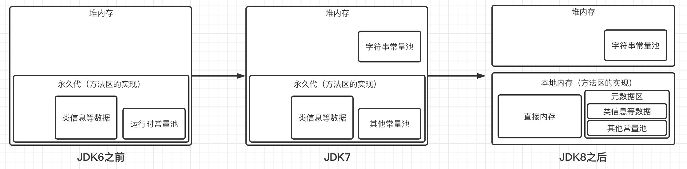

因此在JDK8时直接将本地内存作为元空间（**Metaspace**）的区域，物理内存有多大，元空间内存就可以有多大，这样永久代的空间分配问题就讲解了，所以最终它变成了这样：

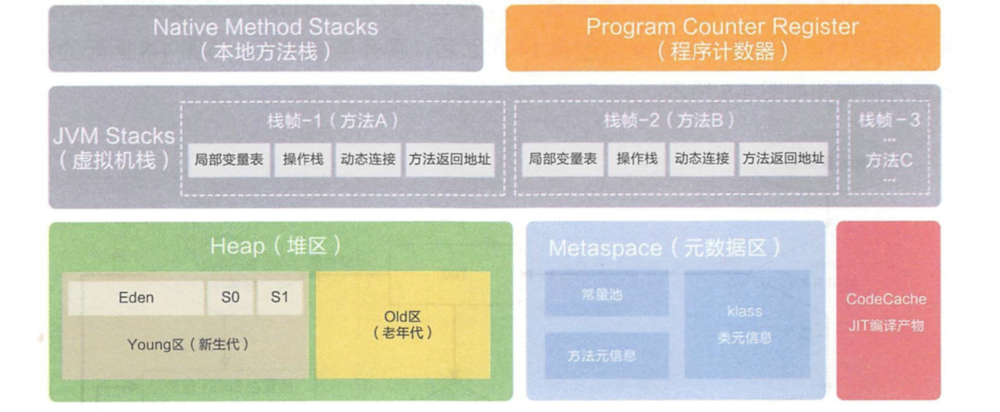

### 堆参数调优

在进行堆参数调优前，可以通过下面的代码来获取虚拟机的相关内存信息。

```java
public class Memory {
    public static void main(String[] args) {
        // 返回 Java 虚拟机试图使用的最大内存量
        long maxMemory = Runtime.getRuntime().maxMemory();
        System.out.println("MAX_MEMORY = " + maxMemory + "（字节）," + (maxMemory / (double) 1024 / 1024) + "MB");
        // 返回 Java 虚拟机中的内存总量
        long totalMemory = Runtime.getRuntime().totalMemory();
        System.out.println("TOTAL_MEMORY = " + totalMemory + "（字节）," + (totalMemory / (double) 1024 / 1024) + "MB");
    }
}
```

虚拟机最大内存为物理内存的1/4，而初始分配的内存为物理内存的1/64。

在【Run】->【Edit Configuration…】->【VM options】中，输入参数`-Xms1024m -Xmx1024m -XX:+PrintGCDetails`，然后保存退出。

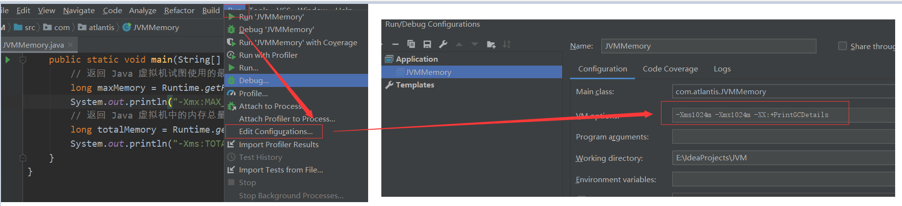

运行结果如下：


初始内存和最大内存一定是一样大，理由是避免GC和应用程序争抢内存，进而导致内存忽高忽低产生停顿。

### 堆溢出 OutOfMemoryError

首先把堆内存调成10M后，再一直new对象，导致Full GC也无法处理，直至撑爆堆内存，进而导致`OOM`堆溢出错误，程序及结果如下：

```java
import java.util.Random;
public class OOMTest {
    public static void main(String[] args) {
        String str = "Atlantis";
        while (true) {
            // 每执行下面语句，会在堆里创建新的对象
            str += str + new Random().nextInt(88888888) + new Random().nextInt(999999999);
        }
    }
}
```


如果出现java.lang.OutOfMemoryError: Java heap space异常，说明Java虚拟机的堆内存不够，造成堆内存溢出。原因有两点：
①Java虚拟机的堆内存设置太小，可以通过参数-Xms和-Xmx来调整。
②代码中创建了大量对象，并且长时间不能被GC回收（存在被引用）。

## 类加载

### 类文件结构

在我们学习C语言的时候，我们的编程过程会经历如下几个阶段：写代码、保存、编译、运行。实际上，最关键的一步是编译，因为只有经历了编译之后，我们所编写的代码才能够翻译为机器可以直接运行的二进制代码，并且在不同的操作系统下，我们的代码都需要进行一次编译之后才能运行。

> 如果全世界所有的计算机指令集只有x86一种，操作系统只有Windows一种，那也许就不会有Java语言的出现。

随着时代的发展，人们迫切希望能够在不同的操作系统、不同的计算机架构中运行同一套编译之后的代码。本地代码不应该是我们编程的唯一选择，所以，越来越多的语言选择了与操作系统和机器指令集无关的中立格式作为编译后的存储格式。

“一次编写，到处运行”，Java最引以为傲的口号，标志着平台不再是限制编程语言的阻碍。

实际上，Java正式利用了这样的解决方案，将源代码编译为平台无关的中间格式，并通过对应的Java虚拟机读取和运行这些中间格式的编译文件，这样，我们只需要考虑不同平台的虚拟机如何编写，而Java语言本身很轻松地实现了跨平台。

现在，越来越多的开发语言都支持将源代码编译为`.class`字节码文件格式，以便能够直接交给JVM运行，包括Kotlin（安卓开发官方指定语言）、Groovy、Scala等。

### 类加载机制

#### 类加载器

ClassLoader：负责加载class文件，class文件在开头有特定的文件标识，将class文件字节码内容加载到内存中，并将这些内容转换成方法区中的运行时数据结构并且ClassLoader只负责class文件的加载，至于它是否可以运行，则由Execution Engine决定。

在这里需要区分一下class与Class。小写的class，是指编译 Java 代码后所生成的以.class为后缀名的字节码文件。而大写的Class，是 JDK 提供的java.lang.Class，可以理解为封装类的模板。多用于反射场景，例如 JDBC 中的加载驱动，Class.forName("com.mysql.jdbc.Driver");

接下来我们来观察下图，Car.class字节码文件被ClassLoader类装载器加载并初始化，在方法区中生成了一个Car Class的类模板，而我们平时所用到的实例化，就是在这个类模板的基础上，形成了一个个实例，即car1，car2。反过来讲，我们可以对某个具体的实例进行getClass()操作，就可以得到该实例的类模板，即Car Class。再接着，我们对这个类模板进行getClassLoader()操作，就可以得到这个类模板是由哪个类装载器进行加载的。


方法区并不是存放方法的区域，其是存放类的描述信息(模板)的地方，Class loader只是负责class文件的加载，相当于快递员，这个“快递员”并不是只有一家，Class loader有多种，加载之前是“小class”，加载之后就变成了“大Class”，这是按照java.lang.Class模板生成了一个实例。“大Class”就装载在方法区，模板实例化之后就得到n个相同的对象，JVM并不是通过检查文件后缀是不是.class，而是检查文件开头特殊标识是不是`cafebabe`。

虚拟机自带的类加载器：

启动类加载器（Bootstrap），也叫根加载器，加载%JAVAHOME%/jre/lib/rt.jar。
扩展类加载器（Extension），加载%JAVAHOME%/jre/lib/ext/*.jar，例如javax.swing包。
应用程序类加载器（AppClassLoader），也叫系统类加载器，加载%CLASSPATH%的所有类。

自定义加载器：用户可以自定义类的加载方式，但必须是`Java.lang.ClassLoader`的子类。


#### 类加载过程

接下来，我们通过下面代码来观察这几个类加载器。首先，我们先看自定义的MyObject，首先通过getClassLoader()获取到的是AppClassLoader，然后getParent()得到ExtClassLoader，再getParent()竟然是null？可能大家会有疑惑，不应该是Bootstrap加载器么？这是因为，BootstrapClassLoader是使用C++语言编写的，Java在加载的时候就成了null。

我们再来看Java自带的Object，通过getClassLoader()获取到的加载器直接就是BootstrapClassLoader，如果要想getParent()的话，因为是null值，所以就会报java.lang.NullPointerException空指针异常。

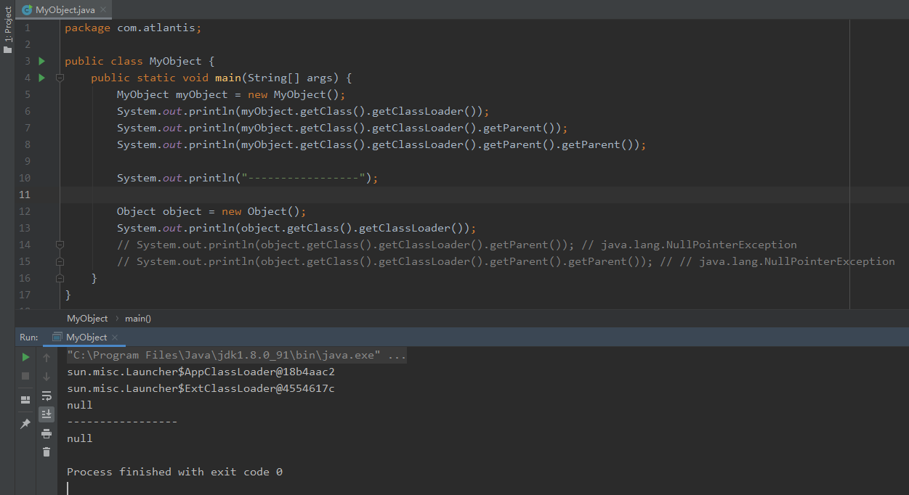

> 输出中，sun.misc.Launcher是JVM相关调用的入口程序。

那为什么会出现这个情况呢？这就需要我们来了解类加载器的加载顺序和机制了，即双亲委派和沙箱安全 。

（1）双亲委派，当一个类收到了类加载请求，它首先不会尝试自己去加载这个类，而是把这个请求委派给父类去完成，因此所有的加载请求都应该传送到启动类加载器中，只有当父类加载器反馈自己无法完成这个请求的时候（在它的加载路径下没有找到所需加载的Class），子类加载器才会尝试自己去加载。

采用双亲委派的一个好处是，比如加载位于rt.jar包中的类java.lang.Object，不管是哪个加载器加载这个类，最终都是委派给顶层的启动类加载器进行加载，确保哪怕使用了不同的类加载器，最终得到的都是同样一个Object对象。

（2）沙箱安全机制，是基于双亲委派机制上采取的一种JVM的自我保护机制，假设你要写一个java.lang.String的类，由于双亲委派机制的原理，此请求会先交给BootStrapClassLoader试图进行加载，但是BootStrapClassLoader在加载类时首先通过包和类名查找rt.jar中有没有该类，有则优先加载rt.jar包中的类，因此就保证了java的运行机制不会被破坏，确保你的代码不会污染到Java的源码。

所以，类加载器的加载顺序如下：

1. 当AppClassLoader加载一个class时，它首先不会自己去尝试加载这个类，而是把类加载请求委派给父类加载器ExtClassLoader去完成。
2. 当ExtClassLoader加载一个class时，它首先也不会自己去尝试加载这个类，而是把类加载请求委派给BootStrapClassLoader去完成。
3. 如果BootStrapClassLoader加载失败（例如在$JAVA_HOME/jre/lib里未查找到该class），会使用ExtClassLoader来尝试加载。
4. 若ExtClassLoader也加载失败，则会使用AppClassLoader来加载，如果AppClassLoader也加载失败，则会报出异常ClassNotFoundException。
