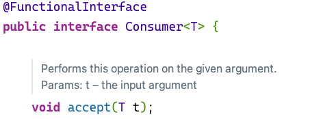
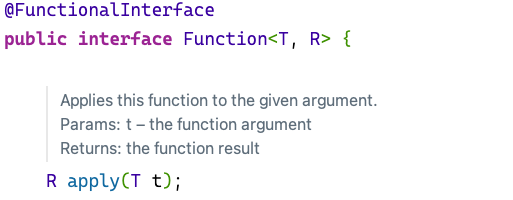
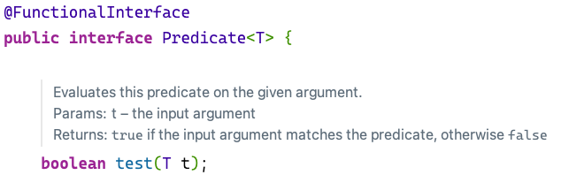
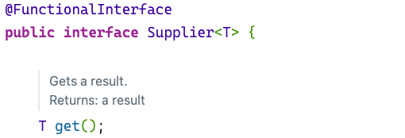

## 函数式编程
### 1 Lambda表达式
#### 1.1 概述

​	Lambda表达式是JDK8中的语法糖，对某些匿名内部类的写法简化。是函数式编程思想的重要体现，不用关注是什么对象，更关注对数据进行了什么操作。

#### 1.2 基本格式

```java
(参数列表)->{代码}
```

#### 1.3 案例

例一

```java
new Thread(new Runnable() {
    @Override
    public void run() {
        System.out.println("The new thread is running!");
    }
}).start();

new Thread(() -> {ystem.out.println("The new thread is running!");).start();
```

例二

```java
int num1 = calculateNum(new IntBinaryOperator() {
    @Override
    public int applyAsInt(int left, int right) {
        return left + right;
    }
});
System.out.println(num1);

int num2 = calculateNum(((left, right) -> {return left+right;}));
System.out.println(num2);

public static int calculateNum(IntBinaryOperator operator){
    int a = 10;
    int b = 20;
    return operator.applyAsInt(a,b);
}
```

例三

```java
foreachArray(new IntConsumer() {
    @Override
    public void accept(int value) {
        System.out.println(value);
    }
});

foreachArray((value) -> {
    System.out.println(value);
});


private static void foreachArray(IntConsumer consumer) {
    int[] nums = {1, 2, 3, 4, 5, 6, 7, 8, 9, 10};
    for (int num : nums) {
        consumer.accept(num);
    }
}
```

例四

```java
printInt(new IntPredicate() {
    @Override
    public boolean test(int value) {
        return value % 2 == 0;
    }
});

printInt((value) -> {return value % 2 == 0;});

public static void printInt(IntPredicate predicate) {
    int[] nums = {1, 2, 3, 4, 5, 6, 7, 8, 9, 10};
    for (int num : nums) {
        if (predicate.test(num)) {
            System.out.println(num);
        }
    }
}
```

例五

```java
Integer num1 = typeConver(new Function<String, Integer>() {
    @Override
    public Integer apply(String s) {
        return Integer.valueOf(s);
    }
});
System.out.println(num1);

Integer num2 = typeConver((s) -> {
    return Integer.valueOf(s);
});
System.out.println(num2);

String str1 = typeConver(new Function<String, String>() {
    @Override
    public String apply(String s) {
        return s + "Test";
    }
});
System.out.println(str1);

String str2 = typeConver((s) -> {
    return s + "Test";
});
System.out.println(str2);

public static <R> R typeConver(Function<String, R> function) {
    String str = "123";
    R result = function.apply(str);
    return result;
}
```

#### 1.4 省略规则

* 参数类型可以省略
* 方法体只有一行代码时大括号、return和分号可以省略
* 方法只有一个参数时，小括号可以省略

### 2 Stream流

#### 2.1 概述

Stream流式函数式编程模式，可以被用来对集合或数组进行链式操作。

#### 2.2 案例

打印大于18岁的作家信息，并去除重复

```java
List<Author> authorList = Author.getAuthors();
authorList.stream()
        .distinct()
        .filter(new Predicate<Author>() {
            @Override
            public boolean test(Author author) {
                return author.getAge() >= 18;
            }
        }).forEach(new Consumer<Author>() {
            @Override
            public void accept(Author author) {
                System.out.println(author.getName());
            }
        });

authorList.stream()
        .distinct()
        .filter(author -> author.getAge() >= 18)
        .forEach(author -> System.out.println(author.getName()));
```

#### 2.3 常用操作

##### 2.3.1 创建流

单列集合：`集合对象.stream()`

```java
List<Author> authors = getAuthors();
Stream<Author> stream = authors.stream();
```

数组：`Arrays.stream(数组)、Stream.of(数组)`

```java
Integer arr = {1,2,3,4,5,5,6};
Stream<Integer> stream1 = Arrays.stream(arr);
Stream<Integer> stream2 = Stream.of(arr);
```

双列集合：转换成单列集合后再创建

```java
Map<String, Integer> map = new HashMap<>();
map.put("Test1", 11);
map.put("Test2", 22);
map.put("Test3", 33);

Set<Map.Entry<String, Integer>> entries = map.entrySet();
Stream<Map.Entry<String, Integer>> stream = entries.stream();
```

##### 2.3.2 中间操作

**filter**

对流中的数据按要求进行过滤

例：打印姓名长度大于5的作家姓名

```java
List<Author> authors = Author.getAuthors();
authors.stream()
        .filter(author -> author.getName().length() > 5)
        .forEach(author -> System.out.println(author.getName()));
```

**map**

对流中的元素进行计算或转换

例：将所有的作家年龄加1，并打印

```java
authors.stream()
        .map(author -> author.getAge())
        .map(age -> age + 1)
        .forEach(age -> System.out.println(age));
```

**distinct**

去除流中的重复元素

例：打印所有作家的姓名，并其中不能出现重复

```java
List<Author> authors = Author.getAuthors();
authors.stream()
        .distinct()
        .forEach(author -> System.out.println(author.getName()));
```

**注：distinct方法是依赖Object的equals方法来判断是否是相同对象的，所以需要注意重写equals方法。**

**sorted**

对流中的元素进行排序

例：按照年龄降序排列，并且不能出现重复

```java
List<Author> authors = Author.getAuthors();
authors.stream()
        .distinct()
        .sorted((o1, o2) -> o2.getAge() - o1.getAge())
        .forEach(author -> System.out.println(author.getAge()));
```

**注：如果调用空参sorted()方法，需要实体类实现Comparable接口。**

**limit**

设置流的最大长度，超出的部分将被抛弃

例：打印出年龄最大的两位作家姓名

```java
List<Author> authors = Author.getAuthors();
authors.stream()
        .distinct()
        .sorted((o1, o2) -> o2.getAge() - o1.getAge())
        .limit(2)
        .forEach(author -> System.out.println(author.getName() + " " + author.getAge()));
```

**skip**

跳过流中前n个元素，返回剩下的

例：打印除年龄最大的作家外的所有作家

```java
List<Author> authors = Author.getAuthors();
authors.stream()
        .distinct()
        .sorted((o1, o2) -> o2.getAge() - o1.getAge())
        .skip(1)
        .forEach(author -> System.out.println(author.getName() + " " + author.getAge()));

```

**flatMap**

map只能把一个对象转换成另一个对象来作为流中的元素，而flatMap可以把一个对象转换成多个对象作为流中的元素。

例：打印所有书籍的名称，并对重复元素去重

```java
List<Author> authors = Author.getAuthors();
authors.stream()
        .flatMap(new Function<Author, Stream<Book>>() {
            @Override
            public Stream<Book> apply(Author author) {
                return author.getBooks().stream();
            }
        })
        .distinct()
        .forEach(book -> System.out.println(book.getName()));
```

例：打印现有数据的所有分类，要求对分类去重

```java
List<Author> authors = Author.getAuthors();
authors.stream()
        .flatMap(author -> author.getBooks().stream())
        .distinct()
        .flatMap(book -> Arrays.stream(book.getCategory().split("，")))
        .distinct()
        .forEach(category-> System.out.println(category));
```

##### 2.3.3 终结操作

**forEach**

对流中元素进行遍历操作，通过传入的参数去指定对遍历到的元素进行什么具体的操作。

例：输出所有作家的姓名

```java
List<Author> authors = Author.getAuthors();
authors.stream()
        .map(author -> author.getName())
        .distinct()
        .forEach(name-> System.out.println(name));
```

**count**

获取当前流中元素的个数。

例：打印作家所出书籍的数目，注意删除重复元素

```java
List<Author> authors = Author.getAuthors();
long count = authors.stream()
        .flatMap(author -> author.getBooks().stream())
        .distinct()
        .count();
System.out.println(count);
```

**max&min**

获取当前流中的最值。

例：分别获取作家所出书籍的最高分和最低分

```java
List<Author> authors = Author.getAuthors();
Optional<Integer> max = authors.stream()
        .flatMap(author -> author.getBooks().stream())
        .map(book -> book.getScore())
        .max((o1, o2) -> o1 - o2);
System.out.println(max.get());

Optional<Integer> min = authors.stream()
        .flatMap(author -> author.getBooks().stream())
        .map(book -> book.getScore())
        .min((o1, o2) -> o1 - o2);
System.out.println(min.get());
```

**collect**

把当前流转换成一个集合。

例：获取一个存放所有作者名字的List集合

```java
List<Author> authors = Author.getAuthors();
List<String> collect = authors.stream()
        .map(author -> author.getName())
        .collect(Collectors.toList());
System.out.println(collect);
```

例：获取一个所有书名的Set集合

```java
List<Author> authors = Author.getAuthors();
Set<String> collect = authors.stream()
        .flatMap(author -> author.getBooks().stream())
        .map(book -> book.getName())
        .collect(Collectors.toSet());
System.out.println(collect);
```

例：获取一个Map集合，Map的key为作者名，value为List

```java
 List<Author> authors = Author.getAuthors();
Map<String, List<Book>> collect = authors.stream()
        .distinct()
        .collect(Collectors.toMap(author -> author.getName(), author -> author.getBooks()));
System.out.println(collect);
```

**查找与匹配**

**anyMatch**:可以用来判断是否有任意符合匹配条件的元素，结果为boolean类型。

例：判断是否有年龄在18岁以上的作家

```java
List<Author> authors = Author.getAuthors();
boolean flag = authors.stream()
        .anyMatch(author -> author.getAge() > 18);
System.out.println(flag);
```

**allMatch**:可以用来判断是否都符合匹配条件，结果为boolean类型，都符合true，否则为false。

例：判断是否所有作家都是成年人

```java
List<Author> authors = Author.getAuthors();
boolean flag = authors.stream()
        .allMatch(author -> author.getAge() >= 18);
System.out.println(flag);
```

**noneMatch**:可以判断流中元素是否都不符合匹配条件，都不符合true，否则为false。

例：判断作家是否都没有超过100岁

```java
List<Author> authors = Author.getAuthors();
boolean flag = authors.stream()
        .noneMatch(author -> author.getAge() > 100);
System.out.println(flag);
```

**findAny**:获取流中任意一个元素（无法确保获取的一定是流中第一个元素）。

例：获取任意一个大于18岁的作家，如果存在就输出他的姓名

```java
List<Author> authors = Author.getAuthors();
Optional<Author> any = authors.stream()
        .filter(author -> author.getAge() > 18)
        .findAny();

any.ifPresent(author -> System.out.println(author.getName()));
```

**findFirst**:获取流中第一个元素。

例：获取一个年龄最小的作家，并输出他的姓名

```java
List<Author> authors = Author.getAuthors();
Optional<Author> first = authors.stream()
        .sorted((o1, o2) -> o1.getAge() - o2.getAge())
        .findFirst();
first.ifPresent(author -> System.out.println(author.getName()));
```

**reduce归并**

对流中数据按指定的计算方式计算出结果。(缩减操作)

reduce的作用是把stream中的元素组合起来，可以传入一个初始值，它会按照指定的计算方式依次拿流中的元素和初始值进行计算，计算结果再和后面的元素计算。

reduce两个参数重载方法的工作原理

```java
T result = identity;
for (T element : this stream)
  result = accumulator.apply(result, element)
return result;
```

其中identity就是可以通过方法参数传入的初始值，accumulator的apply具体进行什么计算也是通过方法的参数来确定的。

例：使用reduce求所有作者的年龄和

```java
List<Author> authors = Author.getAuthors();
Integer reduce = authors.stream()
        .distinct()
        .map(author -> author.getAge())
        .reduce(0, (result, element) -> result += element);
System.out.println(reduce);
```

例：使用reduce求所有作者中年龄的最大值

```java
List<Author> authors = Author.getAuthors();
Integer reduce = authors.stream()
        .distinct()
        .map(author -> author.getAge())
        .reduce(Integer.MIN_VALUE, (result, element) -> result < element ? element : result);
System.out.println(reduce);
```

例：使用reduce求所有作者中年龄的最小值

```java
List<Author> authors = Author.getAuthors();
Optional<Integer> reduce = authors.stream()
        .distinct()
        .map(author -> author.getAge())
        .reduce((result, element) -> result < element ? result : element);
reduce.ifPresent(integer -> System.out.println(integer));
```

reduce一个参数重载方法的工作原理

```java
boolean foundAny = false;
T result = null;
for (T element : this stream) {
   if (!foundAny) {
       foundAny = true;
       result = element;
   }
   else
       result = accumulator.apply(result, element);
}
return foundAny ? Optional.of(result) : Optional.empty();
```

##### 2.5 注意事项

* 惰性求值（如果没有终结操作，中间操作是不会执行的）
* 流是一次性的（一旦一个流经过一个终结操作后，这个流就不能再使用了）
* 流操作在正常情况下不会影响到原数据

### 3 Optional

#### 3.1 概述

在编写代码时可能会出现空指针异常，需要对对象做非空判断

```java
Author author = Author.getAuthors();
if(author != null){
  System.out.println(author.getName());
}
```

过多的判断会导致代码臃肿，引入Optional可以优雅的解决空指针异常问题

#### 3.2 使用

##### 3.2.1 创建对象

Optional类似包装类，可以把具体数据封装在Optional对象的内部，调用对象提供的方法操作数据，用于避免出现空指针异常

1、使用Optional的静态方法**ofNullable**创建对象，无论传入参数是否为空都不影响

```java
Author author = Author.getAuthor();
Optional<Author> authorOptioal = Optional.ofNullable(author);
```

在实际开发中，通常可以改造getAuthor，让其返回值为Optional对象。在MyBatis3.5中可以把dao接口的方法返回值定义成Optional类型，MyBatis会帮助把数据封装成Optional对象返回。

2、确定对象不为空，可以使用Optional的静态方法**of**创建对象

```java
Author author = new Author();
Optional<Author> authorOptional = Optional.of(author);
```

需要注意的是，传入of的参数一定不能为null

3、如果一个方法的返回值类型是Optional，如果经判断发现某次计算的到的返回值为null，这时就需要把null封装成Optional对象返回，需要使用Optional的静态方法**empty**创建对象

```java
return author==null?Optional.empty():Optional.of(author);
```

##### 3.2.2 安全消费值

当获取到一个Optional对象，可以使用**ifPresent**方法来消费其中的值

```java
Optional<Author> authorOptional = Optional.ofNullable(author);
authorOptional.ifPresent(author -> System.out.println(author.getName());
```

##### 3.2.3 获取值

如果想获取值自行处理，可以使用get方法，但不推荐使用，当Optional中数据为null时会出现异常

##### 3.2.4 安全获取值

**orElseGet**

获取数据并设置数据为空时的默认值，如果数据不为空就能获得该数据，如果为空则根据传入的参数来创建对象作为默认值返回

```java
Optional<Author> authorOptional = getAuthorOptional();
Author author = authorOptional.orElseGet(() -> new Author());
```

**orElseThrow**

获取数据，如果不为空就可以获取该数据，如果为空则根据传入的参数来创建异常并抛出

```java
try {
    Optional<Author> authorOptional = getAuthorOptional();
    authorOptional.orElseThrow((Supplier<Throwable>) () -> new RuntimeException("数据为null"));
} catch (Throwable e) {
    e.printStackTrace();
}
```

##### 3.2.5 过滤

可以使用filter方法对数据进行过滤，如果原本有数据，但不符合判断条件，也会变成无数据的Optional对象

```java
Optional<Author> authorOptional = getAuthorOptional();
authorOptional.filter(author -> author.getAge()>18).ifPresent(author -> System.out.println(author.getName()));
```

##### 3.2.6 判断

可以使用isPresent方法判断数据是否存在，如果为空返回false，不为空返回true。

```java
Optional<Author> authorOptional = getAuthorOptional();
System.out.println(authorOptional.isPresent());
```

##### 3.2.7 数据转换

Optional提供了map方法可以对数据进行转换，并且转换得到的数据也是会被Optional封装好的，保证了数据的安全

```java
Optional<Author> authorOptional = getAuthorOptional();
Optional<List<Book>> books = authorOptional.map(author -> author.getBooks());
books.ifPresent(book -> System.out.println(book));
```

### 4 函数式接口

#### 4.1 概述

通常只有一个抽象方法的接口被称为函数接口

JDK的函数式接口都加上了`@FunctionalInterface`注解进行标识，但无论是否加上该注解，只要接口中都只有一个抽象方法，那该接口就是函数式接口

#### 4.2 常见的函数式接口

##### 4.2.1 Consumer消费接口

可以在方法中对传入的参数进行消费



##### 4.2.2 Function计算转换接口

可以在方法中对传入参数计算或转换，后把结果返回



##### 4.2.3 Predicate判断接口

在方法中对传入的参数条件判断，后返回判断结果



##### 4.2.4 Supplier生产型接口

在方法中创建对象，后把创建好的对象返回



#### 4.3 常用的默认方法

##### 4.3.1 and

当在使用Predicate接口时，可能需要判断条件的拼接，而and方法相当于&&拼接两个判断条件

例：打印作家中年龄大于18且名字长度大于1的信息

```java
List<Author> authors = Author.getAuthors();
authors.stream()
        .filter(new Predicate<Author>() {
            @Override
            public boolean test(Author author) {
                return author.getAge()>18;
            }
        }.and(new Predicate<Author>() {
            @Override
            public boolean test(Author author) {
                return author.getName().length()>1;
            }
        }))
        .forEach(author -> System.out.println(author.getName()+":"+author.getAge()));
```

##### 4.3.2 or

or方法相当于||拼接两个判断条件

例：打印作家中年龄大于18或名字长度小于5的信息

```java
        List<Author> authors = Author.getAuthors();
        authors.stream()
                .filter(new Predicate<Author>() {
                    @Override
                    public boolean test(Author author) {
                        return author.getAge()>18;
                    }
                }.or(new Predicate<Author>() {
                    @Override
                    public boolean test(Author author) {
                        return author.getName().length()<5;
                    }
                }))
                .forEach(author -> System.out.println(author.getName()+":"+author.getAge()));
```

##### 4.3.3 negate

negate方法相当于在判断条件前加!取反

例：打印年龄不大于18的作家信息

```java
List<Author> authors = Author.getAuthors();
authors.stream()
        .filter(new Predicate<Author>() {
            @Override
            public boolean test(Author author) {
                return author.getAge()>17;
            }
        }.negate())
        .forEach(author -> System.out.println(author.getName()+":"+author.getAge()));
```

在实际开发中通常会在自定义函数式编程中使用

### 5 方法引用

在使用lambda表达式时，如果方法体中只有一个方法的调用，可以用方法引用进一步简化

#### 5.1 推荐用法

在写完lambda表达式后发现方法体只有一行代码，可以使用alt+enter尝试转换成方法引用即可

#### 5.2 基本格式

类名或对象名::方法名

#### 5.3 语法

##### 5.3.1 引用类的静态方法

```java
类名::方法名
```

使用前提：在重写方法时，方法体中只有一行代码，并且这行代码是调用了某个类的静态方法，并且把要重写的抽象方法中的所有参数都按照顺序传入这个静态方法中，这时就可以引用类的静态方法

例：

```java
List<Author> authors = Author.getAuthors();
authors.stream()
        .map(author -> author.getAge())
        .map(age -> String.valueOf(age));
```

当重写的方法是没有参数的，调用的方法也是没有参数的，也相当于符合规则

优化后：

```java
List<Author> authors = Author.getAuthors();
authors.stream()
        .map(Author::getAge)
        .map(String::valueOf);
```

##### 5.3.2 引用对象的实例方法

```java
对象名::方法名
```

使用前题：在重写方法时，方法体中只有一行代码，并且这行代码是调用了某个对象的成员方法，并且把要重写的抽象方法中所有的参数都按照顺序传入这个成员方法中，这时就可以引用对象的实例方法

例：

```java
List<Author> authors = Author.getAuthors();
StringBuilder stringBuilder = new StringBuilder();
authors.stream()
        .map(new Function<Author, String>() {
            @Override
            public String apply(Author author) {
                return author.getName();
            }
        })
        .forEach(new Consumer<String>() {
            @Override
            public void accept(String s) {
                stringBuilder.append(s);
            }
        });
```

优化后：

```java
List<Author> authors = Author.getAuthors();
StringBuilder stringBuilder = new StringBuilder();
authors.stream()
        .map(Author::getName)
        .forEach(stringBuilder::append);
```

##### 5.3.3 引用类的实例方法

```java
类名::方法名
```

使用前提：在重写方法时，方法体中只有一行代码，并且这行代码是调用了第一个参数的成员方法，并且把要重写的抽象方法中剩余的所有参数都按照顺序传入这个成员方法中，这时就可以引用类的实例方法

例：

```java
interface UseString {
    String use(String str, Integer start, Integer length);
}

private static String subName(String str, UseString useString) {
    Integer start = 0;
    Integer length = 1;
    return useString.use(str, start, length);
}

public static void main(String[] args) {
    String test = subName("TEST", new UseString() {
        @Override
        public String use(String str, Integer start, Integer length) {
            return str.substring(start, length);
        }
    });
    System.out.println(test);
}
```

优化后：

```java
String test = subName("TEST", String::substring);
```

##### 5.3.4 引用构造器

如果方法体中的一行代码是构造器的话，就可以使用构造器引用

```java
类名::new
```

使用前提：在重写方法时，方法体中只有一行代码，并且这行代码是调用了某个类的构造方法，并且把要重写的抽象方法中的所有参数都按照顺序传入了该构造方法中，这时就可以引用构造器 

例：

```java
List<Author> authors = Author.getAuthors();
authors.stream()
        .map(author -> author.getName())
        .map(s -> new StringBuilder(s))
        .map(stringBuilder -> stringBuilder.append("A").toString())
        .forEach(s -> System.out.println(s));
```

优化后：

```java
List<Author> authors = Author.getAuthors();
authors.stream()
        .map(Author::getName)
        .map(StringBuilder::new)
        .map(stringBuilder -> stringBuilder.append("A").toString())
        .forEach(System.out::println);
```

### 6 高级用法

#### 6.1 基本数据类型优化

当Stream流中使用到的泛型都是引用类型，即使是整数或小数都是对应的包装类

过多的装箱拆箱的过程会影响程序的运行，为此提供了正对基本数据类型的方法

例：mapToInt, mapToDouble, flatMapToInt, faltMapToDouble等

#### 6.2并行流

当流中有大量元素时，可以使用并行流提高操作效率，并行流就是将任务分配给多个线程完成

parallel方法可以把串行流转换成并行流

```java
Stream<Integer> stream = Stream.of(1,2,3,4,5,6,7,8,9,10);
Optional<Integer> reduce = stream.parallel()
        .peek(integer -> System.out.println(integer + ":" + Thread.currentThread().getName()))
        .filter(integer -> integer > 5)
        .reduce((result, element) -> result += element);
reduce.ifPresent(System.out::println);
```

也可以通过parallelStream直接获取并行流对象

```java
authors.parallelStream()
```

