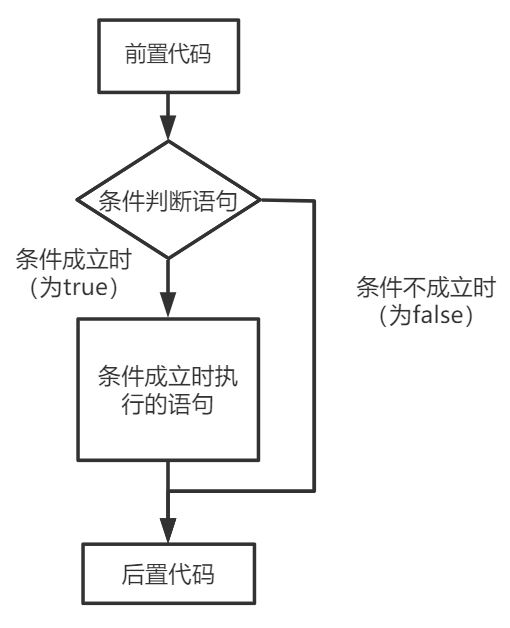

# Python

## 1 Python基础

### 1.1 注释

Python3注释可以确保对模块, 函数, 方法和行内注释使用正确的风格，有专门的符号和格式，有单行与多行的区别。

Python 中的注释有单行注释和多行注释：

Python 中单行注释以 # 开头，例如：

```python
# 这是一个注释
print("Hello, World") 
```

多行注释用三个单引号（'''）或者三个双引号（"""）将需要注释的内容囊括起来，例如:

1、单引号（'''）

```python
'''
这是多行注释，用三个单引号
这是多行注释，用三个单引号 
这是多行注释，用三个单引号
'''
print("Hello, World!") 
```

2、双引号（"""）

```python
"""
这是多行注释，用三个双引号
这是多行注释，用三个双引号 
这是多行注释，用三个双引号
"""
print("Hello, World!") 
```

>   三引号实际上是多行长字符串的声明方式，也作为python代码文档使用（类似javadoc）。

### 1.2 数据类型

在 Python 中，变量就是变量，它没有类型，我们所说的"类型"是变量所指的内存中对象的类型。 

Python 3 中有六个标准的数据类型：

-   Numbers（数字）
-   String（字符串）
-   List（列表）
-   Tuple（元组）
-   Sets（集合）
-   Dictionaries（字典）

#### 1.2.1 Numbers

Python 3 支持 int（整型）、float（浮点型）、bool（布尔型）、complex（复数）。

数值类型的赋值和计算都是很直观的，就像大多数语言一样。内置的 type() 函数可以用来查询变量所指的对象类型。

```python
>>> a, b, c, d = 20, 5.5, True, 4+3j
>>> print(type(a), type(b), type(c), type(d))
<class 'int'><class 'float'><class 'bool'><class 'complex'>
```

此外还可以用isinstance来判断：

```python
>>>a=111
>>>isinstance(a,int)
True
>>>
```

isinstance和type的区别在于：

-   type（）不会认为子类是一种父类类型。
-   isinstance（）会认为子类是一种父类类型。

```python
>>> class A:
...     pass
... 
>>> class B(A):
...     pass
... 
>>> isinstance(A(), A)
True
>>> type(A()) == A 
True
>>> isinstance(B(), A)
True
>>> type(B()) == A
False
```

注意：在 Python2 中是没有布尔型的，它用数字 0 表示 False，用 1 表示 True。到 Python3 中，把 True 和 False 定义成关键字了，但它们的值还是 1 和 0，它们可以和数字相加。

当指定一个值时，Number 对象就会被创建：

```python
var1 = 1
var2 = 10
```

也可以使用 del 语句删除一些对象引用。

del 语句的语法是：

```python
del var1[,var2[,var3[....,varN]]]
```

可以通过使用 del 语句删除单个或多个对象。例如：

```python
del var
del var_a, var_b
```

数值运算：

```python
>>> 5 + 4  # 加法
9
>>> 4.3 - 2 # 减法
2.3
>>> 3 * 7  # 乘法
21
>>> 2 / 4  # 除法，得到一个浮点数
0.5
>>> 2 // 4 # 除法，得到一个整数
0
>>> 17 % 3 # 取余 
2
>>> 2 ** 5 # 乘方
32
```

注意：

-   1、Python 可以同时为多个变量赋值，如 a, b = 1, 2。
-   2、一个变量可以通过赋值指向不同类型的对象。
-   3、数值的除法（/）总是返回一个浮点数，要获取整数使用`//`操作符。
-   4、在混合计算时，Python 会把整型转换成为浮点数。

#### 1.2.2 String

Python 中的字符串 str 用单引号(' ')或双引号 (" ") 括起来，同时使用反斜杠 (\) 转义特殊字符。

```python
>>> s = 'Yes,he doesn\'t'
>>> print(s, type(s), len(s))
Yes,he doesn't  <class 'str'> 14
```

如果你不想让反斜杠发生转义，可以在字符串前面添加一个 r，表示原始字符串：

```python
>>> print('C:\some\name')
C:\some
ame
>>> print(r'C:\some\name')
C:\some\name
```

另外，反斜杠可以作为续行符，表示下一行是上一行的延续。还可以使用"""..."""或者'''...'''跨越多行。

字符串可以使用 + 运算符串连接在一起，或者用 * 运算符重复：

```python
>>> print('str'+'ing', 'my'*3)
string mymymy
```

Python 中的字符串有两种索引方式，第一种是从左往右，从 0 开始依次增加；第二种是从右往左，从 -1 开始依次减少。

注意，没有单独的字符类型，一个字符就是长度为 1 的字符串。

```python
>>> word = 'Python'
>>> print(word[0], word[5])
P n
>>> print(word[-1], word[-6])
n P
```

还可以对字符串进行切片，获取一段子串。用冒号分隔两个索引，形式为变量[头下标:尾下标]。

截取的范围是前闭后开的（头下标取，尾下标不取），并且两个索引都可以省略：

```python
>>> word = 'ilovepython'
>>> word[1:5]
'love'
>>> word[:]
'ilovepython'
>>> word[5:]
'python'
>>> word[-10:-6]
'love'
```

与 C 字符串不同的是，Python 字符串不能被改变。**向一个索引位置赋值，比如 word[0] = 'm' 会导致错误**。

注意：

-   1、反斜杠可以用来转义，使用 r 可以让反斜杠不发生转义。
-   2、字符串可以用 + 运算符连接在一起，用 * 运算符重复。
-   3、Python 中的字符串有两种索引方式，从左往右以 0 开始，从右往左以 -1 开始。
-   4、Python 中的字符串不能改变。

#### 1.2.3 List

List（列表） 是 Python 中使用最频繁的数据类型。

列表是写在方括号之间、用逗号分隔开的元素列表。列表中元素的类型可以不相同：

```python
>>> a = ['him', 25, 100, 'her']
>>> print(a)
['him', 25, 100, 'her']
```

和字符串一样，列表同样可以被索引和切片，列表被切片后返回一个包含所需元素的新列表。详细的在这里就不赘述了。

列表还支持串联操作，使用 + 操作符：

```python
>>> a = [1, 2, 3, 4, 5]
>>> a + [6, 7, 8]
[1, 2, 3, 4, 5, 6, 7, 8]
```

与 Python 字符串不一样的是，列表中的元素是可以改变的：

```python
>>> a = [1, 2, 3, 4, 5, 6]
>>> a[0] = 9
>>> a[2:5] = [13, 14, 15]
>>> a
[9, 2, 13, 14, 15, 6]
>>> a[2:5] = []   # 删除
>>> a
[9, 2, 6]
```

List 内置了有很多方法，例如 append()、pop() 等等，这在后面会讲到。

注意：

-   1、List 写在方括号之间，元素用逗号隔开。
-   2、和字符串一样，List 可以被索引和切片。
-   3、List 可以使用 + 操作符进行拼接。
-   4、List 中的元素是可以改变的。

#### 1.2.4 Tuple

元组（tuple）与列表类似，不同之处在于元组的元素不能修改。元组写在小括号里，元素之间用逗号隔开。

元组中的元素类型也可以不相同：

```python
>>> a = (1991, 2014, 'physics', 'math')
>>> print(a, type(a), len(a))
(1991, 2014, 'physics', 'math') <class 'tuple'> 4
```

元组与字符串类似，可以被索引且下标索引从 0 开始，也可以进行截取/切片（看上面，这里不再赘述）。

其实，可以把字符串看作一种特殊的元组。

```python
>>> tup = (1, 2, 3, 4, 5, 6)
>>> print(tup[0], tup[1:5])
1 (2, 3, 4, 5)
>>> tup[0] = 11  # 修改元组元素的操作是非法的
```

虽然 tuple 的元素不可改变，但它可以包含可变的对象，比如 list 列表。

构造包含 0 个或 1 个元素的 tuple 是个特殊的问题，所以有一些额外的语法规则：

```python
tup1 = () # 空元组
tup2 = (20,) # 一个元素，需要在元素后添加逗号
```

另外，元组也支持用 + 操作符：

```python
>>> tup1, tup2 = (1, 2, 3), (4, 5, 6)
>>> print(tup1+tup2)
(1, 2, 3, 4, 5, 6)
```

string、list 和 tuple 都属于 sequence（序列）。

注意：

-   1、与字符串一样，元组的元素不能修改。
-   2、元组也可以被索引和切片，方法都是一样的。
-   3、注意构造包含 0 或 1 个元素的元组的特殊语法规则。
-   4、元组也可以使用 + 操作符进行拼接。

#### 1.2.5 Sets

集合（set）是一个无序不重复元素的集。

基本功能是进行成员关系测试和消除重复元素。

可以使用大括号 或者 set() 函数创建 set 集合，注意：创建一个空集合必须用 set() 而不是 { }，因为{ }是用来创建一个空字典。

```python
>>> student = {'Tom', 'Jim', 'Mary', 'Tom', 'Jack', 'Rose'}
>>> print(student)   # 重复的元素被自动去掉
{'Jim', 'Jack', 'Mary', 'Tom', 'Rose'}
>>> 'Rose' in student  # membership testing（成员测试）
True
>>> # set可以进行集合运算
... 
>>> a = set('abracadabra')
>>> b = set('alacazam')
>>> a
{'a', 'b', 'c', 'd', 'r'}
>>> a - b     # a和b的差集
{'b', 'd', 'r'}
>>> a | b     # a和b的并集
{'l', 'm', 'a', 'b', 'c', 'd', 'z', 'r'}
>>> a & b     # a和b的交集
{'a', 'c'}
>>> a ^ b     # a和b中不同时存在的元素
{'l', 'm', 'b', 'd', 'z', 'r'}
```

#### 1.2.6 Dictionaries

字典（dictionary）是 Python 中另一个非常有用的内置数据类型。

字典是一种映射类型（mapping type），它是一个无序的键值对（key-value）集合。

关键字（key）必须使用不可变类型，也就是说list和包含可变类型的 tuple 不能做关键字。

在同一个字典中，关键字（key）必须互不相同。

```python
>>> dic = {}  # 创建空字典
>>> tel = {'Jack':1557, 'Tom':1320, 'Rose':1886}
>>> tel
{'Tom': 1320, 'Jack': 1557, 'Rose': 1886}
>>> tel['Jack']   # 主要的操作：通过key查询
1557
>>> del tel['Rose']  # 删除一个键值对
>>> tel['Mary'] = 4127  # 添加一个键值对
>>> tel
{'Tom': 1320, 'Jack': 1557, 'Mary': 4127}
>>> list(tel.keys())  # 返回所有key组成的list
['Tom', 'Jack', 'Mary']
>>> sorted(tel.keys()) # 按key排序
['Jack', 'Mary', 'Tom']
>>> 'Tom' in tel       # 成员测试
True
>>> 'Mary' not in tel  # 成员测试
False
```

构造函数 dict() 直接从键值对 sequence 中构建字典，当然也可以进行推导，如下：

```python
>>> dict([('sape', 4139), ('guido', 4127), ('jack', 4098)])
{'jack': 4098, 'sape': 4139, 'guido': 4127}

>>> {x: x**2 for x in (2, 4, 6)}
{2: 4, 4: 16, 6: 36}

>>> dict(sape=4139, guido=4127, jack=4098)
{'jack': 4098, 'sape': 4139, 'guido': 4127}
```

另外，字典类型也有一些内置的函数，例如 clear()、keys()、values() 等。

注意：

-   1、字典是一种映射类型，它的元素是键值对。
-   2、字典的关键字必须为不可变类型，且不能重复。
-   3、创建空字典使用 { }。

### 1.3 标识符和关键字

#### 1.3.1 标识符

-   第一个字符必须是字母表中字母或下划线'_'。
-   标识符的其他的部分有字母、数字和下划线组成。
-   标识符对大小写敏感。

在 Python 3中，非 ASCII 编码的标识符也是允许的了。

#### 1.3.2 Python 保留字

保留字即关键字，我们不能把它们用作任何标识符名称。Python 的标准库提供了一个关键词模块，我们可以使用它来查看当前版本的所有保留字：

```python
>>> import keyword
>>> keyword.kwlist
['False', 'None', 'True', '__peg_parser__', 'and', 'as', 'assert', 'async', 'await', 'break', 'class', 'continue', 'def', 'del', 'elif', 'else', 'except', 'finally', 'for', 'from', 'global', 'if', 'import', 'in', 'is', 'lambda', 'nonlocal', 'not', 'or', 'pass', 'raise', 'return', 'try', 'while', 'with', 'yield']
```

### 1.4 类型转换

| 函数     | 说明                |
| -------- | ------------------- |
| int(x)   | 将x转换成一个整数   |
| float(x) | 将x转换成一个浮点数 |
| str(x)   | 将对象x转换成字符串 |
| bool(x)  | 将对象x转行成布尔值 |

#### 1.4.1 转换成整数

```python
print(int("123"))  # 将字符串123转换成整数

print(int(123.456))  # 将浮点数123.456转换成整数

print(int(True))    # 将布尔值转换成整数1
print(int(False))    # 将布尔值转换成整数0

# 不能转换的情况，包含非法字符
print(int("123.456"))
print(int("123abc"))
```

#### 1.4.2 转换成浮点数

```python
# float 将字符串的 "123.456" 转换成为浮点数 123.456
f1 = float("123.456")
print(f1)
print(type(f1))

# 将整数转换成为了浮点数
f2 = float(123)
print(f2)
print(type(f2))

```

#### 1.4.3 转换成字符串

```python
str1 = str(123)
str2 = str(123.456)
str3 = str(True)
print(type(str1), type(str2), type(str3))
```

#### 1.4.4 转换成布尔值

```python
# 如下情况会答应False值
print(bool(''))
print(bool(""))
print(bool(0))
print(bool([]))
print(bool({}))
print(bool(()))
```

### 1.5 运算符

#### 1.5.1 算数运算符

以下假设变量 a 为 21，变量 b 为 10：

| 运算符 | 描述                                            | 实例                                    |
| :----- | :---------------------------------------------- | :-------------------------------------- |
| +      | 加 - 两个对象相加                               | a + b 输出结果 31                       |
| -      | 减 - 得到负数或是一个数减去另一个数             | a - b 输出结果 11                       |
| *      | 乘 - 两个数相乘或是返回一个被重复若干次的字符串 | a * b 输出结果 210                      |
| /      | 除 - x 除以 y                                   | a / b 输出结果 2.1                      |
| %      | 取模 - 返回除法的余数                           | a % b 输出结果 1                        |
| **     | 幂 - 返回 x 的 y 次幂                           | a ** b 为 21 的 10 次方                 |
| //     | 取整除 - 返回商的整数部分                       | 9//2 输出结果 4 , 9.0//2.0 输出结果 4.0 |

```python
a = 21
b = 10
c = 0

c = a + b
print ("a+b 的值为：", c)

c = a - b
print ("a-b 的值为：", c)

c = a * b
print ("a*b 的值为：", c)

c = a / b
print ("a/b 的值为：", c)

c = a % b
print ("a%b 的值为：", c)

# 修改变量 a 、b 、c
a = 2
b = 3
c = a**b 
print ("a**b 的值为：", c)

a = 10
b = 5
c = a//b 
print ("a//b 的值为：", c)
```

结果

```
a+b 的值为： 31
a-b 的值为： 11
a*b 的值为： 210
a/b 的值为： 2.1
a%b 的值为： 1
a**b 的值为： 8
a//b 的值为： 2
```

#### 1.5.2 比较运算符

以下假设变量 a 为 10，变量 b 为 20：

| 运算符 | 描述                                | 实例                  |
| :----- | :---------------------------------- | :-------------------- |
| ==     | 等于 -- 比较对象是否相等            | (a == b) 返回 False。 |
| !=     | 不等于 -- 比较两个对象是否不相等    | (a != b) 返回 True.   |
| >      | 大于 -- 返回 x 是否大于 y           | (a > b) 返回 False。  |
| <      | 小于 -- 返回 x 是否小于 y。         | (a < b) 返回 True。   |
| >=     | 大于等于 -- 返回 x 是否大于等于 y。 | (a >= b) 返回 False。 |
| <=     | 小于等于 -- 返回 x 是否小于等于 y。 | (a <= b) 返回 True。  |

>   所有比较运算符返回 1 表示真，返回 0 表示假。这分别与特殊的变量 True 和 False 等价。注意：True和False的首字母为大写。

```python
a = 21
b = 10
c = 0

if ( a == b ):
    print ("a 等于 b")
else:
    print ("a 不等于 b")

if ( a != b ):
    print ("a 不等于 b")
else:
    print ("a 等于 b")

if ( a < b ):
    print ("a 小于 b")
else:
    print ("a 大于等于 b")

if ( a > b ):
    print ("a 大于 b")
else:
    print ("a 小于等于 b")

# 修改变量 a 和 b 的值
a = 5;
b = 20;
if ( a <= b ):
    print ("a 小于等于 b")
else:
    print ("a 大于  b")

if ( a >= b ):
    print ("a 大于等于 b")
else:
    print ("a 小于 b")
```

结果

```
a 不等于 b
a 不等于 b
a 大于等于 b
a 大于 b
a 小于等于 b
a 小于 b
```

#### 1.5.3 赋值运算符

以下假设变量 a 为 10，变量 b 为 20：

| 运算符 | 描述             | 实例                                  |
| :----- | :--------------- | :------------------------------------ |
| =      | 简单的赋值运算符 | c = a + b 将 a + b 的运算结果赋值为 c |
| +=     | 加法赋值运算符   | c += a 等效于 c = c + a               |
| -=     | 减法赋值运算符   | c -= a 等效于 c = c - a               |
| *=     | 乘法赋值运算符   | c *= a 等效于 c = c * a               |
| /=     | 除法赋值运算符   | c /= a 等效于 c = c / a               |
| %=     | 取模赋值运算符   | c %= a 等效于 c = c % a               |
| **=    | 幂赋值运算符     | c **= a 等效于 c = c ** a             |
| //=    | 取整除赋值运算符 | c //= a 等效于 c = c // a             |

```python
a = 21
b = 10
c = 0

c = a + b
print ("1 - c 的值为：", c)

c += a
print ("2 - c 的值为：", c)

c *= a
print ("3 - c 的值为：", c)

c /= a 
print ("4 - c 的值为：", c)

c = 2
c %= a
print ("5 - c 的值为：", c)

c **= a
print ("6 - c 的值为：", c)

c //= a
print ("7 - c 的值为：", c)
```

结果

```
1 - c 的值为： 31
2 - c 的值为： 52
3 - c 的值为： 1092
4 - c 的值为： 52.0
5 - c 的值为： 2
6 - c 的值为： 2097152
7 - c 的值为： 99864
```

#### 1.5.4 位运算符

按位运算符是把数字看作二进制来进行计算的。Python 中的按位运算法则如下：

下表中变量 a 为 60，b 为 13。

|                     | 按位与运算（a&b） | 按位或运算(a\|b) | 按位异或（a^b） |
| :-----------------: | :---------------: | :--------------: | :-------------: |
| a（60）的二进制表示 |     0011 1100     |    0011 1100     |    0011 1100    |
| b（13）的二进制表示 |     0000 1101     |    0000 1101     |    0000 1101    |
|      运算结果       |     0000 1100     |    0011 1101     |    0011 0001    |
|  结果的十进制表示   |        12         |        61        |       49        |

|                      | 按位取反（~a） | 左移（a<<2） | 右移(a>>2) |
| :------------------: | :------------: | :----------: | :--------: |
| a（60）的二进制表示  |   0011 1100    |  0011 1100   | 0011 1100  |
|       运算结果       |   1100 0011    |  1111 0000   | 0000 1111  |
| 运算结果的十进制表示 |      -61       |     240      |     15     |

| 运算符 | 描述                                                         | 实例                                          |
| :----- | :----------------------------------------------------------- | :-------------------------------------------- |
| &      | 按位与运算符：参与运算的两个值,如果两个相应位都为 1,则该位的结果为 1,否则为 0 | (a & b) 输出结果 12 ，二进制解释： 0000 1100  |
| \|     | 按位或运算符：只要对应的二个二进位有一个为 1 时，结果位就为 1。 | (a \| b) 输出结果 61 ，二进制解释： 0011 1101 |
| ^      | 按位异或运算符：当两对应的二进位相异（不同）时，结果为 1     | (a ^ b) 输出结果 49 ，二进制解释： 0011 0001  |
| ~      | 按位取反运算符：对数据的每个二进制位取反,即把 1 变为 0，把 0 变为 1 | (~a ) 输出结果 -61 ，二进制解释： 1100 0011   |
| <<     | 左移动运算符：运算数的各二进位全部左移若干位，由"<<"右边的数指定移动的位数，高位丢弃，低位补 0。 | a << 2 输出结果 240 ，二进制解释： 1111 0000  |
| >>     | 右移动运算符：把">>"左边的运算数的各二进位全部右移若干位，">>"右边的数指定移动的位数 | a >> 2 输出结果 15 ，二进制解释： 0000 1111   |

```python
a = 60            # 60 = 0011 1100 
b = 13            # 13 = 0000 1101 
c = 0

c = a & b;        # 12 = 0000 1100
print ("1 - c 的值为：", c)

c = a | b;        # 61 = 0011 1101 
print ("2 - c 的值为：", c)

c = a ^ b;        # 49 = 0011 0001
print ("3 - c 的值为：", c)

c = ~a;           # -61 = 1100 0011
print ("4 - c 的值为：", c)

c = a << 2;       # 240 = 1111 0000
print ("5 - c 的值为：", c)

c = a >> 2;       # 15 = 0000 1111
print ("6 - c 的值为：", c)
```

结果

```
1 - c 的值为： 12
2 - c 的值为： 61
3 - c 的值为： 49
4 - c 的值为： -61
5 - c 的值为： 240
6 - c 的值为： 15
```

#### 1.5.5 逻辑运算符

Python 语言支持逻辑运算符，以下假设变量 a 为 10, b 为 20:

| 运算符 | 逻辑表达式 | 描述                                                         | 实例                    |
| :----- | :--------- | :----------------------------------------------------------- | :---------------------- |
| and    | x and y    | 布尔"与" - 如果 x 为 False，x and y 返回 False，否则它返回 y 的计算值。 | (a and b) 返回 20。     |
| or     | x or y     | 布尔"或" - 如果 x 是 True，它返回 x的值，否则它返回 y 的计算值。 | (a or b) 返回 10。      |
| not    | not x      | 布尔"非" - 如果 x 为 True，返回 False 。如果 x 为 False，它返回 True。 | not(a and b) 返回 False |

```python
a = 10
b = 20

if ( a and b ):
    print ("1 - 变量 a 和 b 都为 true")
else:
    print ("1 - 变量 a 和 b 有一个不为 true")

if ( a or b ):
    print ("2 - 变量 a 和 b 都为 true，或其中一个变量为 true")
else:
    print ("2 - 变量 a 和 b 都不为 true")

# 修改变量 a 的值
a = 0
if ( a and b ):
    print ("3 - 变量 a 和 b 都为 true")
else:
    print ("3 - 变量 a 和 b 有一个不为 true")

if ( a or b ):
    print ("4 - 变量 a 和 b 都为 true，或其中一个变量为 true")
else:
    print ("4 - 变量 a 和 b 都不为 true")

if not( a and b ):
    print ("5 - 变量 a 和 b 都为 false，或其中一个变量为 false")
else:
    print ("5 - 变量 a 和 b 都为 true")
```

结果

```
1 - 变量 a 和 b 都为 true
2 - 变量 a 和 b 都为 true，或其中一个变量为 true
3 - 变量 a 和 b 有一个不为 true
4 - 变量 a 和 b 都为 true，或其中一个变量为 true
5 - 变量 a 和 b 都为 false，或其中一个变量为 false
```

#### 1.5.5 成员运算符

除了以上的一些运算符之外，Python 还支持成员运算符，测试实例中包含了一系列的成员，包括字符串，列表或元组。

| 运算符 | 描述                                                    | 实例                                              |
| :----- | :------------------------------------------------------ | :------------------------------------------------ |
| in     | 如果在指定的序列中找到值返回 True，否则返回 False。     | x 在 y 序列中 , 如果 x 在 y 序列中返回 True。     |
| not in | 如果在指定的序列中没有找到值返回 True，否则返回 False。 | x 不在 y 序列中 , 如果 x 不在 y 序列中返回 True。 |

```python
a = 10
b = 20
list = [1, 2, 3, 4, 5 ];

if ( a in list ):
    print ("1 - 变量 a 在给定的列表中 list 中")
else:
    print ("1 - 变量 a 不在给定的列表中 list 中")

if ( b not in list ):
    print ("2 - 变量 b 不在给定的列表中 list 中")
else:
    print ("2 - 变量 b 在给定的列表中 list 中")

# 修改变量 a 的值
a = 2
if ( a in list ):
    print ("3 - 变量 a 在给定的列表中 list 中")
else:
    print ("3 - 变量 a 不在给定的列表中 list 中")
```

结果

```
1 - 变量 a 不在给定的列表中 list 中
2 - 变量 b 不在给定的列表中 list 中
3 - 变量 a 在给定的列表中 list 中
```

#### 1.5.5 身份运算符

身份运算符用于比较两个对象的存储单元

| 运算符 | 描述                                        | 实例                                                         |
| :----- | :------------------------------------------ | :----------------------------------------------------------- |
| is     | is 是判断两个标识符是不是引用自一个对象     | x is y, 如果 id(x) 等于 id(y) , **is** 返回结果 True         |
| is not | is not 是判断两个标识符是不是引用自不同对象 | x is not y, 如果 id(x) 不等于 id(y). **is not** 返回结果 True |

```python
a = 20
b = 20

if ( a is b ):
    print ("1 - a 和 b 有相同的标识")
else:
    print ("1 - a 和 b 没有相同的标识")

if ( id(a) == id(b) ):
    print ("2 - a 和 b 有相同的标识")
else:
    print ("2 - a 和 b 没有相同的标识")

# 修改变量 b 的值
b = 30
if ( a is b ):
    print ("3 - a 和 b 有相同的标识")
else:
    print ("3 - a 和 b 没有相同的标识")

if ( a is not b ):
    print ("4 - a 和 b 没有相同的标识")
else:
    print ("4 - a 和 b 有相同的标识")
```

结果

```
1 - a 和 b 有相同的标识
2 - a 和 b 有相同的标识
3 - a 和 b 没有相同的标识
4 - a 和 b 没有相同的标识
```

#### 1.5.5 运算符优先级

| 运算符                                                       | 描述                               |
| :----------------------------------------------------------- | :--------------------------------- |
| `(expressions...)`,`[expressions...]`, `{key: value...}`, `{expressions...}` | 圆括号的表达式                     |
| `x[index]`, `x[index:index]`, `x(arguments...)`, `x.attribute` | 读取，切片，调用，属性引用         |
| await x                                                      | await 表达式                       |
| `**`                                                         | 乘方(指数)                         |
| `+x`, `-x`, `~x`                                             | 正，负，按位非 NOT                 |
| `*`, `@`, `/`, `//`, `%`                                     | 乘，矩阵乘，除，整除，取余         |
| `+`, `-`                                                     | 加和减                             |
| `<<`, `>>`                                                   | 移位                               |
| `&`                                                          | 按位与 AND                         |
| `^`                                                          | 按位异或 XOR                       |
| `|`                                                          | 按位或 OR                          |
| `in,not in, is,is not, <, <=, >, >=, !=, ==`                 | 比较运算，包括成员检测和标识号检测 |
| `not x`                                                      | 逻辑非 NOT                         |
| `and`                                                        | 逻辑与 AND                         |
| `or`                                                         | 逻辑或 OR                          |
| `if -- else`                                                 | 条件表达式                         |
| `lambda`                                                     | lambda 表达式                      |
| `:=`                                                         | 赋值表达式                         |

```python
a = 20
b = 10
c = 15
d = 5
e = 0

e = (a + b) * c / d       #( 30 * 15 ) / 5
print ("(a + b) * c / d 运算结果为：",  e)

e = ((a + b) * c) / d     # (30 * 15 ) / 5
print ("((a + b) * c) / d 运算结果为：",  e)

e = (a + b) * (c / d);    # (30) * (15/5)
print ("(a + b) * (c / d) 运算结果为：",  e)

e = a + (b * c) / d;      #  20 + (150/5)
print ("a + (b * c) / d 运算结果为：",  e)
```

结果

```
(a + b) * c / d 运算结果为： 90.0
((a + b) * c) / d 运算结果为： 90.0
(a + b) * (c / d) 运算结果为： 90.0
a + (b * c) / d 运算结果为： 50.0
```

### 1.6 输入输出

#### 1.6.1 输出

str() 函数返回一个用户易读的表达形式，使用 str.format() 函数可以输出的形式更加多样。

repr() 产生一个解释器易读的表达形式。

```python
>>> s = 'Hello, world.'
>>> str(s)
'Hello, world.'
>>> repr(s)
"'Hello, world.'"
>>> str(1/7)
'0.14285714285714285'
>>> x = 10 * 3.25
>>> y = 200 * 200
>>> s = 'The value of x is ' + repr(x) + ', and y is ' + repr(y) + '...'
>>> print(s)
The value of x is 32.5, and y is 40000...
>>> #  repr() 函数可以转义字符串中的特殊字符
... hello = 'hello, world\n'
>>> hellos = repr(hello)
>>> print(hellos)
'hello, world\n'
>>> # repr() 的参数可以是 Python 的任何对象
... repr((x, y, ('spam', 'eggs')))
"(32.5, 40000, ('spam', 'eggs'))"
```

这里有两种方式输出一个平方与立方的表:

```python
>>> for x in range(1, 11):
...     print(repr(x).rjust(2), repr(x*x).rjust(3), end=' ')
...     # 注意前一行 'end' 的使用
...     print(repr(x*x*x).rjust(4))
...
 1   1    1
 2   4    8
 3   9   27
 4  16   64
 5  25  125
 6  36  216
 7  49  343
 8  64  512
 9  81  729
10 100 1000

>>> for x in range(1, 11):
...     print('{0:2d} {1:3d} {2:4d}'.format(x, x*x, x*x*x))
...
 1   1    1
 2   4    8
 3   9   27
 4  16   64
 5  25  125
 6  36  216
 7  49  343
 8  64  512
 9  81  729
10 100 1000
```

**注意：**在第一个例子中, 每列间的空格由 print() 添加。

这个例子展示了字符串对象的 rjust() 方法, 它可以将字符串靠右, 并在左边填充空格。

还有类似的方法, 如 ljust() 和 center()。 这些方法并不会写任何东西, 它们仅仅返回新的字符串。

另一个方法 zfill(), 它会在数字的左边填充 0，如下所示：

```python
>>> '12'.zfill(5)
'00012'
>>> '-3.14'.zfill(7)
'-003.14'
>>> '3.14159265359'.zfill(5)
'3.14159265359'
```

str.format() 的基本使用如下:

```python
>>> print('We are the {} who say "{}!"'.format('knights', 'Ni'))
We are the knights who say "Ni!"
```

括号及其里面的字符 (称作格式化字段) 将会被 format() 中的参数替换。

在括号中的数字用于指向传入对象在 format() 中的位置，如下所示：

```python
>>> print('{0} and {1}'.format('spam', 'eggs'))
spam and eggs
>>> print('{1} and {0}'.format('spam', 'eggs'))
eggs and spam
```

如果在 format() 中使用了关键字参数, 那么它们的值会指向使用该名字的参数。

```python
>>> print('This {food} is {adjective}.'.format(
...       food='spam', adjective='absolutely horrible'))
This spam is absolutely horrible.
```

位置及关键字参数可以任意的结合:

```python
>>> print('The story of {0}, {1}, and {other}.'.format('Bill', 'Manfred',other='Georg'))
The story of Bill, Manfred, and Georg.
```

'!a' (使用 ascii()), '!s' (使用 str()) 和 '!r' (使用 repr()) 可以用于在格式化某个值之前对其进行转化:

```python
>>> import math
>>> print('The value of PI is approximately {}.'.format(math.pi))
The value of PI is approximately 3.14159265359.
>>> print('The value of PI is approximately {!r}.'.format(math.pi))
The value of PI is approximately 3.141592653589793.
```

可选项 ':' 和格式标识符可以跟着字段名。 这就允许对值进行更好的格式化。 下面的例子将 Pi 保留到小数点后三位：

```python
>>> import math
>>> print('The value of PI is approximately {0:.3f}.'.format(math.pi))
The value of PI is approximately 3.142.
```

在 ':' 后传入一个整数, 可以保证该域至少有这么多的宽度。 用于美化表格时很有用。

```python
>>> table = {'Sjoerd': 4127, 'Jack': 4098, 'Dcab': 7678}
>>> for name, phone in table.items():
...     print('{0:10} ==> {1:10d}'.format(name, phone))
...
Jack       ==>       4098
Dcab       ==>       7678
Sjoerd     ==>       4127
```

如果你有一个很长的格式化字符串, 而你不想将它们分开, 那么在格式化时通过变量名而非位置会是很好的事情。

最简单的就是传入一个字典, 然后使用方括号 '[]' 来访问键值 :

```python
>>> table = {'Sjoerd': 4127, 'Jack': 4098, 'Dcab': 8637678}
>>> print('Jack: {0[Jack]:d}; Sjoerd: {0[Sjoerd]:d}; '
          'Dcab: {0[Dcab]:d}'.format(table))
Jack: 4098; Sjoerd: 4127; Dcab: 8637678
```

也可以通过在 table 变量前使用 '**' 来实现相同的功能：

```python
>>> table = {'Sjoerd': 4127, 'Jack': 4098, 'Dcab': 8637678}
>>> print('Jack: {Jack:d}; Sjoerd: {Sjoerd:d}; Dcab: {Dcab:d}'.format(**table))
Jack: 4098; Sjoerd: 4127; Dcab: 8637678
```

旧式字符串格式化

% 操作符也可以实现字符串格式化。 它将左边的参数作为类似 sprintf() 式的格式化字符串, 而将右边的代入, 然后返回格式化后的字符串. 例如:

```python
>>> import math
>>> print('The value of PI is approximately %5.3f.' % math.pi)
The value of PI is approximately 3.142.
```

因为 str.format() 比较新的函数， 大多数的 Python 代码仍然使用 % 操作符。但是因为这种旧式的格式化最终会从该语言中移除, 应该更多的使用 str.format().

#### 1.6.2 输入

接收用户输入使用input函数

```python
password = input('please input your password: ')
print('your password is '+password)
```

注意：

*   input()的小括号中放入的是提示信息，用来在获取数据之前给用户的一个简单提示

*   input()在从键盘获取了数据以后，会存放到等号右边的变量中

*   input()会把用户输入的任何值都作为字符串来对待

### 1.7 流程控制语句

#### 1.7.1 条件控制

**if语句**

Python条件语句是通过一条或多条语句的执行结果(True或者False)来决定执行的代码块。


Python 中 if 语句的一般形式如下所示：

```python
if condition_1:
    statement_block_1
```

流程图如下所示：



这种if语句只有在符合条件的时候才会执行代码块内的代码，是一种比较常见的用法。

另一种常见的用法是：

```python
if condition_1:
    statement_block_1
else:
    statement_block_2
```

流程图如下所示：


这种语句是一种常用的if-else语句，通常用于二分支结构的条件语句代码。

在一些时候，我们可能需要多分支的条件语句代码，可以在if-else语句中混合elif语句进行使用：

>   Python 中用 elif 代替了else if，所以if语句的关键字为：if – elif – else。

```python
if condition_1:
    statement_block_1
elif condition_2:
    statement_block_2
else:
    statement_block_3
```

流程图如下所示：


如果 "condition_1" 为 True 将执行 "statement_block_1" 块语句，如果 "condition_1" 为 False，将判断 "condition_2"，如果"condition_2" 为 True 将执行 "statement_block_2" 块语句，如果 "condition_2" 为 False，将执行"statement_block_3"块语句。

>    使用第一种常用的if语句搭配合适的条件可以实现第二种和第三种语句的全部效果，但在执行效率和代码可读性上会变得比较糟糕。

**注意：**

-   1、每个条件后面要使用冒号（:），表示接下来是满足条件后要执行的语句块。
-   2、使用缩进来划分语句块，相同缩进数的语句在一起组成一个语句块。
-   3、在 Python 中没有 switch – case 语句，但在python3.10中添加了用法类似的match-case语句。

**match-case语句（python3.10新特性）**

在其他语言（比如说经典的C语言）中有一种多分支条件判断语句，可以进行模式匹配（通俗的讲，就是将传入的内容跟多个已存在的样例进行比较，找到相同的案例并按照该案例的代码进行处理，如果没有相同案例就按默认案例进行处理，可以查看其他编程语言的条件语句的Switch相关部分内容进行比较参考）。在python3.10中也引入了这样的新特性。

match-case语句的结构一般如下所示：

```python
match variable: #这里的variable是需要判断的内容
    case ["quit"]: 
        statement_block_1 # 对应案例的执行代码，当variable="quit"时执行statement_block_1    case ["go", direction]: 
        statement_block_2
    case ["drop", *objects]: 
        statement_block_3
    ... # 其他的case语句
    case _: #如果上面的case语句没有命中，则执行这个代码块，类似于Switch的default
        statement_block_default
```

一个match语句的使用示例：

```python
def http_error(status):
    match status:
        case 400:
            return "Bad request"
        case 404:
            return "Not found"
        case 418:
            return "I'm a teapot"
        case _:
            return "Something's wrong with the Internet"
```

>    上述代码等价于：
>
>   ```python
>   def http_error(status):
>       if status == 400:
>           return "Bad request"
>       elif status == 404:
>           return "Not found"
>       elif status == 418:
>           return "I'm a teapot"
>       else:
>           return "Something's wrong with the Internet"
>   ```

关于模式匹配还有更多的用法，可以参考PEP636进行详细的学习。

**实例**

以下实例演示了狗的年龄计算判断：

```python
age = int(input("Age of the dog: "))
print()
if age < 0:  
    print("This can hardly be true!") 
elif age == 1:  
    print("about 14 human years") 
elif age == 2:  
    print("about 22 human years") 
elif age > 2:
    human = 22 + (age -2)*5
    print("Human years: ", human)

### 
input('press Return>')
```

将以上脚本保存在 dog.py 文件中，并执行该脚本：

```python
python dog.py
Age of the dog: 1

about 14 human years
```

以下为 if 中常用的操作运算符:

| 操作符 | 描述                   |
| :----- | :--------------------- |
| `<`    | 小于                   |
| `<=`   | 小于或等于             |
| `>`    | 大于                   |
| `>=`   | 大于或等于             |
| `==`   | 等于，比较对象是否相等 |
| `!=`   | 不等于                 |

>    只要返回结果为布尔型（true或者false）的，都可以作为if的条件，所以在之前的集合等内容中涉及到的判断元素是否在集合中的`in`和`not in`，都可以作为if的条件。

**实例**

```python
# 程序演示了 == 操作符
# 使用数字
print(5 == 6)
# 使用变量
x = 5
y = 8
print(x == y)
```

以上实例输出结果：

```python
False
False
```

使用`in`和`not in`作为判断条件：

```python
thisset = set(("Google", "W3Cschool", "Taobao"))
if "W3Cschool" in thisset:
    print("该元素在列表中")
if "baidu" not in thisset:
    print("该元素不在列表中")
```

运行结果如下：

```python
该元素在列表中
该元素不在列表中
```

以下示例使用if语句来实现一个猜数字游戏（建议在本地环境尝试）：

```python
# 该实例演示了数字猜谜游戏
number = 7
guess = -1
print("猜数字!")
while guess != number:
    guess = int(input("请输入你要猜的数字"))
    if guess == number:
        print("你猜中了，真厉害！")
    elif guess < number:
        print("猜小了，再猜猜？")
    elif guess > number:
        print("猜大了，在猜猜？")
```

#### 1.7.2 循环

**while 循环**

Python 中 while 语句的一般形式：

```python
while 判断条件：
    statements
```

同样需要注意冒号和缩进。另外，在Python中没有 do-while 循环。

以下实例使用了 while 来计算 1 到 100 的总和：

```python
#!/usr/bin/env python3
n = 100
sum = 0
counter = 1
while counter <= n:
    sum = sum + counter     
    counter += 1  
print('Sum of 1 until %d: %d' % (n,sum)) 
```

执行结果如下：

```python
Sum of 1 until 100: 5050
```

**for 语句**

Python for 循环可以遍历任何序列的项目，如一个列表或者一个字符串。

for 循环的一般格式如下：

```python
for <variable> in <sequence>:
  <statements>
else:
 <statements>
```

Python for循环实例：

```python
>>> languages = ["C", "C++", "Perl", "Python"] 
>>> for x in languages:
...     print (x)
... 
C
C++
Perl
Python
>>> 
```

以下 for 实例中使用了 break 语句，break 语句用于跳出当前循环体：

```python
#!/usr/bin/env python3
edibles = ["ham", "spam","eggs","nuts"]
for food in edibles:
    if food == "spam":
        print("No more spam please!")
        break
    print("Great, delicious " + food)
else:
    print("I am so glad: No spam!")
print("Finally, I finished stuffing myself")
```

执行脚本后，在循环到 "spam"时会跳出循环体：

```python
Great, delicious ham
No more spam please!
Finally, I finished stuffing myself
```

**range()函数**

如果你需要遍历数字序列，可以使用内置 range() 函数。它会生成数列，例如:

```python
>>> for i in range(5):
...     print(i)
...
0
1
2
3
4
```

你也可以使用 range 指定区间的值：

```python
>>> for i in range(5,9) :
  print(i)

    
5
6
7
8
```

也可以使 range 以指定数字开始并指定不同的增量(甚至可以是负数;有时这也叫做'步长'):

```python
>>> for i in range(0, 10, 3) :
    print(i)

    
0
3
6
9
```

负数：

```python
>>> for i in range(-10, -100, -30) :
   print(i)

    
-10
-40
-70
```

您可以结合 range() 和 len() 函数以遍历一个序列的索引,如下所示:

```python
>>> a = ['Mary', 'had', 'a', 'little', 'lamb']
>>> for i in range(len(a)):
...     print(i, a[i])
...
0 Mary
1 had
2 a
3 little
4 lamb
```

还可以使用 range() 函数来创建一个列表：

```python
>>> list(range(5))
[0, 1, 2, 3, 4]
```

#### 1.7.3 迭代器和生成器

**迭代器**

迭代器是访问集合元素的一种方式，可以记住遍历的位置的对象，迭代器对象从集合的第一个元素开始访问，直到所有的元素被访问完结束，迭代器只能往前不会后退。迭代器有两个基本的方法：**iter()** 和 **next()**。字符串，列表或元组对象都可用于创建迭代器。

```python
lists = [1, 2, 3, 4]
it = iter(lists)
for x in it:
    print(x, end=' ')
```

```python
import sys

lists = [1, 2, 3, 4]
it = iter(lists)

while True:
    try:
        print(next(it))
    except StopIteration:
        sys.exit()
```

**生成器**

使用了 yield 的函数被称为生成器（generator）跟普通函数不同的是，生成器是一个返回迭代器的函数，只能用于迭代操作，更简单点理解生成器就是一个迭代器。在调用生成器运行的过程中，每次遇到 yield 时函数会暂停并保存当前所有的运行信息，返回 yield 的值。并在下一次执行 next() 方法时从当前位置继续运行。

### 1.8 数据类型高级

#### 1.8.1 数字

**complex(x)** 将x转换到一个复数，实数部分为 x，虚数部分为 0。

**complex(x, y)** 将 x 和 y 转换到一个复数，实数部分为 x，虚数部分为 y。x 和 y 是数字表达式。

数学函数

| 函数                                                         | 返回值 ( 描述 )                                              |
| :----------------------------------------------------------- | :----------------------------------------------------------- |
| [abs(x)](https://www.w3cschool.cn/python3/python3-func-number-abs.html) | 返回数字的绝对值，如abs(-10) 返回 10                         |
| [ceil(x)](https://www.w3cschool.cn/python3/python3-func-number-ceil.html) | 返回数字的上入整数，如math.ceil(4.1) 返回 5                  |
| cmp(x, y)                                                    | 如果 x < y 返回 -1, 如果 x == y 返回 0, 如果 x > y 返回 1。 **Python 3 已废弃，使用 (x>y)-(x<y) 替换**。 |
| [exp(x)](https://www.w3cschool.cn/python3/python3-func-number-exp.html) | 返回e的x次幂(ex),如math.exp(1) 返回2.718281828459045         |
| [fabs(x)](https://www.w3cschool.cn/python3/python3-func-number-fabs.html) | 返回数字的绝对值，如math.fabs(-10) 返回10.0                  |
| [floor(x)](https://www.w3cschool.cn/python3/python3-func-number-floor.html) | 返回数字的下舍整数，如math.floor(4.9)返回 4                  |
| [log(x)](https://www.w3cschool.cn/python3/python3-func-number-log.html) | 如math.log(math.e)返回1.0,math.log(100,10)返回2.0            |
| [log10(x)](https://www.w3cschool.cn/python3/python3-func-number-log10.html) | 返回以10为基数的x的对数，如math.log10(100)返回 2.0           |
| [max(x1, x2,...)](https://www.w3cschool.cn/python3/python3-func-number-max.html) | 返回给定参数的最大值，参数可以为序列。                       |
| [min(x1, x2,...)](https://www.w3cschool.cn/python3/python3-func-number-min.html) | 返回给定参数的最小值，参数可以为序列。                       |
| [modf(x)](https://www.w3cschool.cn/python3/python3-func-number-modf.html) | 返回x的整数部分与小数部分，两部分的数值符号与x相同，整数部分以浮点型表示。 |
| [pow(x, y)](https://www.w3cschool.cn/python3/python3-func-number-pow.html) | x**y 运算后的值。                                            |
| [round(x [,n\])](https://www.w3cschool.cn/python3/python3-func-number-round.html) | 返回浮点数 x 的四舍五入值，如给出 n 值，则代表舍入到小数点后的位数。**其实准确的说是保留值将保留到离上一位更近的一端。** |
| [sqrt(x)](https://www.w3cschool.cn/python3/python3-func-number-sqrt.html) | 返回数字x的平方根。                                          |

随机数函数

随机数可以用于数学，游戏，安全等领域中，还经常被嵌入到算法中，用以提高算法效率，并提高程序的安全性。

Python包含以下常用随机数函数：

| 函数                                                         | 描述                                                         |
| :----------------------------------------------------------- | :----------------------------------------------------------- |
| [choice(seq)](https://www.w3cschool.cn/python3/python3-func-number-choice.html) | 从序列的元素中随机挑选一个元素，比如random.choice(range(10))，从0到9中随机挑选一个整数。 |
| [randrange ([start,\] stop [,step])](https://www.w3cschool.cn/python3/python3-func-number-randrange.html) | 从指定范围内，按指定基数递增的集合中获取一个随机数，基数默认值为 1 |
| [random()](https://www.w3cschool.cn/python3/python3-func-number-random.html) | 随机生成下一个实数，它在[0,1)范围内。                        |
| [seed([x\])](https://www.w3cschool.cn/python3/python3-func-number-seed.html) | 改变随机数生成器的种子seed。如果你不了解其原理，你不必特别去设定seed，Python会帮你选择seed。 |
| [shuffle(lst)](https://www.w3cschool.cn/python3/python3-func-number-shuffle.html) | 将序列的所有元素随机排序                                     |
| [uniform(x, y)](https://www.w3cschool.cn/python3/python3-func-number-uniform.html) | 随机生成下一个实数，它在[x,y]范围内。                        |

三角函数

Python包括以下三角函数：

| 函数                                                         | 描述                                              |
| :----------------------------------------------------------- | :------------------------------------------------ |
| [acos(x)](https://www.w3cschool.cn/python3/python3-func-number-acos.html#) | 返回x的反余弦弧度值。                             |
| [asin(x)](https://www.w3cschool.cn/python3/python3-func-number-asin.html) | 返回x的反正弦弧度值。                             |
| [atan(x)](https://www.w3cschool.cn/python3/python3-func-number-atan.html) | 返回x的反正切弧度值。                             |
| [atan2(y, x)](https://www.w3cschool.cn/python3/python3-func-number-atan2.html) | 返回给定的 X 及 Y 坐标值的反正切值。              |
| [cos(x)](https://www.w3cschool.cn/python3/python3-func-number-cos.html) | 返回x的弧度的余弦值。                             |
| [hypot(x, y)](https://www.w3cschool.cn/python3/python3-func-number-hypot.html) | 返回欧几里德范数 sqrt(x*x + y*y)。                |
| [sin(x)](https://www.w3cschool.cn/python3/python3-func-number-sin.html) | 返回的x弧度的正弦值。                             |
| [tan(x)](https://www.w3cschool.cn/python3/python3-func-number-tan.html) | 返回x弧度的正切值。                               |
| [degrees(x)](https://www.w3cschool.cn/python3/python3-func-number-degrees.html) | 将弧度转换为角度,如degrees(math.pi/2) ， 返回90.0 |
| [radians(x)](https://www.w3cschool.cn/python3/python3-func-number-radians.html) | 将角度转换为弧度                                  |

数学常量

| 常量 | 描述                                  |
| :--- | :------------------------------------ |
| pi   | 数学常量 pi（圆周率，一般以π来表示）  |
| e    | 数学常量 e，e即自然常数（自然常数）。 |

#### 1.8.2 序列

在python中，最基本的数据结构为**序列（sequence，简写为seq）**，指的是一块可存放多个值的连续内存空间，这些值按一定顺序排列，可通过每个值所在位置的编号（称为索引）访问它们。

在 Python 中，**序列类型包括字符串、列表、元组、集合和字典**，这些序列支持以下几种通用的操作，但比较特殊的是，**集合和字典不支持索引、切片、相加和相乘操作**。

#### 1.8.3 字符串

字符串（string，简写为str）是 Python 中最常用的数据类型之一。我们可以使用引号( ' 或 " )来创建字符串。

Python 不支持单字符类型，单字符在 Python 中也是作为一个字符串使用。

Python 访问子字符串，可以使用方括号 `[]`来截取字符串（这种方式也被称为切片），字符串的截取的语法格式如下：

```
变量[头下标:尾下标]

print(str[2:3]) #使用截取方式，用正序进行截取
print(str[2:-6])#使用截取方式，正序和倒序混合使用
print(str[-7:-6])#使用截取方式，使用倒序进行截取
print(str[-7])#使用负索引获取单个字符C
print(str[2])#使用正索引获取单个字符C
```

切片：[起始:结束:步长]，也可以简化使用 [起始:结束] 步长表示选取间隔

```python
print(str1[1:]) # 从下标为1开始，取出后面所有的元素（没有结束位）
print(str1[:4]) # 从起始位置开始，取到 下标为4的前一个元素（不包括结束位本身）
print(str1[1:5:2]) # 从下标为1开始，取到下标为5的前一个元素，步长为2（不包括结束位本身）
```

#### 1.8.4 列表

append在末尾添加元素

```python
list1 = ['test1', 'test2', 'test3']
list1.append('test4')
print(list1)
```

insert在指定位置插入元素

insert(index, object) 在指定位置index前插入元素object

```python
list1 = ['test1', 'test2', 'test4']
list1.insert(2, 'test3')
print(list1)
```

extend合并两个列表

通过extend可以将另一个列表中的元素逐一添加到列表中

```python
list1 = ['a', 'b', 'c']
list2 = ['d', 'e', 'f']
list1.extend(list2)
print(list1)
```

可以使用列表的下标修改元素

```python
list1 = ['a', 'b', 'c']
list1[1] = 'd'
print(list1)
```

in（存在）,如果存在那么结果为true，否则为false

```python
list1 = ['a', 'b', 'c']
print('b' in list1)
```

not in（不存在），如果不存在那么结果为true，否则false

```python
list1 = ['a', 'b', 'c']
print('d' not in list1)
```

del：根据下标进行删除

```python
list1 = ['a', 'b', 'c']
del list1[0]
print(list1)
```

pop：删除最后一个元素

```python
list1 = ['a', 'b', 'c']
list1.pop()
print(list1)
```

remove：根据元素的值进行删除

```python
list1 = ['a', 'b', 'c']
list1.remove('a')
print(list1)
```

#### 1.8.5 元组

Python的元组与列表类似，不同之处在于**元组的元素不能修改**。元组使用小括号，列表使用方括号。

访问元组

```python
tuples = (1, 'a', 'b')
print(tuples[0])
```

修改元组

```python
tuples = (1, 'a', 'b')
tuples[0] = 2
print(tuples)
# TypeError: 'tuple' object does not support item assignment
```

#### 1.8.6 字典

查看元素

使用key或get方法获取数据

```python
info = {'name': 'test', 'age': 18}
print(info)

print(info['name'])
print(info.get('age'))
# 获取不存在的key，获取到空的内容，不会出现异常，获取不存在的key, 可以提供一个默认值
```

修改添加元素

字典的每个元素中的数据是可以修改的，只要通过key找到，即可修改

```python
info = {'name': 'test', 'age': 18}

info['age'] = 20
print(info)

# 获取不存在的key为添加元素
info['id'] = 1
print(info)
```

删除元素

```python
info = {'id': 1, 'name': 'test', 'age': 18}

del info['id']
print(info)

del info # 删除元素

info.clear() # 清空字典
print(info)
```

遍历字典

```python
info = {'id': 1, 'name': 'test', 'age': 18}

for x in info.keys():
    print(x)

for x in info.values():
    print(x)

for x in info.items():
    print(x)
# ('id', 1) 输出元组

for x, y in info.items():
    print(x, y)
```

#### 1.8.7 集合

集合（set）是一个无序的**不重复元素序列**

```python
basket = {'apple', 'orange', 'apple', 'pear', 'orange', 'banana'}
print(basket)

# 重复元素都被去除了
```

添加元素

```python
a = set(('a', 'b'))
a.add('c')
print(a)

a.update('c')
print(a)
```

删除元素

```python
a = set(('a', 'b', 'c'))
a.remove('c')  # 不存在会发生错误
a.discard('d') # 不存在不会发生错误

a.pop()	# 随机删除一个元素
print(a)
```

清空元素

```python
a = set(('a', 'b', 'c'))
a.clear()
print(a)
```

### 1.9 函数

Python 定义函数使用 def 关键字，一般格式如下：

```python
def  函数名（参数列表）：
    函数体
```

使用函数来输出"Hello World！"：

```python
>>> def hello() :
  print("Hello World!")
 
>>> hello()
Hello World!
>>> 
```

更复杂点的应用，函数中带上参数变量:

```python
def area(width, height):
    return width * height
 
def print_welcome(name):
    print("Welcome", name)

print_welcome("Fred")
w = 4
h = 5
print("width =", w, " height =", h, " area =", area(w, h))
```

以上实例输出结果：

```python
Welcome Fred
width = 4  height = 5  area = 20
```

#### 1.9.1 函数变量作用域

定义在函数内部的变量拥有一个局部作用域，定义在函数外的拥有全局作用域。

```python
#!/usr/bin/env python3
a = 4  # 全局变量
 
def print_func1():
    a = 17 # 局部变量
    print("in print_func a = ", a)

def print_func2():   
    print("in print_func a = ", a)

print_func1()
print_func2()
print("a = ", a) 
```

以上实例运行结果如下：

```python
in print_func a =  17
in print_func a =  4
a =  4
```

#### 1.9.2 关键字参数

函数也可以使用 kwarg = value 的关键字参数形式被调用。例如，以下函数:

```python
def parrot(voltage, state='a stiff', action='voom', type='Norwegian Blue'):
    print("-- This parrot wouldn't", action, end=' ')
    print("if you put", voltage, "volts through it.")
    print("-- Lovely plumage, the", type)
    print("-- It's", state, "!")
```

可以以下几种方式被调用:

```python
parrot(1000)                                          # 1 positional argument
parrot(voltage=1000)                                  # 1 keyword argument
parrot(voltage=1000000, action='VOOOOOM')             # 2 keyword arguments
parrot(action='VOOOOOM', voltage=1000000)             # 2 keyword arguments
parrot('a million', 'bereft of life', 'jump')         # 3 positional arguments
parrot('a thousand', state='pushing up the daisies')  # 1 positional, 1 keyword
```

以下为错误调用方法：

```python
parrot()                     # required argument missing
parrot(voltage=5.0, 'dead')  # non-keyword argument after a keyword argument
parrot(110, voltage=220)     # duplicate value for the same argument
parrot(actor='John Cleese')  # unknown keyword argument
```

#### 1.9.3 返回值

Python 函数使用 return 语句返回函数值，可以将函数作为一个值赋值给指定变量：

```python
def return_sum(x,y):
    c = x + y
    return c

res = return_sum(4,5)
print(res)
```

也可以让函数返回空值：

```python
def empty_return(x,y):
    c = x + y
    return

res = empty_return(4,5)
print(res)
```

#### 1.9.4 可变参数列表

最后，一个较不常用的功能是可以让函数调用可变个数的参数。

这些参数被包装进一个元组(查看元组和序列)。

在这些可变个数的参数之前，可以有零到多个普通的参数:

```python
def arithmetic_mean(*args):
    if len(args) == 0:
        return 0
    else:
        sum = 0
        for x in args:
            sum += x
        return sum/len(args)


print(arithmetic_mean(45,32,89,78))
print(arithmetic_mean(8989.8,78787.78,3453,78778.73))
print(arithmetic_mean(45,32))
print(arithmetic_mean(45))
print(arithmetic_mean())
```

以上实例输出结果为：

```python
61.0
42502.3275
38.5
45.0
0
```

### 1.10 文件

#### 1.10.1 文件读写

open() 将会返回一个 file 对象，基本语法格式如下:

```python
open(filename, mode)
```

实例:

```python
>>> f = open('/tmp/workfile', 'w')
```

-   第一个参数为要打开的文件名。
-   第二个参数描述文件如何使用的字符。 mode 可以是 'r' 如果文件只读, 'w' 只用于写 (如果存在同名文件则将被删除), 和 'a' 用于追加文件内容; 所写的任何数据都会被自动增加到末尾. 'r+' 同时用于读写。 mode 参数是可选的； 'r' 将是默认值。

**f.read()**

为了读取一个文件的内容，调用 f.read(size), 这将读取一定数目的数据, 然后作为字符串或字节对象返回。

size 是一个可选的数字类型的参数。 当 size 被忽略了或者为负, 那么该文件的所有内容都将被读取并且返回。

```python
>>> f.read()
'This is the entire file.\n'
>>> f.read()
''
```

**f.readline()**

f.readline() 会从文件中读取单独的一行。换行符为 '\n'。f.readline() 如果返回一个空字符串, 说明已经已经读取到最后一行。

```python
>>> f.readline()
'This is the first line of the file.\n'
>>> f.readline()
'Second line of the file\n'
>>> f.readline()
''
```

**f.readlines()**

f.readlines() 将返回该文件中包含的所有行。

如果设置可选参数 sizehint, 则读取指定长度的字节, 并且将这些字节按行分割。

```python
>>> f.readlines()
['This is the first line of the file.\n', 'Second line of the file\n']
```

另一种方式是迭代一个文件对象然后读取每行:

```python
>>> for line in f:
...     print(line, end='')
...
This is the first line of the file.
Second line of the file
```

这个方法很简单, 但是并没有提供一个很好的控制。 因为两者的处理机制不同, 最好不要混用。

**f.write()**

f.write(string) 将 string 写入到文件中, 然后返回写入的字符数。

```python
>>> f.write('This is a test\n')
15
```

如果要写入一些不是字符串的东西, 那么将需要先进行转换:

```python
>>> value = ('the answer', 42)
>>> s = str(value)
>>> f.write(s)
18
```

**f.tell()**

f.tell() 返回文件对象当前所处的位置, 它是从文件开头开始算起的字节数。

**f.seek()**

如果要改变文件当前的位置, 可以使用 f.seek(offset, from_what) 函数。

from_what 的值, 如果是 0 表示开头, 如果是 1 表示当前位置, 2 表示文件的结尾，例如：

-   seek(x, 0) ： 从起始位置即文件首行首字符开始移动 x 个字符
-   seek(x, 1) ： 表示从当前位置往后移动x个字符
-   seek(-x, 2)：表示从文件的结尾往前移动x个字符

from_what 值为默认为 0，即文件开头。下面给出一个完整的例子：

```python
>>> f = open('/tmp/workfile', 'rb+')
>>> f.write(b'0123456789abcdef')
16
>>> f.seek(5)     # 移动到文件的第六个字节
5
>>> f.read(1)
b'5'
>>> f.seek(-3, 2) # 移动到文件的倒数第三字节
13
>>> f.read(1)
b'd'
```

**f.close()**

在文本文件中 (那些打开文件的模式下没有 b 的), 只会相对于文件起始位置进行定位。

当你处理完一个文件后, 调用 f.close() 来关闭文件并释放系统的资源，如果尝试再调用该文件，则会抛出异常。

```python
>>> f.close()
>>> f.read()
Traceback (most recent call last):
  File "<stdin>", line 1, in ?
ValueError: I/O operation on closed file
<pre>
<p>
当处理一个文件对象时, 使用 with 关键字是非常好的方式。在结束后, 它会帮你正确的关闭文件。 而且写起来也比 try - finally 语句块要简短:</p>
<pre>
>>> with open('/tmp/workfile', 'r') as f:
...     read_data = f.read()
>>> f.closed
True
```

#### 1.10.2 序列化与反序列化

Python 的 pickle 模块实现了基本的数据序列和反序列化。

通过 pickle 模块的序列化操作我们能够将程序中运行的对象信息保存到文件中去，永久存储。

通过 pickle 模块的反序列化操作，我们能够从文件中创建上一次程序保存的对象。

基本接口：

```python
pickle.dump(obj, file, [,protocol])
```

有了 pickle 这个对象, 就能对 file 以读取的形式打开:

```python
x = pickle.load(file)
```

**注解：**从 file 中读取一个字符串，并将它重构为原来的 Python 对象。

**file:** 类文件对象，有read() 和 readline() 接口。

实例 1：

```python
#使用pickle模块将数据对象保存到文件

import pickle

data1 = {'a': [1, 2.0, 3, 4+6j],
         'b': ('string', u'Unicode string'),
         'c': None}

selfref_list = [1, 2, 3]
selfref_list.append(selfref_list)

output = open('data.pkl', 'wb')

# Pickle dictionary using protocol 0.
pickle.dump(data1, output)

# Pickle the list using the highest protocol available.
pickle.dump(selfref_list, output, -1)

output.close()
```

实例 2：

```python
#使用pickle模块从文件中重构python对象

import pprint, pickle

pkl_file = open('data.pkl', 'rb')

data1 = pickle.load(pkl_file)
pprint.pprint(data1)

data2 = pickle.load(pkl_file)
pprint.pprint(data2)

pkl_file.close()
```

### 1.11 异常

即便 Python 程序的语法是正确的，在运行它的时候，也有可能发生错误。运行期检测到的错误被称为异常。

大多数的异常都不会被程序处理，都以错误信息的形式展现在这里:

```python
>>> 10 * (1/0)
Traceback (most recent call last):
  File "<stdin>", line 1, in ?
ZeroDivisionError: division by zero
>>> 4 + spam*3
Traceback (most recent call last):
  File "<stdin>", line 1, in ?
NameError: name 'spam' is not defined
>>> '2' + 2
Traceback (most recent call last):
  File "<stdin>", line 1, in ?
TypeError: Can't convert 'int' object to str implicitly
```

异常以不同的类型出现，这些类型都作为信息的一部分打印出来: 例子中的类型有 ZeroDivisionError，NameError 和 TypeError。错误信息的前面部分显示了异常发生的上下文，并以调用栈的形式显示具体信息。

以下例子中，让用户输入一个合法的整数，但是允许用户中断这个程序（使用 Control-C 或者操作系统提供的方法）。用户中断的信息会引发一个 KeyboardInterrupt 异常。

```python
>>> while True:
        try:
            x = int(input("Please enter a number: "))
            break
        except ValueError:
            print("Oops!  That was no valid number.  Try again   ")
   
```

try 语句按照如下方式工作；

-   首先，执行 try 子句（在关键字 try 和关键字 except 之间的语句）
-   如果没有异常发生，忽略 except 子句，try 子句执行后结束。
-   如果在执行 try 子句的过程中发生了异常，那么 try 子句余下的部分将被忽略。如果异常的类型和 except 之后的名称相符，那么对应的 except 子句将被执行。最后执行 try 语句之后的代码。
-   如果一个异常没有与任何的 except 匹配，那么这个异常将会传递给上层的 try 中。

一个 try 语句可能包含多个 except 子句，分别来处理不同的特定的异常。最多只有一个分支会被执行。

处理程序将只针对对应的 try 子句中的异常进行处理，而不是其他的 try 的处理程序中的异常。

一个 except 子句可以同时处理多个异常，这些异常将被放在一个括号里成为一个元组，例如:

```python
>>> except (RuntimeError, TypeError, NameError):
        pass
```

最后一个 except 子句可以忽略异常的名称，它将被当作通配符使用。可以使用这种方法打印一个错误信息，然后再次把异常抛出。

```python
import sys

try:
    f = open('myfile.txt')
    s = f.readline()
    i = int(s.strip())
except OSError as err:
    print("OS error: {0}".format(err))
except ValueError:
    print("Could not convert data to an integer.")
except:
    print("Unexpected error:", sys.exc_info()[0])
    raise
```

try except 语句还有一个可选的 else 子句，如果使用这个子句，那么必须放在所有的 except 子句之后。这个子句将在 try 子句没有发生任何异常的时候执行。例如:

```python
for arg in sys.argv[1:]:
    try:
        f = open(arg, 'r')
    except IOError:
        print('cannot open', arg)
    else:
        print(arg, 'has', len(f.readlines()), 'lines')
        f.close()
```

使用 else 子句比把所有的语句都放在 try 子句里面要好，这样可以避免一些意想不到的、而except又没有捕获的异常。

异常处理并不仅仅处理那些直接发生在try子句中的异常，而且还能处理子句中调用的函数（甚至间接调用的函数）里抛出的异常。例如:

```python
>>> def this_fails():
        x = 1/0
   
>>> try:
        this_fails()
    except ZeroDivisionError as err:
        print('Handling run-time error:', err)
   
Handling run-time error: int division or modulo by zero
```

#### 1.11.1 抛出异常

Python 使用 raise 语句抛出一个指定的异常。例如:

```python
>>> raise NameError('HiThere')
Traceback (most recent call last):
  File "<stdin>", line 1, in ?
NameError: HiThere
```

raise 唯一的一个参数指定了要被抛出的异常。它必须是一个异常的实例或者是异常的类（也就是 Exception 的子类）。

如果你只想知道这是否抛出了一个异常，并不想去处理它，那么一个简单的 raise 语句就可以再次把它抛出。

```python
>>> try:
        raise NameError('HiThere')
    except NameError:
        print('An exception flew by!')
        raise
   
An exception flew by!
Traceback (most recent call last):
  File "<stdin>", line 2, in ?
NameError: HiThere
```

#### 1.11.2 用户自定义异常

你可以通过创建一个新的 exception 类来拥有自己的异常。异常应该继承自 Exception 类，或者直接继承，或者间接继承，例如:

```python
>>> class MyError(Exception):
        def __init__(self, value):
            self.value = value
        def __str__(self):
            return repr(self.value)
   
>>> try:
        raise MyError(2*2)
    except MyError as e:
        print('My exception occurred, value:', e.value)
   
My exception occurred, value: 4
>>> raise MyError('oops!')
Traceback (most recent call last):
  File "<stdin>", line 1, in ?
__main__.MyError: 'oops!'
```

在这个例子中，类 Exception 默认的 __init__() 被覆盖。

异常的类可以像其他的类一样做任何事情，但是通常都会比较简单，只提供一些错误相关的属性，并且允许处理异常的代码方便的获取这些信息。

当创建一个模块有可能抛出多种不同的异常时，一种通常的做法是为这个包建立一个基础异常类，然后基于这个基础类为不同的错误情况创建不同的子类:

```python
class Error(Exception):
    """Base class for exceptions in this module."""
    pass

class InputError(Error):
    """Exception raised for errors in the input.

    Attributes:
        expression -- input expression in which the error occurred
        message -- explanation of the error
    """

    def __init__(self, expression, message):
        self.expression = expression
        self.message = message

class TransitionError(Error):
    """Raised when an operation attempts a state transition that's not
    allowed.

    Attributes:
        previous -- state at beginning of transition
        next -- attempted new state
        message -- explanation of why the specific transition is not allowed
    """

    def __init__(self, previous, next, message):
        self.previous = previous
        self.next = next
        self.message = message
```

大多数的异常的名字都以"Error"结尾，就跟标准的异常命名一样。

#### 1.11.3 定义清理行为

try 语句还有另外一个可选的子句，它定义了无论在任何情况下都会执行的清理行为。 例如:

```python
>>> try:
        raise KeyboardInterrupt
    finally:
        print('Goodbye, world!')
   
Goodbye, world!
KeyboardInterrupt
```

以上例子不管 try 子句里面有没有发生异常，finally 子句都会执行。

如果一个异常在 try 子句里（或者在 except 和 else 子句里）被抛出，而又没有任何的 except 把它截住，那么这个异常会在 finally 子句执行后再次被抛出。

下面是一个更加复杂的例子（在同一个 try 语句里包含 except 和 finally 子句）:

```python
>>> def divide(x, y):
        try:
            result = x / y
        except ZeroDivisionError:
            print("division by zero!")
        else:
            print("result is", result)
        finally:
            print("executing finally clause")
   
>>> divide(2, 1)
result is 2.0
executing finally clause
>>> divide(2, 0)
division by zero!
executing finally clause
>>> divide("2", "1")
executing finally clause
Traceback (most recent call last):
  File "<stdin>", line 1, in ?
  File "<stdin>", line 3, in divide
TypeError: unsupported operand type(s) for /: 'str' and 'str'
```

#### 1.11.4 预定义的清理行为

一些对象定义了标准的清理行为，无论系统是否成功的使用了它，一旦不需要它了，那么这个标准的清理行为就会执行。

这面这个例子展示了尝试打开一个文件，然后把内容打印到屏幕上:

```python
for line in open("myfile.txt"):
    print(line, end="")
```

以上这段代码的问题是，当执行完毕后，文件会保持打开状态，并没有被关闭。

关键词 with 语句就可以保证诸如文件之类的对象在使用完之后一定会正确的执行他的清理方法:

```python
with open("myfile.txt") as f:
    for line in f:
        print(line, end="")
```

以上这段代码执行完毕后，就算在处理过程中出问题了，文件 f 总是会关闭。

## 2 urllib

通常我们说的爬虫都是聚焦爬虫，根据需求，实现爬虫程序，抓取需要的数据。

爬虫技术的不断升级，反爬手段也在不断更新，User- Agent、代理IP、验证码访问、动态加载网页、数据加密等

### 2.1 urllib库的使用

模拟浏览器向服务器发送请求

```python
url = "http://www.baidu.com"
response = urllib.request.urlopen(url)
# response是HttpResponse类型
# 字节->字符串 解码decode
# 字符串->字节 编码encode
```

常用的方法

```python 
# 字节形式读取二进制
response.read()
# 读取一行
response.readline()
# 一行行读取，直至结束
response.readlines()
# 获取状态码
print(response.getcode())
# 获取url
print(response.geturl())
# 获取响应头
print(response.getheaders())

# 下载资源 参数1:资源地址 参数2:另存为文件名
urllib.request.urlretrieve("http://www.baidu.com", "baidu.html")
```

