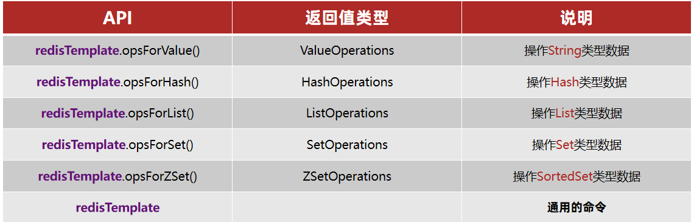

## Redis

### 1 Redis 简介

#### 1.1 Redis的特点

- Redis支持数据的持久化，可以将内存中的数据保持在磁盘中，重启的时候可以再次加载进行使用。
- Redis不仅仅支持简单的key-value类型的数据，同时还提供list，set，zset，hash等数据结构的存储。
- Redis支持数据的备份，即master-slave模式的数据备份。

#### 1.2 Redis 优势

- 性能极高 – Redis能读的速度是110000次/s,写的速度是81000次/s 。
- 丰富的数据类型 – Redis支持二进制案例的 Strings, Lists, Hashes, Sets 及 Ordered Sets 数据类型操作。
- 原子 – Redis的所有操作都是原子性的，同时Redis还支持对几个操作全并后的原子性执行。
- 丰富的特性 – Redis还支持 publish/subscribe, 通知, key 过期等等特性。

#### 1.3 Redis与其他key-value存储有什么不同

- Redis有着更为复杂的数据结构并且提供对他们的原子性操作，这是一个不同于其他数据库的进化路径。Redis的数据类型都是基于基本数据结构的同时对程序员透明，无需进行额外的抽象。
- Redis运行在内存中但是可以持久化到磁盘，所以在对不同数据集进行高速读写时需要权衡内存，应为数据量不能大于硬件内存。在内存数据库方面的另一个优点是， 相比在磁盘上相同的复杂的数据结构，在内存中操作起来非常简单，这样Redis可以做很多内部复杂性很强的事情。 同时，在磁盘格式方面他们是紧凑的以追加的方式产生的，因为他们并不需要进行随机访问。

### 2 Redis 数据类型

Redis支持五种数据类型：string（字符串），hash（哈希），list（列表），set（集合）及zset(sorted set：有序集合)。

#### 2.1 String（字符串）

string是redis最基本的类型，你可以理解成与Memcached一模一样的类型，一个key对应一个value。

string类型是二进制安全的。意思是redis的string可以包含任何数据。比如jpg图片或者序列化的对象 。

string类型是Redis最基本的数据类型，一个键最大能存储512MB。

**实例**

```shell
redis 127.0.0.1:6379> SET name "redis.net.cn"OKredis 127.0.0.1:6379> GET name"redis.net.cn"
```

在以上实例中我们使用了 Redis 的 **SET** 和 **GET** 命令。键为 name，对应的值为redis.net.cn。

**注意：**一个键最大能存储512MB。

#### 2.2 Hash（哈希）

Redis hash 是一个键值对集合。

Redis hash是一个string类型的field和value的映射表，hash特别适合用于存储对象。

**实例**

```shell
redis 127.0.0.1:6379> HMSET user:1 username redis.net.cn password redis.net.cn points 200OKredis 127.0.0.1:6379> HGETALL user:11) "username"2) "redis.net.cn"3) "password"4) "redis.net.cn"5) "points"6) "200"redis 127.0.0.1:6379>
```

以上实例中 hash 数据类型存储了包含用户脚本信息的用户对象。 实例中我们使用了 Redis **HMSET, HEGTALL** 命令，**user:1** 为键值。

每个 hash 可以存储 232 - 1 键值对（40多亿）。

#### 2.3 List（列表）

Redis 列表是简单的字符串列表，按照插入顺序排序。你可以添加一个元素导列表的头部（左边）或者尾部（右边）。

**实例**

```shell
redis 127.0.0.1:6379> lpush redis.net.cn redis(integer) 1redis 127.0.0.1:6379> lpush redis.net.cn mongodb(integer) 2redis 127.0.0.1:6379> lpush redis.net.cn rabitmq(integer) 3redis 127.0.0.1:6379> lrange redis.net.cn 0 101) "rabitmq"2) "mongodb"3) "redis"redis 127.0.0.1:6379>
```

列表最多可存储 232 - 1 元素 (4294967295, 每个列表可存储40多亿)。

#### 2.4 Set（集合）

Redis的Set是string类型的无序集合。

集合是通过哈希表实现的，所以添加，删除，查找的复杂度都是O(1)。

**sadd** 命令

添加一个string元素到,key对应的set集合中，成功返回1,如果元素以及在集合中返回0,key对应的set不存在返回错误。

```
sadd key member
```

**实例**

```shell
redis 127.0.0.1:6379> sadd redis.net.cn redis(integer) 1redis 127.0.0.1:6379> sadd redis.net.cn mongodb(integer) 1redis 127.0.0.1:6379> sadd redis.net.cn rabitmq(integer) 1redis 127.0.0.1:6379> sadd redis.net.cn rabitmq(integer) 0redis 127.0.0.1:6379> smembers redis.net.cn 1) "rabitmq"2) "mongodb"3) "redis"
```

**注意：**以上实例中 rabitmq 添加了两次，但根据集合内元素的唯一性，第二次插入的元素将被忽略。

集合中最大的成员数为 232 - 1 (4294967295, 每个集合可存储40多亿个成员)。

#### 2.5 zset(sorted set：有序集合)

Redis zset 和 set 一样也是string类型元素的集合,且不允许重复的成员。

不同的是每个元素都会关联一个double类型的分数。redis正是通过分数来为集合中的成员进行从小到大的排序。

zset的成员是唯一的,但分数(score)却可以重复。

**zadd** 命令

添加元素到集合，元素在集合中存在则更新对应score

```
zadd key score member 
```

**实例**

```shell
redis 127.0.0.1:6379> zadd redis.net.cn 0 redis(integer) 1redis 127.0.0.1:6379> zadd redis.net.cn 0 mongodb(integer) 1redis 127.0.0.1:6379> zadd redis.net.cn 0 rabitmq(integer) 1redis 127.0.0.1:6379> zadd redis.net.cn 0 rabitmq(integer) 0redis 127.0.0.1:6379> ZRANGEBYSCORE redis.net.cn 0 1000 1) "redis"2) "mongodb"3) "rabitmq"
```

### 3 Redis 命令

本地启动 redis 客户端，打开终端并输入命令 **redis-cli**。该命令会连接本地的 redis 服务。

```
$ redis-cli
```

如果需要在远程 redis 服务上执行命令，同样我们使用的也是 **redis-cli** 命令。

```
$ redis-cli -h host -p port -a password
$ redis-cli -h 127.0.0.1 -p 6379 -a "mypass"
```

#### 3.1 Redis 键命令

| 命令               | 描述                                                | 实例                         |
| :----------------- | :-------------------------------------------------- | ---------------------------- |
| del key            | key 存在时删除 key                                  | del test                     |
| dump key           | 序列化给定 key ，并返回被序列化的值                 | dump test                    |
| exists key         | 检查给定 key 是否存在                               | exists test                  |
| expire key time    | 设置 key 的过期时间，key 过期后将不再可用           | expire test 60               |
| pexpire key time   | 设置 key 的过期时间（毫秒），key 过期后将不再可用   | pexpire test 3600            |
| pexpireat key time | 设置 key 的过期时间（时间戳），key 过期后将不再可用 | pexpireat test 1555555555005 |
| keys pattern       | 查找所有符合给定模式 pattern 的 key                 | keys tes*                    |
| move key db        | 将当前数据库的 key 移动到给定的数据库 db 当中       | move test 1                  |
| persist key        | 移除给定 key 的过期时间，使得 key 永不过期          | persist test                 |
| ttl key            | 以秒为单位返回 key 的剩余过期时间                   | ttl test                     |
| pttl key           | 以毫秒为单位返回 key 的剩余过期时间                 | pttl test                    |
| randomkey          | 从当前数据库中随机返回一个 key                      | randomkey                    |
| rename key key     | 修改 key 的名称                                     | rename name name1            |
| renamenx key key   | 新的 key 不存在时修改 key 的名称                    | rename name name1            |
| type key           | 返回 key 所储存的值的类型                           | type name                    |

#### 3.2 Key的层级结构

Redis没有类似MySQL中的Table的概念，那该如何区分不同类型的key？

例如，需要存储用户.商品信息到redis，有一个用户id是1，有一个商品id恰好也是1，此时如果使用id作为key，那就会冲突了，该怎么办？

可以通过给key添加前缀加以区分，不过这个前缀不是随便加的，有一定的规范：Redis的key允许有多个单词形成层级结构，多个单词之间用':'隔开

```markdown
项目名:业务名:类型ID
```

可以根据自己的需求来删除或添加词条

例如项目名称叫 project，有user和product两种不同类型的数据，我们可以这样定义key：

- user相关的key：**project:user:1**

- product相关的key：**project:product:1**

如果Value是一个Java对象，例如一个User对象，则可以将对象序列化为JSON字符串后存储：

| **KEY**           | **VALUE**                                 |
| ----------------- | ----------------------------------------- |
| project:user:1    | {"id":1, "name": "Jack", "age": 21}       |
| project:product:1 | {"id":1, "name": "小米11", "price": 4999} |

#### 3.3 Redis 字符串(String)命令

| 命令                      | 描述                                                         | 实例                             |
| ------------------------- | ------------------------------------------------------------ | -------------------------------- |
| set key value             | 设置指定 key 的值                                            | set name Tim                     |
| get key                   | 获取指定 key 的值                                            | get name                         |
| setrange key offset value | 用指定的字符串覆盖给定 key 所储存的字符串值，覆盖的位置从偏移量 offset 开始 | setrange name 1 ch               |
| getrange key start end    | 获取存储在指定 key 中字符串的子字符串                        | getrange name 0 -1               |
| getset key value          | 设置指定 key 的值，并返回 key 旧的值                         | getset name Kiven                |
| setbit key offset         | 对 key 所储存的字符串值，设置或清除指定偏移量上的位(bit)     | setbit bit 10086 1               |
| getbit key offset         | 对 key 所储存的字符串值，获取指定偏移量上的位(bit)           | getbit bit 10086                 |
| mset k1 v1 k2 v2 ..       | 同时设置一个或多个 key-value 对                              | mset key1 "Hello" key2 "World"   |
| mget k1 k2 ...            | 返回所有(一个或多个)给定 key 的值                            | mget test1 test2                 |
| setex key time value      | 为指定的 key 设置值及其过期时间。如果 key 已经存在， SETEX 命令将会替换旧的值 | set name 10 Tim                  |
| psetex key time value     | 以毫秒为单位设置 key 的生存时间                              | psetex mykey 1000 "Hello"        |
| setnx key value           | 指定的 key 不存在时，为 key 设置指定的值                     | setnx name Tim                   |
| strlen key                | 获取指定 key 所储存的字符串值的长度                          | strlen name                      |
| msetnx k1 v1 k2 v2 ...    | 所有给定 key 都不存在时，同时设置一个或多个 key-value 对     | msetnx key1 "Hello" key2 "World" |
| incr key                  | 将 key 中储存的数字值增一                                    | incr age                         |
| incrby key value          | 将 key 中储存的数字加上指定的增量值                          | incrby age 2                     |
| incrbyfloat key value     | 将 key 中储存的值加上指定的浮点数增量值                      | incrbyfloat age 0.1              |
| decr key                  | 将 key 中储存的数字值减一                                    | decr age                         |
| decrby key value          | 将 key 所储存的值减去指定的减量值                            | decrby age 2                     |
| append key value          | 为指定的 key 追加值                                          | append name KK                   |

#### 3.4 Redis 哈希(Hash)命令

Redis hash 是一个string类型的field和value的映射表，hash特别适合用于存储对象

| 命令                        | 描述                                             | 实例                                   |
| --------------------------- | ------------------------------------------------ | -------------------------------------- |
| hdel key field              | 删除哈希表 key 中的一个或多个指定字段            | hdel myhash field1                     |
| hexists key field           | 查看哈希表的指定字段是否存在                     | hexists myhash field1                  |
| hget key field              | 返回哈希表中指定字段的值                         | hget myhash field1                     |
| hgetall key                 | 返回哈希表中，所有的字段和值                     | hgetall myhash                         |
| hincrby key field num       | 为哈希表中的字段值加上指定增量值                 | hincrby myhash field 1                 |
| hincrbyfloat key field num  | 为哈希表中的字段值加上指定浮点数增量值           | hincrbyfloat myhash field 0.1          |
| hkeys key                   | 获取哈希表中的所有字段名                         | hkeys myhash                           |
| hlen key                    | 获取哈希表中字段的数量                           | hlen myhash                            |
| hmget key field1 field2 ... | 返回哈希表中，一个或多个给定字段的值             | hmget myhash field1 field2             |
| hmset key field1 value1 ... | 同时将多个 field-value (字段-值)对设置到哈希表中 | hmset myhash field1 "foo" field2 "bar" |
| hset key field value        | 为哈希表中的字段赋值                             | hset myhash field "foo"                |
| hsetnx key field value      | 为哈希表中不存在的的字段赋值                     | hsetnx myhash field "foo"              |
| hvals key                   | 返回哈希表所有字段的值                           | hvals myhash                           |

#### 3.5 Redis 列表(list)命令

列表是简单的字符串列表，按照插入顺序排序。你可以添加一个元素导列表的头部（左边）或者尾部（右边）

| 命令                                             | 描述                                                         | 实例                            |
| ------------------------------------------------ | ------------------------------------------------------------ | ------------------------------- |
| blpop key time                                   | 移出并获取列表的第一个元素                                   | blpop test 10                   |
| brpop key time                                   | 移出并获取列表的最后一个元素                                 | brpop test 10                   |
| brpoplpush key1 key2 time                        | 从列表中弹出一个值，将弹出的元素插入到另外一个列表中并返回它 | brpoplpush test1  test2 1       |
| lindex key index                                 | 通过索引获取列表中的元素                                     | lindex test 0                   |
| linsert key before\|after exists_value new_value | 在列表的元素前或者后插入元素                                 | linsert test before java python |
| llen key                                         | 返回列表的长度                                               | lken test                       |
| lpop key                                         | 移除并返回列表的第一个元素                                   | lpop test                       |
| lpush key value1 value2 ...                      | 将一个或多个值插入到列表头部                                 | lpush test python css           |
| lpushx key value1 value2 ...                     | 将一个或多个值插入到已存在的列表头部                         | lpushx test python css          |
| lrange key start end                             | 返回列表中指定区间内的元素                                   | lrange test 0 -1                |
| lrem key count value                             | 根据参数 COUNT 的值，移除列表中与参数 VALUE 相等的元素       | lrem test 2 java                |
| lset key index value                             | 通过索引来设置元素的值                                       | lset test 1 css                 |
| ltrim key start end                              | 让列表只保留指定区间内的元素，不在指定区间之内的元素都将被删除 | ltrim test 1 3                  |
| rpop key                                         | 移除并返回列表的最后一个元素                                 | rpop key                        |
| rpoplpush source_key new_key                     | 移除列表的最后一个元素，并将该元素添加到另一个列表并返回     | rpoplpush test1 test2           |
| rpush key value1 value2 ...                      | 将一个或多个值插入到列表的尾部                               | rpush test jquery               |
| rpushx key value1 value2 ...                     | 将一个或多个值插入到已存在的列表尾部                         | rpushx key value1 value2 ...    |

#### 3.5 Redis 集合(set)命令

Redis的Set是string类型的无序集合。集合成员是唯一的，这就意味着集合中不能出现重复的数据

| 命令                              | 描述                                                        | 实例                          |
| --------------------------------- | ----------------------------------------------------------- | ----------------------------- |
| sadd key value1 value2 ...        | 将一个或多个成员元素加入到集合中                            | sadd test java                |
| scard key                         | 返回集合中元素的数量                                        | scard test                    |
| sdiff key1 key2                   | 返回给定集合之间的差集                                      | sdiff test1 test2             |
| sdiffstore new_key key1 key2      | 将给定集合之间的差集存储在指定的集合中                      | sdiffstore test3 test1 test2  |
| sinter key1 key2                  | 返回给定所有给定集合的交集                                  | sinter test1 test2            |
| sinterstore new_key key1 key2     | 将给定集合之间的交集存储在指定的集合中                      | sinterstore test3 test1 test2 |
| sismember key value               | 判断成员元素是否是集合的成员                                | sismember test java           |
| smembers key                      | 返回集合中的所有的成员                                      | smembers test                 |
| smove source_key new_key field    | 将指定成员 member 元素从 source 集合移动到 destination 集合 | smove test1 test2 java        |
| spop key                          | 移除并返回集合中的一个随机元素                              | spop test                     |
| srandmember key [count]           | 返回集合中的一个或多个随机元素                              | srandmember test              |
| srem key field                    | 移除集合中的一个或多个成员元素                              | srem test java                |
| sunion key1 key2 ...              | 返回给定集合的并集                                          | sunion test1 test2            |
| sunionstore new_key key1 key2 ... | 将给定集合的并集存储在指定的集合 destination 中             | sunionstore test3 test1 test2 |
| sscan key cursor match            | 用于迭代集合键中的元素                                      | sscan test 0 match t*         |

#### 3.6 Redis 有序集合(sorted set)命令

Redis 有序集合和集合一样也是string类型元素的集合,且不允许重复的成员

| 命令                                            | 描述                                                         | 实例                            |
| ----------------------------------------------- | ------------------------------------------------------------ | ------------------------------- |
| zadd key value1 value2 ...                      | 将一个或多个成员元素及其分数值加入到有序集当中               | zadd test1 1 java 2 python      |
| zcard key                                       | 计算集合中元素的数量                                         | zcard test                      |
| zcount key min max                              | 计算有序集合中指定分数区间的成员数量                         | zcount test 1 2                 |
| zincrby key increment member                    | 对有序集合中指定成员的分数加上增量 increment                 | zincrby myzset 2 "hello"        |
| zinterstore new_key num key1 key2               | 计算给定的一个或多个有序集的交集，其中给定 key 的数量必须以 numkeys 参数指定，并将该交集(结果集)储存到 destination | zinterstore test3 2 test1 test2 |
| zlexcount key min max                           | 在计算有序集合中指定字典区间内成员数量                       |                                 |
| zrange key start stop [WITHSCORES]              | 返回有序集中，指定区间内的成员                               | zrange myzset 0 -1              |
| zrangebylex key start stop [LIMIT offset count] | 通过字典区间返回有序集合的成员                               |                                 |
| zrangebyscore                                   | 返回有序集合中指定分数区间的成员列表                         |                                 |
| zrank key value                                 | 返回有序集中指定成员的索引                                   | zrank test python               |
| zrem key value                                  | 移除有序集中的一个或多个成员，不存在的成员将被忽略           | zrem test java                  |
| zremrangebylex key min max                      | 移除有序集合中给定的字典区间的所有成员                       |                                 |
| zremrangebyrank key start stop                  | 移除有序集中，指定排名(rank)区间内的所有成员                 |                                 |
| zremrangebyscore key min max                    | 移除有序集中，指定分数（score）区间内的所有成员              |                                 |
| zrevrange key start stop                        | 返回有序集中，指定区间内的成员                               | zrevrange test1 0 -1            |
| Zrevrangebyscore key max min                    | 返回有序集中指定分数区间内的所有的成员                       |                                 |
| zrevrank key value                              | 返回有序集中成员的排名                                       |                                 |
| zscore key value                                | 返回有序集中，成员的分数值                                   | zscore test python              |
| zunionstore new_key                             | 计算给定的一个或多个有序集的并集，其中给定 key 的数量必须以 numkeys 参数指定，并将该并集(结果集)储存到 destination |                                 |
| zscan key cursor match count                    | 迭代有序集合中的元素                                         |                                 |

#### 3.7 Redis HyperLogLog命令

Redis HyperLogLog 是用来做基数统计的算法，HyperLogLog 的优点是，在输入元素的数量或者体积非常非常大时，计算基数所需的空间总是固定 的、并且是很小的

基数：比如数据集 {1, 3, 5, 7, 5, 7, 8}， 那么这个数据集的基数集为 {1, 3, 5 ,7, 8}, 基数(不重复元素)为5。 基数估计就是在误差可接受的范围内，快速计算基数

| 命令                 | 描述                                        | 实例                     |
| -------------------- | ------------------------------------------- | ------------------------ |
| pfadd key value1 ... | 将所有元素参数添加到 HyperLogLog 数据结构中 | pfadd keys 1 2 1 3 4 5 4 |
| pfcount key ...      | 返回给定 HyperLogLog 的基数估算值           | pfcount keys             |
| pgmerge              | 将多个 HyperLogLog 合并为一个 HyperLogLog   | pgmerge hll3 hll1 hll2   |

### 4 Java的redis客户端


标记为❤的就是推荐使用的java客户端，包括：

- Jedis和Lettuce：这两个主要是提供了Redis命令对应的API，方便我们操作Redis，而SpringDataRedis又对这两种做了抽象和封装，因此我们后期会直接以SpringDataRedis来学习。
- Redisson：是在Redis基础上实现了分布式的可伸缩的java数据结构，例如Map.Queue等，而且支持跨进程的同步机制：Lock.Semaphore等待，比较适合用来实现特殊的功能需求。

#### 4.1 Jedis

##### 4.1.1 项目测试

1、引入依赖：

```xml
<!--jedis-->
<dependency>
    <groupId>redis.clients</groupId>
    <artifactId>jedis</artifactId>
    <version>3.7.0</version>
</dependency>
<!--单元测试-->
<dependency>
    <groupId>org.junit.jupiter</groupId>
    <artifactId>junit-jupiter</artifactId>
    <version>5.7.0</version>
    <scope>test</scope>
</dependency>
```

2、建立连接

新建一个单元测试类，内容如下：

```java
private Jedis jedis;

@BeforeEach
void setUp() {
    // 1.建立连接
    // jedis = new Jedis("192.168.150.101", 6379);
    jedis = JedisConnectionFactory.getJedis();
    // 2.设置密码
    jedis.auth("123321");
    // 3.选择库
    jedis.select(0);
}
```

3、测试：

```java
@Test
void testString() {
    // 存入数据
    String result = jedis.set("name", "ANNA");
    System.out.println("result = " + result);
    // 获取数据
    String name = jedis.get("name");
    System.out.println("name = " + name);
}

@Test
void testHash() {
    // 插入hash数据
    jedis.hset("user:1", "name", "Jack");
    jedis.hset("user:1", "age", "21");

    // 获取
    Map<String, String> map = jedis.hgetAll("user:1");
    System.out.println(map);
}
```

4、释放资源

```java
@AfterEach
void tearDown() {
    if (jedis != null) {
        jedis.close();
    }
}
```

##### 4.1.2 Jedis连接池

Jedis本身是线程不安全的，并且频繁的创建和销毁连接会有性能损耗，因此推荐使用Jedis连接池代替Jedis的直连方式

1、创建Jedis的连接池

```java
public class JedisConnectionFacotry {

     private static final JedisPool jedisPool;

     static {
         //配置连接池
         JedisPoolConfig poolConfig = new JedisPoolConfig();
         poolConfig.setMaxTotal(8);
         poolConfig.setMaxIdle(8);
         poolConfig.setMinIdle(0);
         poolConfig.setMaxWaitMillis(1000);
         //创建连接池对象
         jedisPool = new JedisPool(poolConfig,
                 "192.168.150.101",6379,1000,"123321");
     }

     public static Jedis getJedis(){
          return jedisPool.getResource();
     }
}
```

**代码说明：**

-  JedisConnectionFacotry：工厂设计模式是实际开发中非常常用的一种设计模式，我们可以使用工厂，去降低代的耦合，比如Spring中的Bean的创建，就用到了工厂设计模式

- 静态代码块：随着类的加载而加载，确保只能执行一次，我们在加载当前工厂类的时候，就可以执行static的操作完成对 连接池的初始化

- 最后提供返回连接池中连接的方法.

2、使用连接池

使用了连接池后，当关闭连接其实并不是关闭，而是将Jedis还回连接池的。

```java
    @BeforeEach
    void setUp(){
        //建立连接
        /*jedis = new Jedis("127.0.0.1",6379);*/
        jedis = JedisConnectionFacotry.getJedis();
         //选择库
        jedis.select(0);
    }

   @AfterEach
    void tearDown() {
        if (jedis != null) {
            jedis.close();
        }
    }
```

#### 4.2 SpringDataRedis

SpringData是Spring中数据操作的模块，包含对各种数据库的集成，其中对Redis的集成模块就叫做SpringDataRedis，官网地址：https://spring.io/projects/spring-data-redis

* 提供了对不同Redis客户端的整合（Lettuce和Jedis）
* 提供了RedisTemplate统一API来操作Redis
* 支持Redis的发布订阅模型
* 支持Redis哨兵和Redis集群
* 支持基于Lettuce的响应式编程
* 支持基于JDK.JSON.字符串.Spring对象的数据序列化及反序列化
* 支持基于Redis的JDKCollection实现

SpringDataRedis中提供了RedisTemplate工具类，其中封装了各种对Redis的操作。并且将不同数据类型的操作API封装到了不同的类型中：



##### 4.2.1 RedisTemplate

RedisTemplate可以接收任意Object作为值写入Redis，但是可读性较差，建议引入jackson转换，自定义RedisTemplate的序列化方式，代码如下：

```java
@Configuration
public class RedisConfig {

    @Bean
    public RedisTemplate<String, Object> redisTemplate(RedisConnectionFactory connectionFactory){
        // 创建RedisTemplate对象
        RedisTemplate<String, Object> template = new RedisTemplate<>();
        // 设置连接工厂
        template.setConnectionFactory(connectionFactory);
        // 创建JSON序列化工具
        GenericJackson2JsonRedisSerializer jsonRedisSerializer = 
            							new GenericJackson2JsonRedisSerializer();
        // 设置Key的序列化
        template.setKeySerializer(RedisSerializer.string());
        template.setHashKeySerializer(RedisSerializer.string());
        // 设置Value的序列化
        template.setValueSerializer(jsonRedisSerializer);
        template.setHashValueSerializer(jsonRedisSerializer);
        // 返回
        return template;
    }
}
```

整体可读性有了很大提升，并且能将Java对象自动的序列化为JSON字符串，并且查询时能自动把JSON反序列化为Java对象。不过，其中记录了序列化时对应的class名称，目的是为了查询时实现自动反序列化。这会带来额外的内存开销。

##### 4.2.2 StringRedisTemplate

SpringDataRedis提供了RedisTemplate的子类：StringRedisTemplate，它的key和value的序列化方式默认就是String方式。


需要手动将对象转换成JSON格式后，以String的形式存储再Redis中。

### 5 Redis实际应用
