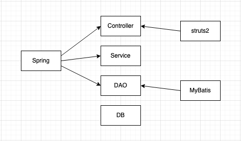

# Spring 5

## 1 Spring IOC工厂

### 1.1 什么是Spring

Spring是一个轻量级的JavaEE解决方案，整合了众多优秀的设计模式

* 轻量级

    1. 对于运行环境是没有额外要求的
    2. 代码移植性比较高：不需要实现额外的接口

* Java EE的解决方案

    传统框架只解决Java EE中某一层的问题

    Spring提供一套完整体系的解决方案

    

* 设计模式的高度封装和整合

    1. 工厂模式
    2. 代理模式
    3. 模版模式
    4. 策略模式

### 1.2 设计模式

广义概念：面向对象设计中，解决特定问题的经典代码

狭义概念：GOF四人帮定义的23种设计模式：工厂、适配器、装饰器、门面、代理、模块...

#### 1.2.1 工厂设计模式

概念：通过工厂类，创建对象

好处：解耦合

耦合：指的是代码间的强关联关系，一方改变会影响另一方

问题：不利于代码维护

简单的理解为，把接口的实现类，硬编码在程序中

#### 1.2.2 简单工厂模式

```java
BeanFactory.java

public class BeanFactory{
	public static UserService getUserService(){
		return new UserServiceImpl();
	}
}

UserService userService = new UserServiceImpl();
UserService userService = BeanFactory.getUserService();
//通过工厂类解耦合
```

#### 1.2.3 反射工厂

对象的创建方式：

1. 直接调用构造方法创建对象 UserService userService = new UserServiceImpl();

2. 通过反射的形式创建对象 可以有效的解耦合

    Class class = Class.forName("com.xxx.UserServiceImpl");

    UserService userService = (UserService)class.newInstance();

3. 通过反射的形式读取properties配置 更加有效的解耦合

#### 1.2.4 通用工厂

反射工厂需要创建多个getXxxService等方法，代码冗余

设计一个通用的工厂

```java
public static Object getBean(String key) {
    Object ret = null;
    try {
        Class<?> clazz = Class.forName(env.getProperty(key));
        ret = clazz.newInstance();
    } catch (Exception e) {
        e.printStackTrace();
    }
    return ret;
}
```

##### 通用工厂的使用方式

1. 定义类型（类）

2. 通过配置文件的配置告知工厂（applicationContext.properties）

    key = value

3. 通过工厂获得类的对象

    Object ret = BeanFactory.getBean("key")

#### 1.2.5 总结

Spring本质：工厂

ApplicationContext(applicationContext.xml)

### 1.3 Spring程序

