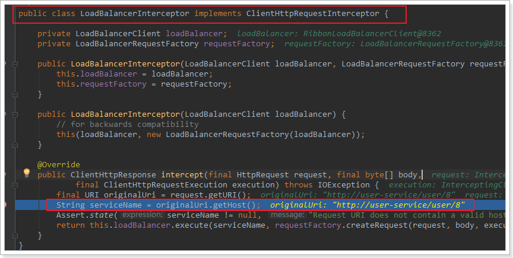
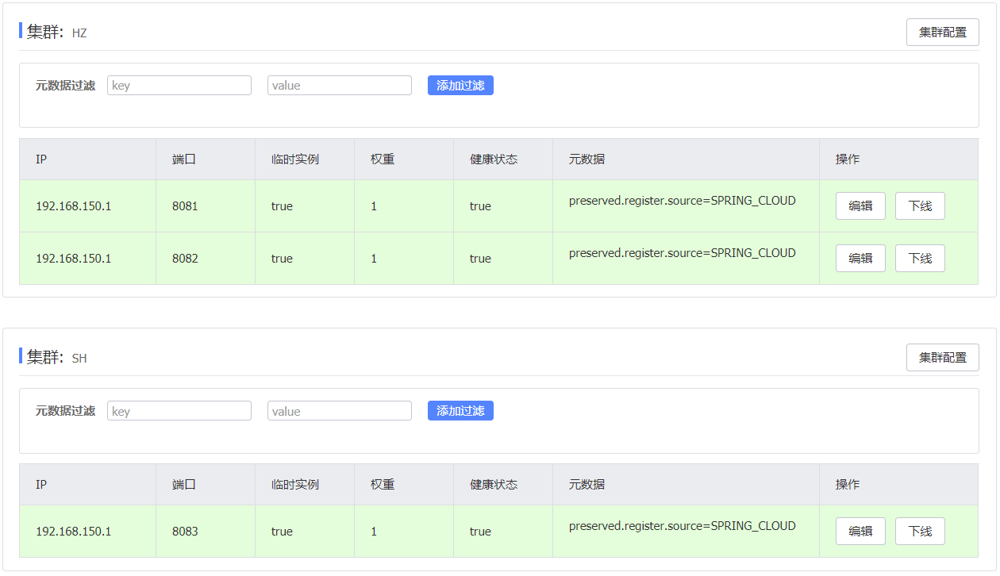
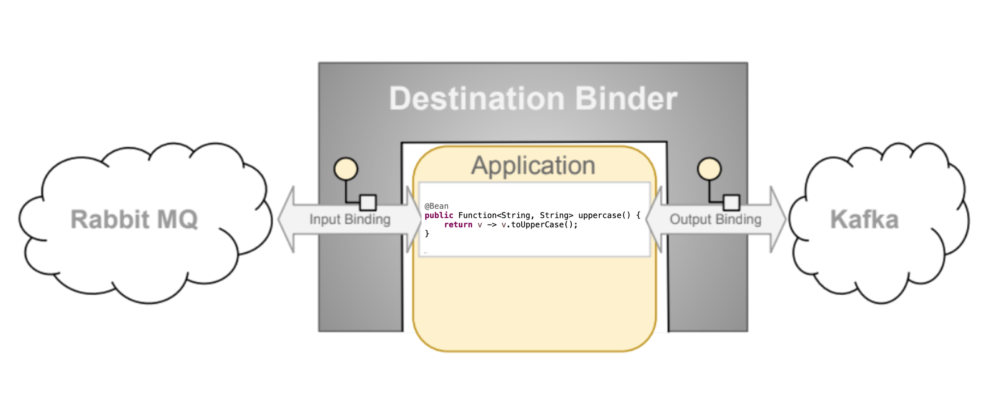

# Spring Cloud

## 1 微服务架构

### 1.1 单体架构


将所有功能集中在一个项目中开发，打成一个包部署

优点：架构简单、部署成本低

缺点：耦合度高（不利于大型项目开发、维护困难、升级困难）

### 1.2 分布式架构


根据业务功能对系统进行拆分，每个业务模块作为独立项目开发，称为一个服务

优点：降低服务耦合、有利于服务升级拓展

分布式架构需要考虑的问题：

* 服务拆分粒度
* 服务集群地址维护
* 服务之间如何实现远程调用
* 服务健康状态如何感知

### 1.3 微服务架构


微服务是一种经过良好设计的分布式架构方案

优点：拆分粒度更小、服务更独立、耦合度更低

缺点：架构非常复杂，运维、监控、部署难度更高

单一职责：微服务拆分粒度更小，每一个服务都应对唯一的业务能力，做到单一职责，避免重复开发

面向服务：微服务对外暴露业务接口

自治：团队独立、技术独立、数据独立、部署独立

隔离性强：服务调用做好隔离、容错、降级，避免出现级联问题

### 1.4 微服务方案

微服务这种方案需要技术框架落地，各大互联网公司都在尝试自己的微服务落地技术如Spring Cloud、Dubbo

|         | Dubbo           | Spring Cloud            | Spring Cloud Alibaba    |
|:-------:|:---------------:|:-----------------------:|:-----------------------:|
| 注册中心    | zookeeper、Redis | Eureka、Consul           | Nacos、Eureka            |
| 服务远程调用  | Dubbo协议         | Feign(http)             | Dubbo、Feign             |
| 配置中心    | 无               | SpringCloudConfig       | SpringCloudConfig、Nacos |
| 服务网关    | 无               | SpringCloudGateway、Zuul | SpringCloudGateway、Zuul |
| 服务监控和保护 | dubbo-admin     | Hystrix                 | Sentinel                |

企业需求：

1. 使用Spring Cloud技术栈、服务接口采用Restful风格、服务调用采用Feign方式
2. 使用Spring Cloud Alibaba技术栈、服务接口采用Restful风格、服务调用采用Feign方式
3. 使用Spring Cloud Alibaba技术栈、服务接口采用Dubbo协议标准、服务调用采用Dubbo方式
4. 使用Dubbo老旧技术体系、服务接口采用Dubbo协议标准、服务调用采用Dubbo方式

### 1.5 Spring Cloud

Spring Cloud是目前国内使用最广泛的微服务框架，集成了各种微服务功能组件，并基于Spring Boot实现了这些组件的自动装配，从而提供良好的开箱即用体验

官方文档：[Spring Cloud](https://spring.io/projects/spring-cloud)

中文文档：[Spring Cloud官方文档中文版](https://www.springcloud.cc/)


## 2 服务拆分及远程调用

### 2.1 服务拆分

服务拆分注意事项

1. 不同微服务需要根据业务模块拆分，做到单一职责，不要重复开发相同业务
2. 微服务数据独立，不要访问其他微服务的数据库
3. 微服务可以将自己的业务暴露为接口，供其他微服务调用


### 2.2 远程调用

#### 2.2.1 案例

修改order-service中的根据id查询订单业务，要求在查询订单的同时，根据订单中包含的userId查询出用户信息，一起返回


因此，需要在order-service中向user-service发起一个http的请求，调用http://localhost:8081/user/{userId}这个接口

#### 2.2.2 注册RestTemplate

```java
@Bean
public RestTemplate restTemplate() {
    return new RestTemplate();
}
```

#### 2.2.3 实现远程调用

```java
// 1.查询订单
Order order = orderMapper.findById(orderId);

// 2.远程查询user
String url = "http://127.0.0.1:8081/user/" + order.getUserId();
User user = restTemplate.getForObject(url, User.class);

// user插入order中
order.setUser(user);
// 4.返回
return order;
```

### 2.3 提供者与消费者

在服务调用关系中，会有两个不同的角色：

**服务提供者**：一次业务中，被其它微服务调用的服务。（提供接口给其它微服务）

**服务消费者**：一次业务中，调用其它微服务的服务。（调用其它微服务提供的接口）


但是，服务提供者与服务消费者的角色并不是绝对的，而是相对于业务而言。

如果服务A调用了服务B，而服务B又调用了服务C，服务B的角色是什么？

- 对于A调用B的业务而言：A是服务消费者，B是服务提供者
- 对于B调用C的业务而言：B是服务消费者，C是服务提供者

因此，服务B既可以是服务提供者，也可以是服务消费者。

## 3 Eureka注册中心

服务提供者user-service部署了多个实例


思考几个问题：

- order-service在发起远程调用的时候，该如何得知user-service实例的ip地址和端口？
- 有多个user-service实例地址，order-service调用时该如何选择？
- order-service如何得知某个user-service实例是否依然健康，是不是已经宕机？

### 3.1 Eureka的结构和作用

这些问题都需要利用SpringCloud中的注册中心来解决，其中最广为人知的注册中心就是Eureka


问题1：order-service如何得知user-service实例地址？

获取地址信息的流程如下：

- user-service服务实例启动后，将自己的信息注册到eureka-server（Eureka服务端）。这个叫服务注册
- eureka-server保存服务名称到服务实例地址列表的映射关系
- order-service根据服务名称，拉取实例地址列表。这个叫服务发现或服务拉取

问题2：order-service如何从多个user-service实例中选择具体的实例？

- order-service从实例列表中利用负载均衡算法选中一个实例地址
- 向该实例地址发起远程调用

问题3：order-service如何得知某个user-service实例是否依然健康，是不是已经宕机？

- user-service会每隔一段时间（默认30秒）向eureka-server发起请求，报告自己状态，称为心跳
- 当超过一定时间没有发送心跳时，eureka-server会认为微服务实例故障，将该实例从服务列表中剔除
- order-service拉取服务时，就能将故障实例排除了

> 注意：一个微服务，既可以是服务提供者，又可以是服务消费者，因此eureka将服务注册、服务发现等功能统一封装到了eureka-client端


### 3.2 搭建eureka-server

#### 3.2.1 创建eureka-server服务


#### 3.2.2 引入eureka依赖

```xml
<dependency>
    <groupId>org.springframework.cloud</groupId>
    <artifactId>spring-cloud-starter-netflix-eureka-server</artifactId>
</dependency>
```

#### 3.2.3 编写启动类

```java
@SpringBootApplication
@EnableEurekaServer
public class EurekaApplication {
    public static void main(String[] args) {
        SpringApplication.run(EurekaApplication.class, args);
    }
}
```

#### 3.2.4编写配置文件

```yaml
server:
  port: 10086
spring:
  application:
    name: eureka-server
eureka:
  client:
    service-url: 
      defaultZone: http://127.0.0.1:10086/eureka
```

### 3.3 服务注册

将user-service注册到eureka-server中

#### 3.3.1 引入依赖

在user-service的pom文件中，引入eureka-client依赖

```java
<dependency>
    <groupId>org.springframework.cloud</groupId>
    <artifactId>spring-cloud-starter-netflix-eureka-client</artifactId>
</dependency>
```

#### 3.3.2 配置文件

在user-service中，修改application.yml文件，添加服务名称、eureka地址

```yaml
spring:
  application:
    name: user-service
eureka:
  client:
    service-url:
      defaultZone: http://127.0.0.1:10086/eureka
```

#### 3.3.3 启动多个实例

复制实例：右键服务->Copy Configuration->Edit Name->VM options(-Dserver.port=8082)->Apply

启动后在eureka-server管理页面中查看服务

### 3.4 服务发现

#### 3.4.1 引入依赖

将order-service的逻辑修改：向eureka-server拉取user-service的信息，实现服务发现。

在order-service的pom文件中，引入eureka-client依赖

```xml
<dependency>
    <groupId>org.springframework.cloud</groupId>
    <artifactId>spring-cloud-starter-netflix-eureka-client</artifactId>
</dependency>
```

#### 3.4.2 配置文件

在order-service中，修改application.yml文件，添加服务名称、eureka地址

```yaml
spring:
  application:
    name: order-service
eureka:
  client:
    service-url:
      defaultZone: http://127.0.0.1:10086/eureka
```

#### 3.4.3 服务拉取和负载均衡

在eureka-server中拉取user-service服务的实例列表，并且实现负载均衡。

在order-service的OrderApplication中，给RestTemplate添加@LoadBalanced注解

```java
@Bean
@LoadBalanced
public RestTemplate restTemplate(){
    return new RestTemplate();
}
```

修改order-service服务中OrderService类中的queryOrderById方法,修改访问的url路径，用服务名代替ip、端口

```java
String url = "http://user-service/user/" + order.getUserId();
User user = restTemplate.getForObject(url, User.class);
```

spring会自动从eureka-server端，根据userservice这个服务名称，获取实例列表，而后完成负载均衡。

## 4 Ribbon负载均衡

### 4.1 负载均衡原理

Spring Cloud底层利用了一个名为Ribbon的组件，来实现负载均衡功能的


**Ribbon本地负载均衡客户端与Nginx服务端负载均衡区别**

Nginx是服务器负载均衡，客户端所有请求都会交给nginx，然后由nginx实现转发请求。即负载均衡是由服务端实现的。Ribbon本地负载均衡，在调用微服务接口时候，会在注册中心上获取注册信息服务列表之后缓存到JVM本地，从而在本地实现RPC远程服务调用技术。

**集中式LB**

即在服务的消费者和提供者之间使用独立的LB设施(可以是硬件，如F5, 也可以是软件，如nginx)，由该设施负责把访问请求通过某种策略转发至服务的提供者;

**进程内LB**

将LB逻辑集成到消费者，消费者从服务注册中心获知有哪些地址可用，然后自己再从这些地址中选择出一个合适的服务器。

**Ribbon就属于进程内LB**，它只是一个类库，集成于消费者进程，消费者通过它来获取到服务提供方的地址。

### 4.2 源码学习

`LoadBalancerInterceptor`会根据service名称，获取到了服务实例的ip和端口。这个类会在对RestTemplate的请求进行拦截，然后从Eureka根据服务id获取服务列表，随后利用负载均衡算法得到真实的服务地址信息，替换服务id。

#### 4.2.1 LoadBalancerIntercepor



可以看到这里的intercept方法，拦截了用户的HttpRequest请求，然后做了几件事：

- `request.getURI()`：获取请求uri，本例中就是 http://user-service/user/8
- `originalUri.getHost()`：获取uri路径的主机名，其实就是服务id，`user-service`
- `this.loadBalancer.execute()`：处理服务id，和用户请求。

这里的`this.loadBalancer`是`LoadBalancerClient`类型

#### 4.2.2 LoadBalancerClient

继续跟入execute方法：


代码是这样的：

- getLoadBalancer(serviceId)：根据服务id获取ILoadBalancer，而ILoadBalancer会拿着服务id去eureka中获取服务列表并保存起来。
- getServer(loadBalancer)：利用内置的负载均衡算法，从服务列表中选择一个。本例中，可以看到获取了8082端口的服务

放行后，再次访问并跟踪，发现获取的是8081： 

果然实现了负载均衡

#### 4.2.3 负载均衡策略IRule

在刚才的代码中，可以看到获取服务使通过`getServer`方法来做负载均衡: 


继续跟入：


继续跟踪源码chooseServer方法，发现这么一段代码：


查看rule是IRule的对象


rule默认值是`RoundRobinRule`，介绍该类为轮询


#### 4.2.4 手写轮询

Provider Controller

```java
@Value("${server.port}")
private String serverPort;

@GetMapping("/lb")
public String getServerPort() {
    return serverPort;
}
```

Consumer

1、将@LoadBalanced注解注释

2、创建MyLoadBalancer接口

```java
public interface LoadBalancer {
    ServiceInstance instance(List<ServiceInstance> serviceInstances);
}
```

3、实现MyLoadBalancer接口

```java
@Component
public class MyLoadBalancer implements LoadBalancer {
    private AtomicInteger integer = new AtomicInteger(0);

    private int getAndIncrement() {
        int current, next;
        do {
            current = this.integer.get();
            next = current >= Integer.MAX_VALUE ? 0 : current + 1;
        } while (!this.integer.compareAndSet(current, next));
        System.out.println("-----访问次数：" + next);
        return next;
    }

    @Override
    public ServiceInstance instance(List<ServiceInstance> serviceInstances) {
        int index = getAndIncrement() % serviceInstances.size();
        return serviceInstances.get(index);
    }
}
```

4、Controller中调用重写的方法

```java
@Resource
private LoadBalancer loadBalancer;

@Resource
private DiscoveryClient discoveryClient;

@GetMapping("/lb")
public String getPaymentLoadBalancer() {
    List<ServiceInstance> instances = discoveryClient.getInstances("CLOUD-PAYMENT-SERVICE");
    if (instances == null || instances.size() <= 0) {
        return null;
    }
    ServiceInstance serviceInstance = loadBalancer.instances(instances);
    URI uri = serviceInstance.getUri();
    return restTemplate.getForObject(uri+"/payments/lb", String.class);
}

```

#### 4.2.5 总结

Spring Cloud Ribbon的底层采用了一个拦截器，拦截了RestTemplate发出的请求，对地址做了修改


基本流程如下：

- 拦截RestTemplate请求http://userservice/user/1
- RibbonLoadBalancerClient会从请求url中获取服务名称，也就是user-service
- DynamicServerListLoadBalancer根据user-service到eureka拉取服务列表
- eureka返回列表，localhost:8081、localhost:8082
- IRule利用内置负载均衡规则，从列表中选择一个，例如localhost:8081
- RibbonLoadBalancerClient修改请求地址，用localhost:8081替代userservice，得到http://localhost:8081/user/1，发起真实请求

### 4.3 负载均衡策略

#### 4.3.1 负载均衡策略

负载均衡的规则都定义在IRule接口中，而IRule有很多不同的实现类：


不同规则的含义如下：

| **内置负载均衡规则类**             | **规则描述**                                                                                                                                                                                                                                                 |
| ------------------------- | -------------------------------------------------------------------------------------------------------------------------------------------------------------------------------------------------------------------------------------------------------- |
| RoundRobinRule            | 简单轮询服务列表来选择服务器。它是Ribbon默认的负载均衡规则。                                                                                                                                                                                                                        |
| AvailabilityFilteringRule | 对以下两种服务器进行忽略：   （1）在默认情况下，这台服务器如果3次连接失败，这台服务器就会被设置为“短路”状态。短路状态将持续30秒，如果再次连接失败，短路的持续时间就会几何级地增加。  （2）并发数过高的服务器。如果一个服务器的并发连接数过高，配置了AvailabilityFilteringRule规则的客户端也会将其忽略。并发连接数的上限，可以由客户端的<clientName>.<clientConfigNameSpace>.ActiveConnectionsLimit属性进行配置。 |
| WeightedResponseTimeRule  | 为每一个服务器赋予一个权重值。服务器响应时间越长，这个服务器的权重就越小。这个规则会随机选择服务器，这个权重值会影响服务器的选择。                                                                                                                                                                                        |
| **ZoneAvoidanceRule**     | 以区域可用的服务器为基础进行服务器的选择。使用Zone对服务器进行分类，这个Zone可以理解为一个机房、一个机架等。而后再对Zone内的多个服务做轮询。                                                                                                                                                                             |
| BestAvailableRule         | 忽略那些短路的服务器，并选择并发数较低的服务器。                                                                                                                                                                                                                                 |
| RandomRule                | 随机选择一个可用的服务器。                                                                                                                                                                                                                                            |
| RetryRule                 | 重试机制的选择逻辑                                                                                                                                                                                                                                                |

默认的实现就是ZoneAvoidanceRule，是一种轮询方案

#### 4.3.2 自定义负载均衡策略

通过定义IRule实现可以修改负载均衡规则，有两种方式：

1. 代码方式：在order-service中的OrderApplication类中，定义一个新的IRule：

```java
@Bean
public IRule randomRule(){
    return new RandomRule();
}
```

2. 配置文件方式：在order-service的application.yml文件中，添加新的配置也可以修改规则：

```yaml
userservice: # 给某个微服务配置负载均衡规则，这里是userservice服务
  ribbon:
    NFLoadBalancerRuleClassName: com.netflix.loadbalancer.RandomRule # 负载均衡规则 
```

> **注意：**一般用默认的负载均衡规则，不做修改。

### 4.4 饥饿加载

Ribbon默认是采用懒加载，即第一次访问时才会去创建LoadBalanceClient，请求时间会很长。

而饥饿加载则会在项目启动时创建，降低第一次访问的耗时，通过下面配置开启饥饿加载：

```yaml
ribbon:
  eager-load:
    enabled: true
    clients: userservice
```

## 5 Nacos注册中心

国内公司一般都推崇阿里巴巴的技术，Spring Cloud Alibaba也为Spring Cloud提供了大量优秀的组件。

[Spring官网](https://spring.io/projects/spring-cloud-alibaba)
[GitHub](https://github.com/alibaba/spring-cloud-alibaba)
[GitHub中文文档](https://github.com/alibaba/spring-cloud-alibaba/blob/master/README-zh.md)
[Spring Cloud Alibaba参考文档](https://spring-cloud-alibaba-group.github.io/github-pages/greenwich/spring-cloud-alibaba.html)
[Spring Cloud Alibaba中文文档](https://spring-cloud-alibaba-group.github.io/github-pages/hoxton/zh-cn/index.html)

### 5.1.认识和安装Nacos

[Nacos](https://nacos.io/)是阿里巴巴的产品，现在是[Spring Cloud](https://spring.io/projects/spring-cloud)中的一个组件。相比[Eureka](https://github.com/Netflix/eureka)功能更加丰富，在国内受欢迎程度较高。


下载nacos：https://github.com/alibaba/nacos/releases

在目录/bin下执行单机模式`sh startup.sh -m standalone`即可启动nacos

浏览器访问`localhost:8848/nacos`输入账户密码nacos即可进入系统

关闭nacos服务使用命令`sh shutdown.sh`

如若端口被占用使用`lsof-i:8848`查看占用端口的进程，使用命令kill

### 5.2 服务注册到Nacos

Nacos是Spring Cloud Alibaba的组件，而Spring Cloud Alibaba也遵循Spring Cloud中定义的服务注册、服务发现规范。因此使用Nacos和使用Eureka对于微服务来说，并没有太大区别。

主要差异在于：

- 依赖不同
- 服务地址不同

#### 5.2.1 引入依赖

在cloud-demo父工程的pom文件中的`<dependencyManagement>`中引入SpringCloudAlibaba的依赖：

```xml
<dependency>
    <groupId>com.alibaba.cloud</groupId>
    <artifactId>spring-cloud-alibaba-dependencies</artifactId>
    <version>2.2.6.RELEASE</version>
    <type>pom</type>
    <scope>import</scope>
</dependency>
```

然后在user-service和order-service中的pom文件中引入nacos-discovery依赖：

```xml
<dependency>
    <groupId>com.alibaba.cloud</groupId>
    <artifactId>spring-cloud-starter-alibaba-nacos-discovery</artifactId>
</dependency>
```

#### 5.2.2 配置nacos地址

在user-service和order-service的application.yml中添加nacos地址：

```yaml
spring:
  cloud:
    nacos:
      server-addr: localhost:8848
```

#### 5.2.3 服务调用测试

重启微服务后，登录nacos管理页面，可以看到微服务信息：


在消费者配置文件中配置生产者微服务地址

```yml
service-url:
  nacos-service-url: http://provider-payment
```

消费者调用时读取配置

```java
@Value("${service-url.nacos-service-url}")
private String serverURL;

@GetMapping("/nacos/{id}")
public String paymentInfo(@PathVariable("id") Integer id) {
    return restTemplate.getForObject(serverURL + "/port/" + id, String.class);
}
```

### 5.3 服务分级存储模型

一个**服务**可以有多个**实例**，例如我们的user-service，可以有:

- 127.0.0.1:8081
- 127.0.0.1:8082
- 127.0.0.1:8083

假如这些实例分布于全国各地的不同机房，例如：

- 127.0.0.1:8081，在上海机房
- 127.0.0.1:8082，在上海机房
- 127.0.0.1:8083，在杭州机房

Nacos就将同一机房内的实例 划分为一个**集群**。

也就是说，user-service是服务，一个服务可以包含多个集群，如杭州、上海，每个集群下可以有多个实例，形成分级模型，如图：


微服务互相访问时，应该尽可能访问同集群实例，因为本地访问速度更快。当本集群内不可用时，才访问其它集群。


杭州机房内的order-service应该优先访问同机房的user-service。

#### 5.3.1 配置区域集群

修改user-service的application.yml文件，添加集群配置：

```yaml
spring:
  cloud:
    nacos:
      server-addr: localhost:8848
      discovery:
        cluster-name: HZ # 集群名称
```

重启两个user-service实例后，我们可以在nacos控制台看到下面结果：


我们再次复制一个user-service启动配置，添加属性：

```sh
-Dserver.port=8083 -Dspring.cloud.nacos.discovery.cluster-name=SH
```

配置如图所示：


启动UserApplication3后再次查看nacos控制台：



#### 5.3.2 同集群优先的负载均衡

默认的`ZoneAvoidanceRule`并不能实现根据同集群优先来实现负载均衡。

因此Nacos中提供了一个`NacosRule`的实现，可以优先从同集群中挑选实例。

1、给order-service配置集群信息

修改order-service的application.yml文件，添加集群配置：

```sh
spring:
  cloud:
    nacos:
      server-addr: localhost:8848
      discovery:
        cluster-name: HZ # 集群名称
```

2、修改负载均衡规则

修改order-service的application.yml文件，修改负载均衡规则：

```yaml
userservice:
  ribbon:
    NFLoadBalancerRuleClassName: com.alibaba.cloud.nacos.ribbon.NacosRule # 负载均衡规则 
```

### 5.4 权重配置

实际部署中会出现这样的场景：

服务器设备性能有差异，部分实例所在机器性能较好，另一些较差，我们希望性能好的机器承担更多的用户请求。

但默认情况下NacosRule是同集群内随机挑选，不会考虑机器的性能问题。

因此，Nacos提供了权重配置来控制访问频率，权重越大则访问频率越高。

在nacos控制台，找到user-service的实例列表，点击编辑，即可修改权重：


在弹出的编辑窗口，修改权重：


> **注意**：如果权重修改为0，则该实例永远不会被访问

### 5.5 Nacos集群架构

Nacos支持三种部署模式

-   单机模式-用于测试和单机试用；
-   集群模式-用于生产环境，确保高可用；
-   多集群模式-用于多数据中心场景。


#### 5.5.1 Nacos持久化

Nacos默认自带的是嵌入式数据库derby，外部数据库默认只支持MySQL。

derby到mysql切换配置步骤：

1.   执行/nacos/conf/nacos-mysql.sql脚本
2.   修改/nacos/conf/application.properties配置

```properties
# 数据源更改为mysql
spring.datasource.platform=mysql

db.num=1
db.url.0=jdbc:mysql://localhost:3306/nacos_config?characterEncoding=utf8&connectTimeout=1000&socketTimeout=3000&autoReconnect=true
db.user=root
db.password=1234
```

重启服务验证是否修改成功。

#### 5.5.2 集群配置

Nginx作为系统反向代理，代理集群中的节点，为保持系统高可用，Nacos集群至少需要三台，MySQL作为数据库保存配置等。

**伪集群**

1、运行/nacos/conf/nacos-mysql.sql脚本；

2、修改/nacos/conf/application.properties中关于数据源的配置；

3、备份cluster.conf，配置集群节点信息（内网地址）；

4、修改启动脚本/nacos/bin/startup.sh(不同版本的配置可能不同)；

```java
while getopts ":m:f:s:p:" opt
do
    case $opt in
        m)
            MODE=$OPTARG;;
        f)
            FUNCTION_MODE=$OPTARG;;
        s)
            SERVER=$OPTARG;;
        p)
            PORT=$OPTARG;;
        ?)
        echo "Unknown parameter"
        exit 1;;
    esac
done

nohup $JAVA -Dserver.port=${PORT} ${JAVA_OPT} nacos.nacos >> ${BASE_DIR}/logs/start.out 2>&1 &
```

备用方案：完成前三步后，可以多次拷贝nacos根目录，修改nacos服务启动端口


5、多次执行脚本`sh startup.sh -p ${port}`开启集群；

6、备份并修改nginx的配置文件 nginx.conf

```conf
upstream cluster{
    server 127.0.0.1:3333;
    server 127.0.0.1:4444;
    server 127.0.0.1:5555;
}

server {
    listen 80;
    server_name localhost;

    location / {
        proxy_pass http://cluster;
    }
}
```

7、启动Nginx测试集群是否可用

```shell
[root@master conf]# nginx -c /usr/local/nginx/conf/nginx.conf
[root@master conf]# nginx -s reload
```

8、查看nacos进程启动数`ps -ef | grep nacos | grep -v grep | wc -l`

```sh
[root@master bin]# ps -ef | grep nacos | grep -v grep | wc -l
3
```

9、Nacos Client服务发现的地址设置为Nginx的代理端口。

### 5.6 Nacos与Eureka的区别

Nacos的服务实例分为两种类型：

- 临时实例：如果实例宕机超过一定时间，会从服务列表剔除，默认的类型。

- 非临时实例：如果实例宕机，不会从服务列表剔除，也可以叫永久实例。

配置一个服务实例为永久实例：

```yaml
spring:
  cloud:
    nacos:
      discovery:
        ephemeral: false # 设置为非临时实例
```

Nacos和Eureka整体结构类似，服务注册、服务拉取、心跳等待，但是也存在一些差异：


- Nacos与eureka的共同点
  
  - 都支持服务注册和服务拉取
  - 都支持服务提供者心跳方式做健康检测

- Nacos与Eureka的区别
  
  - Nacos支持服务端主动检测提供者状态：临时实例采用心跳模式，非临时实例采用主动检测模式
  - 临时实例心跳不正常会被剔除，非临时实例则不会被剔除
  - Nacos支持服务列表变更的消息推送模式，服务列表更新更及时
  - Nacos集群默认采用AP方式，当集群中存在非临时实例时，采用CP模式；Eureka采用AP方式

### 5.7 CAP定理

​	CAP 定理将类似的逻辑应用于分布式系统，即分布式系统只能提供三个期望特征中的两个： ***一致性**、**可用性***和***分区容错***（也就是 CAP 中的 **C**、**A** 和 **P**）。
​	分布式系统是一个[网络](https://www.ibm.com/cn-zh/cloud/learn/networking-a-complete-guide)，同时在多个节点上存储数据（物理机器或[虚拟机](https://www.ibm.com/cn-zh/cloud/learn/virtual-machines)）。 由于所有云应用都是分布式系统，因此在设计云应用时了解 CAP 定理至关重要，这样您就可以选择适当的数据管理系统，以提供应用最需要的特性。

**一致性**

一致性表示所有客户端同时看到相同的数据，无论它们连接到哪个节点。 要做到这一点，每当数据写入一个节点时，就必须立即将其转发或复制到系统中的所有其他节点，然后写操作才被视为“成功”。

**可用性**

可用性表示发出数据请求的任何客户端都会得到响应，即使一个或多个节点宕机。 可用性的另一种状态：分布式系统中的所有工作节点都返回任何请求的有效响应，而不会发生异常。

**分区容错**

*分区*是分布式系统中的通信中断 - 两个节点之间的丢失连接或连接临时延迟。 分区容错意味着集群必须持续工作，无论系统中的节点之间有任何数量的通信中断。

​	[NoSQL（非关系型）数据库](https://www.ibm.com/cloud/learn/nosql-databases)是分布式网络应用的理想之选。 与可垂直扩展的 SQL（关系型）数据库不同，NoSQL 数据库可水平扩展，采用分布式设计 -它们可以在由多个互连节点组成的不断增长的网络中快速扩展。

-   **CP 数据库：**CP 数据库提供一致性和分区容错，以牺牲可用性为代价。 在任何两个节点之间发生分区时，系统必须关闭不一致的节点（即，使其不可用），直至解决该分区为止。
-   **AP 数据库：**AP 数据库提供可用性和分区容错，以牺牲一致性为代价。 当发生分区时，所有节点仍可用，但分区错误端的节点可能会返回较旧版本的数据。（解决分区后，AP 数据库通常会再同步节点，以修复系统中的所有不一致。）
-   **CA 数据库：**CA 数据库在所有节点间提供一致性和可用性。 如果系统中的任意两个节点之间存在分区，但无法提供容错，就无法实现 CA 数据库。

[参考文献](https://writings.sh/post/cap-and-consistency-models)

## 6 Nacos配置管理

Nacos除了可以做注册中心，同样可以做配置管理

### 6.1 统一配置管理

当微服务部署的实例越来越多，达到数十、数百时，逐个修改微服务配置将会极为麻烦，而且很容易出错。所以需要一种统一配置管理方案，可以集中管理所有实例的配置。


Nacos一方面可以将配置集中管理，另一方可以在配置变更时，及时通知微服务，实现配置的热更新。

#### 6.1.1 添加配置文件


然后在弹出的表单中，填写配置信息


> **注意**：项目的核心配置，需要热更新的配置才有放到nacos管理的必要。基本不会变更的一些配置还是保存在微服务本地比较好。

#### 6.1.2 从微服务拉取配置

微服务要拉取nacos中管理的配置，并且与本地的application.yml配置合并，才能完成项目启动。

但如果尚未读取application.yml，又如何得知nacos地址呢？

因此spring引入了一种新的配置文件：bootstrap.yaml文件，会在application.yml之前被读取


1、引入nacos-config依赖

首先，在user-service服务中，引入nacos-config的客户端依赖：

```xml
<!--nacos配置管理依赖-->
<dependency>
    <groupId>com.alibaba.cloud</groupId>
    <artifactId>spring-cloud-starter-alibaba-nacos-config</artifactId>
</dependency>
```

2、添加bootstrap.yaml

然后，在user-service中添加一个bootstrap.yaml文件，内容如下：

```yaml
spring:
  application:
    name: userservice # 服务名称
  profiles:
    active: dev #开发环境，这里是dev 
  cloud:
    nacos:
      server-addr: localhost:8848 # Nacos地址
      config:
        file-extension: yaml # 文件后缀名
```

这里会根据spring.cloud.nacos.server-addr获取nacos地址，再根据

`${spring.application.name}-${spring.profiles.active}.${spring.cloud.nacos.config.file-extension}`作为文件id，来读取配置。


读取nacos配置

在user-service中的UserController中添加业务逻辑，读取pattern.dateformat配置


### 6.2 配置热更新

修改nacos中的配置后，微服务中无需重启即可让配置生效，也就是**配置热更新**。

要实现配置热更新，可以使用两种方式：

**方式一**：

在@Value注入的变量所在类上添加注解@RefreshScope


**方式二**：

使用@ConfigurationProperties注解代替@Value注解。

在user-service服务中，添加一个类，读取patterrn.dateformat属性：

```java
@Component
@Data
@ConfigurationProperties(prefix = "pattern")
public class PatternProperties {
    private String dateformat;
}
```

在UserController中使用该类代替@Value：


### 6.3 配置共享

其实微服务启动时，会去nacos读取多个配置文件，例如：

- `[spring.application.name]-[spring.profiles.active].yaml`，例如：userservice-dev.yaml

- `[spring.application.name].yaml`，例如：userservice.yaml

而`[spring.application.name].yaml`不包含环境，因此可以被多个环境共享。

1、添加一个环境共享配置

在nacos中添加userservice.yaml文件


2、在user-service中读取共享配置

在user-service服务中，修改PatternProperties类，读取新添加的属性


在user-service服务中，修改UserController，添加一个方法


3、使用不同的profile运行两个UserApplication


这样，UserApplication(8081)使用的profile是dev，UserApplication2(8082)使用的profile是test。

启动UserApplication和UserApplication2

访问http://localhost:8081/user/prop，结果：


访问http://localhost:8082/user/prop，结果：


可以看出来，不管是dev，还是test环境，都读取到了envSharedValue这个属性的值。

4、配置共享的优先级

当nacos、服务本地同时出现相同属性时，优先级有高低之分：


### 6.4 环境隔离

Nacos提供了namespace来实现环境隔离功能。

- nacos中可以有多个namespace
- namespace下可以有group、service等
- 不同namespace之间相互隔离，例如不同namespace的服务互相不可见


nacos使用**Namespace+Group+Data lD**使不同配置文件在某个工程中里生效，类似Java里面的package名和类名最外层的namespace是可以用于区分部署环境的，Group和DatalD逻辑上区分两个目标对象。


默认情况：Namespace=public，Group=DEFAULT_GROUP，默认Cluster是DEFAULT

-   Nacos默认的Namespace是public，Namespace主要用来实现隔离。
    -   比方说现在有三个环境：开发、测试、生产环境，我们就可以创建三个Namespace，不同的Namespace之间是隔离的。
-   Group默认是DEFAULT_GROUP，Group可以把不同的配置文件划分到同一个分组里面去
-   Service就是微服务:一个Service可以包含多个Cluster (集群)，Nacos默认Cluster是DEFAULT，Cluster是对指定微服务的一个虚拟划分。
    -   比方说为了容灾，将Service微服务分别部署在了杭州机房和广州机房，这时就可以给杭州机房的Service微服务起一个集群名称(HZ) ，给广州机房的Service微服务起一个集群名称(GZ)，还可以尽量让同一个机房的微服务互相调用，以提升性能。
-   最后是Instance，就是微服务的实例。

#### 6.4.1 namespace

默认情况下，所有service、data、group都在同一个namespace，名为public：


点击页面新增按钮，添加一个namespace：


然后，填写表单：


就能在页面看到一个新的namespace：


给微服务配置namespace只能通过修改配置来实现。

例如，修改order-service的application.yml文件：

```yaml
spring:
  cloud:
    nacos:
      server-addr: localhost:8848
      discovery:
        cluster-name: HZ
        namespace: 492a7d5d-237b-46a1-a99a-fa8e98e4b0f9 # 命名空间，填ID
```

重启order-service后，访问控制台，可以看到下面的结果：


此时访问order-service，因为namespace不同，会导致找不到userservice，控制台会报错：


#### 6.4.2 group


在nacos图形界面控制台上面新建配置文件


bootstrap+application

在config下增加一条group的配置即可。可配置为DEV_GROUP或TEST GROUP


## 7 Feign远程调用

Feign是一个声明式的http客户端，官方地址：https://github.com/OpenFeign/feign

其作用就是帮助我们优雅的实现http请求的发送

### 7.1 Feign替代RestTemplate

1、引入依赖

在order-service服务的pom文件中引入feign的依赖：

```xml
<dependency>
    <groupId>org.springframework.cloud</groupId>
    <artifactId>spring-cloud-starter-openfeign</artifactId>
</dependency>
```

2、添加注解

在order-service的启动类添加注解开启Feign的功能：


3、编写Feign的客户端

在order-service中新建一个接口，内容如下：

```java
package cn.itcast.order.client;

import cn.itcast.order.pojo.User;
import org.springframework.cloud.openfeign.FeignClient;
import org.springframework.web.bind.annotation.GetMapping;
import org.springframework.web.bind.annotation.PathVariable;

@FeignClient("userservice")
public interface UserClient {
    @GetMapping("/user/{id}")
    User findById(@PathVariable("id") Long id);
}
```

这个客户端主要是基于SpringMVC的注解来声明远程调用的信息，比如：

- 服务名称：userservice
- 请求方式：GET
- 请求路径：/user/{id}
- 请求参数：Long id
- 返回值类型：User

这样，Feign就可以帮助我们发送http请求，无需自己使用RestTemplate来发送了。

4、测试

修改order-service中的OrderService类中的queryOrderById方法，使用Feign客户端代替RestTemplate：


5、总结

使用Feign的步骤：

1. 引入依赖

2. 添加@EnableFeignClients注解

3. 编写FeignClient接口

4. 使用FeignClient中定义的方法代替RestTemplate

### 7.2 自定义配置

Feign可以支持很多的自定义配置，如下表所示：

| 类型                     | 作用       | 说明                                |
| ---------------------- | -------- | --------------------------------- |
| **feign.Logger.Level** | 修改日志级别   | 包含四种不同的级别：NONE、BASIC、HEADERS、FULL |
| feign.codec.Decoder    | 响应结果的解析器 | http远程调用的结果做解析，例如解析json字符串为java对象 |
| feign.codec.Encoder    | 请求参数编码   | 将请求参数编码，便于通过http请求发送              |
| feign.Contract         | 支持的注解格式  | 默认是SpringMVC的注解                   |
| feign.Retryer          | 失败重试机制   | 请求失败的重试机制，默认是没有，不过会使用Ribbon的重试    |

一般情况下，默认值就能满足我们使用，如果要自定义时，只需要创建自定义的@Bean覆盖默认Bean即可。

下面以日志为例来演示如何自定义配置。

#### 7.2.1 配置文件方式

基于配置文件修改feign的日志级别可以针对单个服务：

```yaml
feign:  
  client:
    config: 
      userservice: # 针对某个微服务的配置
        loggerLevel: FULL #  日志级别 也可以针对所有服务：
```

```yaml
feign:  
  client:
    config: 
      default: # 这里用default就是全局配置，如果是写服务名称，则是针对某个微服务的配置
        loggerLevel: FULL #  日志级别 
```

而日志的级别分为四种：

- NONE：不记录任何日志信息，这是默认值。
- BASIC：仅记录请求的方法，URL以及响应状态码和执行时间
- HEADERS：在BASIC的基础上，额外记录了请求和响应的头信息
- FULL：记录所有请求和响应的明细，包括头信息、请求体、元数据。

#### 7.2.2 Java代码方式

也可以基于Java代码来修改日志级别，先声明一个类，然后声明一个Logger.Level的对象：

```java
public class DefaultFeignConfiguration  {
    @Bean
    public Logger.Level feignLogLevel(){
        return Logger.Level.BASIC; // 日志级别为BASIC
    }
}
```

如果要**全局生效**，将其放到启动类的@EnableFeignClients这个注解中：

```java
@EnableFeignClients(defaultConfiguration = DefaultFeignConfiguration .class) 
```

如果是**局部生效**，则把它放到对应的@FeignClient这个注解中：

```java
@FeignClient(value = "userservice", configuration = DefaultFeignConfiguration .class) 
```

### 7.3 Feign使用优化

Feign底层发起http请求，依赖于其它的框架。其底层客户端实现包括：

* URLConnection：默认实现，不支持连接池

* Apache HttpClient ：支持连接池

* OKHttp：支持连接池

因此提高Feign的性能主要手段就是使用**连接池**代替默认的URLConnection。

1、引入依赖

在order-service的pom文件中引入Apache的HttpClient依赖：

```xml
<!--httpClient的依赖 -->
<dependency>
    <groupId>io.github.openfeign</groupId>
    <artifactId>feign-httpclient</artifactId>
</dependency>
```

2、配置连接池

在order-service的application.yml中添加配置：

```yaml
feign:
  client:
    config:
      default: # default全局的配置
        loggerLevel: BASIC # 日志级别，BASIC就是基本的请求和响应信息
  httpclient:
    enabled: true # 开启feign对HttpClient的支持
    max-connections: 200 # 最大的连接数
    max-connections-per-route: 50 # 每个路径的最大连接数
```

接下来，在FeignClientFactoryBean中的loadBalance方法中打断点：


Debug方式启动order-service服务，可以看到这里的client，底层就是Apache HttpClient：


总结，Feign的优化：

1.日志级别尽量用basic

2.使用HttpClient或OKHttp代替URLConnection

①  引入feign-httpClient依赖

②  配置文件开启httpClient功能，设置连接池参数

### 7.4 实战

简化Feign

#### 7.4.1 继承方式

一样的代码可以通过继承来共享：

1、定义一个API接口，利用定义方法，并基于SpringMVC注解做声明。

2、Feign客户端和Controller都集成改接口


优点：

- 简单
- 实现了代码共享

缺点：

- 服务提供方、服务消费方紧耦合

- 参数列表中的注解映射并不会继承，因此Controller中必须再次声明方法、参数列表、注解

#### 7.4.2 抽取方式

将Feign的Client抽取为独立模块，并且把接口有关的POJO、默认的Feign配置都放到这个模块中，提供给所有消费者使用。

例如，将UserClient、User、Feign的默认配置都抽取到一个feign-api包中，所有微服务引用该依赖包，即可直接使用。


1、抽取

首先创建一个module，命名为feign-api

在feign-api中然后引入feign的starter依赖

```xml
<dependency>
    <groupId>org.springframework.cloud</groupId>
    <artifactId>spring-cloud-starter-openfeign</artifactId>
</dependency>
```

将order-service中编写的UserClient、User、DefaultFeignConfiguration都复制到feign-api项目中

2、在order-service中使用feign-api

首先，删除order-service中的UserClient、User、DefaultFeignConfiguration等类或接口。

在order-service的pom文件中中引入feign-api的依赖：

```xml
<dependency>
    <groupId>cn.itcast.demo</groupId>
    <artifactId>feign-api</artifactId>
    <version>1.0</version>
</dependency>
```

修改order-service中的所有与上述三个组件有关的导包部分，改成导入feign-api中的包

3、重启测试

重启后，发现服务报错了：


这是因为UserClient现在在cn.itcast.feign.clients包下，

而order-service的@EnableFeignClients注解是在cn.itcast.order包下，不在同一个包，无法扫描到UserClient。

4、解决扫描包问题

方式一：

指定Feign应该扫描的包：

```java
@EnableFeignClients(basePackages = "cn.itcast.feign.clients")
```

方式二：

指定需要加载的Client接口：

```java
@EnableFeignClients(clients = {UserClient.class})
```

### 7.5 OpenFeign

OpenFeign是Spring Cloud在Feign的基础上支持了SpringMVC的注解，如@RequesMapping等。OpenFeign的@Feignclient可以解析SpringMVc的@RequestMapping注解下的接口，并通过动态代理的方式产生实现类，实现类中做负载均衡并调用其他服务。

```xml
<!--openfeign-->
<dependency>
    <groupId>org.springframework.cloud</groupId>
    <artifactId>spring-cloud-starter-openfeign</artifactId>
</dependency>
```

application.yml

```yml
server:
  port: 8000

spring:
  application:
    name: cloud-consumer-feign-order

eureka:
  client:
    register-with-eureka: true
    service-url:
      defaultZone: http://localhost:7001/eureka
    fetch-registry: true
```

在启动类上添加@EnableFeignClients注解

创建Service类，调用提供者的方法

```java
@Component
@FeignClient(value = "CLOUD-PAYMENT-SERVICE")
public interface PaymentFeignService {

    @GetMapping(value = "/payment/get/{id}")
    public CommonResult<Payment> getPaymentById(@PathVariable("id") Long id);
}
```

#### 7.5.1 OpenFeign的超时控制

消费者默认等待响应时间为1秒，超过时间`feign.RetryableException:Read timed out executing GET http://CLOUD-PAYMENT-SERVCE/payment/feign/timeout`异常

在YML文件里开启OpenFeign客户端超时控制

```yml
#设置feign客户端超时时间(OpenFeign默认支持ribbon)(单位：毫秒)
ribbon:
  #指的是建立连接所用的时间，适用于网络状况正常的情况下,两端连接所用的时间
  ReadTimeout: 5000
  #指的是建立连接后从服务器读取到可用资源所用的时间
  ConnectTimeout: 5000
```

#### 7.5.2 日志增强

**日志级别**

- NONE：默认的，不显示任何日志;
- BASIC：仅记录请求方法、URL、响应状态码及执行时间;
- HEADERS：除了BASIC中定义的信息之外，还有请求和响应的头信息;
- FULL：除了HEADERS中定义的信息之外，还有请求和响应的正文及元数据。

配置日志bean

```java
@Configuration
public class FeignConfig {

    @Bean
    Logger.Level feignLoggerLevel(){
        return Logger.Level.FULL;
    }
}
```

开启日志的Feign客户端

```yml
logging:
  level:
    # feign日志以什么级别监控哪个接口
    com.frx01.springcloud.service.PaymentFeignService: debug
```

## 8 Gateway服务网关

Spring Cloud Gateway 是 Spring Cloud 的一个全新项目，该项目是基于 Spring 5.0，Spring Boot 2.0 和 Project Reactor 等响应式编程和事件流技术开发的网关，它旨在为微服务架构提供一种简单有效的统一的 API 路由管理方式。

### 8.1 为什么需要网关

Gateway网关是微服务的守门神，所有微服务的统一入口。

网关的**核心功能特性**：请求路由、权限控制、限流

架构图：


**权限控制**：网关作为微服务入口，需要校验用户是是否有请求资格，如果没有则进行拦截。

**路由和负载均衡**：一切请求都必须先经过gateway，但网关不处理业务，而是根据某种规则，把请求转发到某个微服务，这个过程叫做路由。当然路由的目标服务有多个时，还需要做负载均衡。

**限流**：当请求流量过高时，在网关中按照下流的微服务能够接受的速度来放行请求，避免服务压力过大。

在SpringCloud中网关的实现包括两种：

* gateway
- zuul

Zuul是基于Servlet的实现，属于阻塞式编程。而Spring Cloud Gateway则是基于Spring5中提供的WebFlux，属于响应式编程的实现，具备更好的性能。

#### 8.1.1 非阻塞异步模型

SpringCloud Gateway具有如下特性：

1. 基于Spring Framework 5，Project Reactor和Spring Boot 2.0进行构建；
2. 动态路由：能够匹配任何请求属性；
3. 可以对路由指定Predicate (断言)和Filter(过滤器)；
4. 集成Hystrix的断路器功能；
5. 集成Spring Cloud 服务发现功能；
6. 易于编写的Predicate (断言)和Filter(过滤器)；
7. 请求限流功能；
8. 支持路径重写。

SpringCloud Gateway与Zuul的区别：

1. 在SpringCloud Finchley正式版之前，Spring Cloud推荐的网关是Netflix提供的Zuul；
2. Zuul 1.x，是一个基于阻塞I/O的API Gateway；
3. Zuul 1.x基于Servlet 2.5使用阻塞架构它不支持任何长连接(如WebSocket)Zuul的设计模式和Nginx较像，每次I/О操作都是从工作线程中选择一个执行，请求线程被阻塞到工作线程完成，但是差别是Nginx用C++实现，Zuul用Java实现，而JVM本身会有第-次加载较慢的情况，使得Zuul的性能相对较差；
4. Zuul 2.x理念更先进，想基于Netty非阻塞和支持长连接，但SpringCloud目前还没有整合。Zuul .x的性能较Zuul 1.x有较大提升。在性能方面，根据官方提供的基准测试,Spring Cloud Gateway的RPS(每秒请求数)是Zuul的1.6倍；
5. Spring Cloud Gateway建立在Spring Framework 5、Project Reactor和Spring Boot2之上，使用非阻塞API；
6. Spring Cloud Gateway还支持WebSocket，并且与Spring紧密集成拥有更好的开发体验。

**Zuul1.x模型**

Springcloud中所集成的Zuul版本，采用的是Tomcat容器，使用的是传统的Serviet IO处理模型。

Servlet的生命周期？servlet由servlet container进行生命周期管理。

- container启动时构造servlet对象并调用servlet init()进行初始化；
- container运行时接受请求，并为每个请求分配一个线程（一般从线程池中获取空闲线程）然后调用service)；
- container关闭时调用servlet destory()销毁servlet。


上述模式的**缺点**：

Servlet是一个简单的网络IO模型，当请求进入Servlet container时，Servlet container就会为其绑定一个线程，在**并发不高的场景下**这种模型是适用的。但是一旦高并发(如抽风用Jmeter压)，线程数量就会上涨，而线程资源代价是昂贵的（上线文切换，内存消耗大）严重影响请求的处理时间。在一些简单业务场景下，不希望为每个request分配一个线程，只需要1个或几个线程就能应对极大并发的请求，这种业务场景下servlet模型没有优势。

所以Zuul 1.X是**基于servlet之上的一个阻塞式处理模型**，即Spring实现了处理所有request请求的一个servlet (DispatcherServlet)并由该servlet阻塞式处理处理。所以SpringCloud Zuul无法摆脱servlet模型的弊端。

**Gateway模型**

WebFlux是什么？[官方文档](https://docs.spring.io/spring-framework/docs/current/reference/html/web-reactive.html#spring-webflux)

传统的Web框架，比如说: Struts2，SpringMVC等都是基于Servlet APl与Servlet容器基础之上运行的。

但是在Servlet3.1之后有了异步非阻塞的支持。而WebFlux是一个典型非阻塞异步的框架，它的核心是基于Reactor的相关API实现的。相对于传统的web框架来说，它可以运行在诸如Netty，Undertow及支持Servlet3.1的容器上。非阻塞式+函数式编程(Spring 5必须让你使用Java 8)。

Spring WebFlux是Spring 5.0 引入的新的响应式框架，区别于Spring MVC，它不需要依赖Servlet APl，它是完全异步非阻塞的，并且基于Reactor来实现响应式流规范。

#### 8.1.2 GateWay工作流程

1. Route(路由) - 路由是构建网关的基本模块,它由ID,目标URI,一系列的断言和过滤器组成,如断言为true则匹配该路由；
2. Predicate(断言) - 参考的是Java8的java.util.function.Predicate，开发人员可以匹配HTTP请求中的所有内容(例如请求头或请求参数),如果请求与断言相匹配则进行路由；
3. Filter(过滤) - 指的是Spring框架中GatewayFilter的实例,使用过滤器,可以在请求被路由前或者之后对请求进行修改。


> Clients make requests to Spring Cloud Gateway. If the Gateway Handler Mapping determines that a request matches a route, it is sent to the Gateway Web Handler. This handler runs the request through a filter chain that is specific to the request. The reason the filters are divided by the dotted line is that filters can run logic both before and after the proxy request is sent. All “pre” filter logic is executed. Then the proxy request is made. After the proxy request is made, the “post” filter logic is run.

客户端向Spring Cloud Gateway发出请求。然后在Gateway Handler Mapping 中找到与请求相匹配的路由，将其发送到GatewayWeb Handler。

Handler再通过指定的过滤器链来将请求发送到我们实际的服务执行业务逻辑，然后返回。

过滤器之间用虚线分开是因为过滤器可能会在发送代理请求之前(“pre”)或之后(“post"）执行业务逻辑。

Filter在“pre”类型的过滤器可以做参数校验、权限校验、流量监控、日志输出、协议转换等，在“post”类型的过滤器中可以做响应内容、响应头的修改，日志的输出，流量监控等有着非常重要的作用。

**核心逻辑**：路由转发 + 执行过滤器链。

### 8.2 使用Gateway

#### 8.2.1 nacos使用Gateway

1、创建SpringBoot工程gateway，引入网关依赖

引入依赖：

```xml
<!--网关-->
<dependency>
    <groupId>org.springframework.cloud</groupId>
    <artifactId>spring-cloud-starter-gateway</artifactId>
</dependency>
<!--nacos服务发现依赖-->
<dependency>
    <groupId>com.alibaba.cloud</groupId>
    <artifactId>spring-cloud-starter-alibaba-nacos-discovery</artifactId>
</dependency>
```

2、编写启动类

```java
@SpringBootApplication
public class GatewayApplication {

    public static void main(String[] args) {
        SpringApplication.run(GatewayApplication.class, args);
    }
}
```

3、编写基础配置和路由规则

```yaml
erver:
  port: 10010 # 网关端口
spring:
  application:
    name: gateway # 服务名称
  cloud:
    nacos:
      server-addr: localhost:8848 # nacos地址
    gateway:
      routes: # 网关路由配置
        - id: user-service # 路由id，自定义，只要唯一即可
          # uri: http://127.0.0.1:8081 # 路由的目标地址 http就是固定地址
          uri: lb://userservice # 路由的目标地址 lb就是负载均衡，后面跟服务名称
          predicates: # 路由断言，也就是判断请求是否符合路由规则的条件
            - Path=/user/** # 这个是按照路径匹配，只要以/user/开头就符合要求
```

4、启动网关服务进行测试

重启网关，访问http://localhost:10010/user/1时，符合`/user/**`规则，请求转发到uri：http://userservice/user/1

总结：

网关搭建步骤：

1. 创建项目，引入nacos服务发现和gateway依赖

2. 配置application.yml，包括服务基本信息、nacos地址、路由

路由配置包括：

1. 路由id：路由的唯一标示

2. 路由目标（uri）：路由的目标地址，http代表固定地址，lb代表根据服务名负载均衡

3. 路由断言（predicates）：判断路由的规则，

4. 路由过滤器（filters）：对请求或响应做处理


#### 8.2.2 Eureka使用Gateway

引入依赖(不能引入Spring-boot-starter-web)

```xml
<dependency>
    <groupId>org.springframework.cloud</groupId>
    <artifactId>spring-cloud-starter-gateway</artifactId>
</dependency>

<dependency>
    <groupId>org.springframework.cloud</groupId>
    <artifactId>spring-cloud-starter-netflix-eureka-client</artifactId>
</dependency>
```

配置文件方式配置网关

```yml
spring:
  application:
    name: cloud-gateway
  cloud:
    gateway:
      routes:
        - id: payment_route
          uri: http://localhost:8001
          predicates:
            - Path=/payments/**

eureka:
  instance:
    hostname: cloud-gateway-service
  client:
    service-url:
      defaultZone: http://localhost:8000/eureka
    register-with-eureka: true
    fetch-registry: true
```

配置类方式配置网关

```java
@Configuration
public class GatewayConfig {
    @Bean
    public RouteLocator customRouteLocator(RouteLocatorBuilder builder) {
        RouteLocatorBuilder.Builder routes = builder.routes();
        routes.route("path_route", r -> r.path("/guonei").uri("http://news.baidu.com/")).build();
        return routes.build();
    }
}

```

**配置动态路由**

需要注意的是uri的协议为`lb`，表示启用Gateway的负载均衡功能。

```yml
cloud:
    gateway:
      discovery:
        locator:
          enabled: true #开启从注册中心动态创建路由的功能，利用微服务名进行路由
      routes:
        - id: payment_route #payment_route     #路由的ID，没有固定规则但要求唯一，建议配合服务名
          #uri: http://localhost:8001          #匹配后提供服务的路由地址
          uri: lb://cloud-payment-service      #匹配后提供服务的路由地址
          predicates:
            - Path=/payment/get/**             # 断言，路径相匹配的进行路由
```

### 8.3 断言工厂

[官方文档](https://cloud.spring.io/spring-cloud-static/spring-cloud-gateway/2.2.1.RELEASE/reference/html/#gateway-request-predicates-factories)

**Route Predicate Factories**

> Spring Cloud Gateway matches routes as part of the Spring WebFlux `HandlerMapping` infrastructure. Spring Cloud Gateway includes many built-in `route predicate factories`. All of these predicates match on different attributes of the HTTP request. You can combine multiple route predicate factories with logical `and` statements. 

Spring Cloud Gateway将路由匹配作为Spring WebFlux HandlerMapping基础架构的一部分。

Spring Cloud Gateway包括许多内置的Route Predicate工厂。所有这些Predicate都与HTTP请求的不同属性匹配。多个RoutePredicate工厂可以进行组合。

Spring Cloud Gateway创建Route 对象时，使用RoutePredicateFactory 创建 Predicate对象，Predicate 对象可以赋值给Route。Spring Cloud Gateway包含许多内置的Route Predicate Factories。

所有这些谓词都匹配HTTP请求的不同属性。多种谓词工厂可以组合，并通过逻辑and。

> **predicate**
>
> 美: ['predɪkeɪt] 英: ['predɪkət]
>
> **v.** 断言；使基于；使以…为依据；表明
>
> **adj.** 述语的；谓项的
>
> **n.** 谓语（句子成分，对主语加以陈述，如 John went home 中的 went home）

在配置文件中写的断言规则只是字符串，这些字符串会被Predicate Factory读取并处理，转变为路由判断的条件

例如Path=/user/**是按照路径匹配，这个规则是由

`org.springframework.cloud.gateway.handler.predicate.PathRoutePredicateFactory`类来

处理的，像这样的断言工厂在SpringCloudGateway还有十几个:

| **名称**     | **说明**            | **示例**                                                                                                   |
| ---------- | ----------------- | -------------------------------------------------------------------------------------------------------- |
| After      | 是某个时间点后的请求        | -  After=2037-01-20T17:42:47.789-07:00[America/Denver]                                                   |
| Before     | 是某个时间点之前的请求       | -  Before=2031-04-13T15:14:47.433+08:00[Asia/Shanghai]                                                   |
| Between    | 是某两个时间点之前的请求      | -  Between=2037-01-20T17:42:47.789-07:00[America/Denver],  2037-01-21T17:42:47.789-07:00[America/Denver] |
| Cookie     | 请求必须包含某些cookie    | - Cookie=chocolate, ch.p                                                                                 |
| Header     | 请求必须包含某些header    | - Header=X-Request-Id, \d+                                                                               |
| Host       | 请求必须是访问某个host（域名） | -  Host=**.somehost.org,**.anotherhost.org                                                               |
| Method     | 请求方式必须是指定方式       | - Method=GET,POST                                                                                        |
| Path       | 请求路径必须符合指定规则      | - Path=/red/{segment},/blue/**                                                                           |
| Query      | 请求参数必须包含指定参数      | - Query=name, Jack或者-  Query=name                                                                        |
| RemoteAddr | 请求者的ip必须是指定范围     | - RemoteAddr=192.168.1.1/24                                                                              |
| Weight     | 权重处理              |                                                                                                          |

获取时间戳字符串

```java
ZonedDateTime zbj = ZonedDateTime.now(); // 默认时区
System.out.println(zbj);
//2022-08-20T21:02:40.570+08:00[Asia/Shanghai]
```

Predicate就是为了实现一组匹配规则，完全匹配规则才响应对应uri

### 8.4 过滤器工厂

[官方文档](https://cloud.spring.io/spring-cloud-static/spring-cloud-gateway/2.2.1.RELEASE/reference/html/#gatewayfilter-factories)

> Route filters allow the modification of the incoming HTTP request or outgoing HTTP response in some manner. Route filters are scoped to a particular route. Spring Cloud Gateway includes many built-in GatewayFilter Factories.

路由过滤器可用于修改进入的HTTP请求和返回的HTTP响应，路由过滤器只能指定路由进行使用。Spring Cloud Gateway内置了多种路由过滤器，他们都由GatewayFilter的工厂类来产生。

Spring Cloud Gateway的Filter:

生命周期：

- pre
- post

GatewayFilter是网关中提供的一种过滤器，可以对进入网关的请求和微服务返回的响应做处理：


#### 8.4.1 路由过滤器的种类

Spring提供了31种不同的路由过滤器工厂。例如：

| **名称**               | **说明**         |
| -------------------- | -------------- |
| AddRequestHeader     | 给当前请求添加一个请求头   |
| RemoveRequestHeader  | 移除请求中的一个请求头    |
| AddResponseHeader    | 给响应结果中添加一个响应头  |
| RemoveResponseHeader | 从响应结果中移除有一个响应头 |
| RequestRateLimiter   | 限制请求的流量        |

#### 3.4.2 请求头过滤器

下面以AddRequestHeader为例

> **需求**：给所有进入userservice的请求添加一个请求头：Truth=itcast is freaking awesome!

只需要修改gateway服务的application.yml文件，添加路由过滤即可：

```yaml
spring:
  cloud:
    gateway:
      routes:
      - id: user-service 
        uri: lb://userservice 
        predicates: 
        - Path=/user/** 
        filters: # 过滤器
        - AddRequestHeader=Truth, Itcast is freaking awesome! # 添加请求头
```

当前过滤器写在userservice路由下，因此仅仅对访问userservice的请求有效。

#### 8.4.3 默认过滤器

如果要对所有的路由都生效，则可以将过滤器工厂写到default下。格式如下：

```yaml
spring:
  cloud:
    gateway:
      routes:
      - id: user-service 
        uri: lb://userservice 
        predicates: 
        - Path=/user/**
      default-filters: # 默认过滤项
      - AddRequestHeader=Truth, Itcast is freaking awesome! 
```

#### 8.4.4 总结

过滤器的作用是什么？

1. 对路由的请求或响应做加工处理，比如添加请求头

2. 配置在路由下的过滤器只对当前路由的请求生效

defaultFilters的作用是什么？

答：对所有路由都生效的过滤器

### 8.5 全局过滤器

过滤器工厂提供了31种，但每一种过滤器的作用都是固定的，如果希望拦截请求，做自己的业务逻辑则没办法实现。

#### 8.5.1 全局过滤器作用

全局过滤器的作用也是处理一切进入网关的请求和微服务响应，与GatewayFilter的作用一样。区别在于GatewayFilter通过配置定义，处理逻辑是固定的；而GlobalFilter的逻辑需要自己写代码实现。

定义方式是实现GlobalFilter接口。

```java
public interface GlobalFilter {
    /**
     *  处理当前请求，有必要的话通过{@link GatewayFilterChain}将请求交给下一个过滤器处理
     *
     * @param exchange 请求上下文，里面可以获取Request、Response等信息
     * @param chain 用来把请求委托给下一个过滤器 
     * @return {@code Mono<Void>} 返回标示当前过滤器业务结束
     */
    Mono<Void> filter(ServerWebExchange exchange, GatewayFilterChain chain);
}
```

在filter中编写自定义逻辑，可以实现下列功能：

- 登录状态判断
- 权限校验
- 请求限流等

#### 8.5.2 自定义全局过滤器

需求：定义全局过滤器，拦截请求，判断请求的参数是否满足下面条件：

- 参数中是否有authorization，

- authorization参数值是否为admin

如果同时满足则放行，否则拦截

在gateway中定义一个过滤器：

```java
@Order(-1)
@Component
public class AuthorizeFilter implements GlobalFilter {
    @Override
    public Mono<Void> filter(ServerWebExchange exchange, GatewayFilterChain chain) {
        // 1.获取请求参数
        MultiValueMap<String, String> params = exchange.getRequest().getQueryParams();
        // 2.获取authorization参数
        String auth = params.getFirst("authorization");
        // 3.校验
        if ("admin".equals(auth)) {
            // 放行
            return chain.filter(exchange);
        }
        // 4.拦截
        // 4.1.禁止访问，设置状态码
        exchange.getResponse().setStatusCode(HttpStatus.FORBIDDEN);
        // 4.2.结束处理
        return exchange.getResponse().setComplete();
    }
}
```

#### 8.5.3 过滤器执行顺序

请求进入网关会碰到三类过滤器：当前路由的过滤器、DefaultFilter、GlobalFilter

请求路由后，会将当前路由过滤器和DefaultFilter、GlobalFilter，合并到一个过滤器链（集合）中，排序后依次执行每个过滤器：


排序的规则是什么呢？

- 每一个过滤器都必须指定一个int类型的order值，**order值越小，优先级越高，执行顺序越靠前**。
- GlobalFilter通过实现Ordered接口，或者添加@Order注解来指定order值，由我们自己指定
- 路由过滤器和defaultFilter的order由Spring指定，默认是按照声明顺序从1递增。
- 当过滤器的order值一样时，会按照 defaultFilter > 路由过滤器 > GlobalFilter的顺序执行。

详细内容，可以查看源码：

`org.springframework.cloud.gateway.route.RouteDefinitionRouteLocator#getFilters()`方法是先加载defaultFilters，然后再加载某个route的filters，然后合并。

`org.springframework.cloud.gateway.handler.FilteringWebHandler#handle()`方法会加载全局过滤器，与前面的过滤器合并后根据order排序，组织过滤器链

### 8.6 跨域问题

#### 8.6.1 什么是跨域问题

跨域：域名不一致就是跨域，主要包括：

- 域名不同： www.taobao.com 和 www.taobao.org 和 www.jd.com 和 miaosha.jd.com

- 域名相同，端口不同：localhost:8080和localhost8081

跨域问题：浏览器禁止请求的发起者与服务端发生跨域ajax请求，请求被浏览器拦截的问题

解决方案：CORS

#### 8.6.2 模拟跨域问题


从localhost:8090访问localhost:10010，端口不同，显然是跨域的请求。

#### 8.6.3 解决跨域问题

在gateway服务的application.yml文件中，添加下面的配置：

```yaml
spring:
  cloud:
    gateway:
      globalcors: # 全局的跨域处理
        add-to-simple-url-handler-mapping: true # 解决options请求被拦截问题
        corsConfigurations:
          '[/**]':
            allowedOrigins: # 允许哪些网站的跨域请求 
              - "http://localhost:8090"
            allowedMethods: # 允许的跨域ajax的请求方式
              - "GET"
              - "POST"
              - "DELETE"
              - "PUT"
              - "OPTIONS"
            allowedHeaders: "*" # 允许在请求中携带的头信息
            allowCredentials: true # 是否允许携带cookie
            maxAge: 360000 # 这次跨域检测的有效期
```

## 9 Hystrix服务降级与熔断

**分布式系统面临的问题**

复杂分布式体系结构中的应用程序有数十个依赖关系，每个依赖关系在某些时候将不可避免地失败。

**服务雪崩**

​	多个微服务之间调用的时候，假设微服务A调用微服务B和微服务C，微服务B和微服务C又调用其它的微服务，这就是所谓的“扇出”。如果扇出的链路上某个微服务的调用响应时间过长或者不可用，对微服务A的调用就会占用越来越多的系统资源，进而引起系统崩溃，所谓的“雪崩效应”. 对于高流量的应用来说，单一的后避依赖可能会导致所有服务器上的所有资源都在几秒钟内饱和。比失败更糟糕的是，这些应用程序还可能导致服务之间的延迟增加，备份队列，线程和其他系统资源紧张，导致整个系统发生更多的级联故障。这些都表示需要对故障和延迟进行隔离和管理，以便单个依赖关系的失败，不能取消整个应用程序或系统。所以，通常当你发现一个模块下的某个实例失败后，这时候这个模块依然还会接收流量，然后这个有问题的模块还调用了其他的模块，这样就会发生级联故障，或者叫雪崩。

**Hystrix**

​	Hystrix是一个用于处理分布式系统的**延迟**和**容错**的开源库，在分布式系统里，许多依赖不可避免的会调用失败，比如超时、异常等，Hystrix能够保证在一个依赖出问题的情况下，**不会导致整体服务失败，避免级联故障，以提高分布式系统的弹性**。"断路器”本身是一种开关装置，当某个服务单元发生故障之后，通过断路器的故障监控（**类似熔断保险丝**)，向调用方返回一个符合预期的、可处理的备选响应（FallBack)，而不是长时间的等待或者抛出调用方无法处理的异常，这样就保证了服务调用方的线程不会被长时间、不必要地占用，从而避免了故障在分布式系统中的蔓延，乃至雪崩。

**服务降级**

- 程序运行导常
- 超时
- 服务熔断触发服务降级
- 线程池/信号量满也会导致服务降级

**服务熔断**

类比保险丝达到最大服务访问后，直接拒绝访问，拉闸限电，然后调用服务降级的方法并返回友好提示。

服务的降级 -> 进而熔断 -> 恢复调用链路

**服务限流**

秒杀高并发等操作，严禁一窝蜂的过来拥挤，大家排队，一秒钟N个，有序进行。

### 9.1 服务降级

pom文件引入坐标

```xml
<!--hystrix-->
<dependency>
    <groupId>org.springframework.cloud</groupId>
    <artifactId>spring-cloud-starter-netflix-hystrix</artifactId>
</dependency>
<!--eureka client-->
<dependency>
    <groupId>org.springframework.cloud</groupId>
    <artifactId>spring-cloud-starter-netflix-eureka-client</artifactId>
</dependency>
<!--openfeign-->
<dependency>
    <groupId>org.springframework.cloud</groupId>
    <artifactId>spring-cloud-starter-openfeign</artifactId>
</dependency>
```

#### 9.1.1 服务提供者服务降级

当服务超时或异常就会触发服务降级，返回handler中的信息

```java
@Override
@HystrixCommand(fallbackMethod = "paymentInfo_TimeoutHandler", commandProperties = {
        @HystrixProperty(name = "execution.isolation.thread.timeoutInMilliseconds", value = "3000")
})
public String paymentInfo_Timeout(Integer id) {
    int timeNum = 4000;
//        int a = 10/0;
    try {
        Thread.sleep(timeNum);
    } catch (InterruptedException e) {
        e.printStackTrace();
    }
    return "线程池: " + Thread.currentThread().getName() + "    paymentInfo_OK,id: " + id + "\t" + "^_^" + "  耗时(毫秒):" + timeNum;
}

public String paymentInfo_TimeoutHandler(Integer id) {
    return "线程池: " + Thread.currentThread().getName() + "8001系统繁忙或者运行报错，请稍后再试,id: " + id;
}

```

启动类中需要添加相应的注解

```java
@SpringBootApplication
@EnableEurekaClient
@EnableCircuitBreaker
public class ProviderHystrixApplication {
    public static void main(String[] args) {
        SpringApplication.run(ProviderHystrixApplication.class, args);
    }
} 
```

#### 9.1.2 消费者服务降级

通常服务降级业务写在消费者

```yml
server:
  port: 80

spring:
  application:
    name: cloud-consumer-order

eureka:
  client:
    register-with-eureka: true
    fetch-registry: true
    service-url:
      defaultZone: http://localhost:8000/eureka
  instance:
    instance-id: consumer80
    prefer-ip-address: true

ribbon:
  ReadTimeout: 5000
  ConnectTimeout: 5000
```

启动类中添加注解

```java
@SpringBootApplication
@EnableEurekaClient
@EnableFeignClients
@EnableHystrix
public class ConsumerHystrixOrderApplication {
    public static void main(String[] args) {
        SpringApplication.run(ConsumerHystrixOrderApplication.class,args);
    }
}
```

在业务中处理服务降级

```java
@RestController
@RequestMapping("/orders")
public class OrderController {
    @Resource
    PaymentService paymentService;

    @GetMapping("/ok/{id}")
    public String ok(@PathVariable("id") Integer id) {
        return paymentService.paymentInfo_OK(id);
    }

    @GetMapping("/timeout/{id}")
    @HystrixCommand(fallbackMethod = "paymentTimeOutFallbackMethod",commandProperties = {
            @HystrixProperty(name = "execution.isolation.thread.timeoutInMilliseconds",value = "1500")
    })
    @HystrixCommand
    public String timeout(@PathVariable("id") Integer id) {
        return paymentService.paymentInfo_TimeOut(id);
    }
    
    public String paymentTimeOutFallbackMethod(@PathVariable("id") Integer id){
        return "我是消费者80,对方支付系统繁忙请10秒钟后再试或者自己运行出错请检查自己,o(╥﹏╥)o";
    }
}
```

#### 9.1.3 全局服务降级DefaultProperties

每个业务都添加服务降级的业务会造成代码冗余量大，某些特别重要的业务可以专门提供服务降级策略，普通业务使用全局服务降级即可。

```java
@RestController
@RequestMapping("/orders")
@DefaultProperties(defaultFallback = "payment_Global_FallbackMethod")
public class OrderController {
    @Resource
    PaymentService paymentService;

    public String paymentTimeOutFallbackMethod(@PathVariable("id") Integer id){
        return "我是消费者80,对方支付系统繁忙请10秒钟后再试或者自己运行出错请检查自己,o(╥﹏╥)o";
    }

    public String payment_Global_FallbackMethod(){
        return "Global异常处理信息，请稍后再试，/(ㄒoㄒ)/~~";
    }
}
```

#### 9.1.4 通配服务降级FeignFallback

当服务提供者发生超时、宕机等问题时，只需要为Feign客户端定义的接口添加一个服务降级处理的实现类即可实现解耦

```yml
feign:
  hystrix:
    enabled: true
```

PaymentFallbackService类实现PaymentService接口

```java
@Component
public class PaymentFallbackService implements PaymentService{
    @Override
    public String paymentInfo_OK(Integer id) {
        return "-----PaymentFallbackService fall back-paymentInfo_OK ,o(╥﹏╥)o";
    }

    @Override
    public String paymentInfo_TimeOut(Integer id) {
        return "-----PaymentFallbackService fall back-paymentInfo_TimeOut ,o(╥﹏╥)o";
    }
}
```

PaymentService接口

```java
@Component
@FeignClient(value = "CLOUD-PROVIDER-HYSTRIX-PAYMENT",
        fallback = PaymentFallbackService.class)//指定PaymentFallbackService类
public interface PaymentService {

    @GetMapping("/payment/hystrix/ok/{id}")
    public String paymentInfo_OK(@PathVariable("id") Integer id);

    @GetMapping("/payment/hystrix/timeout/{id}")
    public String paymentInfo_TimeOut(@PathVariable("id") Integer id);
}
```

### 9.2 服务熔断

**熔断机制概述**

​	熔断机制是应对雪崩效应的一种微服务链路保护机制。当扇出链路的某个微服务出错不可用或者响应时间太长时，会进行服务的降级，进而熔断该节点微服务的调用，快速返回错误的响应信息。**当检测到该节点微服务调用响应正常后，恢复调用链路。**在Spring Cloud框架里，熔断机制通过Hystrix实现。Hystrix会监控微服务间调用的状况，当失败的调用到一定阈值，缺省是5秒内20次调用失败，就会启动熔断机制。熔断机制的注解是`@HystrixCommand`。

[Martin Fowler的相关论文](https://martinfowler.com/bliki/CircuitBreaker.html)


#### 9.2.1 实现熔断

在服务提供者端实现服务熔断

````java
@Service
public class PaymentService {

    //===========================服务熔断===========================
    @HystrixCommand(fallbackMethod = "paymentCircuitBreaker_fallback",commandProperties = {
            @HystrixProperty(name = "circuitBreaker.enabled", value = "true"),//是否开启断路器
            @HystrixProperty(name = "circuitBreaker.requestVolumeThreshold", value = "10"),//请求次数
            @HystrixProperty(name = "circuitBreaker.sleepWindowInMilliseconds", value = "10000"),//时间窗口期
            @HystrixProperty(name = "circuitBreaker.errorThresholdPercentage", value = "60")//失败率达到多少后跳闸 //6次
    })
    public String paymentCircuitBreaker(@PathVariable("id") Integer id){
        if(id < 0){
            throw new RuntimeException("=======id 不能为负数");
        }
        String serialNumber = IdUtil.simpleUUID();//==UUID.randomUUID().toString()
        return Thread.currentThread().getName()+"\t"+"调用成功，流水号："+serialNumber;
    }

    public String paymentCircuitBreaker_fallback(@PathVariable("id") Integer id){
        return "id 不能负数，请稍后再试，，/(ㄒoㄒ)/~~   id: "+id;
    }
}
````

>The precise way that the circuit opening and closing occurs is as follows:
>
>1. Assuming the volume across a circuit meets a certain threshold : `HystrixCommandProperties.circuitBreakerRequestVolumeThreshold()`
>2. And assuming that the error percentage, as defined above exceeds the error percentage defined in :`HystrixCommandProperties.circuitBreakerErrorThresholdPercentage()`
>3. Then the circuit-breaker transitions from `CLOSED` to `OPEN`.
>4. While it is open, it short-circuits all requests made against that circuit-breaker.
>5. After some amount of time (`HystrixCommandProperties.circuitBreakerSleepWindowInMilliseconds()`), the next request is let through. If it fails, the command stays OPEN for the sleep window. If it succeeds, it transitions to CLOSED and the logic in 1) takes over again.

服务熔断详细的配置在HystrixCommandProperties类中

当请求该接口，错误的请求达到一定的数量触发断路器

```java
@RestController
@Slf4j
public class PaymentController {

    @Resource
    private PaymentService paymentService;

    @Value("${server.port}")
    private String serverPort;
    
	//===========================服务熔断===========================
    @GetMapping("/payment/circuit/{id}")
    public String paymentCircuitBreaker(@PathVariable("id") Integer id){
        String result = paymentService.paymentCircuitBreaker(id);
        log.info("======result:"+result);
        return result;
    }
}
```

#### 9.2.2 熔断原理

**熔断类型**

- 熔断打开：请求不再进行调用当前服务，内部设置时钟一般为MTTR(平均故障处理时间)，当打开时长达到所设时钟则进入半熔断状态。
- 熔断关闭：熔断关闭不会对服务进行熔断。
- 熔断半开：部分请求根据规则调用当前服务，如果请求成功且符合规则则认为当前服务恢复正常，关闭熔断。

[服务熔断过程](https://github.com/Netflix/Hystrix/issues/674)

涉及到断路器的三个重要参数：

1. **快照时间窗**：断路器确定是否打开需要统计一些请求和错误数据，而统计的时间范围就是快照时间窗，默认为最近的10秒。
2. **请求总数阀值**：在快照时间窗内，必须满足请求总数阀值才有资格熔断。默认为20，意味着在10秒内，如果该hystrix命令的调用次数不足20次7,即使所有的请求都超时或其他原因失败，断路器都不会打开。
3. **错误百分比阀值**：当请求总数在快照时间窗内超过了阀值，比如发生了30次调用，如果在这30次调用中，有15次发生了超时异常，也就是超过50%的错误百分比，在默认设定50%阀值情况下，这时候就会将断路器打开。

**断路器开启或者关闭的条件**

- 到达以下阀值，断路器将会开启：
  - 当满足一定的阀值的时候（默认10秒内超过20个请求次数)
  - 当失败率达到一定的时候（默认10秒内超过50%的请求失败)
- 当开启的时候，所有请求都不会进行转发
- 一段时间之后（默认是5秒)，这个时候断路器是半开状态，会让其中一个请求进行转发。如果成功，断路器会关闭，若失败，继续开启。

**断路器打开之后**

1. 再有请求调用的时候，将不会调用主逻辑，而是直接调用降级fallback。通过断路器，实现了自动地发现错误并将降级逻辑切换为主逻辑，减少响应延迟的效果。
2. 原来的主逻辑要如何恢复呢？

对于这一问题，hystrix也为我们实现了自动恢复功能。

当断路器打开，对主逻辑进行熔断之后，hystrix会启动一个休眠时间窗，在这个时间窗内，降级逻辑是临时的成为主逻辑，当休眠时间窗到期，断路器将进入半开状态，释放一次请求到原来的主逻辑上，如果此次请求正常返回，那么断路器将继续闭合，主逻辑恢复，如果这次请求依然有问题，断路器继续进入打开状态，休眠时间窗重新计时。

#### 9.2.3 熔断配置

```java
@HystrixCommand(fallbackMethod = "fallbackMethod", 
groupKey = "strGroupCommand", 
commandKey = "strCommand", 
threadPoolKey = "strThreadPool",

commandProperties = {
    // 设置隔离策略，THREAD 表示线程池 SEMAPHORE：信号池隔离
    @HystrixProperty(name = "execution.isolation.strategy", value = "THREAD"),
    // 当隔离策略选择信号池隔离的时候，用来设置信号池的大小（最大并发数）
    @HystrixProperty(name = "execution.isolation.semaphore.maxConcurrentRequests", value = "10"),
    // 配置命令执行的超时时间
    @HystrixProperty(name = "execution.isolation.thread.timeoutinMilliseconds", value = "10"),
    // 是否启用超时时间
    @HystrixProperty(name = "execution.timeout.enabled", value = "true"),
    // 执行超时的时候是否中断
    @HystrixProperty(name = "execution.isolation.thread.interruptOnTimeout", value = "true"),

    // 执行被取消的时候是否中断
    @HystrixProperty(name = "execution.isolation.thread.interruptOnCancel", value = "true"),
    // 允许回调方法执行的最大并发数
    @HystrixProperty(name = "fallback.isolation.semaphore.maxConcurrentRequests", value = "10"),
    // 服务降级是否启用，是否执行回调函数
    @HystrixProperty(name = "fallback.enabled", value = "true"),
    // 是否启用断路器
    @HystrixProperty(name = "circuitBreaker.enabled", value = "true"),
    // 该属性用来设置在滚动时间窗中，断路器熔断的最小请求数。例如，默认该值为 20 的时候，如果滚动时间窗（默认10秒）内仅收到了19个请求， 即使这19个请求都失败了，断路器也不会打开。
    @HystrixProperty(name = "circuitBreaker.requestVolumeThreshold", value = "20"),

    // 该属性用来设置在滚动时间窗中，表示在滚动时间窗中，在请求数量超过 circuitBreaker.requestVolumeThreshold 的情况下，如果错误请求数的百分比超过50, 就把断路器设置为 "打开" 状态，否则就设置为 "关闭" 状态。
    @HystrixProperty(name = "circuitBreaker.errorThresholdPercentage", value = "50"),
    // 该属性用来设置当断路器打开之后的休眠时间窗。 休眠时间窗结束之后，会将断路器置为 "半开" 状态，尝试熔断的请求命令，如果依然失败就将断路器继续设置为 "打开" 状态，如果成功就设置为 "关闭" 状态。
    @HystrixProperty(name = "circuitBreaker.sleepWindowinMilliseconds", value = "5000"),
    // 断路器强制打开
    @HystrixProperty(name = "circuitBreaker.forceOpen", value = "false"),
    // 断路器强制关闭
    @HystrixProperty(name = "circuitBreaker.forceClosed", value = "false"),
    // 滚动时间窗设置，该时间用于断路器判断健康度时需要收集信息的持续时间
    @HystrixProperty(name = "metrics.rollingStats.timeinMilliseconds", value = "10000"),

    // 该属性用来设置滚动时间窗统计指标信息时划分"桶"的数量，断路器在收集指标信息的时候会根据设置的时间窗长度拆分成多个 "桶" 来累计各度量值，每个"桶"记录了一段时间内的采集指标。
    // 比如 10 秒内拆分成 10 个"桶"收集这样，所以 timeinMilliseconds 必须能被 numBuckets 整除。否则会抛异常
    @HystrixProperty(name = "metrics.rollingStats.numBuckets", value = "10"),
    // 该属性用来设置对命令执行的延迟是否使用百分位数来跟踪和计算。如果设置为 false, 那么所有的概要统计都将返回 -1。
    @HystrixProperty(name = "metrics.rollingPercentile.enabled", value = "false"),
    // 该属性用来设置百分位统计的滚动窗口的持续时间，单位为毫秒。
    @HystrixProperty(name = "metrics.rollingPercentile.timeInMilliseconds", value = "60000"),
    // 该属性用来设置百分位统计滚动窗口中使用 “ 桶 ”的数量。
    @HystrixProperty(name = "metrics.rollingPercentile.numBuckets", value = "60000"),
    // 该属性用来设置在执行过程中每个 “桶” 中保留的最大执行次数。如果在滚动时间窗内发生超过该设定值的执行次数，
    // 就从最初的位置开始重写。例如，将该值设置为100, 滚动窗口为10秒，若在10秒内一个 “桶 ”中发生了500次执行，
    // 那么该 “桶” 中只保留 最后的100次执行的统计。另外，增加该值的大小将会增加内存量的消耗，并增加排序百分位数所需的计算时间。
    @HystrixProperty(name = "metrics.rollingPercentile.bucketSize", value = "100"),

    // 该属性用来设置采集影响断路器状态的健康快照（请求的成功、 错误百分比）的间隔等待时间。
    @HystrixProperty(name = "metrics.healthSnapshot.intervalinMilliseconds", value = "500"),
    // 是否开启请求缓存
    @HystrixProperty(name = "requestCache.enabled", value = "true"),
    // HystrixCommand的执行和事件是否打印日志到 HystrixRequestLog 中
    @HystrixProperty(name = "requestLog.enabled", value = "true"),

},
threadPoolProperties = {
    // 该参数用来设置执行命令线程池的核心线程数，该值也就是命令执行的最大并发量
    @HystrixProperty(name = "coreSize", value = "10"),
    // 该参数用来设置线程池的最大队列大小。当设置为 -1 时，线程池将使用 SynchronousQueue 实现的队列，否则将使用 LinkedBlockingQueue 实现的队列。
    @HystrixProperty(name = "maxQueueSize", value = "-1"),
    // 该参数用来为队列设置拒绝阈值。 通过该参数， 即使队列没有达到最大值也能拒绝请求。
    // 该参数主要是对 LinkedBlockingQueue 队列的补充,因为 LinkedBlockingQueue 队列不能动态修改它的对象大小，而通过该属性就可以调整拒绝请求的队列大小了。
    @HystrixProperty(name = "queueSizeRejectionThreshold", value = "5"),
}
)
public String doSomething() {
...
}
```

### 9.3 工作流程


[官方解释](https://github.com/Netflix/Hystrix/wiki/How-it-Works)

步骤说明

1. 创建HystrixCommand （用在依赖的服务返回单个操作结果的时候）或HystrixObserableCommand（用在依赖的服务返回多个操作结果的时候）对象。
2. 命令执行。
3. 其中 HystrixCommand实现了下面前两种执行方式
   1. execute()：同步执行，从依赖的服务返回一个单一的结果对象或是在发生错误的时候抛出异常
   2. queue()：异步执行，直接返回一个Future对象，其中包含了服务执行结束时要返回的单一结果对象。
4. 而 HystrixObservableCommand实现了后两种执行方式： 4. obseve()：返回Observable对象，它代表了操作的多个统 果，它是一个Hot Observable （不论“事件源”是否有“订阅者”，都会在创建后对事件进行发布，所以对于Hot Observable的每一个“订阅者”都有可能是从“事件源”的中途开始的，并可能只是看到了整个操作的局部过程）。 2. toObservable()：同样会返回Observable对象，也代表了操作的多个结果，但它返回的是一个Cold Observable（没有“订间者”的时候并不会发布事件，而是进行等待，直到有“订阅者"之后才发布事件，所以对于Cold Observable 的订阅者，它可以保证从一开始看到整个操作的全部过程）。
5. 若当前命令的请求缓存功能是被启用的，并且该命令缓存命中，那么缓存的结果会立即以Observable对象的形式返回。
6. 检查断路器是否为打开状态。如果断路器是打开的，那么Hystrix不会执行命令，而是转接到fallback处理逻辑(第8步)；如果断路器是关闭的，检查是否有可用资源来执行命令(第5步)。
7. 线程池/请求队列信号量是否占满。如果命令依赖服务的专有线程地和请求队列，或者信号量（不使用线程的时候）已经被占满，那么Hystrix也不会执行命令，而是转接到fallback处理理辑(第8步) 。
8. Hystrix会根据我们编写的方法来决定采取什么样的方式去请求依赖服务。
   1. HystrixCommand.run()：返回一个单一的结果，或者抛出异常。
   2. HystrixObservableCommand.construct()：返回一个Observable对象来发射多个结果，或通过onError发送错误通知。
9. Hystix会将“成功”、“失败”、“拒绝”、“超时” 等信息报告给断路器，而断路器会维护一组计数器来统计这些数据。断路器会使用这些统计数据来决定是否要将断路器打开，来对某个依赖服务的请求进行"熔断/短路"。
10. 当命令执行失败的时候，Hystix会进入fallback尝试回退处理，我们通常也称波操作为“服务降级”。而能够引起服务降级处理的情况有下面几种：
    1. 第4步∶当前命令处于“熔断/短路”状态，断洛器是打开的时候。
    2. 第5步∶当前命令的钱程池、请求队列或者信号量被占满的时候。
    3. 第6步∶HystrixObsevableCommand.construct()或HytrixCommand.run()抛出异常的时候。
11. 当Hystrix命令执行成功之后，它会将处理结果直接返回或是以Observable的形式返回。

> 提示
>
> 如果我们没有为命令实现降级逻辑或者在降级处理逻辑中抛出了异常，Hystrix依然会运回一个Obsevable对象，但是它不会发射任结果数惯，而是通过onError方法通知命令立即中断请求，并通过onError方法将引起命令失败的异常发送给调用者。

### 9.4 服务监控Dashboard

pom引入坐标

```xml
<dependency>
    <groupId>org.springframework.cloud</groupId>
    <artifactId>spring-cloud-starter-netflix-hystrix-dashboard</artifactId>
</dependency>
<dependency>
    <groupId>org.springframework.boot</groupId>
    <artifactId>spring-boot-starter-actuator</artifactId>
</dependency>
```

主启动类添加@EnableHystrixDashboard注解，通过浏览器在相应端口下/hystrix访问页面。

新版本Hystrix需要在主启动类中指定监控路径

```java
/**
 *此配置是为了服务监控而配置，与服务容错本身无关
 *ServletRegistrationBean因为springboot的默认路径不是"/hystrix.stream"，
 *否则，Unable to connect to Command Metric Stream 404
 */
@Bean
public ServletRegistrationBean getServlet() {
    HystrixMetricsStreamServlet streamServlet = new HystrixMetricsStreamServlet();
    ServletRegistrationBean registrationBean = new ServletRegistrationBean(streamServlet);
    registrationBean.setLoadOnStartup(1);
    registrationBean.addUrlMappings("/hystrix.stream");
    registrationBean.setName("HystrixMetricsStreamServlet");
    return registrationBean;
}
```

随后进行服务熔断的测试


## 10 Config配置中心

微服务意味着要将单体应用中的业务拆分成一个个子服务，每个服务的粒度相对较小，因此系统中会出现大量的服务。由于每个服务都需要必要的配置信息才能运行，所以一套集中式的、动态的配置管理设施是必不可少的。


SpringCloud Config分为**服务端**和**客户端**两部分。

- 服务端也称为分布式配置中心，它是一个独立的微服务应用，用来连接配置服务器并为客户端提供获取配置信息，加密/解密信息等访问接口。
- 客户端则是通过指定的配置中心来管理应用资源，以及与业务相关的配置内容，并在启动的时候从配置中心获取和加载配置信息配置服务器默认采用git来存储配置信息，这样就有助于对环境配置进行版本管理，并且可以通过git客户端工具来方便的管理和访问配置内容。

[官方文档](https://cloud.spring.io/spring-cloud-static/spring-cloud-config/2.2.1.RELEASE/reference/html/)

### 10.1 Config Center

pom引入坐标

```xml
<dependency>
    <groupId>org.springframework.cloud</groupId>
    <artifactId>spring-cloud-config-server</artifactId>
</dependency>
```

配置文件

```java
server:
  port: 8200

spring:
  application:
    name: cloud-cofig
  cloud:
    config:
      server:
        git:
          uri: git@github.com:zezhoud/spring-cloud-config.git
          search-paths:
            - spring-cloud-config
      label: main

eureka:
  client:
    service-url:
      defaultZone: http://localhost:8000/eureka
```

主启动类

```java
@SpringBootApplication
@EnableConfigServer
public class CloudConfigApplication {
    public static void main(String[] args) {
        SpringApplication.run(CloudConfigApplication.class, args);
    }
}
```

访问：http://localhost:8200/main/config-dev.yml

配置读取规则

[官方文档](https://cloud.spring.io/spring-cloud-static/spring-cloud-config/2.2.1.RELEASE/reference/html/#_quick_start)

`/{label(分支)}/{application}-{profile}.yml`（推荐）

`/{application}-{profile}.yml`

`/{application}/{profile}[/{label}]`


### 10.2 Config Client

pom引入坐标

```xml
<dependency>
    <groupId>org.springframework.cloud</groupId>
    <artifactId>spring-cloud-config-server</artifactId>
</dependency>
```

applicaiton.yml是用户级的资源配置项

bootstrap.yml是系统级的，优先级更加高

Spring Cloud会创建一个Bootstrap Context，作为Spring应用的Application Context的父上下文。

初始化的时候，BootstrapContext负责从外部源加载配置属性并解析配置。这两个上下文共享一个从外部获取的Environment。

Bootstrap属性有高优先级，默认情况下，它们不会被本地配置覆盖。Bootstrap context和Application Context有着不同的约定，所以新增了一个bootstrap.yml文件，保证Bootstrap Context和Application Context配置的分离。

要将Client模块下的application.yml文件改为bootstrap.yml,这是很关键的，因为bootstrap.yml是比application.yml先加载的。`bootstrap.yml`优先级高于`application.yml`。

```yml
server:
  port: 8300

spring:
  application:
    name: config-client
  cloud:
    #Config客户端配置
    config:
      label: main #分支名称
      name: config #配置文件名称
      profile: dev #读取后缀名称   上述3个综合：mian分支上config-dev.yml的配置文件被读取/mian/config-dev.yml
      uri: http://localhost:8200/ #配置中心地址

#服务注册到eureka地址
eureka:
  client:
    service-url:
      defaultZone: http://localhost:8000/eureka
```

主启动类

```java
@EnableEurekaClient
@SpringBootApplication
public class ConfigClientApplication {
    public static void main(String[] args) {
        SpringApplication.run(ConfigClientApplication.class,args);
    }
}
```

控制器

```java
@RestController
@Slf4j
public class ConfigClientController {
    @Value("${config.info}")
    private String configInfo;

    @GetMapping("/configInfo")
    public String getConfigInfo(){
        return configInfo;
    }
}
```

### 10.3 动态刷新

POM引入actuator监控

```xml
<dependency>
    <groupId>org.springframework.boot</groupId>
    <artifactId>spring-boot-starter-actuator</artifactId>
</dependency>
```

修改YML，添加暴露监控端口配置：

```yaml
# 暴露监控端点
management:
  endpoints:
    web:
      exposure:
        include: "*"
```

`@RefreshScope`业务类Controller修改

```java
@RestController
@RefreshScope//<----添加该注解
@Slf4j
public class ConfigClientController {

}
```

发送Post请求刷新8300

```sh
curl -X POST "http://localhost:8300/actuator/refresh"
```

## 11 BUS消息总线

Spring Cloud Bus是用来将分布式系统的节点与轻量级消息系统链接起来的框架，整合了Java的事件处理机制和消息中间件的功能，可以实现配置的动态刷新功能，Spring Clud Bus目前支持`RabbitMQ`和`Kafka`。


Spring Cloud Bus能管理和传播分布式系统间的消息，就像一个分布式执行器，可用于广播状态更改、事件推送等，也可以当作微服务间的通信通道。

什么是总线

​	在微服务架构的系统中，通常会使用轻量级的消息代理来构建一个共用的消息主题，并让系统中所有微服务实例都连接上来。由于该主题中产生的消息会被所有实例监听和消费，所以称它为消息总线。在总线上的各个实例，都可以方便地广播一些需要让其他连接在该主题上的实例都知道的消息。

基本原理

​	ConfigClient实例都监听MQ中同一个topic(默认是Spring Cloud Bus)。当一个服务刷新数据的时候，它会把这个信息放入到Topic中，这样其它监听同一Topic的服务就能得到通知，然后去更新自身的配置。

### 11.1 Config Client全局广播

构建两个Config Client，端口分别是8300、8400，pom中引入对BabbitMQ支持的消息总线

```xml
<!--添加消息总线RabbitMQ支持-->
<dependency>
    <groupId>org.springframework.cloud</groupId>
    <artifactId>spring-cloud-starter-bus-amqp</artifactId>
</dependency>
<!--配置中心客户端-->
<dependency>
    <groupId>org.springframework.cloud</groupId>
    <artifactId>spring-cloud-starter-config</artifactId>
</dependency>
```

bootstrap.yml配置文件（其他配置文件参考10.2）

```yml
spring:
  application:
    name: config-client
  cloud:
    #Config客户端配置
    config:
      label: master #分支名称
      name: config #配置文件名称
      profile: dev #读取后缀名称
      uri: http://localhost:8200 #配置中心地址
  #rabbitmq相关配置 15672是Web管理界面的端口；5672是MQ访问的端口
  rabbitmq:
    host: localhost
    port: 5672
    username: guest
    password: guest
```

响应请求

```java
@RestController
@RefreshScope
public class ConfigClientController {

    @Value("${server.port}")
    private String serverPort;

    @Value("${config.info}")
    private String configInfo;

    @GetMapping(value = "/configInfo")
    public String getConfigInfo(){
        return "serverPort:"+serverPort+"\t\n\n configInfo:"+configInfo;
    }
}
```

**设计思想**

1.  利用消息总线触发一个客户端/bus/refresh,而刷新所有客户端的配置


1.  利用消息总线触发一个服务端ConfigServer的/bus/refresh端点，而刷新所有客户端的配置


图二的架构显然更加适合，图—不适合的原因如下：

-   打破了微服务的职责单一性，因为微服务本身是业务模块，它本不应该承担配置刷新的职责。
-   破坏了微服务各节点的对等性。
-   有一定的局限性。例如，微服务在迁移时，它的网络地址常常会发生变化，此时如果想要做到自动刷新，那就会增加更多的修改。

### 11.2 Config Center全局广播

pom引入坐标

```xml
<!--添加消息总线RabbitNQ支持-->
<dependency>
	<groupId>org.springframework.cloud</groupId>
	<artifactId>spring-cloud-starter-bus-amap</artifactId>
</dependency>
<dependency>
	<groupId>org-springframework.boot</groupId>
	<artifactId>spring-boot-starter-actuator</artifactId>
</dependency>
```

配置文件

```yml
spring:
  #rabbitmq相关配置<--------------------------
  rabbitmq:
    host: localhost
    port: 5672
    username: guest
    password: guest

##rabbitmq相关配置,暴露bus刷新配置的端点<--------------------------
management:
  endpoints: #暴露bus刷新配置的端点
    web:
      exposure:
        include: 'bus-refresh'
```

发送POST请求

-   `curl -X POST "http://localhost:3344/actuator/bus-refresh"`
-   —次发送，处处生效(触发服务端3344，刷新客户端)

### 11.3 定点通知

当某些情况下的需求是只修改部分节点，可以使用定点通知的方式修改节点

公式：http://{config-center:port}/actuator/bus-refresh/{destination}

/bus/refresh请求不再发送到具体的服务实例上，而是发给config server通过destination参数类指定需要更新配置的服务或实例，destination为Config Client的Spring application name + port

例：`curl -X POST "http://localhost:8200/actuator/bus-refresh/config-client:8300"`


## 12 Stream消息驱动

[官方文档](https://spring.io/projects/spring-cloud-stream#overview)

[中文手册](https://m.wang1314.com/doc/webapp/topic/20971999.html)

​	官方定义Spring Cloud Stream是一个构建消息驱动微服务的框架。应用程序通过inputs或者outputs 来与Spring Cloud Stream中binder对象交互。通过配置binding(绑定)，而Spring Cloud Stream 的binder对象负责与消息中间件交互。通过使用Spring Integration来连接消息代理中间件以实现消息事件驱动。

​	Spring Cloud Stream为一些供应商的消息中间件产品提供了个性化的自动化配置实现，引用了发布-订阅、消费组、分区的三个核心概念。

**标准MQ**


-   生产者/消费者之间靠消息媒介传递信息内容；
-   消息必须走特定的通道 - 消息通道 Message Channel；
-   消息通道里的消息如何被消费呢，谁负责收发处理 - 消息通道MessageChannel的子接口；
-   SubscribableChannel，由MessageHandler消息处理器所订阅。

**为什么使用Stream**

​	比如使用RabbitMQ和Kafka，由于这两个消息中间件的架构上的不同，像RabbitMQ有exchange，kafka有Topic和Partitions分区。这些中间件的差异性导致我们实际项目开发给我们造成了一定的困扰，我们如果用了两个消息队列的其中一种，后面的业务需求，我想往另外一种消息队列进行迁移，这时候无疑就是一个灾难性的，一大堆东西都要重新推倒重新做，因为它跟我们的系统耦合了，这时候Spring Cloud Stream给我们提供了—种解耦合的方式。



**Stream如何统一底层差异**

在没有绑定器这个概念的情况下，我们的SpringBoot应用要直接与消息中间件进行信息交互的时候，由于各消息中间件构建的初衷不同，它们的实现细节上会有较大的差异性通过定义绑定器作为中间层，完美地实现了应用程序与消息中间件细节之间的隔离。通过向应用程序暴露统一的Channel通道，使得应用程序不需要再考虑各种不同的消息中间件实现。


**通过定义绑定器Binder作为中间层，实现了应用程序与消息中间件细节之间的隔离。**

Binder：

-   INPUT对应于消费者
-   OUTPUT对应于生产者

**Stream中的消息通信方式遵循了发布-订阅模式**

Topic主题进行广播

-   在RabbitMQ就是Exchange
-   在Kakfa中就是Topic

### 12.1 常用注解


-   Binder - 很方便的连接中间件，屏蔽差异。
-   Channel - 通道，是队列Queue的一种抽象，在消息通讯系统中就是实现存储和转发的媒介，通过Channel对队列进行配置。
-   Source和Sink - 简单的可理解为参照对象是Spring Cloud Stream自身，从Stream发布消息就是输出，接受消息就是输入。

编码API和常用注解

| 组成            | 说明                                                         |
| --------------- | ------------------------------------------------------------ |
| Middleware      | 中间件，目前只支持RabbitMQ和Kafka                            |
| Binder          | Binder是应用与消息中间件之间的封装，目前实行了Kafka和RabbitMQ的Binder，通过Binder可以很方便的连接中间件，可以动态的改变消息类型(对应于Kafka的topic,RabbitMQ的exchange)，这些都可以通过配置文件来实现 |
| @Input          | 注解标识输入通道，通过该输乎通道接收到的消息进入应用程序     |
| @Output         | 注解标识输出通道，发布的消息将通过该通道离开应用程序         |
| @StreamListener | 监听队列，用于消费者的队列的消息接收                         |
| @EnableBinding  | 指信道channel和exchange绑定在一起                            |

### 12.2 生产者

创建工程名为cloud-stream-publisher的项目，在pom中引入坐标

```xml
<dependency>
    <groupId>org.springframework.cloud</groupId>
    <artifactId>spring-cloud-starter-stream-rabbit</artifactId>
</dependency>
```

修改配置文件

```yml
server:
  port: 8800

spring:
  application:
    name: cloud-stream-publisher
  cloud:
    stream:
      binders:
        defaultRabbit:
          type: rabbit
          environment:
            spring:
              rabbitmq:
                host: nilsad.cn
                port: 5672
                username: root
                password: 1234
      bindings:
        output:
          destination: studyExchange
          contentType: application/json
          binder: defaultRabbit

eureka:
  client:
    register-with-eureka: true
    fetch-registry: true
    service-url:
      defaultZone: http://localhost:8000/eureka
  instance:
    instance-id: publisher-8800
    prefer-ip-address: true
    lease-renewal-interval-in-seconds: 2
    lease-expiration-duration-in-seconds: 5
```

业务类

1、发送消息接口

```java
public interface IMessageProvider {
    public String send();
}
```

2、发送消息接口实现类

```java
@EnableBinding(Source.class)//定义消息发送管道
public class MessageProviderImpl implements IMessageProvider {

    @Resource
    private MessageChannel output;//消息发送管道

    @Override
    public String send() {
        String serial = UUID.randomUUID().toString();
        output.send(MessageBuilder.withPayload(serial).build());
        System.out.println("-------------serial:"+serial);
        return serial;
    }
}
```

3、Controller

```java
@RestController
public class SendMessageController {
    @Resource
    private IMessageProvider messageProvider;

    @GetMapping(value = "/send")
    public String sendMessage(){
        return messageProvider.send();
    }
}
```

### 12.3 消费者

创建工程名为cloud-stream-consumer的项目，在pom中引入坐标

```xml
<dependency>
    <groupId>org.springframework.cloud</groupId>
    <artifactId>spring-cloud-starter-stream-rabbit</artifactId>
</dependency>
```

修改配置文件

```yml
server:
  port: 8801

spring:
  application:
    name: cloud-stream-consumer
  cloud:
    stream:
      binders:
        defaultRabbit:
          type: rabbit
          environment:
            spring:
              rabbitmq:
                host: nilsad.cn
                port: 5672
                username: root
                password: 1234
      bindings:
        input:
          destination: studyExchange
          contentType: application/json
          binder: defaultRabbit

eureka:
  client:
    service-url:
      defaultZone: http://localhost:8000/eureka
  instance:
    instance-id: consumer-8801
    prefer-ip-address: true
    lease-renewal-interval-in-seconds: 2
    lease-expiration-duration-in-seconds: 5
```

Controller

```java
@Component
@EnableBinding(Sink.class)
public class ReceiveMessageListenerController {

    @Value("${server.port}")
    private String serverPort;

    @StreamListener(Sink.INPUT)
    public void input(Message<String> message){
        System.out.println("消费者<" + serverPort + ">接收到的信息是：" + message.getPayload());
    }
}
```

### 12.4 重复消费

开启多个消费者会发现，相同的消息被多个消费者同时消费了，在实际开发中不能出现这种情况

比如在如下场景中，订单系统做集群部署，都会从RabbitMQ中获取订单信息，那如果一个订单同时被两个服务获取到，那么就会造成数据错误，我们得避免这种情况，这时我们就可以**使用Stream中的消息分组来解决**。


注意在Stream中处于同一个group中的多个消费者是竞争关系，就能够保证消息只会被其中一个应用消费一次。不同组是可以全面消费的(重复消费)。

```yml
spring:
  application:
    name: cloud-stream-consumer
  cloud:
    stream:
      binders:
        defaultRabbit:
          type: rabbit
          environment:
            spring:
              rabbitmq:
                host: nilsad.cn
                port: 5672
                username: root
                password: 1234
      bindings:
        input:
          destination: studyExchange
          contentType: application/json
          binder: defaultRabbit
          group: A_group
```

只有在同一个分组中的消费者，才会进行轮询消费，即可避免重复消费的问题。

### 12.5 消息持久化

当多个消费者若其中一个消费者移除了分组的属性，

停止8801/8802并**去除掉**8801的分组`group: A_Group`，8802的分组`group: A_Group`保留。

生产者先发送4条消息到RabbitMQ。

先启动消费者8801，**无分组属性配置**，后台没有打出来消息。

再启动消费者8802，**有分组属性配置**，后台打印出MQ上的消息。消息是会被持久化保存在mq中，当有相应分组上的消费者连接到mq即会被消费。

```java
消费者<8802>接受到的消息: 402b4095-4911-41e1-bf92-f146d8f0efa9
消费者<8802>接受到的消息: b24a7a0e-2504-4248-92ff-e95777617a4c
消费者<8802>接受到的消息: 1b821e91-9798-461d-ba6e-7a0260cc0cfa
消费者<8802>接受到的消息: 6d7e1145-bfab-494b-a9c5-8dc71ab6751e
```

## 13 Sleuth分布式请求链路追踪

​	在微服务框架中，一个由客户端发起的请求在后端系统中会经过多个不同的的服务节点调用来协同产生最后的请求结果，每一个前段请求都会形成一条复杂的分布式服务调用链路，链路中的任何一环出现高延时或错误都会引起整个请求最后的失败。

Spring Cloud Sleuth提供了一套完整的服务跟踪的解决方案[官方文档](https://github.com/spring-cloud/spring-cloud-sleuth)


完整的调用链路，表示一请求链路，一条链路通过Trace ld唯一标识，Span标识发起的请求信息，各span通过parent id关联起来。**Trace**类似于树结构的Span集合，表示一条调用链路，存在唯一标识；**span**表示调用链路来源，通俗的理解span就是一次请求信息。

pom文件引入坐标

```xml
<!--包含了sleuth+zipkin-->
<dependency>
    <groupId>org.springframework.cloud</groupId>
    <artifactId>spring-cloud-starter-zipkin</artifactId>
</dependency>
```

修改配置文件

```yml
spring:
  application:
    name: cloud-payment-service
  zipkin: #<-------------------------------------关键 
    base-url: http://localhost:9411
  sleuth: #<-------------------------------------关键
    sampler:
    #采样率值介于 0 到 1 之间，1 则表示全部采集
    probability: 1
```

多个微服务间如此配置，进行链路调用即可在dashboard中查看到相关的链路调用信息


## 14 Sentinel实现熔断与限流

​	随着微服务的流行，服务和服务之间的稳定性变得越来越重要。Sentinel 以流量为切入点，从流量控制、熔断降级、系统负载保护等多个维度保护服务的稳定性。

[官方文档](https://sentinelguard.io/zh-cn/docs/introduction.html)

Sentinel 具有以下特征:

-   **丰富的应用场景**：Sentinel 承接了阿里巴巴近 10 年的双十一大促流量的核心场景，例如秒杀（即突发流量控制在系统容量可以承受的范围）、消息削峰填谷、集群流量控制、实时熔断下游不可用应用等。
-   **完备的实时监控**：Sentinel 同时提供实时的监控功能。您可以在控制台中看到接入应用的单台机器秒级数据，甚至 500 台以下规模的集群的汇总运行情况。
-   **广泛的开源生态**：Sentinel 提供开箱即用的与其它开源框架/库的整合模块，例如与 Spring Cloud、Dubbo、gRPC 的整合。您只需要引入相应的依赖并进行简单的配置即可快速地接入 Sentinel。
-   **完善的 SPI 扩展点**：Sentinel 提供简单易用、完善的 SPI 扩展接口。您可以通过实现扩展接口来快速地定制逻辑。例如定制规则管理、适配动态数据源等。


### 14.1 初始化监控

Sentinel 分为两个部分：

-   核心库（Java 客户端）不依赖任何框架/库，能够运行于所有 Java 运行时环境，同时对 Dubbo / Spring Cloud 等框架也有较好的支持。
-   控制台（Dashboard）基于 Spring Boot 开发，打包后可以直接运行，不需要额外的 Tomcat 等应用容器。

[下载](https://github.com/alibaba/Sentinel/releases)jar包，用jdk以jar包的形式运行

新建工程引入pom坐标

```xml
<!--SpringCloud ailibaba nacos -->
<dependency>
    <groupId>com.alibaba.cloud</groupId>
    <artifactId>spring-cloud-starter-alibaba-nacos-discovery</artifactId>
</dependency>
<!--SpringCloud ailibaba sentinel-datasource-nacos 后续做持久化用到-->
<dependency>
    <groupId>com.alibaba.csp</groupId>
    <artifactId>sentinel-datasource-nacos</artifactId>
</dependency>
<!--SpringCloud ailibaba sentinel -->
<dependency>
    <groupId>com.alibaba.cloud</groupId>
    <artifactId>spring-cloud-starter-alibaba-sentinel</artifactId>
</dependency>
<!--openfeign-->
<dependency>
    <groupId>org.springframework.cloud</groupId>
    <artifactId>spring-cloud-starter-openfeign</artifactId>
</dependency>
<!-- SpringBoot整合Web组件+actuator -->
<dependency>
    <groupId>org.springframework.boot</groupId>
    <artifactId>spring-boot-starter-web</artifactId>
</dependency>
<dependency>
    <groupId>org.springframework.boot</groupId>
    <artifactId>spring-boot-starter-actuator</artifactId>
</dependency>
<!--日常通用jar包配置-->
<dependency>
    <groupId>org.springframework.boot</groupId>
    <artifactId>spring-boot-devtools</artifactId>
    <scope>runtime</scope>
    <optional>true</optional>
</dependency>
<dependency>
    <groupId>cn.hutool</groupId>
    <artifactId>hutool-all</artifactId>
    <version>4.6.3</version>
</dependency>
<dependency>
    <groupId>org.projectlombok</groupId>
    <artifactId>lombok</artifactId>
    <optional>true</optional>
</dependency>
<dependency>
    <groupId>org.springframework.boot</groupId>
    <artifactId>spring-boot-starter-test</artifactId>
    <scope>test</scope>
</dependency>
```

修改配置文件

```yml
server:
  port: 8401

spring:
  application:
    name: cloudalibaba-sentinel-service
  cloud:
    nacos:
      discovery:
        server-addr: localhost:8848 #Nacos服务注册中心地址
    sentinel:
      transport:
        dashboard: localhost:8080   #配置Sentinel dashboard地址
        #默认8719端口，假如被占用会自动从8719开始依次+1扫描，直至找到未被占用的端口
        port: 8719

management:
  endpoints:
    web:
      exposure:
        include: '*'
```

创建接口

```java
@RestController
@Slf4j
public class FlowLimitController {

    @GetMapping("/testA")
    public String testA(){
        return "----------------testA";
    }

    @GetMapping("/testB")
    public String testB(){
        log.info(Thread.currentThread().getName()+"\t"+".....testB");
        return "----------------testB";
    }
}
```

启动微服务，在Sentinel Dashboard中查看

### 14.2 流控规则

-   资源名：唯一名称，默认请求路径。
-   针对来源：Sentinel可以针对调用者进行限流，填写微服务名，默认default（不区分来源）。
-   阈值类型/单机阈值：
    -   QPS(每秒钟的请求数量)︰当调用该API的QPS达到阈值的时候，进行限流。
    -   线程数：当调用该API的线程数达到阈值的时候，进行限流。
-   是否集群：不需要集群。
-   流控模式：
-   直接：API达到限流条件时，直接限流。
    -   关联：当关联的资源达到阈值时，就限流自己。
    -   链路：只记录指定链路上的流量（指定资源从入口资源进来的流量，如果达到阈值，就进行限流)【API级别的针对来源】。
-   流控效果：
    -   快速失败：直接失败，抛异常。
    -   Warm up：根据Code Factor（冷加载因子，默认3）的值，从阈值/codeFactor，经过预热时长，才达到设置的QPS阈值。
    -   排队等待：匀速排队，让请求以匀速的速度通过，阈值类型必须设置为QPS，否则无效。

#### 14.2.1 QPS直接失败


**配置及说明**

表示1秒钟内查询1次就是OK，若超过次数1，就直接->快速失败，报默认错误

**测试**

快速多次点击访问[http://localhost:8401/testA(opens new window)](http://localhost:8401/testA)

**结果**

返回页面 Blocked by Sentinel (flow limiting)

**源码**

com.alibaba.csp.sentinel.slots.block.flow.controller.DefaultController

#### 14.2.2 线程数直接失败


当调用该API的线程数达到阈值的时候，进行限流。

#### 14.2.3 关联

-   当自己关联的资源达到阈值时，就限流自己
-   当与A关联的资源B达到阀值后，就限流A自己

当关联资源/testB的QPS阀值超过1时，就限流/testA的Rest访问地址，**当关联资源到阈值后限制配置好的资源名**。


**Postman模拟并发密集访问testB**


测试访问A，发现A已经被限流无法访问了

#### 14.2.4 预热

Warm Up（`RuleConstant.CONTROL_BEHAVIOR_WARM_UP`）方式，即预热/冷启动方式。当系统长期处于低水位的情况下，当流量突然增加时，直接把系统拉升到高水位可能瞬间把系统压垮。通过"冷启动"，让通过的流量缓慢增加，在一定时间内逐渐增加到阈值上限，给冷系统一个预热的时间，避免冷系统被压垮。详细文档可以参考 [流量控制 - Warm Up 文档](https://github.com/alibaba/Sentinel/wiki/限流---冷启动)，具体的例子可以参见 WarmUpFlowDemo。

通常冷启动的过程系统允许通过的 QPS 曲线如下图所示：


默认coldFactor为3，即请求QPS 从 threshold / 3开始，经预热时长逐渐升至设定的QPS阈值。

**源码** - com.alibaba.csp.sentinel.slots.block.flow.controller.WarmUpController

**WarmUp配置**

案例，阀值为10+预热时长设置5秒。

系统初始化的阀值为10/ 3约等于3,即阈值刚开始为3;然后过了5秒后阈值才慢慢升高恢复到10


**测试**

多次快速点击http://localhost:8401/testB - 刚开始访问会被限流，后续慢慢放开，允许访问

**应用场景**

如：秒杀系统在开启的瞬间，同时会有很多流量访问，容易让系统宕机，预热方式就是把为了保护系统，可慢慢的把流量放进来，慢慢的把阀值增长到设置的阀值。

#### 14.2.5 排队等待

匀速排队（RuleConstant.CONTROL_BEHAVIOR_RATE_LIMITER）方式会严格控制请求通过的间隔时间，也即是让请求以均匀的速度通过，对应的是漏桶算法。详细文档可以参考 [流量控制 - 匀速器模式](https://github.com/alibaba/Sentinel/wiki/流量控制-匀速排队模式)，具体的例子可以参见 [PaceFlowDemo](https://github.com/alibaba/Sentinel/blob/master/sentinel-demo/sentinel-demo-basic/src/main/java/com/alibaba/csp/sentinel/demo/flow/PaceFlowDemo.java)。

该方式的作用如下图所示：


这种方式主要用于处理间隔性突发的流量，例如消息队列。想象一下这样的场景，在某一秒有大量的请求到来，而接下来的几秒则处于空闲状态，我们希望系统能够在接下来的空闲期间逐渐处理这些请求，而不是在第一秒直接拒绝多余的请求。

>   注意：匀速排队模式暂时不支持 QPS > 1000 的场景。

设置：/testA每秒1次请求，超过的话就排队等待，等待的超时时间为20000毫秒。


使用Postman模拟密集访问A，A会依次排队进行响应，不会被系统限流。

### 14.3 熔断降级

[官方文档](https://github.com/alibaba/Sentinel/wiki/熔断降级)

>   **熔断降级概述**
>
>   除了流量控制以外，对调用链路中不稳定的资源进行熔断降级也是保障高可用的重要措施之一。一个服务常常会调用别的模块，可能是另外的一个远程服务、数据库，或者第三方 API 等。例如，支付的时候，可能需要远程调用银联提供的 API；查询某个商品的价格，可能需要进行数据库查询。然而，这个被依赖服务的稳定性是不能保证的。如果依赖的服务出现了不稳定的情况，请求的响应时间变长，那么调用服务的方法的响应时间也会变长，线程会产生堆积，最终可能耗尽业务自身的线程池，服务本身也变得不可用。
>
>   现代微服务架构都是分布式的，由非常多的服务组成。不同服务之间相互调用，组成复杂的调用链路。以上的问题在链路调用中会产生放大的效果。复杂链路上的某一环不稳定，就可能会层层级联，最终导致整个链路都不可用。因此我们需要对不稳定的**弱依赖服务调用**进行熔断降级，暂时切断不稳定调用，避免局部不稳定因素导致整体的雪崩。熔断降级作为保护自身的手段，通常在客户端（调用端）进行配置。

-   RT（平均响应时间，秒级）
    -   平均响应时间 超出阈值 且 在时间窗口内通过的请求>=5，两个条件同时满足后触发降级。
    -   窗口期过后关闭断路器。
    -   RT最大4900（更大的需要通过-Dcsp.sentinel.statistic.max.rt=XXXX才能生效）。
-   异常比列（秒级）
-   QPS >= 5且异常比例（秒级统计）超过阈值时，触发降级;时间窗口结束后，关闭降级 。
-   异常数(分钟级)
    -   异常数(分钟统计）超过阈值时，触发降级;时间窗口结束后，关闭降级

Sentinel熔断降级会在调用链路中某个资源出现不稳定状态时（例如调用超时或异常比例升高)，对这个资源的调用进行限制，让请求快速失败，避免影响到其它的资源而导致级联错误。

当资源被降级后，在接下来的降级时间窗口之内，对该资源的调用都自动熔断（默认行为是抛出 DegradeException）。

Sentinei的断路器是没有类似Hystrix半开状态的。(Sentinei 1.8.0 已有半开状态)

半开的状态系统自动去检测是否请求有异常，没有异常就关闭断路器恢复使用，有异常则继续打开断路器不可用。

#### 14.3.1 RT

平均响应时间(`DEGRADE_GRADE_RT`)：当1s内持续进入5个请求，对应时刻的平均响应时间（**秒级**）均超过阈值（ `count`，以ms为单位），那么在接下的时间窗口（`DegradeRule`中的`timeWindow`，以s为单位）之内，对这个方法的调用都会自动地熔断(抛出`DegradeException` )。注意Sentinel 默认统计的RT上限是4900 ms，超出此阈值的都会算作4900ms，若需要变更此上限可以通过启动配置项`-Dcsp.sentinel.statistic.max.rt=xxx`来配置。

慢调用比例 (SLOW_REQUEST_RATIO)：选择以慢调用比例作为阈值，需要设置允许的慢调用 RT（即最大的响应时间），请求的响应时间大于该值则统计为慢调用。当单位统计时长（statIntervalMs）内请求数目大于设置的最小请求数目，并且慢调用的比例大于阈值，则接下来的熔断时长内请求会自动被熔断。经过熔断时长后熔断器会进入探测恢复状态（HALF-OPEN 状态），若接下来的一个请求响应时间小于设置的慢调用 RT 则结束熔断，若大于设置的慢调用 RT 则会再次被熔断。

**注意**：Sentinel 1.7.0才有**平均响应时间**（`DEGRADE_GRADE_RT`），Sentinel 1.8.0的没有这项，取而代之的是**慢调用比例** (`SLOW_REQUEST_RATIO`)。

测试

```java
@RestController
@Slf4j
public class FlowLimitController {
    
	@GetMapping("/testD")
    public String testD(){
        try {
            Thread.sleep(1000);
        } catch (InterruptedException e) {
            e.printStackTrace();
        }
        log.info("test 测试RT");
        return "---------------testD";
    }
}
```

配置


jmeter压测


结论

按照上述配置，永远一秒钟10个线程（大于5个了）调用testD，我们希望200毫秒处理完本次任务，如果超过200毫秒还没处理完，在未来1秒钟的时间窗口内，断路器打开微服务不可用，后续停止jmeter，没有这么大的访问量了，断路器关闭，微服务恢复OK

#### 14.3.2 异常比例

异常比例(`DEGRADE_GRADE_EXCEPTION_RATIO`)：当资源的每秒请求量 >= 5，并且每秒异常总数占通过量的比值超过阈值（ `DegradeRule`中的 `count`）之后，资源进入降级状态，即在接下的时间窗口( `DegradeRule`中的`timeWindow`，以s为单位）之内，对这个方法的调用都会自动地返回。异常比率的阈值范围是`[0.0, 1.0]`，代表0% -100%。

与Sentinel 1.8.0相比，有些不同（Sentinel 1.8.0才有的半开状态），Sentinel 1.8.0的如下：

异常比例 (`ERROR_RATIO`)：当单位统计时长（`statIntervalMs`）内请求数目大于设置的最小请求数目，并且异常的比例大于阈值，则接下来的熔断时长内请求会自动被熔断。经过熔断时长后熔断器会进入探测恢复状态（HALF-OPEN 状态），若接下来的一个请求成功完成（没有错误）则结束熔断，否则会再次被熔断。异常比率的阈值范围是 `[0.0, 1.0]`，代表 0% - 100%。

测试

```java
@RestController
@Slf4j
public class FlowLimitController {
    ...
    @GetMapping("/testD")
    public String testD() {
        log.info("testD 异常比例");
        int age = 10/0;
        return "------testD";
    }
}
```

配置


jmeter


结论

按照上述配置，单独访问一次，直接报错(int age = 10/0)，错误率100%

开启jmeter后，直接高并发发送请求，多次调用达到我们的配置条件了。断路器开启，微服务不可用了，不再报错error而是服务降级了

#### 14.3.3 异常数

异常数(`DEGRADE_GRADE_EXCEPTION_COUNT`)：当资源近一分钟的异常数超过阈值之后才会进行熔断，由于统计窗口时间是分钟级别的，若`timeWindow`小于60秒，则熔断结束后可能再次进入熔断。

注意：Sentinel1.8之后熔断后会进入半开状态

异常数 (`ERROR_COUNT`)：当单位统计时长内的异常数目超过阈值之后会自动进行熔断。经过熔断时长后熔断器会进入探测恢复状态（HALF-OPEN 状态），若接下来的一个请求成功完成（没有错误）则结束熔断，否则会再次被熔断。


### 14.4 Sentinel热点key

何为热点？热点即经常访问的数据。很多时候我们希望统计某个热点数据中访问频次最高的 Top K 数据，并对其访问进行限制。比如：

-   商品 ID 为参数，统计一段时间内最常购买的商品 ID 并进行限制
-   用户 ID 为参数，针对一段时间内频繁访问的用户 ID 进行限制

热点参数限流会统计传入参数中的热点参数，并根据配置的限流阈值与模式，对包含热点参数的资源调用进行限流。热点参数限流可以看做是一种特殊的流量控制，仅对包含热点参数的资源调用生效。


Sentinel 利用 LRU 策略统计最近最常访问的热点参数，结合令牌桶算法来进行参数级别的流控。


#### 14.4.1 热点参数

源码：com.alibaba.csp.sentinel.slots.block.BlockException

```java
@RestController
@Slf4j
public class FlowLimitController{
    ...
	@GetMapping("/testHotKey")
    @SentinelResource(value = "testHotKey",blockHandler = "deal_testHotKey")
    public String testHostKey(@RequestParam(value = "p1",required = false)String p1,
                              @RequestParam(value = "p2",required = false)String p2){
        return "-------------testHotKey";
    }

    @GetMapping
    public String deal_testHotKey(String p1, String p2, BlockException exception){
        return "-------------deal_testHotKey,o(╥﹏╥)o";//sentinel系统默认的提示：Blocked by Sentinel (flow limiting)
    }
}
```


-   error
    -   [http://localhost:8401/testHotKey?p1=abc
    -   [http://localhost:8401/testHotKey?p1=abc&p2=33

-   right
    -   http://localhost:8401/testHotKey?p2=abc

方法testHotKey里面第一个参数只要QPS超过每秒1次，马上降级处理

#### 14.4.2 参数例外项

-   普通 - 超过1秒钟一个后，达到阈值1后马上被限流
-   我们期望p1参数当它是某个特殊值时，它的限流值和平时不一样
-   特例 - 假如当p1的值等于5时，它的阈值可以达到200


-   当p1等于hello的时候，阈值变为100
-   当p1不等于hello的时候，阈值就是平常的1

>    注意
>
>   当在配置的资源中抛出异常，熔断降级机制并不会被触发，反而会直接抛出异常。@SentinelResource主管配置出错，运行时异常由RunTimeException处理。

### 14.5 Sentinel系统规则

[官方文档](https://github.com/alibaba/Sentinel/wiki/%E7%B3%BB%E7%BB%9F%E8%87%AA%E9%80%82%E5%BA%94%E9%99%90%E6%B5%81)

​	Sentinel 系统自适应限流从**整体维度**对应用入口流量进行控制，结合应用的 Load、CPU 使用率、总体平均 RT、入口 QPS 和并发线程数等几个维度的监控指标，通过自适应的流控策略，让系统的入口流量和系统的负载达到一个平衡，让系统尽可能跑在最大吞吐量的同时保证系统整体的稳定性。

​	系统保护规则是从应用级别的入口流量进行控制，从单台机器的 load、CPU 使用率、平均 RT、入口 QPS 和并发线程数等几个维度监控应用指标，让系统尽可能跑在最大吞吐量的同时保证系统整体的稳定性。

​	系统保护规则是应用整体维度的，而不是资源维度的，并且**仅对入口流量生效**。入口流量指的是进入应用的流量（`EntryType.IN`），比如 Web 服务或 Dubbo 服务端接收的请求，都属于入口流量。

系统规则支持以下的模式:

-   Load 自适应（仅对 Linux/Unix-like 机器生效）：系统的 load1 作为启发指标，进行自适应系统保护。当系统 load1 超过设定的启发值，且系统当前的并发线程数超过估算的系统容量时才会触发系统保护（BBR 阶段）。系统容量由系统的 `maxQps * minRt` 估算得出。设定参考值一般是 `CPU cores * 2.5`。
-   **CPU usage**（1.5.0+ 版本）：当系统 CPU 使用率超过阈值即触发系统保护（取值范围 0.0-1.0），比较灵敏。
-   **平均 RT**：当单台机器上所有入口流量的平均 RT 达到阈值即触发系统保护，单位是毫秒。
-   **并发线程数**：当单台机器上所有入口流量的并发线程数达到阈值即触发系统保护。
-   **入口 QPS**：当单台机器上所有入口流量的 QPS 达到阈值即触发系统保护。

### 14.6 SentinelResource配置

#### 14.6.1 按资源名称限流

业务接口

```java
@RestController
public class RateLimitController {

    @GetMapping("/byResource")
    @SentinelResource(value = "byResource",blockHandler = "handleException")
    public CommonResult byResource(){
        return new CommonResult(200,"按资源名称限流测试OK",new Payment(2020L,"serial001"));
    }

    public CommonResult handleException(BlockException exception){
        return new CommonResult(444,exception.getClass().getCanonicalName()+"\t服务不可用");
    }
}
```

配置规则


表示1秒钟内查询次数大于1，就由自定义方法处理，进行限流。此时关闭服务，查看Sentinel控制台，发现流控规则消失了。

#### 14.6.2 按照Url地址限流

业务接口

```java
@RestController
public class RateLimitController {
    ...
        
	@GetMapping("/rateLimit/byUrl")
    @SentinelResource(value = "byUrl")
    public CommonResult byUrl(){
        return new CommonResult(200,"按url限流测试OK",new Payment(2020L,"serial002"));
    }
}
```

配置规则


会返回Sentinel自带的限流处理结果 Blocked by Sentinel (flow limiting)

上述方案面临的问题

1.  系统默认的，没有体现我们自己的业务要求。
2.  依照现有条件，我们自定义的处理方法又和业务代码耦合在一块，不直观。
3.  每个业务方法都添加—个兜底的，那代码膨胀加剧。
4.  全局统—的处理方法没有体现

#### 14.6.3 客户自定义限流

自定义限流处理类 - 创建CustomerBlockHandler类用于自定义限流处理逻辑

```java
public class CustomerBlockHandler {
    public static CommonResult handlerException1(BlockException exception){
        return new CommonResult(444,"按客户自定义,global handlerException----1");
    }

    public static CommonResult handlerException2(BlockException exception){
        return new CommonResult(444,"按客户自定义,global handlerException----2");
    }
}
```

业务接口

```java
@RestController
public class RateLimitController {
    
    ...
	@GetMapping("/rateLimit/customerBlockHandler")
    @SentinelResource(value = "customerBlockHandler",
        blockHandlerClass = CustomerBlockHandler.class,
        blockHandler = "handlerException2")
    public CommonResult customerBlockHandler(){
        return new CommonResult(200,"按客户自定义",new Payment(2020L,"serial003"));
    }
}
```

配置规则


Sentinel处理后，会返回指定的自定义处理结果。

#### 14.6.4 总结

[官方文档](https://github.com/alibaba/Sentinel/wiki/%E6%B3%A8%E8%A7%A3%E6%94%AF%E6%8C%81#sentinelresource-%E6%B3%A8%E8%A7%A3)

**@SentinelResource 注解**

>   注意：注解方式埋点不支持 private 方法。

`@SentinelResource` 用于定义资源，并提供可选的异常处理和 fallback 配置项。 `@SentinelResource` 注解包含以下属性：

-   `value`：资源名称，必需项（不能为空）

-   `entryType`：entry 类型，可选项（默认为 `EntryType.OUT`）

-   `blockHandler` / `blockHandlerClass`: `blockHandler` 对应处理 `BlockException` 的函数名称，可选项。`blockHandler` 函数访问范围需要是 `public`，返回类型需要与原方法相匹配，参数类型需要和原方法相匹配并且最后加一个额外的参数，类型为 BlockException。blockHandler 函数默认需要和原方法在同一个类中。若希望使用其他类的函数，则可以指定 `blockHandlerClass` 为对应的类的 `Class` 对象，注意对应的函数必需为 static 函数，否则无法解析。

-   `fallback` / `fallbackClass`：fallback 函数名称，可选项，用于在抛出异常的时候提供 fallback 处理逻辑。fallback 函数可以针对所有类型的异常（除了`exceptionsToIgnore`里面排除掉的异常类型）进行处理。fallback 函数签名和位置要求：

    -   返回值类型必须与原函数返回值类型一致；
    -   方法参数列表需要和原函数一致，或者可以额外多一个 `Throwable` 类型的参数用于接收对应的异常。
    -   fallback 函数默认需要和原方法在同一个类中。若希望使用其他类的函数，则可以指定 `fallbackClass` 为对应的类的 `Class` 对象，注意对应的函数必需为 static 函数，否则无法解析。
    
-   `defaultFallback`（since 1.6.0）：默认的 fallback 函数名称，可选项，通常用于通用的 fallback 逻辑（即可以用于很多服务或方法）。默认 fallback 函数可以针对所有类型的异常（除了`exceptionsToIgnore`里面排除掉的异常类型）进行处理。若同时配置了 fallback 和 defaultFallback，则只有 fallback 会生效。defaultFallback 函数签名要求：
    -   返回值类型必须与原函数返回值类型一致；
    -   方法参数列表需要为空，或者可以额外多一个 `Throwable` 类型的参数用于接收对应的异常。
    -   defaultFallback 函数默认需要和原方法在同一个类中。若希望使用其他类的函数，则可以指定 `fallbackClass` 为对应的类的 `Class` 对象，注意对应的函数必需为 static 函数，否则无法解析。
    
-   `exceptionsToIgnore`（since 1.6.0）：用于指定哪些异常被排除掉，不会计入异常统计中，也不会进入 fallback 逻辑中，而是会原样抛出。

Sentinel主要有三个核心Api：

1.  SphU定义资源
2.  Tracer定义统计
3.  ContextUtil定义了上下文

### 14.7 Sentinel服务熔断

准备：

-   启动nacos和sentinel
-   生产者9003/9004
-   消费者84

#### 14.7.1 整合Ribbon

**生产者**

引入pom坐标

```xml
<!--SpringCloud ailibaba nacos -->
<dependency>
    <groupId>com.alibaba.cloud</groupId>
    <artifactId>spring-cloud-starter-alibaba-nacos-discovery</artifactId>
</dependency>
<!--SpringCloud ailibaba sentinel -->
<dependency>
    <groupId>com.alibaba.cloud</groupId>
    <artifactId>spring-cloud-starter-alibaba-sentinel</artifactId>
</dependency>
```

修改配置文件

```yml
server:
  port: 9003

spring:
  application:
    name: nacos-payment-provider
  cloud:
    nacos:
      discovery:
        server-addr: localhost:8848 #配置Nacos地址

management:
  endpoints:
    web:
      exposure:
        include: '*'
```

业务接口

```java
@RestController
public class PaymentController {

    @Value("{server.port}")
    private String serverPort;

    //模拟数据库
    public static HashMap<Long, Payment> hashMap = new HashMap<>();

    static {
        hashMap.put(1L,new Payment(1L,"28a8c1e3bc2742d8848569891fb42181"));
        hashMap.put(2L,new Payment(2L,"bba8c1e3bc2742d8848569891ac32182"));
        hashMap.put(3L,new Payment(3L,"6ua8c1e3bc2742d8848569891xt92183"));
    }

    @GetMapping(value = "/paymentSQL/{id}")
    public CommonResult<Payment> paymentSQL(@PathVariable("id") Long id){
        Payment payment = hashMap.get(id);
        CommonResult<Payment> result = new CommonResult<>(200, "from mysql,serverPort:  " + serverPort, payment);
        return result;
    }
}
```

**消费者**

引入pom坐标

```xml
 <!--SpringCloud openfeign -->
<dependency>
    <groupId>org.springframework.cloud</groupId>
    <artifactId>spring-cloud-starter-openfeign</artifactId>
</dependency>
<!--SpringCloud ailibaba nacos -->
<dependency>
    <groupId>com.alibaba.cloud</groupId>
    <artifactId>spring-cloud-starter-alibaba-nacos-discovery</artifactId>
</dependency>
<!--SpringCloud ailibaba sentinel -->
<dependency>
    <groupId>com.alibaba.cloud</groupId>
    <artifactId>spring-cloud-starter-alibaba-sentinel</artifactId>
</dependency>
```

修改配置文件

```yml
server:
  port: 84

spring:
  application:
    name: nacos-order-consumer
  cloud:
    nacos:
      discovery:
        server-addr: localhost:8848
    sentinel:
      transport:
        #配置Sentinel dashboard地址
        dashboard: localhost:8080
        #默认8719端口，假如被占用会自动从8719开始依次+1扫描,直至找到未被占用的端口
        port: 8719

#消费者将要去访问的微服务名称(注册成功进nacos的微服务提供者)
service-url:
  nacos-user-service: http://nacos-payment-provider

# 激活Sentinel对Feign的支持
feign:
  sentinel:
    enabled: false
```

ApplicationContextConfig

```java
@Configuration
public class ApplicationContextConfig {

    @Bean
    @LoadBalanced
    public RestTemplate getRestTemplate(){
        return new RestTemplate();
    }
}
```

CircleBreakerController

```java
@RestController
@Slf4j
public class CircleBreakerController {

    public static final String SERVICE_URL = "http://nacos-payment-provider";

    @Resource
    private RestTemplate restTemplate;

    @RequestMapping("/common/fallback/{id}")
    @SentinelResource(value = "fallback")//没有配置
    public CommonResult<Payment> fallback(@PathVariable Long id){
        CommonResult<Payment> result = restTemplate.getForObject(SERVICE_URL + "/paymentSQL/" + id, CommonResult.class);
        if(id==4){
            throw new IllegalArgumentException("IllegalArgumentException,非法参数异常....");
        }else if(result.getData() == null){
            throw new NullPointerException("NullPointerException,该ID没有对应记录,空指针异常");
        }
        return result;
    }
}
```

-   Fallback处理运行异常
-   BlockHandler处理配置违规

在默认不配置fallback的情况下，即请求的id为4或大于4的情况下，会返回给用户服务器error的错误，如下情况不友好。

#### 14.7.2 Fallback和BlockHandler配置

当只配置fallback时，负责处理业务异常

```java
@RestController
@Slf4j
public class CircleBreakerController {

    public static final String SERVICE_URL = "http://nacos-payment-provider";

    @Resource
    private RestTemplate restTemplate;

    @RequestMapping("/consumer/fallback/{id}")
    //@SentinelResource(value = "fallback")//没有配置
    @SentinelResource(value = "fallback",fallback = "handlerFallback")//fallback只负责业务异常
    public CommonResult<Payment> fallback(@PathVariable Long id){
        CommonResult<Payment> result = restTemplate.getForObject(SERVICE_URL + "/paymentSQL/" + id, CommonResult.class);
        if(id==4){
            throw new IllegalArgumentException("IllegalArgumentException,非法参数异常....");
        }else if(result.getData() == null){
            throw new NullPointerException("NullPointerException,该ID没有对应记录,空指针异常");
        }
        return result;
    }

    //本例是fallback
    public CommonResult handlerFallback(@PathVariable Long id, Throwable e){
        Payment payment = new Payment(id, "null");
        return new CommonResult(444,"兜底异常handlerFallback,exception内容  "+e.getMessage(),payment);
    }
}
```

会返回如下结果


当只配置blockHandler时，负责sentinel控制台配置违规

```java
@RestController
@Slf4j
public class CircleBreakerController {

    public static final String SERVICE_URL = "http://nacos-payment-provider";

    @Resource
    private RestTemplate restTemplate;

    @RequestMapping("/consumer/fallback/{id}")
    //@SentinelResource(value = "fallback")//没有配置
    //@SentinelResource(value = "fallback",fallback = "handlerFallback")//fallback只负责业务异常
    @SentinelResource(value = "fallback",blockHandler = "blockHandler")//blockHandler只负责sentinel控制台配置违规
    public CommonResult<Payment> fallback(@PathVariable Long id){
        CommonResult<Payment> result = restTemplate.getForObject(SERVICE_URL + "/paymentSQL/" + id, CommonResult.class);
        if(id==4){
            throw new IllegalArgumentException("IllegalArgumentException,非法参数异常....");
        }else if(result.getData() == null){
            throw new NullPointerException("NullPointerException,该ID没有对应记录,空指针异常");
        }
        return result;
    }

    //本例是fallback
    /*public CommonResult handlerFallback(@PathVariable Long id, Throwable e){
        Payment payment = new Payment(id, "null");
        return new CommonResult(444,"兜底异常handlerFallback,exception内容  "+e.getMessage(),payment);
    }*/

    //本例是blockHandler
    public CommonResult blockHandler(@PathVariable Long id, BlockException blockException){
        Payment payment = new Payment(id, "null");
        return new CommonResult(445,"blockHandler-sentinel限流,无此流水: blockException  "+blockException.getMessage(),payment);
    }
}
```


第一次访问页面报错，但是一秒内快速访问两次，结果:


若blockHandler和fallback 都进行了配置，则被限流降级而抛出BlockException时只会进入blockHandler处理逻辑。

```java
@RestController
@Slf4j
public class CircleBreakerController {

    public static final String SERVICE_URL = "http://nacos-payment-provider";

    @Resource
    private RestTemplate restTemplate;

    @RequestMapping("/consumer/fallback/{id}")
    //@SentinelResource(value = "fallback")//没有配置
    //@SentinelResource(value = "fallback",fallback = "handlerFallback")//fallback只负责业务异常
    //@SentinelResource(value = "fallback",blockHandler = "blockHandler")//blockHandler只负责sentinel控制台配置违规
    @SentinelResource(value = "fallback",fallback = "handlerFallback",blockHandler = "blockHandler")
    public CommonResult<Payment> fallback(@PathVariable Long id){
        CommonResult<Payment> result = restTemplate.getForObject(SERVICE_URL + "/paymentSQL/" + id, CommonResult.class);
        if(id==4){
            throw new IllegalArgumentException("IllegalArgumentException,非法参数异常....");
        }else if(result.getData() == null){
            throw new NullPointerException("NullPointerException,该ID没有对应记录,空指针异常");
        }
        return result;
    }

    //本例是fallback
    public CommonResult handlerFallback(@PathVariable Long id, Throwable e){
        Payment payment = new Payment(id, "null");
        return new CommonResult(444,"兜底异常handlerFallback,exception内容  "+e.getMessage(),payment);
    }

    //本例是blockHandler
    public CommonResult blockHandler(@PathVariable Long id, BlockException blockException){
        Payment payment = new Payment(id, "null");
        return new CommonResult(445,"blockHandler-sentinel限流,无此流水: blockException  "+blockException.getMessage(),payment);
    }
}
```

#### 14.7.3 exceptionsToIgnore

exceptionsToIgnore，忽略指定异常。

```java
@RestController
@Slf4j
public class CircleBreakerController {

    ...

    @RequestMapping("/consumer/fallback/{id}")
    @SentinelResource(value = "fallback",fallback = "handlerFallback",blockHandler = "blockHandler",
        exceptionsToIgnore = {IllegalArgumentException.class}) //<-------------
    public CommonResult<Payment> fallback(@PathVariable Long id){
        CommonResult<Payment> result = restTemplate.getForObject(SERVICE_URL + "/paymentSQL/" + id, CommonResult.class);
        if(id==4){
            //exceptionsToIgnore属性有IllegalArgumentException.class，
            //所以IllegalArgumentException不会跳入指定的兜底程序。
            throw new IllegalArgumentException("IllegalArgumentException,非法参数异常....");
        }else if(result.getData() == null){
            throw new NullPointerException("NullPointerException,该ID没有对应记录,空指针异常");
        }
        return result;
    }
	...
}
```

#### 14.7.4 整合OpenFeign

在消费者处增加Feign组件

```xml
<!--SpringCloud openfeign -->
<dependency>
    <groupId>org.springframework.cloud</groupId>
    <artifactId>spring-cloud-starter-openfeign</artifactId>
</dependency>
```

配置文件

```yml
# 激活Sentinel对Feign的支持
feign:
  sentinel:
    enabled: true
```

带@Feignclient注解的业务接口，fallback = PaymentFallbackService.class

```java
@FeignClient(value = "nacos-payment-provider",fallback = PaymentFallbackService.class)
public interface PaymentService {

    @GetMapping(value = "/paymentSQL/{id}")
    public CommonResult<Payment> paymentSQL(@PathVariable("id") Long id);
}
```

```java
@Component
public class PaymentFallbackService implements PaymentService {
    @Override
    public CommonResult<Payment> paymentSQL(Long id) {
        return new CommonResult<>(44444,"服务降级返回,---PaymentFallbackService",new Payment(id,"errorSerial"));
    }
}
```

```java
@RestController
@Slf4j
public class CircleBreakerController {

    ...
    
	//OpenFeign调用    
	@Resource
    private PaymentService paymentService;

    @GetMapping(value = "/consumer/paymentSQL/{id}")
    public CommonResult<Payment> paymentSQL(@PathVariable("id") Long id){
        return paymentService.paymentSQL(id);
    }
}
```

当关闭某一生产者节点，消费者会自动降级，不会持续等待响应。

**熔断框架比较**

|       -        |                          Sentinel                          |        Hystrix         |           resilience4j           |
| :------------: | :--------------------------------------------------------: | :--------------------: | :------------------------------: |
|    隔离策略    |                信号量隔离（并发线程数限流）                | 线程池隔商/信号量隔离  |            信号量隔离            |
|  熔断降级策略  |               基于响应时间、异常比率、异常数               |      基于异常比率      |      基于异常比率、响应时间      |
|  实时统计实现  |                   滑动窗口（LeapArray）                    | 滑动窗口（基于RxJava） |         Ring Bit Buffer          |
|  动态规则配置  |                       支持多种数据源                       |     支持多种数据源     |             有限支持             |
|     扩展性     |                         多个扩展点                         |       插件的形式       |            接口的形式            |
| 基于注解的支持 |                            支持                            |          支持          |               支持               |
|      限流      |              基于QPS，支持基于调用关系的限流               |       有限的支持       |           Rate Limiter           |
|    流量整形    |            支持预热模式匀速器模式、预热排队模式            |         不支持         |      简单的Rate Limiter模式      |
| 系统自适应保护 |                            支持                            |         不支持         |              不支持              |
|     控制台     | 提供开箱即用的控制台，可配置规则、查看秒级监控，机器发观等 |     简单的监控查看     | 不提供控制台，可对接其它监控系统 |

### 14.8 Sentinel持久化

当重启服务器节点，设定的sentinel规则将消失，生产环境需要将配置规则进行持久化。

可以将限流配置规则持久化进Nacos保存，只要刷新8401某个rest地址，sentinel控制台的流控规则就能看到，只要Nacos里面的配置不删除，针对8401上sentinel上的流控规则持续有效。

pom文件引入坐标

```xml
<!--SpringCloud ailibaba sentinel-datasource-nacos 后续做持久化用到-->
<dependency>
    <groupId>com.alibaba.csp</groupId>
    <artifactId>sentinel-datasource-nacos</artifactId>
</dependency>
```

修改配置文件

```yml
server:
  port: 8401

spring:
  application:
    name: cloudalibaba-sentinel-service
  cloud:
    nacos:
      discovery:
        server-addr: localhost:8848 #Nacos服务注册中心地址
    sentinel:
      transport:
        dashboard: localhost:8080 #配置Sentinel dashboard地址
        port: 8719
      datasource: #<---------------------------关注点，添加Nacos数据源配置
        ds1:
          nacos:
            server-addr: localhost:8848
            dataId: cloudalibaba-sentinel-service
            groupId: DEFAULT_GROUP
            data-type: json
            rule-type: flow

management:
  endpoints:
    web:
      exposure:
        include: '*'

feign:
  sentinel:
    enabled: true # 激活Sentinel对Feign的支持
```

添加Nacos业务规则配置


```json
[{
    "resource": "/rateLimit/byUrl",
    "IimitApp": "default",
    "grade": 1,
    "count": 1, 
    "strategy": 0,
    "controlBehavior": 0,
    "clusterMode": false
}]
```

-   resource：资源名称；
-   limitApp：来源应用；
-   grade：阈值类型，0表示线程数, 1表示QPS；
-   count：单机阈值；
-   strategy：流控模式，0表示直接，1表示关联，2表示链路；
-   controlBehavior：流控效果，0表示快速失败，1表示Warm Up，2表示排队等待；
-   clusterMode：是否集群。

重启等行为不会影响Sentinel的规则

## 15 Seata分布式事务

单体应用被拆分成微服务应用，原来的三个模块被拆分成三个独立的应用,分别使用三个独立的数据源，业务操作需要调用这三 个服务来完成。此时**每个服务内部的数据一致性由本地事务来保证， 但是全局的数据一致性问题没法保证**。


Seata是一款开源的分布式事务解决方案，致力于在微服务架构下提供高性能和简单易用的分布式事务服务。

一个典型的分布式事务过程

分布式事务处理过程的一ID+三组件模型：

-   Transaction ID XID 全局唯一的事务ID
-   三组件概念
    -   TC (Transaction Coordinator) - 事务协调者：维护全局和分支事务的状态，驱动全局事务提交或回滚。
    -   TM (Transaction Manager) - 事务管理器：定义全局事务的范围：开始全局事务、提交或回滚全局事务。
    -   RM (Resource Manager) - 资源管理器：管理分支事务处理的资源，与TC交谈以注册分支事务和报告分支事务的状态，并驱动分支事务提交或回滚。

处理过程：

1.  TM向TC申请开启一个全局事务，全局事务创建成功并生成一个全局唯一的XID；
2.  XID在微服务调用链路的上下文中传播；
3.  RM向TC注册分支事务，将其纳入XID对应全局事务的管辖；
4.  TM向TC发起针对XID的全局提交或回滚决议；
5.  TC调度XID下管辖的全部分支事务完成提交或回滚请求。


### 15.1 Seata-Server安装

[Seata1.4](https://www.yuque.com/mrlinxi/pxvr4g/nyye5k)

seata-server-0.9.0.zip解压到指定目录并修改conf目录下的file.conf配置文件(注意备份)

主要修改:自定义事务组名称+事务日志存储模式为db +数据库连接信息

file.conf

```nginx
service {
    ##fsp_tx_group是自定义的
    vgroup_mapping.my.test.tx_group="fsp_tx_group" 
    default.grouplist = "127.0.0.1:8091"
    enableDegrade = false
    disable = false
    max.commitretry.timeout= "-1"
    max.ollbackretry.timeout= "-1"
}
...
## transaction log store
store {
	## store mode: file, db
	## 改成db
	mode = "db"

	# database store
	db {
		## the implement of javax.sql.DataSource, such as DruidDataSource(druid)/BasicDataSource(dbcp) etc.
		datasource = "dbcp"
		## mysql/oracle/h2/oceanbase etc.
		## 配置数据源
		db-type = "mysql"
		driver-class-name = "com.mysql.jdbc.Driver"
		url = "jdbc:mysql://127.0.0.1:3306/seata"
		user = "root"
		password = "你自己密码"
		min-conn= 1
		max-conn = 3
		global.table = "global_table"
		branch.table = "branch_table"
		lock-table = "lock_table"
		query-limit = 100
	}
}
```

mysql5.7数据库新建库seata，在seata库中导入\seata-server-0.9.0\seata\conf下的db_store.sql

修改seata-server-0.9.0\seata\conf目录下的registry.conf配置文件，将Seata注册到Nacos中

```nginx
registry {
  # file 、nacos 、eureka、redis、zk、consul、etcd3、sofa
  # 改用为nacos
  type = "nacos"

  nacos {
  	## 加端口号
    serverAddr = "localhost:8848"
    namespace = ""
    cluster = "default"
  }
  ...
}
```

启动Nacos和Seata服务

**分布式事务业务说明**

创建三个服务，一个订单服务，一个库存服务，一个账户服务。

当用户下单时,会在订单服务中创建一个订单, 然后通过远程调用库存服务来扣减下单商品的库存，再通过远程调用账户服务来扣减用户账户里面的余额，最后在订单服务中修改订单状态为已完成。

该操作跨越三个数据库，有两次远程调用，很明显会有分布式事务问题。

**一言蔽之**，下订单—>扣库存—>减账户(余额)。

创建业务数据库

-   seata_ order：存储订单的数据库;
-   seata_ storage：存储库存的数据库;
-   seata_ account：存储账户信息的数据库。

建库SQL

```sql
CREATE DATABASE seata_order;
CREATE DATABASE seata_storage;
CREATE DATABASE seata_account;
```

按照上述3库分别建对应业务表

-   seata_order库下建t_order表

```sql
use seata_order;
CREATE TABLE t_order (
    `id` BIGINT(11) NOT NULL AUTO_INCREMENT PRIMARY KEY,
    `user_id` BIGINT(11) DEFAULT NULL COMMENT '用户id',
    `product_id` BIGINT(11) DEFAULT NULL COMMENT '产品id',
    `count` INT(11) DEFAULT NULL COMMENT '数量',
    `money` DECIMAL(11,0) DEFAULT NULL COMMENT '金额',
    `status` INT(1) DEFAULT NULL COMMENT '订单状态: 0:创建中; 1:已完结'
) ENGINE=INNODB AUTO_INCREMENT=1 DEFAULT CHARSET=utf8;

SELECT * FROM t_order;
```

-   seata_storage库下建t_storage表

```sql
use seata_storage;
CREATE TABLE t_storage (
`id` BIGINT(11) NOT NULL AUTO_INCREMENT PRIMARY KEY,
`product_id` BIGINT(11) DEFAULT NULL COMMENT '产品id',
`total` INT(11) DEFAULT NULL COMMENT '总库存',
`used` INT(11) DEFAULT NULL COMMENT '已用库存',
`residue` INT(11) DEFAULT NULL COMMENT '剩余库存'
) ENGINE=INNODB AUTO_INCREMENT=1 DEFAULT CHARSET=utf8;

INSERT INTO seata_storage.t_storage(`id`, `product_id`, `total`, `used`, `residue`)
VALUES ('1', '1', '100', '0','100');

SELECT * FROM t_storage;
```

-   seata_account库下建t_account表

```sql
USE seata_account;
CREATE TABLE t_account(
	`id` BIGINT(11) NOT NULL AUTO_INCREMENT PRIMARY KEY COMMENT 'id',
	`user_id` BIGINT(11) DEFAULT NULL COMMENT '用户id',
	`total` DECIMAL(10,0) DEFAULT NULL COMMENT '总额度',
	`used` DECIMAL(10,0) DEFAULT NULL COMMENT '已用余额',
	`residue` DECIMAL(10,0) DEFAULT '0' COMMENT '剩余可用额度'
) ENGINE=INNODB AUTO_INCREMENT=1 DEFAULT CHARSET=utf8;

INSERT INTO seata_account.t_account(`id`, `user_id`, `total`, `used`, `residue`)
VALUES ('1', '1', '1000', '0', '1000');

SELECT * FROM t_account;
```

按照上述3库分别建对应的回滚日志表

-   订单-库存-账户3个库下**都需要建各自的回滚日志表**
-   \seata-server-0.9.0\seata\conf目录下的db_ undo_ log.sql
-   建表SQL

```sql
-- the table to store seata xid data
-- 0.7.0+ add context
-- you must to init this sql for you business databese. the seata server not need it.
-- 此脚本必须初始化在你当前的业务数据库中，用于AT 模式XID记录。与server端无关（注：业务数据库）
-- 注意此处0.3.0+ 增加唯一索引 ux_undo_log
drop table `undo_log`;
CREATE TABLE `undo_log` (
  `id` bigint(20) NOT NULL AUTO_INCREMENT,
  `branch_id` bigint(20) NOT NULL,
  `xid` varchar(100) NOT NULL,
  `context` varchar(128) NOT NULL,
  `rollback_info` longblob NOT NULL,
  `log_status` int(11) NOT NULL,
  `log_created` datetime NOT NULL,
  `log_modified` datetime NOT NULL,
  `ext` varchar(100) DEFAULT NULL,
  PRIMARY KEY (`id`),
  UNIQUE KEY `ux_undo_log` (`xid`,`branch_id`)
) ENGINE=InnoDB AUTO_INCREMENT=1 DEFAULT CHARSET=utf8;
```

### 15.2 工程构建

seata-order-service:2001 引入pom坐标

```xml
<!--nacos-->
<dependency>
    <groupId>com.alibaba.cloud</groupId>
    <artifactId>spring-cloud-starter-alibaba-nacos-discovery</artifactId>
</dependency>
<!--seata-->
<dependency>
    <groupId>com.alibaba.cloud</groupId>
    <artifactId>spring-cloud-starter-alibaba-seata</artifactId>
    <exclusions>
        <exclusion>
            <artifactId>seata-all</artifactId>
            <groupId>io.seata</groupId>
        </exclusion>
    </exclusions>
</dependency>
<dependency>
    <groupId>io.seata</groupId>
    <artifactId>seata-all</artifactId>
    <version>1.4.2</version>
</dependency>
<!--feign-->
<dependency>
    <groupId>org.springframework.cloud</groupId>
    <artifactId>spring-cloud-starter-openfeign</artifactId>
</dependency>
```

修改配置文件

```yml
server:
  port: 2001

spring:
  application:
    name: seata-order-service
  cloud:
    alibaba:
      seata:
        #自定义事务组名称需要与seata-server中的对应
        tx-service-group: fsp_tx_group
    nacos:
      discovery:
        server-addr: localhost:8848
  datasource:
    driver-class-name: com.mysql.jdbc.Driver
    url: jdbc:mysql://localhost:3306/seata_order
    username: root
    password: hsp

feign:
  hystrix:
    enabled: false

logging:
  level:
    io:
      seata: info

mybatis:
  mapperLocations: classpath:mapper/*.xml
```

entity

```java
@Data
@AllArgsConstructor
@NoArgsConstructor
public class Order {
    private Long id;

    private Long userId;

    private Long productId;

    private Integer count;

    private BigDecimal money;

    private Integer status;//订单状态：0：创建中；1：已完结

}
```

dao

```java
@Mapper
public interface OrderDao {

    //1.新建订单
    void create(Order order);

    //2.修改订单状态，从0改为1
    void update(@Param("userId") Long userId,@Param("status") Integer status);
}
```

mapper

```xml
?xml version="1.0" encoding="UTF-8" ?>
<!DOCTYPE mapper PUBLIC "-//mybatis.org//DTD Mapper 3.0//EN" "http://mybatis.org/dtd/mybatis-3-mapper.dtd" >
<mapper namespace="com.frx01.springcloud.dao.OrderDao">
    
    <resultMap id="BaseResultMap" type="com.frx01.springcloud.domain.Order">
        <id column="id" property="id" jdbcType="BIGINT"/>
        <result column="user_id" property="userId" jdbcType="BIGINT"/>
        <result column="product_id" property="productId" jdbcType="BIGINT"/>
        <result column="count" property="count" jdbcType="INTEGER"/>
        <result column="money" property="money" jdbcType="DECIMAL"/>
        <result column="status" property="status" jdbcType="INTEGER"/>
    </resultMap>
    <insert id="create">
        insert into t_order (id,user_id,product_id,count,money,status)
        values(null,#{userId},#{productId},#{count},#{money},0);
    </insert>

     <update id="update">
         update T_order set status = 1
         where user_id=#{userId} and status=#{status};
     </update>
</mapper>
```

Service接口及实现

-   OrderService
    -   OrderServiceImpl
-   StorageService
-   AccountService

```java
public interface OrderService {
    void create(Order order);
}
```

```java
@FeignClient(value = "seata-storage-service")
public interface StorageService {

    @PostMapping(value = "/storage/decrease")
    CommonResult decrease(@RequestParam("productId") Long productId, @RequestParam("count") Integer count);

}
```

```java
@FeignClient(value = "seata-account-service")
public interface AccountService {

    @PostMapping(value = "/account/decrease")
    CommonResult decrease(@RequestParam("userId")BigInteger userId, @RequestParam("money") BigDecimal money);
}
```

```java
@Service
@Slf4j
public class OrderServiceImpl implements OrderService {

    @Resource
    private OrderDao orderDao;

    @Resource
    private StorageService storageService;

    @Resource
    private AccountService accountService;
	/**
     * 创建订单->调用库存服务扣减库存->调用账户服务扣减账户余额->修改订单状态
     * 简单说：下订单->扣库存->减余额->改状态
     */
    
    @Override
    public void create(Order order) {

        log.info("----------->开始新建订单");
        //1.新建订单
        orderDao.create(order);

        //2.扣减库存
        log.info("----------->订单微服务开始调用库存,做扣减Count");
        storageService.decrease(order.getProductId(),order.getCount());
        log.info("----------->订单微服务开始调用库存,做扣减end");

        //3.扣减账户
        log.info("----------->订单微服务开始调用账户，做扣减Money");
        accountService.decrease(order.getUserId(),order.getMoney());
        log.info("----------->订单微服务开始调用账户，做扣减end");

        //4.修改订单状态，从零到1，1代表已经完成
        log.info("----------->修改订单状态开始");
        orderDao.update(order.getUserId(),0);
        log.info("----------->修改订单状态end");

        log.info("----------->下订单结束了，O(∩_∩)O哈哈~");
    }
}
```

Controller

```java
@RestController
public class OrderController {

    @Resource
    private OrderService orderService;

    @GetMapping("/order/create")
    public CommonResult create(Order order){
        orderService.create(order);
        return new CommonResult(200,"订单创建成功");
    }
}
```

Config配置

-   MyBatisConfig
-   DataSourceProxyConfig

```java
@Configuration
@MapperScan("com.frx01.springcloud.dao")
public class MyBatisConfig {
}
```

```java
/**
 * @author frx
 * @version 1.0
 * @date 2022/9/2  0:36
 * desc:说用Seata对数据源进行代理
 */
@Configuration
public class DataSourceProxyConfig {

    @Value("${mybatis.mapperLocations}")
    private String mapperLocations;
    @Bean
    @ConfigurationProperties(prefix = "spring.datasource")
    public DataSource druidDataSource(){
        return new DruidDataSource();
    }

    @Bean
    public DataSourceProxy dataSourceProxy(DataSource dataSource){

        return new DataSourceProxy(dataSource);
    }

    @Bean
    public SqlSessionFactory sqlSessionFactory(DataSourceProxy dataSourceProxy) throws Exception{
        SqlSessionFactoryBean sqlSessionFactoryBean = new SqlSessionFactoryBean();
        sqlSessionFactoryBean.setDataSource(dataSourceProxy);
        sqlSessionFactoryBean.setMapperLocations(new PathMatchingResourcePatternResolver().getResources(mapperLocations));
        sqlSessionFactoryBean.setTransactionFactory(new SpringManagedTransactionFactory());
        return sqlSessionFactoryBean.getObject();
    }
    
}
```

主启动

```java
//取消数据源的自动创建，而是使用自己定义的
@SpringBootApplication(exclude = DataSourceAutoConfiguration.class)
@EnableDiscoveryClient
@EnableFeignClients
public class SeataOrderMainApp2001 {
    public static void main(String[] args) {
        SpringApplication.run(SeataOrderMainApp2001.class,args);
    }
}
```

file.conf

```conf
transport {
  # tcp udt unix-domain-socket
  type = "TCP"
  #NIO NATIVE
  server = "NIO"
  #enable heartbeat
  heartbeat = true
  #thread factory for netty
  thread-factory {
    boss-thread-prefix = "NettyBoss"
    worker-thread-prefix = "NettyServerNIOWorker"
    server-executor-thread-prefix = "NettyServerBizHandler"
    share-boss-worker = false
    client-selector-thread-prefix = "NettyClientSelector"
    client-selector-thread-size = 1
    client-worker-thread-prefix = "NettyClientWorkerThread"
    # netty boss thread size,will not be used for UDT
    boss-thread-size = 1
    #auto default pin or 8
    worker-thread-size = 8
  }
  shutdown {
    # when destroy server, wait seconds
    wait = 3
  }
  serialization = "seata"
  compressor = "none"
}

service {

  vgroup_mapping.fsp_tx_group = "default" #修改自定义事务组名称

  default.grouplist = "127.0.0.1:8091"
  enableDegrade = false
  disable = false
  max.commit.retry.timeout = "-1"
  max.rollback.retry.timeout = "-1"
  disableGlobalTransaction = false
}


client {
  async.commit.buffer.limit = 10000
  lock {
    retry.internal = 10
    retry.times = 30
  }
  report.retry.count = 5
  tm.commit.retry.count = 1
  tm.rollback.retry.count = 1
}

## transaction log store
store {
  ## store mode: file、db
  mode = "db"

  ## file store
  file {
    dir = "sessionStore"

    # branch session size , if exceeded first try compress lockkey, still exceeded throws exceptions
    max-branch-session-size = 16384
    # globe session size , if exceeded throws exceptions
    max-global-session-size = 512
    # file buffer size , if exceeded allocate new buffer
    file-write-buffer-cache-size = 16384
    # when recover batch read size
    session.reload.read_size = 100
    # async, sync
    flush-disk-mode = async
  }

  ## database store
  db {
    ## the implement of javax.sql.DataSource, such as DruidDataSource(druid)/BasicDataSource(dbcp) etc.
    datasource = "dbcp"
    ## mysql/oracle/h2/oceanbase etc.
    db-type = "mysql"
    driver-class-name = "com.mysql.jdbc.Driver"
    url = "jdbc:mysql://127.0.0.1:3306/seata"
    user = "root"
    password = "hsp"
    min-conn = 1
    max-conn = 3
    global.table = "global_table"
    branch.table = "branch_table"
    lock-table = "lock_table"
    query-limit = 100
  }
}
lock {
  ## the lock store mode: local、remote
  mode = "remote"

  local {
    ## store locks in user's database
  }

  remote {
    ## store locks in the seata's server
  }
}
recovery {
  #schedule committing retry period in milliseconds
  committing-retry-period = 1000
  #schedule asyn committing retry period in milliseconds
  asyn-committing-retry-period = 1000
  #schedule rollbacking retry period in milliseconds
  rollbacking-retry-period = 1000
  #schedule timeout retry period in milliseconds
  timeout-retry-period = 1000
}

transaction {
  undo.data.validation = true
  undo.log.serialization = "jackson"
  undo.log.save.days = 7
  #schedule delete expired undo_log in milliseconds
  undo.log.delete.period = 86400000
  undo.log.table = "undo_log"
}

## metrics settings
metrics {
  enabled = false
  registry-type = "compact"
  # multi exporters use comma divided
  exporter-list = "prometheus"
  exporter-prometheus-port = 9898
}

support {
  ## spring
  spring {
    # auto proxy the DataSource bean
    datasource.autoproxy = false
  }
}
```

registry.conf

```conf
registry {
  # file 、nacos 、eureka、redis、zk、consul、etcd3、sofa
  type = "nacos"

  nacos {
    serverAddr = "localhost:8848"
    namespace = ""
    cluster = "default"
  }
  eureka {
    serviceUrl = "http://localhost:8761/eureka"
    application = "default"
    weight = "1"
  }
  redis {
    serverAddr = "localhost:6379"
    db = "0"
  }
  zk {
    cluster = "default"
    serverAddr = "127.0.0.1:2181"
    session.timeout = 6000
    connect.timeout = 2000
  }
  consul {
    cluster = "default"
    serverAddr = "127.0.0.1:8500"
  }
  etcd3 {
    cluster = "default"
    serverAddr = "http://localhost:2379"
  }
  sofa {
    serverAddr = "127.0.0.1:9603"
    application = "default"
    region = "DEFAULT_ZONE"
    datacenter = "DefaultDataCenter"
    cluster = "default"
    group = "SEATA_GROUP"
    addressWaitTime = "3000"
  }
  file {
    name = "file.conf"
  }
}

config {
  # file、nacos 、apollo、zk、consul、etcd3
  type = "file"

  nacos {
    serverAddr = "localhost"
    namespace = ""
  }
  consul {
    serverAddr = "127.0.0.1:8500"
  }
  apollo {
    app.id = "seata-server"
    apollo.meta = "http://192.168.1.204:8801"
  }
  zk {
    serverAddr = "127.0.0.1:2181"
    session.timeout = 6000
    connect.timeout = 2000
  }
  etcd3 {
    serverAddr = "http://localhost:2379"
  }
  file {
    name = "file.conf"
  }
}
```

seata- storage - service:2002

配置文件

```yml
server:
  port: 2002

spring:
  application:
    name: seata-storage-service
  cloud:
    alibaba:
      seata:
        tx-service-group: fsp_tx_group
    nacos:
      discovery:
        server-addr: localhost:8848
  datasource:
    driver-class-name: com.mysql.jdbc.Driver
    url: jdbc:mysql://localhost:3306/seata_storage
    username: root
    password: 123456

logging:
  level:
    io:
      seata: info

mybatis:
  mapperLocations: classpath:mapper/*.xml
```

entity

```java
@Data
public class Storage {

    private Long id;

    //产品id
    private Long productId;

    //总库存
    private Integer total;

    //已用库存
    private Integer used;

    //剩余库存
    private Integer residue;
}
```

Dao接口及实现

```java
@Mapper
public interface StorageDao {

    //扣减库存
    void decrease(@Param("productId") Long productId,@Param("count") Integer count);
}
```

```xml
<?xml version="1.0" encoding="UTF-8" ?>
<!DOCTYPE mapper PUBLIC "-//mybatis.org//DTD Mapper 3.0//EN" "http://mybatis.org/dtd/mybatis-3-mapper.dtd" >
<mapper namespace="com.frx01.springcloud.dao.StorageDao">

    <resultMap id="BaseResultMap" type="com.frx01.springcloud.domain.Storage">
        <id column="id" property="id" jdbcType="BIGINT"/>
        <result column="product_id" property="productId" jdbcType="BIGINT"/>
        <result column="total" property="total" jdbcType="INTEGER"/>
        <result column="used" property="used" jdbcType="INTEGER"/>
        <result column="residue" property="residue" jdbcType="INTEGER"/>
    </resultMap>
    <update id="decrease">
        UPDATE t_storage SET used = used + #{count},residue = residue - #{count}
                where product_id = #{productId}
    </update>

</mapper>
```

Service接口及实现

```java
public interface StorageService {

    //扣减库存
    void decrease(Long productId,Integer count);
}
```

```java
@Service
public class StorageServiceImpl implements StorageService {

    public static final Logger LOGGER = (Logger) LoggerFactory.getLogger(StorageServiceImpl.class);

    @Resource
    private StorageDao storageDao;

    //扣减库存
    @Override
    public void decrease(Long productId, Integer count) {
        LOGGER.info("----------->storage-service中扣减库存开始");
        storageDao.decrease(productId,count);
        LOGGER.info("----------->storage-service中扣减库存结束");
    }
}
```

Controller

```java
@RestController
public class StorageController {

    //扣减库存
    @Resource
    private StorageService storageService;
    @RequestMapping("/storage/decrease")
    public CommonResult decrease(Long productId,Integer count){
        storageService.decrease(productId,count);
        return new CommonResult(200,"扣减库存成功!");
    }
}
```

seata- account- service:2003

配置文件

```yml
server:
  port: 2003

spring:
  application:
    name: seata-account-service
  cloud:
    alibaba:
      seata:
        tx-service-group: fsp_tx_group
    nacos:
      discovery:
        server-addr: localhost:8848
  datasource:
    driver-class-name: com.mysql.jdbc.Driver
    url: jdbc:mysql://localhost:3306/seata_account
    username: root
    password: hsp

feign:
  hystrix:
    enabled: false

logging:
  level:
    io:
      seata: info

mybatis:
  mapperLocations: classpath:mapper/*.xml
```

entity

```java
@Data
@AllArgsConstructor
@NoArgsConstructor
public class Account {

    private Long id;
    
    //用户id
    private Long userId;

    //总额度
    private BigDecimal total;

    //已用额度
    private BigDecimal used;

    //剩余额度 
    private BigDecimal residue;
}
```

Dao接口及实现

```java
@Mapper
public interface AccountDao {

    //扣减账户余额
    void decrease(@Param("userId") Long userId, @Param("money")BigDecimal money);
}
```

```xml
<?xml version="1.0" encoding="UTF-8" ?>
<!DOCTYPE mapper PUBLIC "-//mybatis.org//DTD Mapper 3.0//EN" "http://mybatis.org/dtd/mybatis-3-mapper.dtd" >
<mapper namespace="com.frx01.springcloud.dao.AccountDao">

    <resultMap id="BaseResultMap" type="com.frx01.springcloud.domain.Account">
        <id column="id" property="id" jdbcType="BIGINT"/>
        <result column="user_id" property="userId" jdbcType="DECIMAL"/>
        <result column="total" property="total" jdbcType="DECIMAL"/>
        <result column="used" property="used" jdbcType="DECIMAL"/>
        <result column="residue" property="residue" jdbcType="DECIMAL"/>
    </resultMap>
    <update id="decrease">
        UPDATE t_account SET residue = residue - #{money},used = used + #{money}
            WHERE userId = #{userId};
    </update>
</mapper>
```

Service接口及实现

```java
public interface AccountService {

    /**
     * 扣减账户余额
     * @param userId 用户id
     * @param money 金额
     */
    void decrease(@RequestParam("userId") Long userId, @RequestParam("money") BigDecimal money);
}
```

```java
@Service
public class AccountServiceImpl implements AccountService {

    public static final Logger LOGGER = LoggerFactory.getLogger(AccountServiceImpl.class);

    @Resource
    private AccountDao accountDao;

    //扣减账户金额
    @Override
    public void decrease(Long userId, BigDecimal money) {
        LOGGER.info("----------->account-service中扣减账户余额开始");
        accountDao.decrease(userId, money);
        LOGGER.info("----------->account-service中扣减账户余额结束");
    }
}
```

Controller

```java
@RestController
public class AccountController {

    @Resource
    private AccountService accountService;

    //扣减账户余额

    @RequestMapping("/account/decrease")
    public CommonResult decrease(@RequestParam("userId") Long userId,@RequestParam("money") BigDecimal money){
        accountService.decrease(userId,money);
        return new CommonResult(200,"扣减账户余额成功!");
    }
}
```

### 15.3 @GlobalTransactional

下订单 -> 减库存 -> 扣余额 -> 改（订单）状态

正常下单 - [http://localhost:2001/order/create?userId=1&productId=1&count=10&money=100](http://localhost:2001/order/create?userId=1&productId=1&count=10&money=100)


**超时异常，没加@GlobalTransactional**

模拟AccountServiceImpl添加超时

```java
@Service
public class AccountServiceImpl implements AccountService {

    public static final Logger LOGGER = LoggerFactory.getLogger(AccountServiceImpl.class);

    @Resource
    private AccountDao accountDao;

    //扣减账户金额
    @Override
    public void decrease(Long userId, BigDecimal money) {
        LOGGER.info("----------->account-service中扣减账户余额开始");
        //模拟超时异常，全局事务回滚
        //暂停几秒钟线程
        try {
            TimeUnit.SECONDS.sleep(20);
        } catch (InterruptedException e) {
            e.printStackTrace();
        }
        accountDao.decrease(userId, money);
        LOGGER.info("----------->account-service中扣减账户余额结束");
    }
}
```

另外，OpenFeign的调用默认时间是1s以内，所以最后会抛异常。

下单 - http://localhost:2001/order/create?userId=1&productId=1&count=10&money=100

**故障情况**

-   当库存和账户金额扣减后，订单状态并没有设置为已经完成，没有从零改为1
-   而且由于feign的重试机制，账户余额还有可能被多次扣减

用@GlobalTransactional标注OrderServiceImpl的create()方法。

```java
@Service
@Slf4j
public class OrderServiceImpl implements OrderService {

    @Resource
    private OrderDao orderDao;

    @Resource
    private StorageService storageService;

    @Resource
    private AccountService accountService;

    /**
     * 创建订单->调用库存服务扣减库存->调用账户服务扣减账户余额->修改订单状态
     * 简单说：下订单->扣库存->减余额->改状态
     */
    //rollbackFor = Exception.class表示对任意异常都进行回滚
    @GlobalTransactional(name = "fsp-tx-order",rollbackFor = Exception.class)
    @Override
    public void create(Order order) {
		...
    }
}
```

下单 - [http://localhost:2001/order/create?userId=1&productId=1&count=10&money=100](http://localhost:2001/order/create?userId=1&productId=1&count=10&money=100)


还是模拟AccountServiceImpl添加超时，下单后数据库数据并没有任何改变，记录都添加不进来，**达到出异常，数据库回滚的效果**。

### 15.4 Seata原理

2019年1月份蚂蚁金服和阿里巴巴共同开源的分布式事务解决方案。

Simple Extensible Autonomous Transaction Architecture，简单可扩展自治事务框架。

2020起始，用1.0以后的版本。Alina Gingertail


分布式事务的执行流程

-   TM开启分布式事务(TM向TC注册全局事务记录) ;
-   按业务场景，编排数据库、服务等事务内资源(RM向TC汇报资源准备状态) ;
-   TM结束分布式事务，事务一阶段结束(TM通知TC提交/回滚分布式事务) ;
-   TC汇总事务信息，决定分布式事务是提交还是回滚；
-   TC通知所有RM提交/回滚资源，事务二阶段结束。

**AT模式如何做到对业务的无侵入**

>   **前提**
>
>   -   基于支持本地 ACID 事务的关系型数据库。
>   -   Java 应用，通过 JDBC 访问数据库。
>
>   **整体机制**
>
>   两阶段提交协议的演变：
>
>   -   一阶段：业务数据和回滚日志记录在同一个本地事务中提交，释放本地锁和连接资源。
>   -   二阶段：
>       -   提交异步化，非常快速地完成。
>       -   回滚通过一阶段的回滚日志进行反向补偿。
>
>   [原文链接](https://seata.io/zh-cn/docs/overview/what-is-seata.html)

-   一阶段加载

在一阶段，Seata会拦截“业务SQL”

1.  解析SQL语义，找到“业务SQL" 要更新的业务数据，在业务数据被更新前，将其保存成"before image”
2.  执行“业务SQL" 更新业务数据，在业务数据更新之后,
3.  其保存成"after image”，最后生成行锁。

以上操作全部在一个数据库事务内完成, 这样保证了一阶段操作的原子性。


-   二阶段提交

二阶段如果顺利提交的话，因为"业务SQL"在一阶段已经提交至数据库，所以Seata框架只需将一阶段保存的快照数据和行锁删掉，完成数据清理即可。


-   二阶段回滚

二阶段如果是回滚的话，Seata 就需要回滚一阶段已经执行的 “业务SQL"，还原业务数据。

回滚方式便是用"before image"还原业务数据；但在还原前要首先要校验脏写，对比“数据库当前业务数据”和"after image"。

如果两份数据完全一致就说明没有脏写， 可以还原业务数据，如果不一致就说明有脏写, 出现脏写就需要转人工处理。


补充


